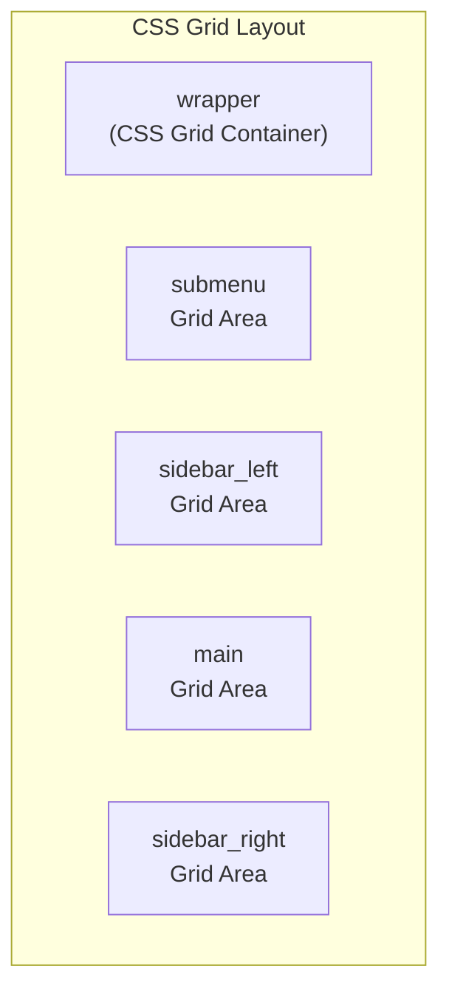
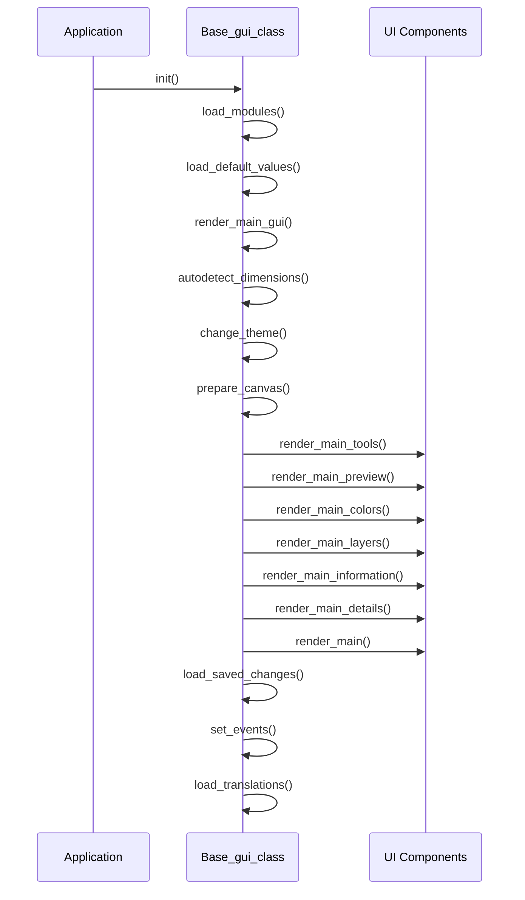
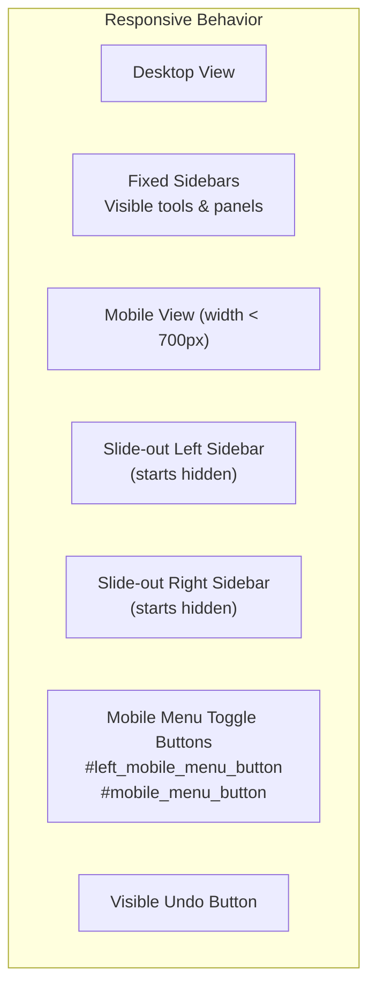

# User Interface

> **Relevant source files**
> * [index.html](https://github.com/viliusle/miniPaint/blob/6d0b95e5/index.html)
> * [manifest-disabled.json](https://github.com/viliusle/miniPaint/blob/6d0b95e5/manifest-disabled.json)
> * [src/css/layout.css](https://github.com/viliusle/miniPaint/blob/6d0b95e5/src/css/layout.css)
> * [src/js/core/base-gui.js](https://github.com/viliusle/miniPaint/blob/6d0b95e5/src/js/core/base-gui.js)

## Purpose

This document provides a comprehensive overview of the miniPaint user interface system, including its layout structure, component hierarchy, initialization process, and how users interact with various UI elements. For information about specific tools functionality, see [Tools](/viliusle/miniPaint/4-tools), and for dialog implementations, see [Dialog System](/viliusle/miniPaint/2.6-dialog-system).

## Overview

The miniPaint interface follows a classic image editor layout with a grid-based structure that adapts to different screen sizes. The interface consists of several key areas: a main menu, tool selection sidebar, central canvas area, context-sensitive submenu, and multiple panels in the right sidebar.

## UI Layout Structure

### HTML Structure Diagram

```mermaid
flowchart TD

mermaid-9gc5r6p0m6b-flowchart-Wrapper["div.wrapper"]
mermaid-9gc5r6p0m6b-flowchart-MainMenu["nav.main_menu<br>#main_menu"]
mermaid-9gc5r6p0m6b-flowchart-Submenu["div.submenu"]
mermaid-9gc5r6p0m6b-flowchart-SidebarLeft["div.sidebar_left<br>#tools_container"]
mermaid-9gc5r6p0m6b-flowchart-MiddleArea["div.middle_area<br>#middle_area"]
mermaid-9gc5r6p0m6b-flowchart-SidebarRight["div.sidebar_right"]
mermaid-9gc5r6p0m6b-flowchart-Logo["a.logo"]
mermaid-9gc5r6p0m6b-flowchart-Attributes["div.attributes<br>#action_attributes"]
mermaid-9gc5r6p0m6b-flowchart-UndoBtn["button.undo_button"]
mermaid-9gc5r6p0m6b-flowchart-RulerLeft["canvas#ruler_left"]
mermaid-9gc5r6p0m6b-flowchart-RulerTop["canvas#ruler_top"]
mermaid-9gc5r6p0m6b-flowchart-MainWrapper["div.main_wrapper"]
mermaid-9gc5r6p0m6b-flowchart-CanvasWrapper["div.canvas_wrapper"]
mermaid-9gc5r6p0m6b-flowchart-Mouse["div#mouse"]
mermaid-9gc5r6p0m6b-flowchart-Grid["div.transparent-grid"]
mermaid-9gc5r6p0m6b-flowchart-Canvas["canvas#canvas_minipaint"]
mermaid-9gc5r6p0m6b-flowchart-Preview["div.preview.block"]
mermaid-9gc5r6p0m6b-flowchart-Colors["div.colors.block"]
mermaid-9gc5r6p0m6b-flowchart-Info["div#info_base.block"]
mermaid-9gc5r6p0m6b-flowchart-Details["div#details_base.block"]
mermaid-9gc5r6p0m6b-flowchart-Layers["div.layers.block"]
mermaid-9gc5r6p0m6b-flowchart-MobileMenu["div.mobile_menu"]
mermaid-9gc5r6p0m6b-flowchart-Popups["div#popups"]

subgraph mermaid-9gc5r6p0m6b-subGraph0 ["HTML Structure"]
    mermaid-9gc5r6p0m6b-flowchart-Wrapper
    mermaid-9gc5r6p0m6b-flowchart-MainMenu
    mermaid-9gc5r6p0m6b-flowchart-Submenu
    mermaid-9gc5r6p0m6b-flowchart-SidebarLeft
    mermaid-9gc5r6p0m6b-flowchart-MiddleArea
    mermaid-9gc5r6p0m6b-flowchart-SidebarRight
    mermaid-9gc5r6p0m6b-flowchart-Logo
    mermaid-9gc5r6p0m6b-flowchart-Attributes
    mermaid-9gc5r6p0m6b-flowchart-UndoBtn
    mermaid-9gc5r6p0m6b-flowchart-RulerLeft
    mermaid-9gc5r6p0m6b-flowchart-RulerTop
    mermaid-9gc5r6p0m6b-flowchart-MainWrapper
    mermaid-9gc5r6p0m6b-flowchart-CanvasWrapper
    mermaid-9gc5r6p0m6b-flowchart-Mouse
    mermaid-9gc5r6p0m6b-flowchart-Grid
    mermaid-9gc5r6p0m6b-flowchart-Canvas
    mermaid-9gc5r6p0m6b-flowchart-Preview
    mermaid-9gc5r6p0m6b-flowchart-Colors
    mermaid-9gc5r6p0m6b-flowchart-Info
    mermaid-9gc5r6p0m6b-flowchart-Details
    mermaid-9gc5r6p0m6b-flowchart-Layers
    mermaid-9gc5r6p0m6b-flowchart-MobileMenu
    mermaid-9gc5r6p0m6b-flowchart-Popups
end
```



Sources: [index.html L33-L102](https://github.com/viliusle/miniPaint/blob/6d0b95e5/index.html#L33-L102)

### CSS Grid Layout

The UI layout is implemented using CSS Grid, which provides a responsive and flexible structure:



Sources: [src/css/layout.css L1-L21](https://github.com/viliusle/miniPaint/blob/6d0b95e5/src/css/layout.css#L1-L21)

 [src/css/layout.css L200-L248](https://github.com/viliusle/miniPaint/blob/6d0b95e5/src/css/layout.css#L200-L248)

 [src/css/layout.css L253-L330](https://github.com/viliusle/miniPaint/blob/6d0b95e5/src/css/layout.css#L253-L330)

 [src/css/layout.css L333-L610](https://github.com/viliusle/miniPaint/blob/6d0b95e5/src/css/layout.css#L333-L610)

 [src/css/layout.css L613-L745](https://github.com/viliusle/miniPaint/blob/6d0b95e5/src/css/layout.css#L613-L745)

## Component Architecture

The UI is managed by a set of JavaScript classes, with `Base_gui_class` serving as the central controller:

```sql
#mermaid-4aoymsjitsa{font-family:ui-sans-serif,-apple-system,system-ui,Segoe UI,Helvetica;font-size:16px;fill:#333;}@keyframes edge-animation-frame{from{stroke-dashoffset:0;}}@keyframes dash{to{stroke-dashoffset:0;}}#mermaid-4aoymsjitsa .edge-animation-slow{stroke-dasharray:9,5!important;stroke-dashoffset:900;animation:dash 50s linear infinite;stroke-linecap:round;}#mermaid-4aoymsjitsa .edge-animation-fast{stroke-dasharray:9,5!important;stroke-dashoffset:900;animation:dash 20s linear infinite;stroke-linecap:round;}#mermaid-4aoymsjitsa .error-icon{fill:#dddddd;}#mermaid-4aoymsjitsa .error-text{fill:#222222;stroke:#222222;}#mermaid-4aoymsjitsa .edge-thickness-normal{stroke-width:1px;}#mermaid-4aoymsjitsa .edge-thickness-thick{stroke-width:3.5px;}#mermaid-4aoymsjitsa .edge-pattern-solid{stroke-dasharray:0;}#mermaid-4aoymsjitsa .edge-thickness-invisible{stroke-width:0;fill:none;}#mermaid-4aoymsjitsa .edge-pattern-dashed{stroke-dasharray:3;}#mermaid-4aoymsjitsa .edge-pattern-dotted{stroke-dasharray:2;}#mermaid-4aoymsjitsa .marker{fill:#999;stroke:#999;}#mermaid-4aoymsjitsa .marker.cross{stroke:#999;}#mermaid-4aoymsjitsa svg{font-family:ui-sans-serif,-apple-system,system-ui,Segoe UI,Helvetica;font-size:16px;}#mermaid-4aoymsjitsa p{margin:0;}#mermaid-4aoymsjitsa g.classGroup text{fill:#dddddd;stroke:none;font-family:ui-sans-serif,-apple-system,system-ui,Segoe UI,Helvetica;font-size:10px;}#mermaid-4aoymsjitsa g.classGroup text .title{font-weight:bolder;}#mermaid-4aoymsjitsa .cluster-label text{fill:#444;}#mermaid-4aoymsjitsa .cluster-label span{color:#444;}#mermaid-4aoymsjitsa .cluster-label span p{background-color:transparent;}#mermaid-4aoymsjitsa .cluster rect{fill:#f8f8f8;stroke:#dddddd;stroke-width:1px;}#mermaid-4aoymsjitsa .cluster text{fill:#444;}#mermaid-4aoymsjitsa .cluster span{color:#444;}#mermaid-4aoymsjitsa .nodeLabel,#mermaid-4aoymsjitsa .edgeLabel{color:#333333;}#mermaid-4aoymsjitsa .noteLabel .nodeLabel,#mermaid-4aoymsjitsa .noteLabel .edgeLabel{color:#333;}#mermaid-4aoymsjitsa .edgeLabel .label rect{fill:#ffffff;}#mermaid-4aoymsjitsa .label text{fill:#333333;}#mermaid-4aoymsjitsa .labelBkg{background:#ffffff;}#mermaid-4aoymsjitsa .edgeLabel .label span{background:#ffffff;}#mermaid-4aoymsjitsa .classTitle{font-weight:bolder;}#mermaid-4aoymsjitsa .node rect,#mermaid-4aoymsjitsa .node circle,#mermaid-4aoymsjitsa .node ellipse,#mermaid-4aoymsjitsa .node polygon,#mermaid-4aoymsjitsa .node path{fill:#ffffff;stroke:#dddddd;stroke-width:1;}#mermaid-4aoymsjitsa .divider{stroke:#dddddd;stroke-width:1;}#mermaid-4aoymsjitsa g.clickable{cursor:pointer;}#mermaid-4aoymsjitsa g.classGroup rect{fill:#ffffff;stroke:#dddddd;}#mermaid-4aoymsjitsa g.classGroup line{stroke:#dddddd;stroke-width:1;}#mermaid-4aoymsjitsa .classLabel .box{stroke:none;stroke-width:0;fill:#ffffff;opacity:0.5;}#mermaid-4aoymsjitsa .classLabel .label{fill:#dddddd;font-size:10px;}#mermaid-4aoymsjitsa .relation{stroke:#999;stroke-width:1;fill:none;}#mermaid-4aoymsjitsa .dashed-line{stroke-dasharray:3;}#mermaid-4aoymsjitsa .dotted-line{stroke-dasharray:1 2;}#mermaid-4aoymsjitsa [id$="-compositionStart"],#mermaid-4aoymsjitsa .composition{fill:#999!important;stroke:#999!important;stroke-width:1;}#mermaid-4aoymsjitsa [id$="-compositionEnd"],#mermaid-4aoymsjitsa .composition{fill:#999!important;stroke:#999!important;stroke-width:1;}#mermaid-4aoymsjitsa [id$="-dependencyStart"],#mermaid-4aoymsjitsa .dependency{fill:#999!important;stroke:#999!important;stroke-width:1;}#mermaid-4aoymsjitsa [id$="-dependencyEnd"],#mermaid-4aoymsjitsa .dependency{fill:#999!important;stroke:#999!important;stroke-width:1;}#mermaid-4aoymsjitsa [id$="-extensionStart"],#mermaid-4aoymsjitsa .extension{fill:transparent!important;stroke:#999!important;stroke-width:1;}#mermaid-4aoymsjitsa [id$="-extensionEnd"],#mermaid-4aoymsjitsa .extension{fill:transparent!important;stroke:#999!important;stroke-width:1;}#mermaid-4aoymsjitsa [id$="-aggregationStart"],#mermaid-4aoymsjitsa .aggregation{fill:transparent!important;stroke:#999!important;stroke-width:1;}#mermaid-4aoymsjitsa [id$="-aggregationEnd"],#mermaid-4aoymsjitsa .aggregation{fill:transparent!important;stroke:#999!important;stroke-width:1;}#mermaid-4aoymsjitsa [id$="-lollipopStart"],#mermaid-4aoymsjitsa .lollipop{fill:#ffffff!important;stroke:#999!important;stroke-width:1;}#mermaid-4aoymsjitsa [id$="-lollipopEnd"],#mermaid-4aoymsjitsa .lollipop{fill:#ffffff!important;stroke:#999!important;stroke-width:1;}#mermaid-4aoymsjitsa .edgeTerminals{font-size:11px;line-height:initial;}#mermaid-4aoymsjitsa .classTitleText{text-anchor:middle;font-size:18px;fill:#333;}#mermaid-4aoymsjitsa .edgeLabel[data-look="neo"]{background-color:#ffffff;text-align:center;}#mermaid-4aoymsjitsa .edgeLabel[data-look="neo"] p{background-color:#ffffff;}#mermaid-4aoymsjitsa .edgeLabel[data-look="neo"] rect{opacity:0.5;background-color:#ffffff;fill:#ffffff;}#mermaid-4aoymsjitsa .label-icon{display:inline-block;height:1em;overflow:visible;vertical-align:-0.125em;}#mermaid-4aoymsjitsa .node .label-icon path{fill:currentColor;stroke:revert;stroke-width:revert;}#mermaid-4aoymsjitsa .node .neo-node{stroke:#dddddd;}#mermaid-4aoymsjitsa [data-look="neo"].node rect,#mermaid-4aoymsjitsa [data-look="neo"].cluster rect,#mermaid-4aoymsjitsa [data-look="neo"].node polygon{stroke:url(#mermaid-4aoymsjitsa-gradient);filter:drop-shadow( 1px 2px 2px rgba(185,185,185,1));}#mermaid-4aoymsjitsa [data-look="neo"].node path{stroke:url(#mermaid-4aoymsjitsa-gradient);stroke-width:1px;}#mermaid-4aoymsjitsa [data-look="neo"].node .outer-path{filter:drop-shadow( 1px 2px 2px rgba(185,185,185,1));}#mermaid-4aoymsjitsa [data-look="neo"].node .neo-line path{stroke:#dddddd;filter:none;}#mermaid-4aoymsjitsa [data-look="neo"].node circle{stroke:url(#mermaid-4aoymsjitsa-gradient);filter:drop-shadow( 1px 2px 2px rgba(185,185,185,1));}#mermaid-4aoymsjitsa [data-look="neo"].node circle .state-start{fill:#000000;}#mermaid-4aoymsjitsa [data-look="neo"].icon-shape .icon{fill:url(#mermaid-4aoymsjitsa-gradient);filter:drop-shadow( 1px 2px 2px rgba(185,185,185,1));}#mermaid-4aoymsjitsa [data-look="neo"].icon-shape .icon-neo path{stroke:url(#mermaid-4aoymsjitsa-gradient);filter:drop-shadow( 1px 2px 2px rgba(185,185,185,1));}#mermaid-4aoymsjitsa :root{--mermaid-font-family:"trebuchet ms",verdana,arial,sans-serif;}managesmanagesmanagesmanagesmanagesmanagesmanagesusesusesusesusesBase_gui_class+init()+load_modules()+render_main_gui()+set_events()+prepare_canvas()+change_theme()+draw_grid()+draw_guides()GUI_tools_class+render_main_tools()+activate_tool()GUI_preview_class+render_main_preview()GUI_colors_class+render_main_colors()GUI_layers_class+render_main_layers()GUI_information_class+render_main_information()GUI_details_class+render_main_details()GUI_menu_class+render_main()+on()Base_layers_classHelper_classTools_translate_classTools_settings_class
```

Sources: [src/js/core/base-gui.js L6-L69](https://github.com/viliusle/miniPaint/blob/6d0b95e5/src/js/core/base-gui.js#L6-L69)

 [src/js/core/base-gui.js L137-L147](https://github.com/viliusle/miniPaint/blob/6d0b95e5/src/js/core/base-gui.js#L137-L147)

## Main UI Components

### 1. Main Menu

The main menu provides access to file operations, editing tools, and application settings. It's rendered at the top of the interface by the `GUI_menu_class`.

Sources: [index.html L35](https://github.com/viliusle/miniPaint/blob/6d0b95e5/index.html#L35-L35)

 [src/js/core/base-gui.js L66](https://github.com/viliusle/miniPaint/blob/6d0b95e5/src/js/core/base-gui.js#L66-L66)

 [src/js/core/base-gui.js L147](https://github.com/viliusle/miniPaint/blob/6d0b95e5/src/js/core/base-gui.js#L147-L147)

### 2. Tool Selection (Left Sidebar)

The left sidebar contains tools for editing images, with each tool represented by an icon. This component is managed by the `GUI_tools_class`.

| Tool | CSS Class | Description |
| --- | --- | --- |
| Selection | `.select, .selection` | Tools for selecting areas |
| Brush | `.brush` | Freehand drawing tool |
| Pencil | `.pencil` | Precise drawing tool |
| Color Picker | `.pick_color` | Tool to select colors from the canvas |
| Eraser | `.erase, .magic_erase` | Tools to erase content |
| Fill | `.fill` | Fill tool for coloring areas |
| Shape | `.shape` | Tools for drawing various shapes |
| Text | `.text` | Tool for adding text |
| Gradient | `.gradient` | Tool for applying gradients |
| Clone | `.clone` | Clone stamp tool |
| Crop | `.crop` | Tool for cropping images |
| Effects | `.blur, .sharpen, .desaturate` | Tools for applying image effects |

Sources: [index.html L45](https://github.com/viliusle/miniPaint/blob/6d0b95e5/index.html#L45-L45)

 [src/css/layout.css L253-L330](https://github.com/viliusle/miniPaint/blob/6d0b95e5/src/css/layout.css#L253-L330)

 [src/css/layout.css L305-L323](https://github.com/viliusle/miniPaint/blob/6d0b95e5/src/css/layout.css#L305-L323)

 [src/js/core/base-gui.js L60](https://github.com/viliusle/miniPaint/blob/6d0b95e5/src/js/core/base-gui.js#L60-L60)

 [src/js/core/base-gui.js L141](https://github.com/viliusle/miniPaint/blob/6d0b95e5/src/js/core/base-gui.js#L141-L141)

### 3. Canvas Area

The central area contains the main canvas where image editing takes place. It includes:

* The main canvas (`#canvas_minipaint`)
* Transparent grid background
* Optional rulers
* Mouse pointer indicator

Sources: [index.html L48-L64](https://github.com/viliusle/miniPaint/blob/6d0b95e5/index.html#L48-L64)

 [src/css/layout.css L613-L745](https://github.com/viliusle/miniPaint/blob/6d0b95e5/src/css/layout.css#L613-L745)

 [src/js/core/base-gui.js L239-L270](https://github.com/viliusle/miniPaint/blob/6d0b95e5/src/js/core/base-gui.js#L239-L270)

### 4. Tool Attributes Submenu

The submenu area below the main menu displays context-sensitive attributes for the currently selected tool, allowing users to configure tool-specific settings. It also contains the logo and undo button.

Sources: [index.html L37-L43](https://github.com/viliusle/miniPaint/blob/6d0b95e5/index.html#L37-L43)

 [src/css/layout.css L200-L248](https://github.com/viliusle/miniPaint/blob/6d0b95e5/src/css/layout.css#L200-L248)

### 5. Right Sidebar Panels

The right sidebar contains several collapsible panels that provide additional functionality:

| Panel | Purpose | DOM ID | Managing Class |
| --- | --- | --- | --- |
| Preview | Shows a small preview of the entire image | `#toggle_preview` | `GUI_preview_class` |
| Colors | Color selection tools | `#toggle_colors` | `GUI_colors_class` |
| Information | Displays information about the current state | `#toggle_info` | `GUI_information_class` |
| Layer Details | Shows details of the selected layer | `#toggle_details` | `GUI_details_class` |
| Layers | Lists all layers and provides layer management | `#layers_base` | `GUI_layers_class` |

Sources: [index.html L66-L90](https://github.com/viliusle/miniPaint/blob/6d0b95e5/index.html#L66-L90)

 [src/css/layout.css L333-L610](https://github.com/viliusle/miniPaint/blob/6d0b95e5/src/css/layout.css#L333-L610)

 [src/js/core/base-gui.js L61-L65](https://github.com/viliusle/miniPaint/blob/6d0b95e5/src/js/core/base-gui.js#L61-L65)

 [src/js/core/base-gui.js L142-L146](https://github.com/viliusle/miniPaint/blob/6d0b95e5/src/js/core/base-gui.js#L142-L146)

## Initialization Process

The UI initialization follows these steps:



Sources: [src/js/core/base-gui.js L72-L152](https://github.com/viliusle/miniPaint/blob/6d0b95e5/src/js/core/base-gui.js#L72-L152)

## Panel Toggle System

The UI implements a toggle system for collapsible panels, allowing users to show/hide specific components:

1. Each toggle element has a `data-target` attribute pointing to the container ID it controls
2. Toggle state is stored in cookies for persistence across sessions
3. Clicking a toggle element toggles both the `toggled` class on the trigger and the `hidden` class on the target

```javascript
// registerToggleAbilityvar targets = document.querySelectorAll('.toggle');for (var i = 0; i < targets.length; i++) {    if (targets[i].dataset.target == undefined)        continue;    targets[i].addEventListener('click', function (event) {        this.classList.toggle('toggled');        var target = document.getElementById(this.dataset.target);        target.classList.toggle('hidden');        // save state in cookies        if (target.classList.contains('hidden') == false)            _this.Helper.setCookie(this.dataset.target, 1);        else            _this.Helper.setCookie(this.dataset.target, 0);    });}
```

Sources: [src/js/core/base-gui.js L186-L201](https://github.com/viliusle/miniPaint/blob/6d0b95e5/src/js/core/base-gui.js#L186-L201)

 [src/js/core/base-gui.js L272-L284](https://github.com/viliusle/miniPaint/blob/6d0b95e5/src/js/core/base-gui.js#L272-L284)

## Responsive Design

The UI adapts to different screen sizes using CSS media queries. Key responsive features include:

### Desktop View

* Full grid layout with visible left and right sidebars
* Tools directly accessible in the left sidebar
* Panels directly accessible in the right sidebar

### Mobile View (screen width < 700px)

* Left sidebar becomes a slide-out panel accessed via a toggle button
* Right sidebar also becomes a slide-out panel with its own toggle
* Mobile menu buttons appear at the bottom of the screen
* Undo button becomes visible for easier access



Sources: [index.html L93-L100](https://github.com/viliusle/miniPaint/blob/6d0b95e5/index.html#L93-L100)

 [src/css/layout.css L177-L197](https://github.com/viliusle/miniPaint/blob/6d0b95e5/src/css/layout.css#L177-L197)

 [src/css/layout.css L582-L610](https://github.com/viliusle/miniPaint/blob/6d0b95e5/src/css/layout.css#L582-L610)

 [src/js/core/base-gui.js L203-L208](https://github.com/viliusle/miniPaint/blob/6d0b95e5/src/js/core/base-gui.js#L203-L208)

## Canvas Preparation

The canvas is dynamically prepared to match the current zoom level and viewport size:

1. Get current window dimensions
2. Calculate visible canvas size based on zoom level
3. Set canvas dimensions
4. Configure image smoothing based on zoom level
5. Render canvas background (transparent grid or solid color)
6. Update wrapper dimensions
7. Calculate canvas offset for proper mouse interaction

Sources: [src/js/core/base-gui.js L239-L270](https://github.com/viliusle/miniPaint/blob/6d0b95e5/src/js/core/base-gui.js#L239-L270)

 [src/js/core/base-gui.js L328-L342](https://github.com/viliusle/miniPaint/blob/6d0b95e5/src/js/core/base-gui.js#L328-L342)

## Theme Support

The UI supports multiple themes through CSS variables and class toggling. Themes affect colors, contrast, and the overall appearance:

1. Theme is determined from cookies or settings
2. Previous theme classes are removed from the body
3. New theme class is added to the body
4. CSS variables defined in theme classes control the UI appearance

Sources: [src/js/core/base-gui.js L474-L490](https://github.com/viliusle/miniPaint/blob/6d0b95e5/src/js/core/base-gui.js#L474-L490)

## Event Handling System

The UI sets up various event listeners for user interactions:

1. **Menu events**: Handled by the `GUI_menu` class, which dispatches actions to appropriate modules
2. **Toggle events**: For showing/hiding panels
3. **Mobile menu events**: For showing/hiding sidebars on mobile
4. **Resize events**: To adjust canvas size when the window is resized
5. **Canvas context menu**: Prevented to allow for custom handling
6. **Exit confirmation**: Optional confirmation when leaving with unsaved changes

Sources: [src/js/core/base-gui.js L164-L228](https://github.com/viliusle/miniPaint/blob/6d0b95e5/src/js/core/base-gui.js#L164-L228)

## Grid and Guides

The UI provides optional grid and guides for precise editing:

* **Grid**: Configurable horizontal and vertical lines (controlled by `grid_size`)
* **Guides**: Custom positioning guides that can be added by the user

Both features help with alignment and precise positioning during editing.

Sources: [src/js/core/base-gui.js L344-L436](https://github.com/viliusle/miniPaint/blob/6d0b95e5/src/js/core/base-gui.js#L344-L436)

## Mobile Menu

On smaller screens, the mobile menu provides access to the sidebars:

1. Left button toggles the tools sidebar
2. Right button toggles the right panels sidebar
3. Sidebars slide in from off-screen when activated

This approach maximizes available canvas space on small screens while keeping tools accessible.

Sources: [index.html L93-L100](https://github.com/viliusle/miniPaint/blob/6d0b95e5/index.html#L93-L100)

 [src/css/layout.css L582-L610](https://github.com/viliusle/miniPaint/blob/6d0b95e5/src/css/layout.css#L582-L610)

 [src/js/core/base-gui.js L203-L208](https://github.com/viliusle/miniPaint/blob/6d0b95e5/src/js/core/base-gui.js#L203-L208)