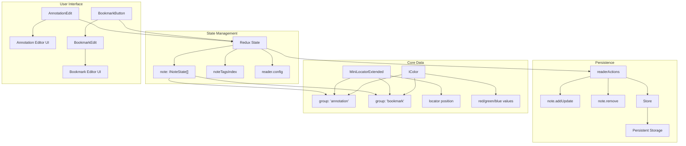
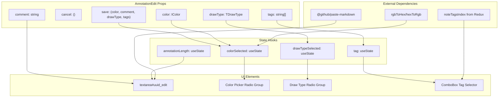
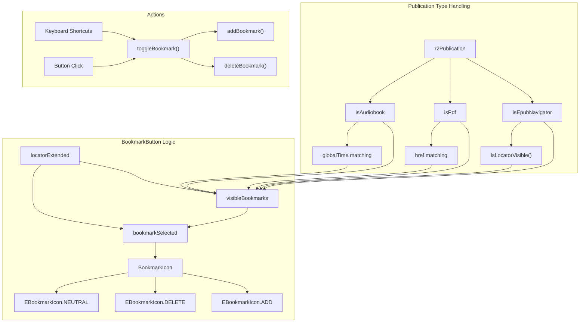
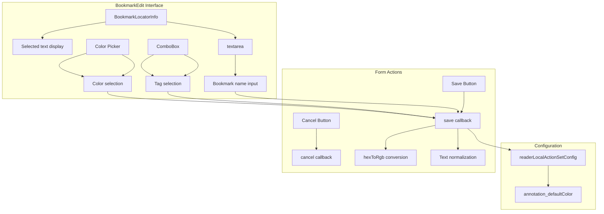

# Annotations and Bookmarks

> **Relevant source files**
> * [src/common/redux/states/bookmark.ts](https://github.com/edrlab/thorium-reader/blob/02b67755/src/common/redux/states/bookmark.ts)
> * [src/common/rgb.ts](https://github.com/edrlab/thorium-reader/blob/02b67755/src/common/rgb.ts)
> * [src/renderer/assets/styles/components/bookmarks.scss](https://github.com/edrlab/thorium-reader/blob/02b67755/src/renderer/assets/styles/components/bookmarks.scss)
> * [src/renderer/assets/styles/components/bookmarks.scss.d.ts](https://github.com/edrlab/thorium-reader/blob/02b67755/src/renderer/assets/styles/components/bookmarks.scss.d.ts)
> * [src/renderer/reader/components/AnnotationEdit.tsx](https://github.com/edrlab/thorium-reader/blob/02b67755/src/renderer/reader/components/AnnotationEdit.tsx)
> * [src/renderer/reader/components/BookmarkEdit.tsx](https://github.com/edrlab/thorium-reader/blob/02b67755/src/renderer/reader/components/BookmarkEdit.tsx)
> * [src/renderer/reader/components/header/BookmarkButton.tsx](https://github.com/edrlab/thorium-reader/blob/02b67755/src/renderer/reader/components/header/BookmarkButton.tsx)
> * [src/renderer/reader/index_reader.ts](https://github.com/edrlab/thorium-reader/blob/02b67755/src/renderer/reader/index_reader.ts)

This document covers the annotation and bookmark system in Thorium Reader, which allows users to highlight text, add notes, and create bookmarks while reading publications. The system supports multiple publication formats (EPUB, PDF, audiobooks) and provides a unified interface for managing user-generated content with features like color coding, tagging, and text comments.

For information about the reader interface components that display these annotations and bookmarks, see [Reader UI Components](/edrlab/thorium-reader/2.1-reader-ui-components).

## System Overview

The annotations and bookmarks system consists of two primary user-facing features that share common underlying infrastructure:

* **Annotations**: Text highlights with optional comments, supporting multiple draw types (solid background, underline, strikethrough, outline)
* **Bookmarks**: Location markers with optional names, colors, and tags

Both features use the same data model (`INoteState`) with different `group` values to distinguish between annotations and bookmarks.



Sources: [src/renderer/reader/components/AnnotationEdit.tsx](https://github.com/edrlab/thorium-reader/blob/02b67755/src/renderer/reader/components/AnnotationEdit.tsx)

 [src/renderer/reader/components/header/BookmarkButton.tsx](https://github.com/edrlab/thorium-reader/blob/02b67755/src/renderer/reader/components/header/BookmarkButton.tsx)

 [src/renderer/reader/components/BookmarkEdit.tsx](https://github.com/edrlab/thorium-reader/blob/02b67755/src/renderer/reader/components/BookmarkEdit.tsx)

 [src/common/redux/states/bookmark.ts](https://github.com/edrlab/thorium-reader/blob/02b67755/src/common/redux/states/bookmark.ts)

## Annotation System

### AnnotationEdit Component

The `AnnotationEdit` component provides a comprehensive interface for creating and editing text annotations. It supports multiple highlighting styles, color selection, and text comments.

| Feature | Implementation | Location |
| --- | --- | --- |
| Draw Types | `noteDrawType` array with 4 styles | [src/renderer/reader/components/AnnotationEdit.tsx L182-L203](https://github.com/edrlab/thorium-reader/blob/02b67755/src/renderer/reader/components/AnnotationEdit.tsx#L182-L203) |
| Color Picker | `noteColorCodeToColorTranslatorKeySet` mapping | [src/renderer/reader/components/AnnotationEdit.tsx L162-L177](https://github.com/edrlab/thorium-reader/blob/02b67755/src/renderer/reader/components/AnnotationEdit.tsx#L162-L177) |
| Text Input | Auto-resizing textarea with markdown support | [src/renderer/reader/components/AnnotationEdit.tsx L143-L154](https://github.com/edrlab/thorium-reader/blob/02b67755/src/renderer/reader/components/AnnotationEdit.tsx#L143-L154) |
| Tag System | ComboBox with existing tags | [src/renderer/reader/components/AnnotationEdit.tsx L208-L234](https://github.com/edrlab/thorium-reader/blob/02b67755/src/renderer/reader/components/AnnotationEdit.tsx#L208-L234) |



Sources: [src/renderer/reader/components/AnnotationEdit.tsx L49-L283](https://github.com/edrlab/thorium-reader/blob/02b67755/src/renderer/reader/components/AnnotationEdit.tsx#L49-L283)

 [src/common/rgb.ts L10-L28](https://github.com/edrlab/thorium-reader/blob/02b67755/src/common/rgb.ts#L10-L28)

### Draw Types and Colors

The annotation system supports four distinct visual styles:

```javascript
// Draw types defined in noteDrawTypeconst drawTypes = [    "solid_background",  // Highlight    "underline",        // Underline      "strikethrough",    // Strikethrough    "outline"           // Outline];
```

Colors are managed through a predefined palette in `noteColorCodeToColorTranslatorKeySet`, with conversion utilities handling the transformation between hex values and RGB objects.

Sources: [src/renderer/reader/components/AnnotationEdit.tsx L84-L89](https://github.com/edrlab/thorium-reader/blob/02b67755/src/renderer/reader/components/AnnotationEdit.tsx#L84-L89)

 [src/common/redux/states/renderer/note.ts](https://github.com/edrlab/thorium-reader/blob/02b67755/src/common/redux/states/renderer/note.ts)

 [src/common/rgb.ts L10-L28](https://github.com/edrlab/thorium-reader/blob/02b67755/src/common/rgb.ts#L10-L28)

## Bookmark System

### BookmarkButton Component

The `BookmarkButton` component manages bookmark creation, deletion, and visibility detection. It adapts its behavior based on the publication type and current reading location.



Sources: [src/renderer/reader/components/header/BookmarkButton.tsx L41-L134](https://github.com/edrlab/thorium-reader/blob/02b67755/src/renderer/reader/components/header/BookmarkButton.tsx#L41-L134)

 [src/renderer/reader/components/header/BookmarkButton.tsx L195-L261](https://github.com/edrlab/thorium-reader/blob/02b67755/src/renderer/reader/components/header/BookmarkButton.tsx#L195-L261)

### Visibility Detection

The system uses different strategies to determine bookmark visibility based on publication format:

| Format | Detection Method | Implementation |
| --- | --- | --- |
| EPUB | `isLocatorVisible()` API | [src/renderer/reader/components/header/BookmarkButton.tsx L332-L360](https://github.com/edrlab/thorium-reader/blob/02b67755/src/renderer/reader/components/header/BookmarkButton.tsx#L332-L360) |
| Audiobook | Time-based matching | [src/renderer/reader/components/header/BookmarkButton.tsx L122-L125](https://github.com/edrlab/thorium-reader/blob/02b67755/src/renderer/reader/components/header/BookmarkButton.tsx#L122-L125) |
| PDF/Divina | Simple href matching | [src/renderer/reader/components/header/BookmarkButton.tsx L127-L129](https://github.com/edrlab/thorium-reader/blob/02b67755/src/renderer/reader/components/header/BookmarkButton.tsx#L127-L129) |

### BookmarkEdit Component

The `BookmarkEdit` component provides a simpler interface compared to annotations, focusing on naming, color selection, and tagging.



Sources: [src/renderer/reader/components/BookmarkEdit.tsx L54-L189](https://github.com/edrlab/thorium-reader/blob/02b67755/src/renderer/reader/components/BookmarkEdit.tsx#L54-L189)

 [src/renderer/reader/components/BookmarkLocatorInfo.tsx](https://github.com/edrlab/thorium-reader/blob/02b67755/src/renderer/reader/components/BookmarkLocatorInfo.tsx)

## Data Model

### INoteState Structure

Both annotations and bookmarks share the `INoteState` data structure:

```css
interface INoteState {    uuid: string;    textualValue?: string;        // Comment for annotations, name for bookmarks    created: number;              // Timestamp    modified?: number;           // Optional modification timestamp    index: number;               // Sequential index    locatorExtended: MiniLocatorExtended; // Position information    creator: INoteCreator;       // User information    color: IColor;              // RGB color object    drawType: TDrawType;        // Visual style    tags?: string[];            // Optional tags    group: "annotation" | "bookmark"; // Discriminator}
```

Sources: [src/common/redux/states/renderer/note.ts](https://github.com/edrlab/thorium-reader/blob/02b67755/src/common/redux/states/renderer/note.ts)

 [src/common/redux/states/bookmark.ts L15-L31](https://github.com/edrlab/thorium-reader/blob/02b67755/src/common/redux/states/bookmark.ts#L15-L31)

### Locator System

Position information is stored in `MiniLocatorExtended` objects, which contain:

* `locator.href`: Resource identifier
* `locator.locations`: Position data including CSS selectors and ranges
* `selectionInfo`: Text selection details for annotations
* `audioPlaybackInfo`: Time-based position for audiobooks

Sources: [src/common/redux/states/locatorInitialState.ts](https://github.com/edrlab/thorium-reader/blob/02b67755/src/common/redux/states/locatorInitialState.ts)

 [src/renderer/reader/components/header/BookmarkButton.tsx L107-L134](https://github.com/edrlab/thorium-reader/blob/02b67755/src/renderer/reader/components/header/BookmarkButton.tsx#L107-L134)

## State Management Integration

### Redux Actions

The system uses centralized Redux actions for persistence:

| Action | Purpose | Implementation |
| --- | --- | --- |
| `readerActions.note.addUpdate.build()` | Create/update notes | [src/renderer/reader/components/header/BookmarkButton.tsx L190](https://github.com/edrlab/thorium-reader/blob/02b67755/src/renderer/reader/components/header/BookmarkButton.tsx#L190-L190) |
| `readerActions.note.remove.build()` | Delete notes | [src/renderer/reader/components/header/BookmarkButton.tsx L168](https://github.com/edrlab/thorium-reader/blob/02b67755/src/renderer/reader/components/header/BookmarkButton.tsx#L168-L168) |
| `readerLocalActionSetConfig.build()` | Save default colors | [src/renderer/reader/components/AnnotationEdit.tsx L113](https://github.com/edrlab/thorium-reader/blob/02b67755/src/renderer/reader/components/AnnotationEdit.tsx#L113-L113) |

### Tag Indexing

The system maintains a `noteTagsIndex` in Redux state that tracks tag usage frequency:

```
interface TagIndex {    tag: string;    index: number;  // Usage count}
```

This index is built during reader initialization from all existing notes.

Sources: [src/renderer/reader/index_reader.ts L67-L86](https://github.com/edrlab/thorium-reader/blob/02b67755/src/renderer/reader/index_reader.ts#L67-L86)

 [src/renderer/reader/components/AnnotationEdit.tsx L78-L79](https://github.com/edrlab/thorium-reader/blob/02b67755/src/renderer/reader/components/AnnotationEdit.tsx#L78-L79)

## Keyboard Integration

Both systems support keyboard shortcuts through the global keyboard management system:

* `ToggleBookmark`: Quick bookmark toggle
* `AddBookmarkWithLabel`: Open bookmark editor

The shortcuts are registered using `registerKeyboardListener()` and automatically unregistered on component unmount.

Sources: [src/renderer/reader/components/header/BookmarkButton.tsx L274-L283](https://github.com/edrlab/thorium-reader/blob/02b67755/src/renderer/reader/components/header/BookmarkButton.tsx#L274-L283)

 [src/renderer/reader/components/header/BookmarkButton.tsx L298-L310](https://github.com/edrlab/thorium-reader/blob/02b67755/src/renderer/reader/components/header/BookmarkButton.tsx#L298-L310)

## Styling System

The UI components use modular SCSS with CSS custom properties for theming:

* `bookmarks.scss`: Bookmark-specific styles
* `annotations.scss`: Annotation-specific styles
* `buttons.scss`: Shared button styles

Key styling patterns include responsive color pickers, auto-resizing textareas, and theme-aware color variables.

Sources: [src/renderer/assets/styles/components/bookmarks.scss](https://github.com/edrlab/thorium-reader/blob/02b67755/src/renderer/assets/styles/components/bookmarks.scss)

 [src/renderer/assets/styles/components/annotations.scss](https://github.com/edrlab/thorium-reader/blob/02b67755/src/renderer/assets/styles/components/annotations.scss)

 [src/renderer/assets/styles/components/buttons.scss](https://github.com/edrlab/thorium-reader/blob/02b67755/src/renderer/assets/styles/components/buttons.scss)