# Application Architecture

> **Relevant source files**
> * [package-lock.json](https://github.com/edrlab/thorium-reader/blob/02b67755/package-lock.json)
> * [package.json](https://github.com/edrlab/thorium-reader/blob/02b67755/package.json)
> * [scripts/webpack-loader-scope-checker.js](https://github.com/edrlab/thorium-reader/blob/02b67755/scripts/webpack-loader-scope-checker.js)
> * [src/main.ts](https://github.com/edrlab/thorium-reader/blob/02b67755/src/main.ts)
> * [src/main/di.ts](https://github.com/edrlab/thorium-reader/blob/02b67755/src/main/di.ts)
> * [src/package.json](https://github.com/edrlab/thorium-reader/blob/02b67755/src/package.json)
> * [src/renderer/library/index_library.ts](https://github.com/edrlab/thorium-reader/blob/02b67755/src/renderer/library/index_library.ts)
> * [src/renderer/library/redux/sagas/i18n.ts](https://github.com/edrlab/thorium-reader/blob/02b67755/src/renderer/library/redux/sagas/i18n.ts)
> * [webpack.config.main.js](https://github.com/edrlab/thorium-reader/blob/02b67755/webpack.config.main.js)
> * [webpack.config.preload.js](https://github.com/edrlab/thorium-reader/blob/02b67755/webpack.config.preload.js)
> * [webpack.config.renderer-library.js](https://github.com/edrlab/thorium-reader/blob/02b67755/webpack.config.renderer-library.js)
> * [webpack.config.renderer-pdf.js](https://github.com/edrlab/thorium-reader/blob/02b67755/webpack.config.renderer-pdf.js)
> * [webpack.config.renderer-reader.js](https://github.com/edrlab/thorium-reader/blob/02b67755/webpack.config.renderer-reader.js)

This document provides a technical overview of the Thorium Reader application architecture, explaining the high-level structure of the Electron-based application, its processes, core dependencies, and how the various components interact. For information about specific subsystems, refer to their dedicated sections in the wiki, such as the Reader System in [2](/edrlab/thorium-reader/2-reader-system) or the Library System in [3](/edrlab/thorium-reader/3-library-system).

## Overview

Thorium Reader is built on the Electron framework, which provides a multi-process architecture with a clear separation between the main process and renderer processes. This application leverages modern JavaScript/TypeScript development patterns including dependency injection, Redux for state management, and React for UI rendering.

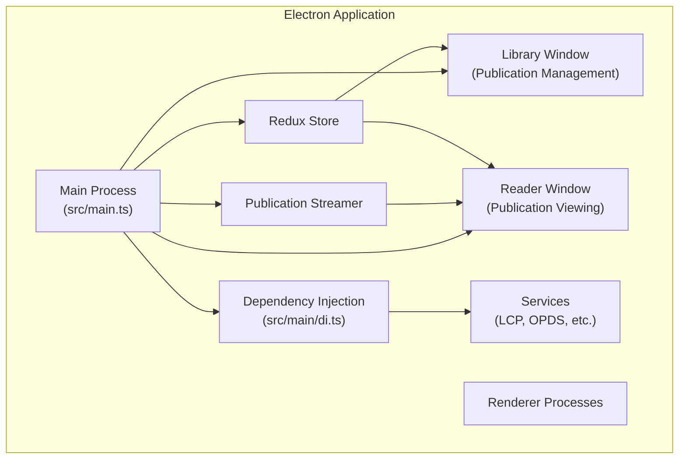

Sources: [src/main.ts](https://github.com/edrlab/thorium-reader/blob/02b67755/src/main.ts)

 [src/main/di.ts](https://github.com/edrlab/thorium-reader/blob/02b67755/src/main/di.ts)

 [webpack.config.js](https://github.com/edrlab/thorium-reader/blob/02b67755/webpack.config.js)

## Main Process Architecture

The main process serves as the central coordinator for the application. It initializes core systems, manages windows, and handles communication between different parts of the application.

### Application Entry Point

The application entry point is `src/main.ts`, which performs several key initialization tasks:

1. Sets up logging via the debug module
2. Initializes global converters for Readium libraries
3. Configures the LCP native plugin for DRM support
4. Sets up protocol handlers for content serving
5. Creates the Redux store via dependency injection
6. Starts the streamer service

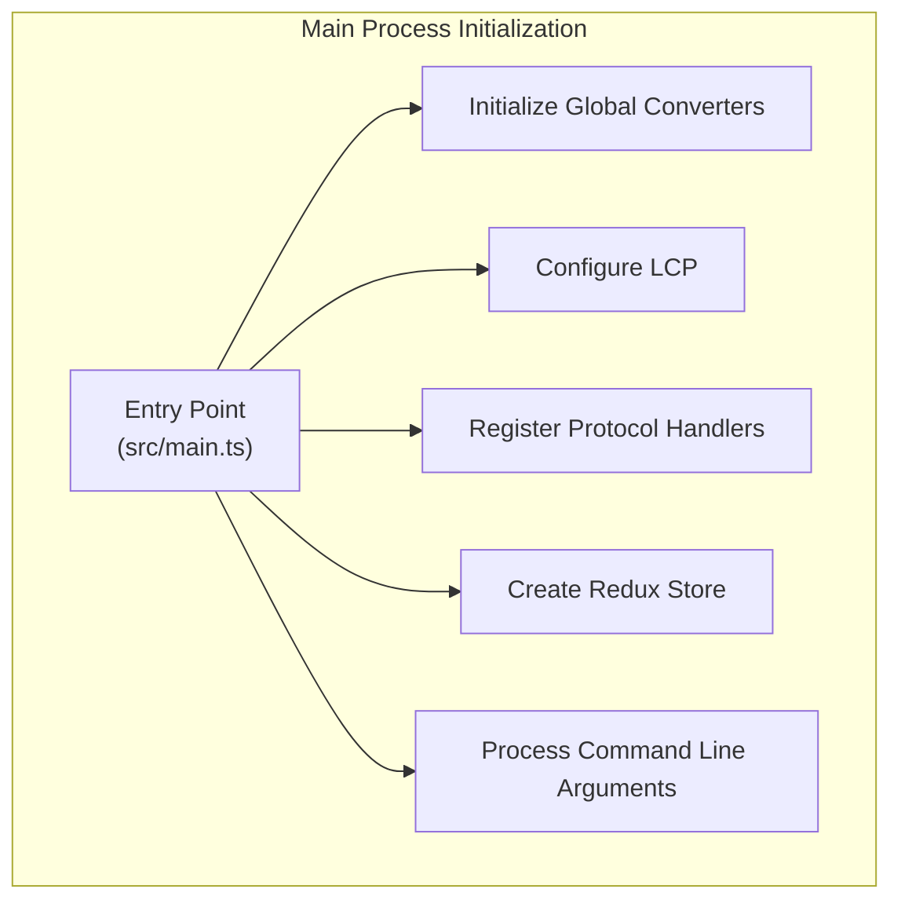

Sources: [src/main.ts L49-L84](https://github.com/edrlab/thorium-reader/blob/02b67755/src/main.ts#L49-L84)

 [webpack.config.main.js](https://github.com/edrlab/thorium-reader/blob/02b67755/webpack.config.main.js)

### Dependency Injection System

The application uses InversifyJS for dependency injection, configured in `src/main/di.ts`. This enables decoupled components and simplified testing. The DI container manages:

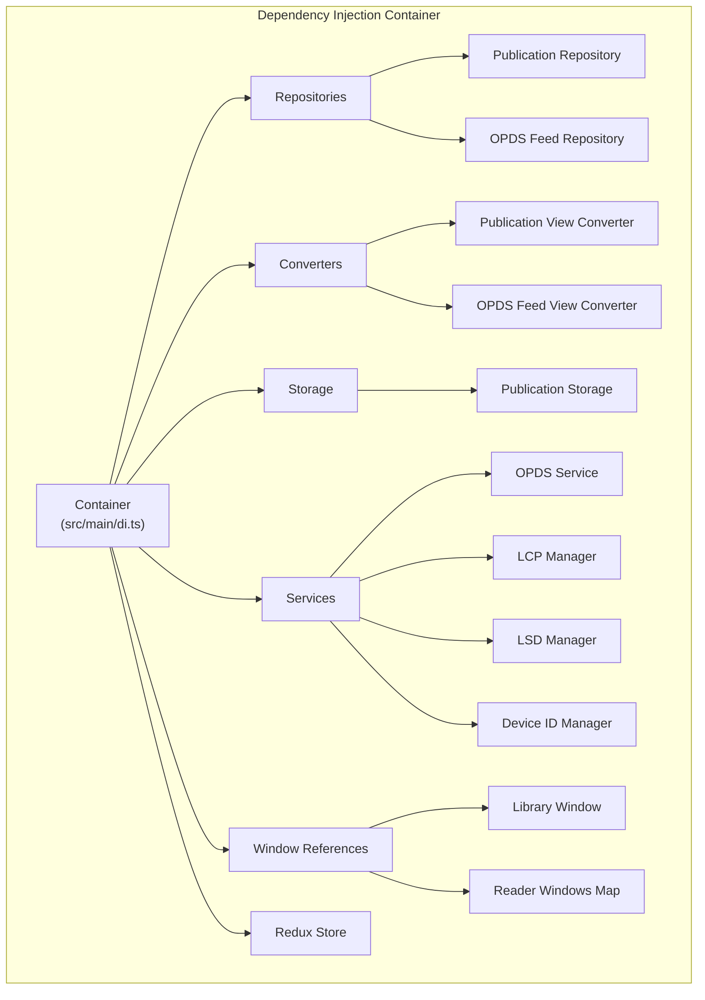

The container provides a `diMainGet` function that's used throughout the application to retrieve registered dependencies.

Sources: [src/main/di.ts L175-L346](https://github.com/edrlab/thorium-reader/blob/02b67755/src/main/di.ts#L175-L346)

 [src/main/di.ts L99-L137](https://github.com/edrlab/thorium-reader/blob/02b67755/src/main/di.ts#L99-L137)

### State Management

Thorium uses Redux for state management with Redux Saga for handling asynchronous operations. The main process maintains the primary Redux store, which is synchronized with renderer processes.

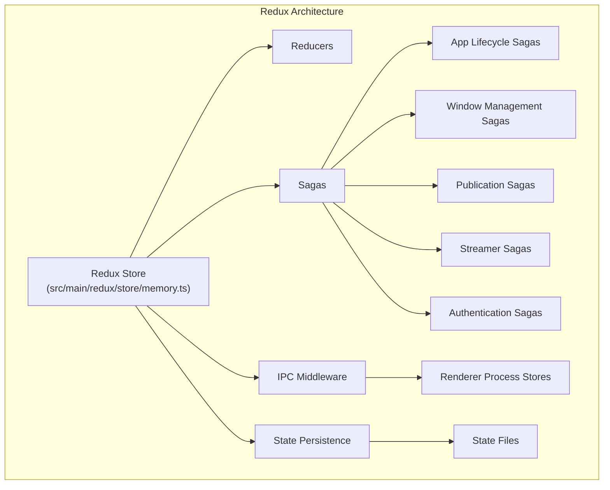

Sources: [src/main/redux/sagas/app.ts L41-L265](https://github.com/edrlab/thorium-reader/blob/02b67755/src/main/redux/sagas/app.ts#L41-L265)

 [src/main/redux/sagas/streamer.ts](https://github.com/edrlab/thorium-reader/blob/02b67755/src/main/redux/sagas/streamer.ts)

### Window Management

Windows are created and managed through Redux sagas, with references stored in the DI container:

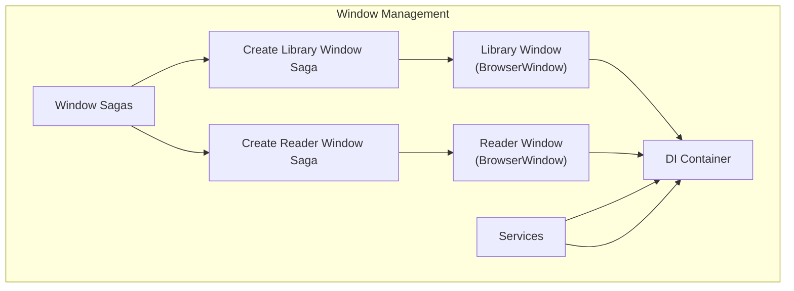

Sources: [src/main/redux/sagas/win/browserWindow/createLibraryWindow.ts](https://github.com/edrlab/thorium-reader/blob/02b67755/src/main/redux/sagas/win/browserWindow/createLibraryWindow.ts)

 [src/main/redux/sagas/win/browserWindow/createReaderWindow.ts](https://github.com/edrlab/thorium-reader/blob/02b67755/src/main/redux/sagas/win/browserWindow/createReaderWindow.ts)

### Publication Streamer

The streamer service is responsible for serving publication content to reader windows. Thorium uses a custom protocol approach rather than an HTTP server:

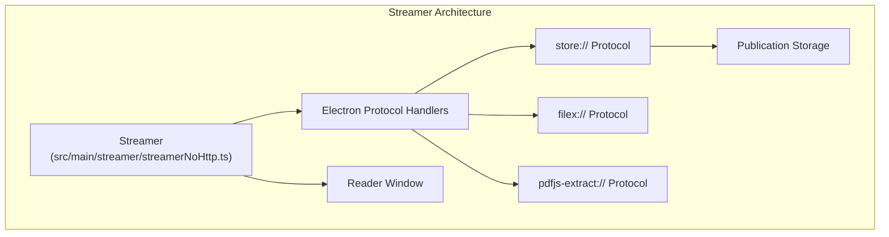

The streamer provides several key functions:

* Serving publication content via custom protocols
* Injecting ReadiumCSS for styling EPUB publications
* Handling Media Overlays and MathML content
* Managing streamer sessions for multiple publications

Sources: [src/main/streamer/streamerNoHttp.ts](https://github.com/edrlab/thorium-reader/blob/02b67755/src/main/streamer/streamerNoHttp.ts)

 [src/main/redux/sagas/streamer.ts](https://github.com/edrlab/thorium-reader/blob/02b67755/src/main/redux/sagas/streamer.ts)

## Renderer Processes

Thorium has three primary renderer processes, each with its own webpack configuration:

### Library Window

The library window is the main application interface showing the user's publication collection and allowing OPDS catalog browsing:

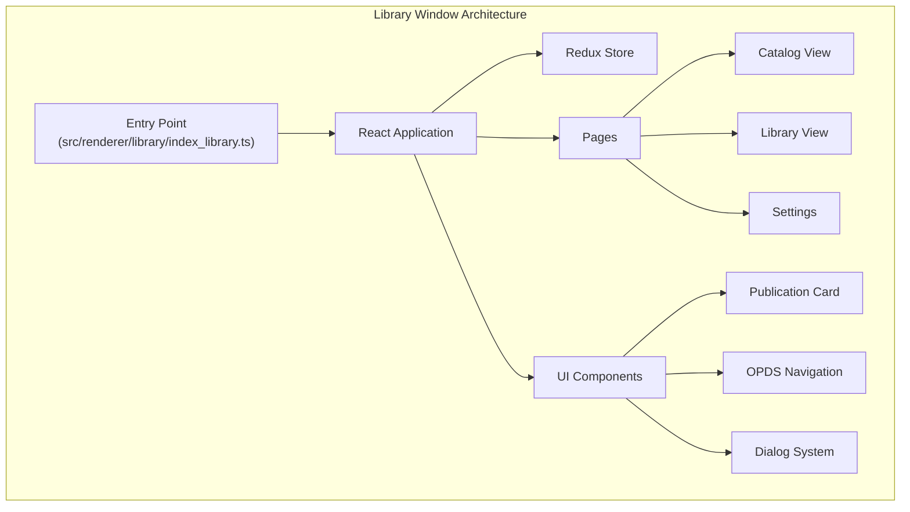

Sources: [src/renderer/library/index_library.ts](https://github.com/edrlab/thorium-reader/blob/02b67755/src/renderer/library/index_library.ts)

 [webpack.config.renderer-library.js](https://github.com/edrlab/thorium-reader/blob/02b67755/webpack.config.renderer-library.js)

### Reader Window

The reader window displays publications using the Readium Navigator:

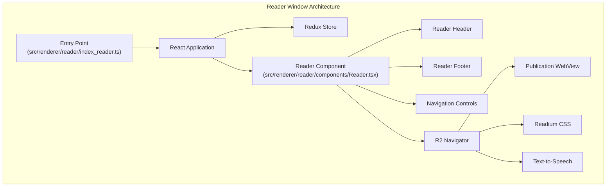

Sources: [src/renderer/reader/components/App.tsx](https://github.com/edrlab/thorium-reader/blob/02b67755/src/renderer/reader/components/App.tsx)

 [webpack.config.renderer-reader.js](https://github.com/edrlab/thorium-reader/blob/02b67755/webpack.config.renderer-reader.js)

### PDF Viewer

The PDF viewer is a specialized reader for PDF documents:

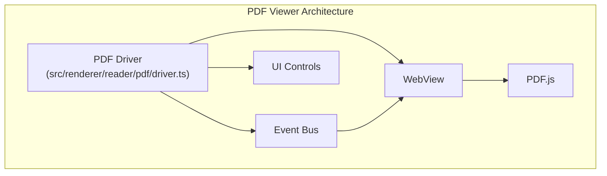

Sources: [src/renderer/reader/pdf/driver.ts](https://github.com/edrlab/thorium-reader/blob/02b67755/src/renderer/reader/pdf/driver.ts)

 [webpack.config.renderer-pdf.js](https://github.com/edrlab/thorium-reader/blob/02b67755/webpack.config.renderer-pdf.js)

## Publication Processing Pipeline

Publications follow a defined path from import to reading:

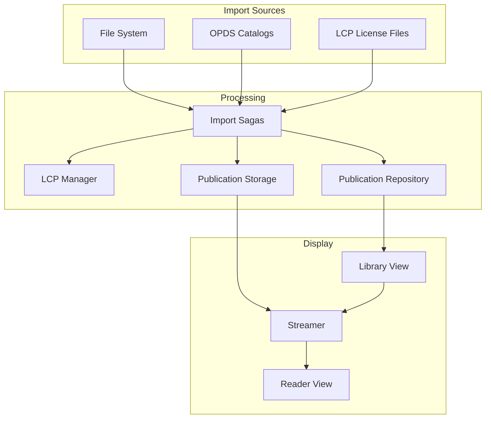

Sources: [src/main/redux/sagas/publication/openPublication.ts](https://github.com/edrlab/thorium-reader/blob/02b67755/src/main/redux/sagas/publication/openPublication.ts)

 [src/main/services/opds.ts](https://github.com/edrlab/thorium-reader/blob/02b67755/src/main/services/opds.ts)

## Inter-Process Communication

Communication between the main process and renderer processes happens through Electron's IPC mechanism:

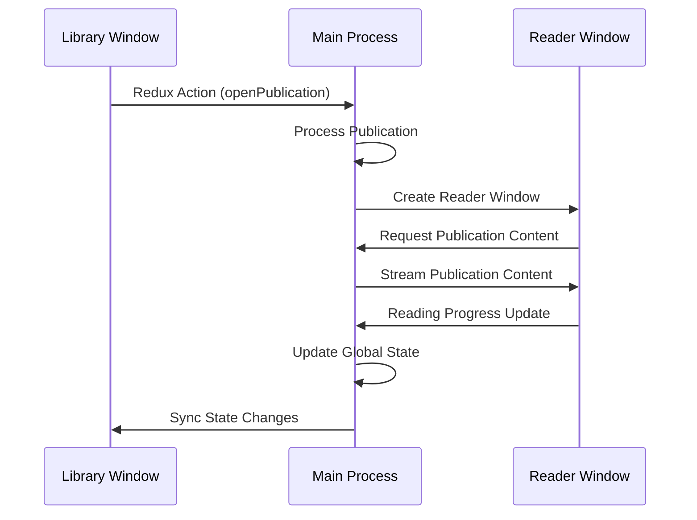

Redux actions are serialized and transmitted between processes, with appropriate sagas handling the actions.

Sources: [src/main/redux/sagas/win/library.ts](https://github.com/edrlab/thorium-reader/blob/02b67755/src/main/redux/sagas/win/library.ts)

 [src/common/utils/http.ts](https://github.com/edrlab/thorium-reader/blob/02b67755/src/common/utils/http.ts)

## Build and Packaging

Thorium uses webpack for bundling and electron-builder for packaging:

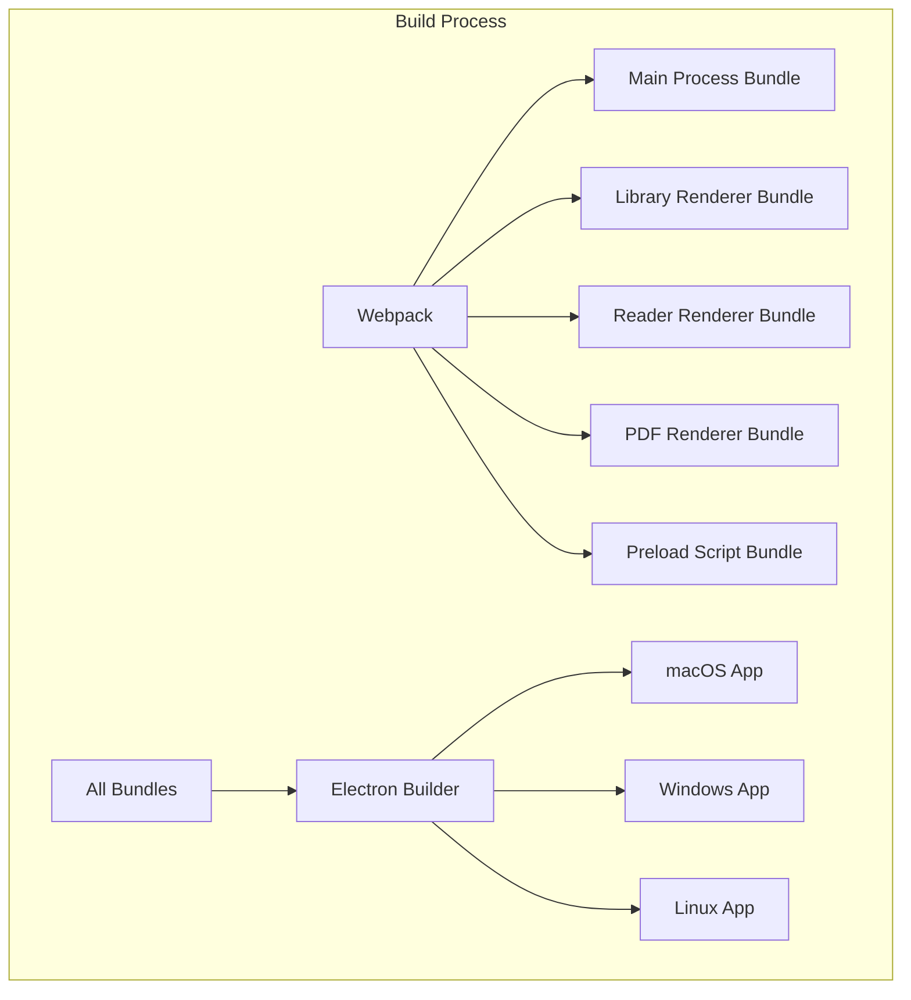

Source code is split into multiple webpack configurations, one for each process, which are then combined for the final build.

Sources: [webpack.config.js](https://github.com/edrlab/thorium-reader/blob/02b67755/webpack.config.js)

 [scripts/afterPack.js](https://github.com/edrlab/thorium-reader/blob/02b67755/scripts/afterPack.js)

 [package.json L11-L89](https://github.com/edrlab/thorium-reader/blob/02b67755/package.json#L11-L89)

## Summary

Thorium Reader's architecture follows modern patterns for Electron applications:

1. **Process Separation**: Clear separation between main and renderer processes
2. **Dependency Injection**: Decoupled components managed by InversifyJS
3. **Redux State Management**: Consistent state handling with Redux and Redux Saga
4. **Custom Protocol Handling**: Direct publication serving without HTTP server
5. **Component-Based UI**: React components for modular interface design

This architecture enables the application to provide a responsive reading experience while handling various publication formats and DRM schemes.

Sources: [src/main.ts](https://github.com/edrlab/thorium-reader/blob/02b67755/src/main.ts)

 [src/main/di.ts](https://github.com/edrlab/thorium-reader/blob/02b67755/src/main/di.ts)

 [src/common/streamerProtocol.ts](https://github.com/edrlab/thorium-reader/blob/02b67755/src/common/streamerProtocol.ts)