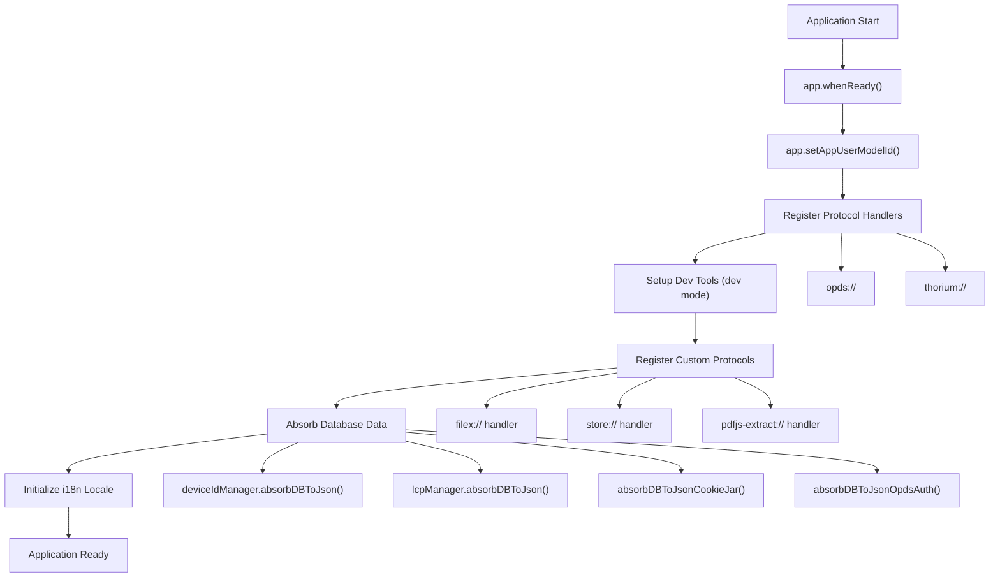
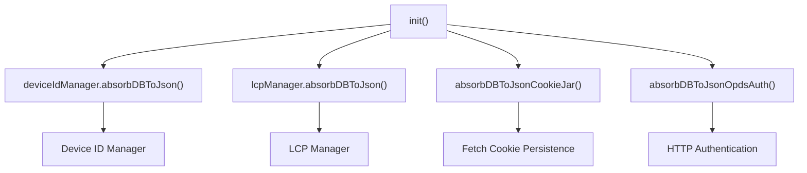
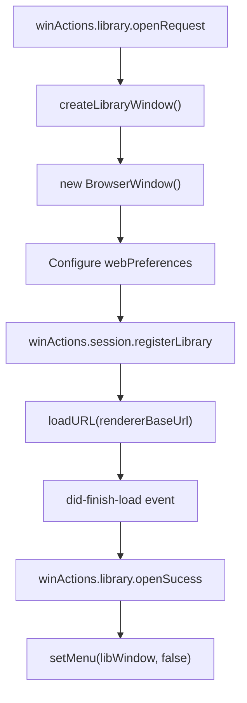
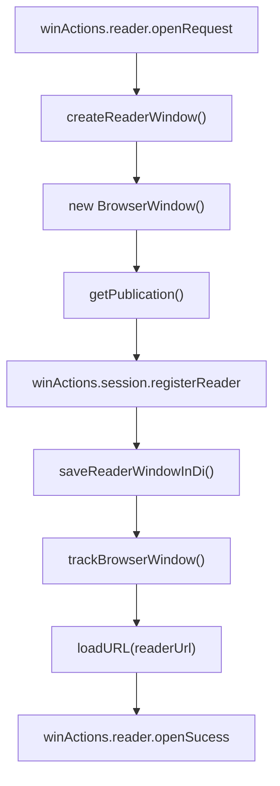
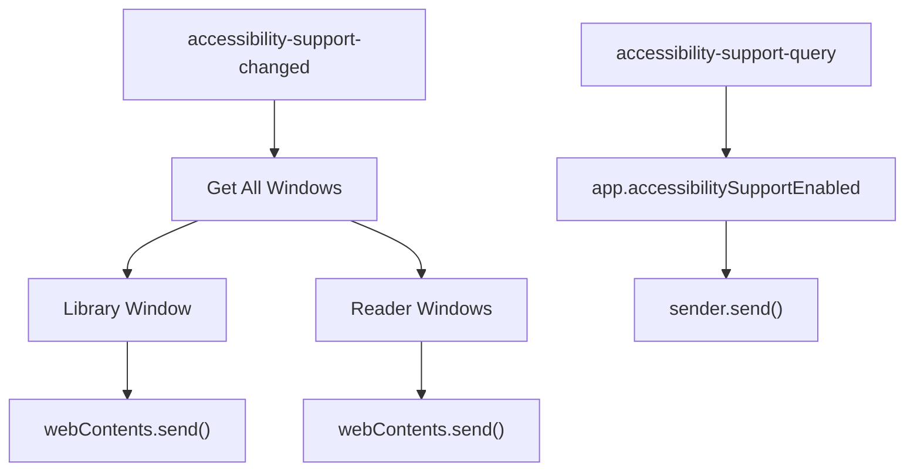
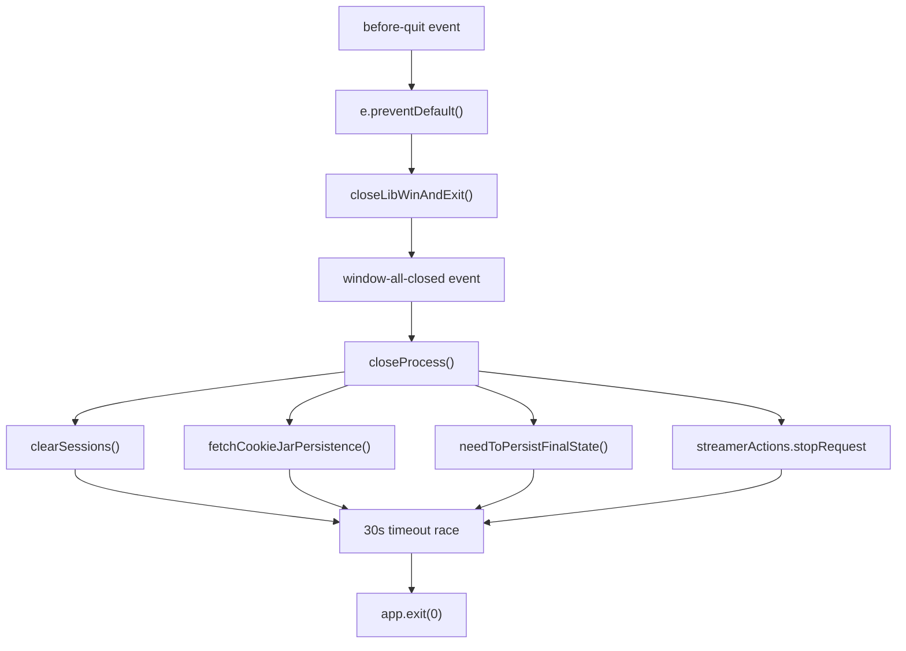
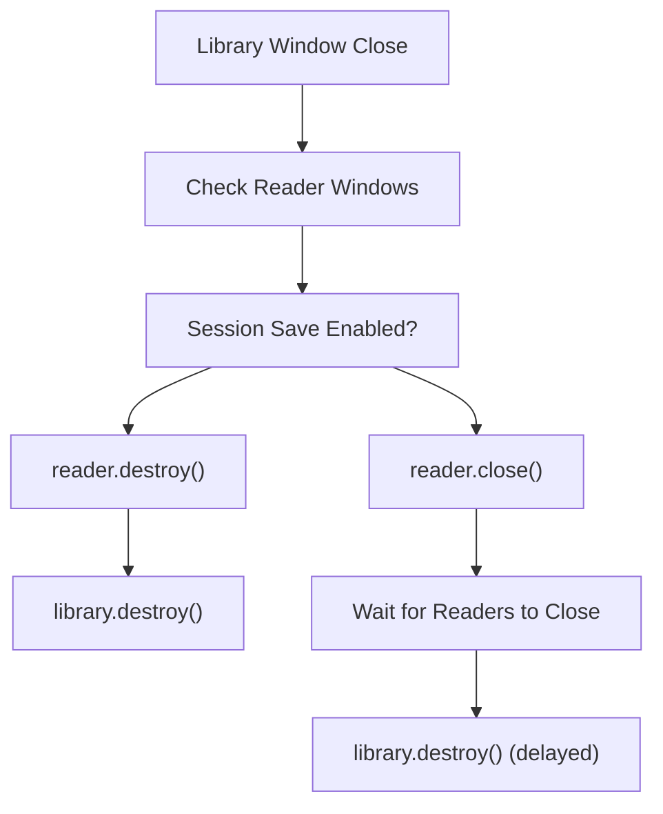
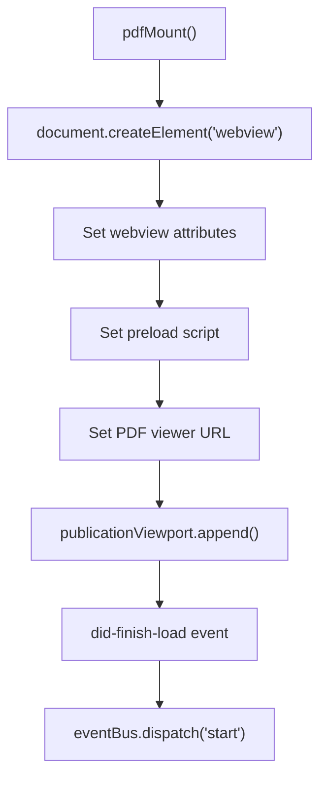

# Application Lifecycle

> **Relevant source files**
> * [scripts/afterPack.js](https://github.com/edrlab/thorium-reader/blob/02b67755/scripts/afterPack.js)
> * [scripts/go-ts-checker-webpack-plugin.js](https://github.com/edrlab/thorium-reader/blob/02b67755/scripts/go-ts-checker-webpack-plugin.js)
> * [src/main/pdf/extract.ts](https://github.com/edrlab/thorium-reader/blob/02b67755/src/main/pdf/extract.ts)
> * [src/main/redux/sagas/api/publication/export.ts](https://github.com/edrlab/thorium-reader/blob/02b67755/src/main/redux/sagas/api/publication/export.ts)
> * [src/main/redux/sagas/app.ts](https://github.com/edrlab/thorium-reader/blob/02b67755/src/main/redux/sagas/app.ts)
> * [src/main/redux/sagas/win/browserWindow/createLibraryWindow.ts](https://github.com/edrlab/thorium-reader/blob/02b67755/src/main/redux/sagas/win/browserWindow/createLibraryWindow.ts)
> * [src/main/redux/sagas/win/browserWindow/createReaderWindow.ts](https://github.com/edrlab/thorium-reader/blob/02b67755/src/main/redux/sagas/win/browserWindow/createReaderWindow.ts)
> * [src/main/redux/sagas/win/library.ts](https://github.com/edrlab/thorium-reader/blob/02b67755/src/main/redux/sagas/win/library.ts)
> * [src/main/streamer/streamerNoHttp.ts](https://github.com/edrlab/thorium-reader/blob/02b67755/src/main/streamer/streamerNoHttp.ts)
> * [src/preprocessor-directives.ts](https://github.com/edrlab/thorium-reader/blob/02b67755/src/preprocessor-directives.ts)
> * [src/renderer/reader/pdf/driver.ts](https://github.com/edrlab/thorium-reader/blob/02b67755/src/renderer/reader/pdf/driver.ts)
> * [tsconfig-cli.json](https://github.com/edrlab/thorium-reader/blob/02b67755/tsconfig-cli.json)
> * [tsconfig.json](https://github.com/edrlab/thorium-reader/blob/02b67755/tsconfig.json)
> * [typings.d.ts](https://github.com/edrlab/thorium-reader/blob/02b67755/typings.d.ts)
> * [webpack.config-preprocessor-directives.js](https://github.com/edrlab/thorium-reader/blob/02b67755/webpack.config-preprocessor-directives.js)
> * [webpack.config.js](https://github.com/edrlab/thorium-reader/blob/02b67755/webpack.config.js)

This document explains the complete lifecycle of the Thorium Reader application, from initialization through normal operation to shutdown. It covers application startup processes, protocol handler registration, window management, accessibility support, and graceful shutdown procedures.

For information about the overall application architecture, see [Application Architecture](/edrlab/thorium-reader/1.1-application-architecture). For details about state management during the lifecycle, see [Redux Sagas](/edrlab/thorium-reader/6.2-redux-sagas).

## Application Initialization

The application initialization process is orchestrated by the `init()` function in the main process, which handles critical setup tasks before the application becomes ready for user interaction.

Sources: [src/main/redux/sagas/app.ts L41-L279](https://github.com/edrlab/thorium-reader/blob/02b67755/src/main/redux/sagas/app.ts#L41-L279)

### Protocol Handler Registration

The application registers as the default handler for specific URL schemes to enable deep linking functionality. The registration process differs between development and production modes.

| Protocol Scheme | Purpose | Handler Function |
| --- | --- | --- |
| `opds://` | OPDS catalog links | Built-in Electron handler |
| `thorium://` | Thorium-specific deep links | Built-in Electron handler |
| `filex://` | Local file access | `protocolHandler_FILEX` |
| `store://` | Publication storage access | `protocolHandler_Store` |
| `pdfjs-extract://` | PDF content extraction | `protocolHandler_PDF` |

The protocol handlers are registered using Electron's `protocol.handle()` API:

Sources: [src/main/redux/sagas/app.ts L45-L68](https://github.com/edrlab/thorium-reader/blob/02b67755/src/main/redux/sagas/app.ts#L45-L68)

 [src/main/redux/sagas/app.ts L131-L217](https://github.com/edrlab/thorium-reader/blob/02b67755/src/main/redux/sagas/app.ts#L131-L217)

### Database Initialization

During startup, the application absorbs persistent data from various database sources to restore application state:

Sources: [src/main/redux/sagas/app.ts L220-L236](https://github.com/edrlab/thorium-reader/blob/02b67755/src/main/redux/sagas/app.ts#L220-L236)

## Window Lifecycle Management

The application manages multiple window types through dedicated creation and lifecycle sagas. Each window type has specific initialization requirements and lifecycle events.

### Library Window Creation

The library window serves as the main application interface for publication management:

Sources: [src/main/redux/sagas/win/browserWindow/createLibraryWindow.ts L38-L179](https://github.com/edrlab/thorium-reader/blob/02b67755/src/main/redux/sagas/win/browserWindow/createLibraryWindow.ts#L38-L179)

### Reader Window Creation

Reader windows are created for individual publication reading sessions:

Sources: [src/main/redux/sagas/win/browserWindow/createReaderWindow.ts L33-L151](https://github.com/edrlab/thorium-reader/blob/02b67755/src/main/redux/sagas/win/browserWindow/createReaderWindow.ts#L33-L151)

## Accessibility Support

The application provides comprehensive accessibility support through system integration and event handling:

The accessibility system handles two main events:

* `accessibility-support-changed`: Broadcasts accessibility state changes to all windows
* `accessibility-support-query`: Responds to accessibility support queries from renderers

Sources: [src/main/redux/sagas/app.ts L81-L125](https://github.com/edrlab/thorium-reader/blob/02b67755/src/main/redux/sagas/app.ts#L81-L125)

## Application Shutdown

The shutdown process ensures data persistence and clean resource disposal through a coordinated sequence of operations:

### Shutdown Sequence

The shutdown process follows a strict sequence to ensure data integrity:

1. **Event Prevention**: The `before-quit` event is prevented to allow controlled shutdown
2. **Window Closure**: Library and reader windows are closed appropriately
3. **Resource Cleanup**: Sessions, cookies, and state are persisted
4. **Service Shutdown**: The streamer service is gracefully stopped
5. **Force Exit**: A 30-second timeout ensures the process terminates

Sources: [src/main/redux/sagas/app.ts L340-L464](https://github.com/edrlab/thorium-reader/blob/02b67755/src/main/redux/sagas/app.ts#L340-L464)

 [src/main/redux/sagas/app.ts L281-L338](https://github.com/edrlab/thorium-reader/blob/02b67755/src/main/redux/sagas/app.ts#L281-L338)

### Session Management During Shutdown

The application handles session persistence differently based on user preferences:

Sources: [src/main/redux/sagas/win/library.ts L191-L293](https://github.com/edrlab/thorium-reader/blob/02b67755/src/main/redux/sagas/win/library.ts#L191-L293)

## PDF Renderer Lifecycle

The PDF renderer has a specialized lifecycle for handling PDF documents through a dedicated webview:

The PDF renderer uses a custom event bus system for communication between the main renderer and the PDF webview.

Sources: [src/renderer/reader/pdf/driver.ts L75-L165](https://github.com/edrlab/thorium-reader/blob/02b67755/src/renderer/reader/pdf/driver.ts#L75-L165)

## Development vs Production Differences

The application lifecycle varies between development and production environments:

| Aspect | Development | Production |
| --- | --- | --- |
| Protocol Registration | Uses `electronPath` and `appPath` parameters | Direct registration without parameters |
| DevTools | Automatic installation of React/Redux DevTools | DevTools disabled |
| URL Loading | HTTP servers for hot reload | `filex://` protocol for local files |
| Debug Output | Extensive logging enabled | Minimal logging |

Sources: [src/main/redux/sagas/app.ts L49-L68](https://github.com/edrlab/thorium-reader/blob/02b67755/src/main/redux/sagas/app.ts#L49-L68)

 [src/main/redux/sagas/win/browserWindow/createLibraryWindow.ts L84-L95](https://github.com/edrlab/thorium-reader/blob/02b67755/src/main/redux/sagas/win/browserWindow/createLibraryWindow.ts#L84-L95)