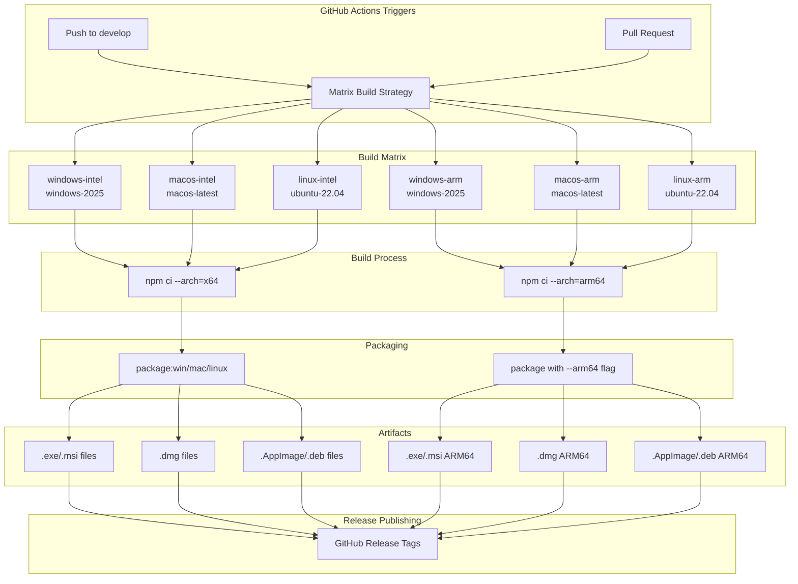
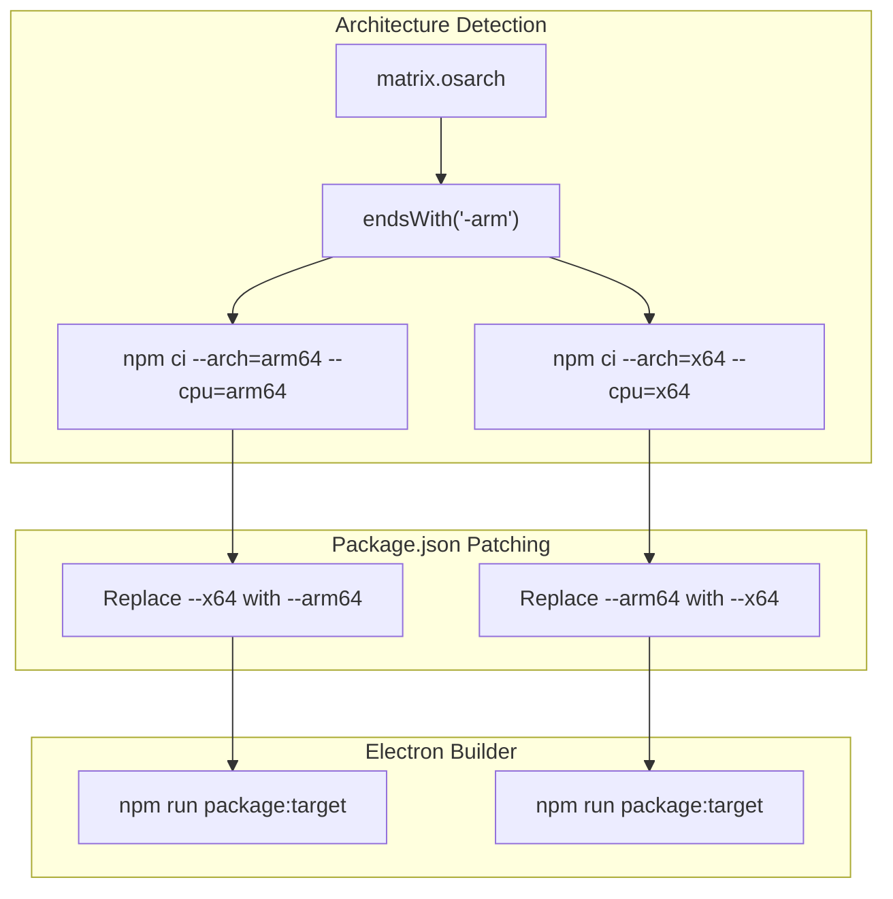
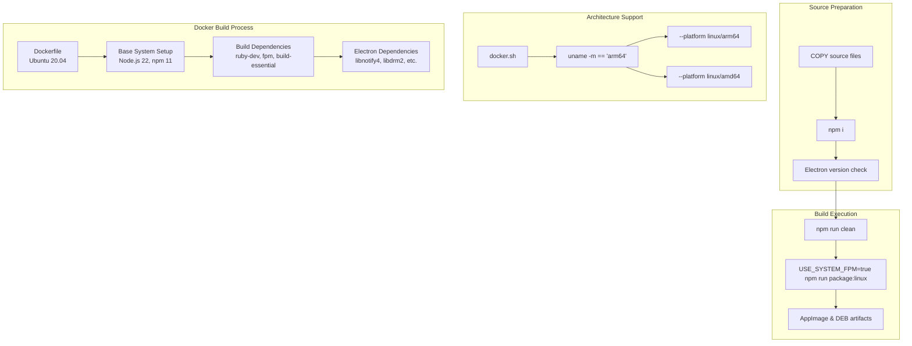
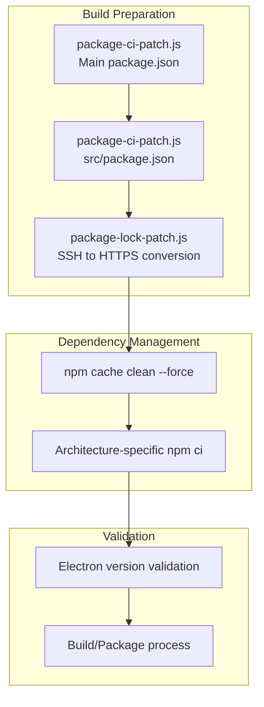
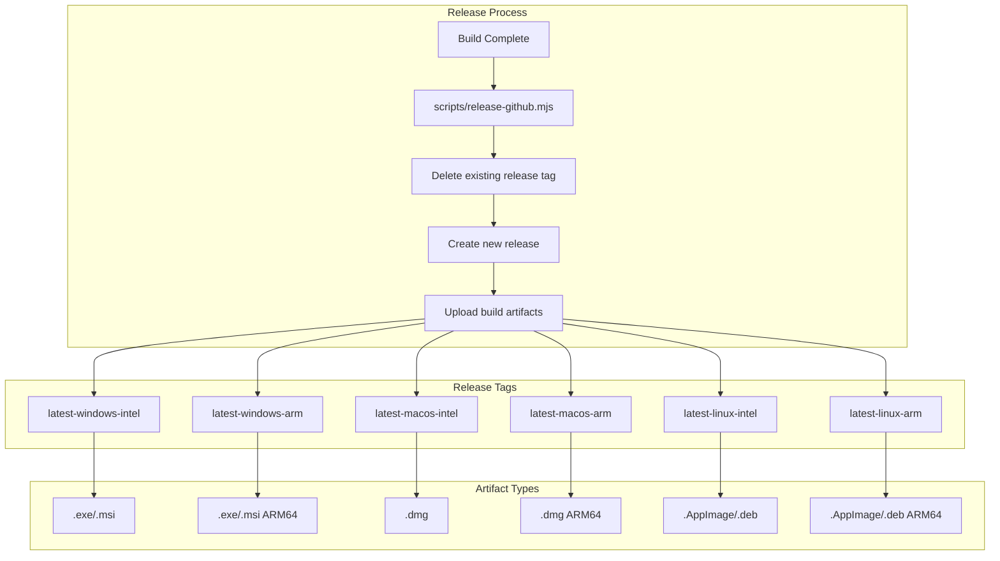
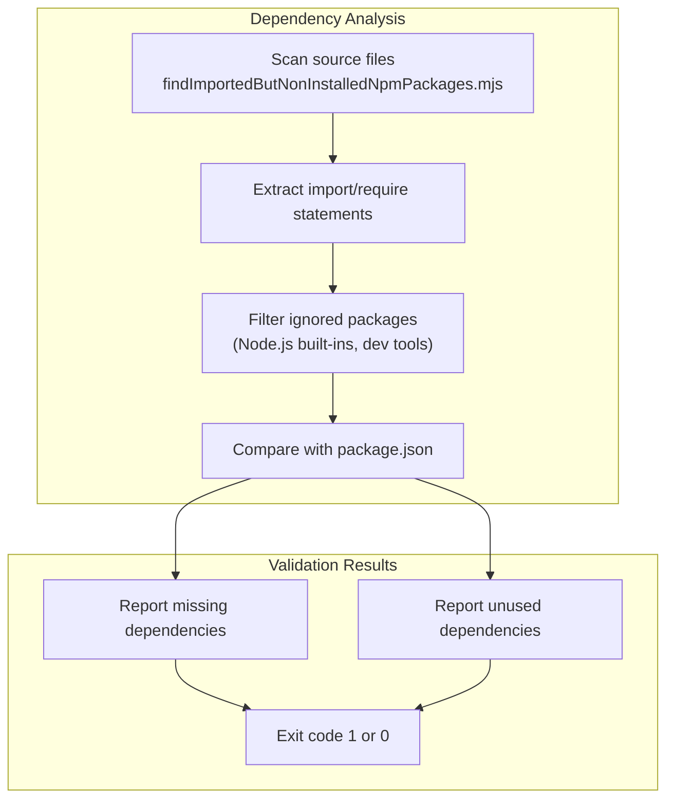

# Build & Deployment

> **Relevant source files**
> * [.github/workflows/main.yml](https://github.com/edrlab/thorium-reader/blob/02b67755/.github/workflows/main.yml)
> * [Dockerfile](https://github.com/edrlab/thorium-reader/blob/02b67755/Dockerfile)
> * [docker.sh](https://github.com/edrlab/thorium-reader/blob/02b67755/docker.sh)
> * [eslint.config.mjs](https://github.com/edrlab/thorium-reader/blob/02b67755/eslint.config.mjs)
> * [package-mac-skip-notarize_ARM64.sh](https://github.com/edrlab/thorium-reader/blob/02b67755/package-mac-skip-notarize_ARM64.sh)
> * [package-mac-skip-notarize_x64.sh](https://github.com/edrlab/thorium-reader/blob/02b67755/package-mac-skip-notarize_x64.sh)
> * [scripts/findImportedButNonInstalledNpmPackages.mjs](https://github.com/edrlab/thorium-reader/blob/02b67755/scripts/findImportedButNonInstalledNpmPackages.mjs)
> * [scripts/package-lock-patch.js](https://github.com/edrlab/thorium-reader/blob/02b67755/scripts/package-lock-patch.js)
> * [src/main/redux/sagas/keyboard.ts](https://github.com/edrlab/thorium-reader/blob/02b67755/src/main/redux/sagas/keyboard.ts)

This document covers the continuous integration, build matrix, packaging, and deployment pipeline for Thorium Reader. The system supports cross-platform builds for Windows, macOS, and Linux across both Intel and ARM architectures using GitHub Actions, Docker containerization, and Electron Builder.

For application architecture details, see [Application Architecture](/edrlab/thorium-reader/1.1-application-architecture). For information about the overall system overview, see [Overview](/edrlab/thorium-reader/1-overview).

## CI/CD Pipeline Overview

The build and deployment system uses GitHub Actions with a comprehensive build matrix to generate platform-specific distributables. The pipeline supports both pull request validation builds and full release builds with artifact publishing.

Sources: [.github/workflows/main.yml L31-L88](https://github.com/edrlab/thorium-reader/blob/02b67755/.github/workflows/main.yml#L31-L88)

## Build Matrix Configuration

The GitHub Actions workflow defines a comprehensive build matrix covering all supported platforms and architectures. Each matrix entry specifies the runner OS, packaging command, and release tag.

| OS Architecture | Runner | Package Command | Release Tag |
| --- | --- | --- | --- |
| windows-intel | windows-2025 | `win` | latest-windows-intel |
| windows-arm | windows-2025 | `win` | latest-windows-arm |
| macos-intel | macos-latest | `mac:skip-notarize` | latest-macos-intel |
| macos-arm | macos-latest | `mac:skip-notarize` | latest-macos-arm |
| linux-intel | ubuntu-22.04 | `linux` | latest-linux-intel |
| linux-arm | ubuntu-22.04 | `linux` | latest-linux-arm |

The build process dynamically patches `package.json` to switch between `--x64` and `--arm64` flags based on the target architecture:

Sources: [.github/workflows/main.yml L184-L228](https://github.com/edrlab/thorium-reader/blob/02b67755/.github/workflows/main.yml#L184-L228)

 [.github/workflows/main.yml L64-L88](https://github.com/edrlab/thorium-reader/blob/02b67755/.github/workflows/main.yml#L64-L88)

## Docker Containerization

Linux builds support Docker containerization for consistent build environments and glibc compatibility. The Docker setup uses Ubuntu 20.04 as the base image for maximum compatibility.

The `docker.sh` script handles architecture detection and package.json patching for ARM64 builds:

Sources: [Dockerfile L1-L125](https://github.com/edrlab/thorium-reader/blob/02b67755/Dockerfile#L1-L125)

 [docker.sh L10-L134](https://github.com/edrlab/thorium-reader/blob/02b67755/docker.sh#L10-L134)

## Platform-Specific Build Scripts

### macOS Builds

Separate shell scripts handle Intel and ARM64 macOS builds with architecture-specific npm installations and package.json patching:

* `package-mac-skip-notarize_x64.sh` - Intel macOS builds
* `package-mac-skip-notarize_ARM64.sh` - ARM64 macOS builds

Both scripts follow the pattern:

1. Remove existing electron modules
2. Install with architecture-specific flags
3. Patch package.json for target architecture
4. Run packaging command

Sources: [package-mac-skip-notarize_x64.sh L1-L8](https://github.com/edrlab/thorium-reader/blob/02b67755/package-mac-skip-notarize_x64.sh#L1-L8)

 [package-mac-skip-notarize_ARM64.sh L1-L8](https://github.com/edrlab/thorium-reader/blob/02b67755/package-mac-skip-notarize_ARM64.sh#L1-L8)

## Build Tools and Configuration

### Version Patching

The CI pipeline uses Node.js scripts to patch version information and dependencies:

The `package-lock-patch.js` script converts SSH Git URLs to HTTPS for CI compatibility:

Sources: [.github/workflows/main.yml L171-L179](https://github.com/edrlab/thorium-reader/blob/02b67755/.github/workflows/main.yml#L171-L179)

 [scripts/package-lock-patch.js L1-L6](https://github.com/edrlab/thorium-reader/blob/02b67755/scripts/package-lock-patch.js#L1-L6)

### Electron Version Validation

The CI pipeline validates Electron binary architecture and version compatibility:

* Windows: Uses `dumpbin /headers` to verify binary architecture
* Linux: Uses `file` command to check binary format
* macOS: Validates Electron.app bundle architecture

Sources: [.github/workflows/main.yml L194-L210](https://github.com/edrlab/thorium-reader/blob/02b67755/.github/workflows/main.yml#L194-L210)

## Release Publishing

### GitHub Release Management

The deployment process uses a custom Node.js script (`release-github.mjs`) to manage GitHub releases:

1. Delete existing release tags for the target platform
2. Create new release with build artifacts
3. Upload platform-specific binaries (.exe, .msi, .dmg, .AppImage, .deb)

### Build Environment Variables

Key environment variables control the build and release process:

* `GITHUB_TOKEN_RELEASE_PUBLISH` - GitHub token for release publishing
* `USE_HARD_LINKS` - Set to 'false' for Electron Builder compatibility
* `USE_SYSTEM_FPM` - Use system FPM for Linux packaging
* `RELEASE_TAG` - Target release tag for the build matrix entry

Sources: [.github/workflows/main.yml L231-L233](https://github.com/edrlab/thorium-reader/blob/02b67755/.github/workflows/main.yml#L231-L233)

 [.github/workflows/main.yml L24-L29](https://github.com/edrlab/thorium-reader/blob/02b67755/.github/workflows/main.yml#L24-L29)

## Dependency Validation

The build system includes a comprehensive dependency validation script that ensures all imported packages are properly declared in package.json:

The script identifies and reports:

* Packages imported but not in package.json dependencies
* Package.json dependencies not imported anywhere in the codebase
* Proper handling of scoped packages and Node.js built-ins

Sources: [scripts/findImportedButNonInstalledNpmPackages.mjs L1-L226](https://github.com/edrlab/thorium-reader/blob/02b67755/scripts/findImportedButNonInstalledNpmPackages.mjs#L1-L226)