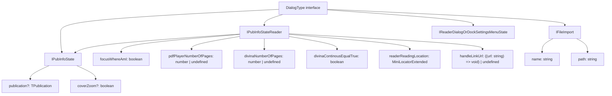
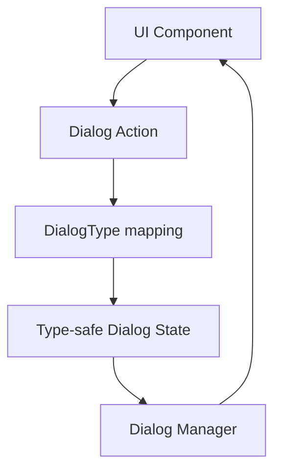

# Dialog System

> **Relevant source files**
> * [src/common/models/dialog.ts](https://github.com/edrlab/thorium-reader/blob/02b67755/src/common/models/dialog.ts)

## Purpose and Scope

The Dialog System in Thorium Reader provides a centralized type-safe mechanism for managing modal dialogs throughout the application. This system defines dialog types, their associated data structures, and ensures consistent handling of modal interactions across different components. The system supports various dialog use cases including file imports, publication information display, OPDS feed management, LCP authentication, and application settings.

For information about the broader UI component architecture, see [UI Components](/edrlab/thorium-reader/8.1-ui-components). For details about settings-specific interfaces, see [Settings UI](/edrlab/thorium-reader/8.4-settings-ui).

## Dialog Type System

The dialog system is built around a strongly-typed enumeration and interface mapping that ensures type safety across all dialog interactions.

### Dialog Type Enumeration

The `DialogTypeName` enum defines all available dialog types in the application:

| Dialog Type | Purpose |
| --- | --- |
| `FileImport` | Handle file import operations |
| `PublicationInfoOpds` | Display publication information from OPDS feeds |
| `PublicationInfoLib` | Show publication details in library context |
| `PublicationInfoReader` | Present publication info within reader interface |
| `OpdsFeedAddForm` | Create new OPDS feed subscriptions |
| `OpdsFeedUpdateForm` | Modify existing OPDS feed settings |
| `ApiappAddForm` | Configure API application connections |
| `DeletePublicationConfirm` | Confirm publication deletion |
| `DeleteOpdsFeedConfirm` | Confirm OPDS feed removal |
| `LcpAuthentication` | Handle LCP license authentication |
| `LsdReturnConfirm` | Confirm LCP license returns |
| `LsdRenewConfirm` | Confirm LCP license renewals |
| `AboutThorium` | Display application information |
| `ReaderMenu` | Present reader navigation menu |
| `ReaderSettings` | Show reader configuration options |

**Dialog Type Hierarchy**

```mermaid
flowchart TD

DialogTypeName["DialogTypeName enum"]
FileOps["File Operations"]
PubInfo["Publication Info"]
OpdsOps["OPDS Operations"]
LcpOps["LCP Operations"]
ReaderOps["Reader Operations"]
SystemOps["System Operations"]
FileImport["FileImport"]
PublicationInfoOpds["PublicationInfoOpds"]
PublicationInfoLib["PublicationInfoLib"]
PublicationInfoReader["PublicationInfoReader"]
OpdsFeedAddForm["OpdsFeedAddForm"]
OpdsFeedUpdateForm["OpdsFeedUpdateForm"]
DeleteOpdsFeedConfirm["DeleteOpdsFeedConfirm"]
LcpAuthentication["LcpAuthentication"]
LsdReturnConfirm["LsdReturnConfirm"]
LsdRenewConfirm["LsdRenewConfirm"]
ReaderMenu["ReaderMenu"]
ReaderSettings["ReaderSettings"]
ApiappAddForm["ApiappAddForm"]
AboutThorium["AboutThorium"]
DeletePublicationConfirm["DeletePublicationConfirm"]

DialogTypeName --> FileOps
DialogTypeName --> PubInfo
DialogTypeName --> OpdsOps
DialogTypeName --> LcpOps
DialogTypeName --> ReaderOps
DialogTypeName --> SystemOps
FileOps --> FileImport
PubInfo --> PublicationInfoOpds
PubInfo --> PublicationInfoLib
PubInfo --> PublicationInfoReader
OpdsOps --> OpdsFeedAddForm
OpdsOps --> OpdsFeedUpdateForm
OpdsOps --> DeleteOpdsFeedConfirm
LcpOps --> LcpAuthentication
LcpOps --> LsdReturnConfirm
LcpOps --> LsdRenewConfirm
ReaderOps --> ReaderMenu
ReaderOps --> ReaderSettings
SystemOps --> ApiappAddForm
SystemOps --> AboutThorium
SystemOps --> DeletePublicationConfirm
```

Sources: [src/common/models/dialog.ts L33-L49](https://github.com/edrlab/thorium-reader/blob/02b67755/src/common/models/dialog.ts#L33-L49)

### Dialog State Interfaces

The system uses TypeScript interfaces to define the data structure for each dialog type through the `DialogType` mapping interface.

**Dialog State Architecture**

Sources: [src/common/models/dialog.ts L15-L31](https://github.com/edrlab/thorium-reader/blob/02b67755/src/common/models/dialog.ts#L15-L31)

 [src/common/models/dialog.ts L51-L84](https://github.com/edrlab/thorium-reader/blob/02b67755/src/common/models/dialog.ts#L51-L84)

## Dialog Categories

### Publication Information Dialogs

Three variants of publication information dialogs serve different contexts:

* **PublicationInfoOpds**: Basic publication details from OPDS feeds
* **PublicationInfoLib**: Library-specific publication information
* **PublicationInfoReader**: Enhanced reader context with location tracking

The reader variant (`IPubInfoStateReader`) extends the base interface with additional reading-specific data including page counts for PDF/Divina content, reading location tracking, and link handling capabilities.

### OPDS Management Dialogs

OPDS-related dialogs handle catalog feed operations:

* **OpdsFeedAddForm**: Empty state for new feed creation
* **OpdsFeedUpdateForm**: Contains existing `IOpdsFeedView` for modification
* **DeleteOpdsFeedConfirm**: Confirmation dialog with feed reference

### LCP Authentication Dialogs

LCP (Licensed Content Protection) dialogs manage DRM operations:

* **LcpAuthentication**: Comprehensive authentication state including publication view, hint text, URL hints, and error messages
* **LsdReturnConfirm**: License return confirmation with publication reference
* **LsdRenewConfirm**: License renewal confirmation with publication reference

### System and Utility Dialogs

Additional dialogs support system operations:

* **FileImport**: Contains array of file import specifications with name/path pairs
* **ReaderMenu/ReaderSettings**: Use shared `IReaderDialogOrDockSettingsMenuState` interface
* **AboutThorium**: Simple informational dialog with empty state
* **ApiappAddForm**: Empty state for API application configuration

**Dialog Integration Flow**

Sources: [src/common/models/dialog.ts L51-L84](https://github.com/edrlab/thorium-reader/blob/02b67755/src/common/models/dialog.ts#L51-L84)

## Type Safety and Integration

The dialog system ensures compile-time type safety through the `DialogType` interface mapping, which associates each `DialogTypeName` enum value with its corresponding data structure. This approach prevents runtime errors and provides IDE support for dialog state management.

The system integrates with the broader application architecture through Redux state management and supports consistent dialog handling patterns across library, reader, and OPDS contexts. Dialog states can contain complex objects including publication views, feed references, and callback functions for dynamic behavior.

Sources: [src/common/models/dialog.ts L1-L85](https://github.com/edrlab/thorium-reader/blob/02b67755/src/common/models/dialog.ts#L1-L85)