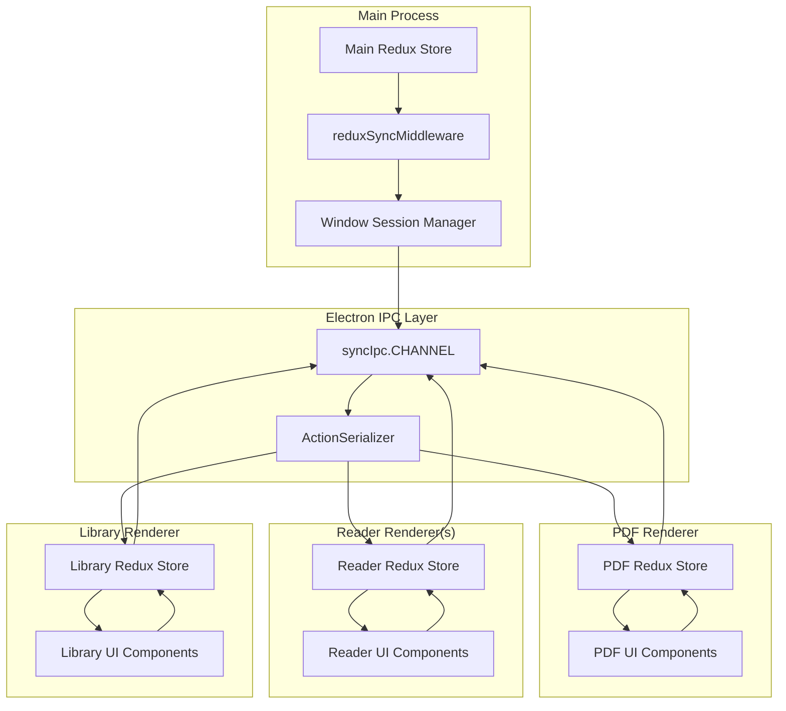
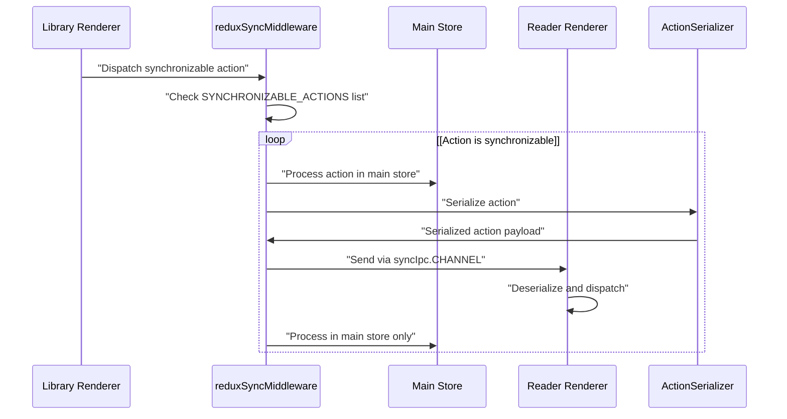

# Inter-Process Communication

> **Relevant source files**
> * [src/common/redux/actions/index.ts](https://github.com/edrlab/thorium-reader/blob/02b67755/src/common/redux/actions/index.ts)
> * [src/main/redux/middleware/sync.ts](https://github.com/edrlab/thorium-reader/blob/02b67755/src/main/redux/middleware/sync.ts)
> * [src/main/redux/reducers/index.ts](https://github.com/edrlab/thorium-reader/blob/02b67755/src/main/redux/reducers/index.ts)
> * [src/main/redux/sagas/index.ts](https://github.com/edrlab/thorium-reader/blob/02b67755/src/main/redux/sagas/index.ts)
> * [src/main/redux/states/index.ts](https://github.com/edrlab/thorium-reader/blob/02b67755/src/main/redux/states/index.ts)

This document covers the inter-process communication (IPC) system in Thorium Reader, which enables Redux action synchronization between the main process and multiple renderer processes. The system allows state changes to be automatically propagated across different application windows including the library interface and reader windows.

For information about Redux state management, see [Redux Store](/edrlab/thorium-reader/6.1-redux-store). For details on Redux sagas and side effects, see [Redux Sagas](/edrlab/thorium-reader/6.2-redux-sagas).

## Architecture Overview

Thorium Reader uses a Redux-based IPC system built on top of Electron's native IPC capabilities. The main mechanism is the synchronization middleware that intercepts specific Redux actions and broadcasts them to appropriate renderer processes.



Sources: [src/main/redux/middleware/sync.ts L96-L212](https://github.com/edrlab/thorium-reader/blob/02b67755/src/main/redux/middleware/sync.ts#L96-L212)

 [src/main/redux/sagas/index.ts L47-L165](https://github.com/edrlab/thorium-reader/blob/02b67755/src/main/redux/sagas/index.ts#L47-L165)

## Redux Action Synchronization

The core IPC mechanism is implemented through the `reduxSyncMiddleware` which intercepts Redux actions and determines whether they should be synchronized across processes. Only actions listed in `SYNCHRONIZABLE_ACTIONS` are eligible for cross-process communication.

### Synchronizable Actions

The middleware defines a comprehensive list of action types that can be synchronized:

| Action Category | Examples | Purpose |
| --- | --- | --- |
| API Results | `apiActions.result.ID` | Share API responses across processes |
| Dialog Management | `dialogActions.openRequest.ID` | Coordinate modal dialogs |
| Reader Operations | `readerActions.fullScreenRequest.ID`, `readerActions.setReduxState.ID` | Synchronize reading state |
| Localization | `i18nActions.setLocale.ID` | Update interface language |
| Keyboard Shortcuts | `keyboardActions.setShortcuts.ID` | Share keyboard configurations |
| Publication Management | `publicationActions.readingFinished.ID` | Track reading progress |
| Theme & UI | `themeActions.setTheme.ID` | Synchronize UI appearance |

Sources: [src/main/redux/middleware/sync.ts L28-L94](https://github.com/edrlab/thorium-reader/blob/02b67755/src/main/redux/middleware/sync.ts#L28-L94)

### Action Flow Diagram



Sources: [src/main/redux/middleware/sync.ts L96-L212](https://github.com/edrlab/thorium-reader/blob/02b67755/src/main/redux/middleware/sync.ts#L96-L212)

## Implementation Details

### Middleware Function

The `reduxSyncMiddleware` implements the Redux middleware pattern to intercept actions before they reach reducers:

```javascript
export const reduxSyncMiddleware: Middleware    = (store: MiddlewareAPI<Dispatch<UnknownAction>, RootState>) =>        (next: (action: unknown) => unknown) =>            ((action: unknown) => { /* implementation */ });
```

The middleware performs these key operations:

1. **Action Filtering**: Checks if the action type exists in `SYNCHRONIZABLE_ACTIONS`
2. **Window Discovery**: Retrieves active browser windows from the dependency injection container
3. **Action Broadcasting**: Sends serialized actions to appropriate renderer processes
4. **Sender Verification**: Prevents circular action dispatching by checking action sender

Sources: [src/main/redux/middleware/sync.ts L96-L98](https://github.com/edrlab/thorium-reader/blob/02b67755/src/main/redux/middleware/sync.ts#L96-L98)

### Window Management Integration

The middleware integrates with the window management system to determine which renderer processes should receive synchronized actions:

```javascript
const browserWin: Map<string, Electron.BrowserWindow> = new Map(); const libId = store.getState().win.session.library.identifier;if (libId) {    const libWin = getLibraryWindowFromDi();    if (libWin && !libWin.isDestroyed()) {        browserWin.set(libId, libWin);    }}
```

The system handles multiple reader windows by iterating through the reader session state and retrieving corresponding browser windows from the dependency injection container.

Sources: [src/main/redux/middleware/sync.ts L115-L145](https://github.com/edrlab/thorium-reader/blob/02b67755/src/main/redux/middleware/sync.ts#L115-L145)

### Action Serialization

Actions are serialized using the `ActionSerializer` service before transmission over IPC. The serialized actions are wrapped in a standardized `syncIpc.EventPayload` format:

```javascript
const a = ActionSerializer.serialize(action as ActionWithSender);win.webContents.send(syncIpc.CHANNEL, {    type: syncIpc.EventType.MainAction,    payload: { action: a },    sender: { type: SenderType.Main }} as syncIpc.EventPayload);
```

Sources: [src/main/redux/middleware/sync.ts L163-L175](https://github.com/edrlab/thorium-reader/blob/02b67755/src/main/redux/middleware/sync.ts#L163-L175)

## Action Routing and Targeting

The middleware supports targeted action dispatch through destination identifiers. Actions can include destination metadata to specify which renderer process should receive them:

* **Publication-specific targeting**: Actions with `ActionWithReaderPublicationIdentifierDestination` are only sent to readers displaying the specific publication
* **Window-specific targeting**: Actions with `ActionWithDestination` can target specific window identifiers
* **Sender exclusion**: Actions are never sent back to their originating renderer process

This prevents unnecessary action processing and maintains clean separation between different reader instances.

Sources: [src/main/redux/middleware/sync.ts L136-L160](https://github.com/edrlab/thorium-reader/blob/02b67755/src/main/redux/middleware/sync.ts#L136-L160)

## Integration with Root Saga

The IPC system is initialized and managed through the root saga orchestration. The `ipc.saga()` is called as part of the main application initialization sequence, ensuring proper setup of inter-process communication channels before other application features become active.

Sources: [src/main/redux/sagas/index.ts L101-L102](https://github.com/edrlab/thorium-reader/blob/02b67755/src/main/redux/sagas/index.ts#L101-L102)