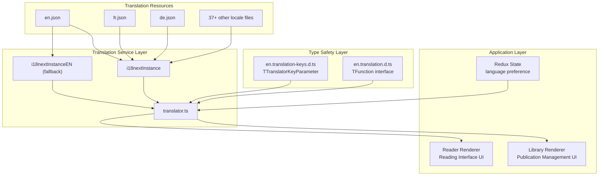
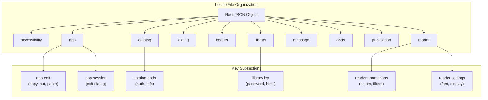
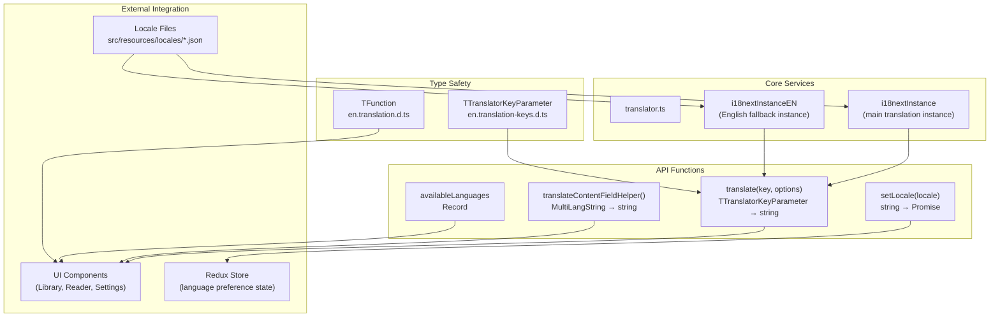
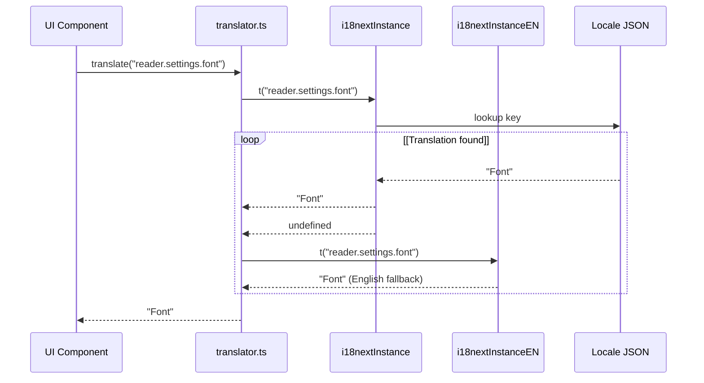
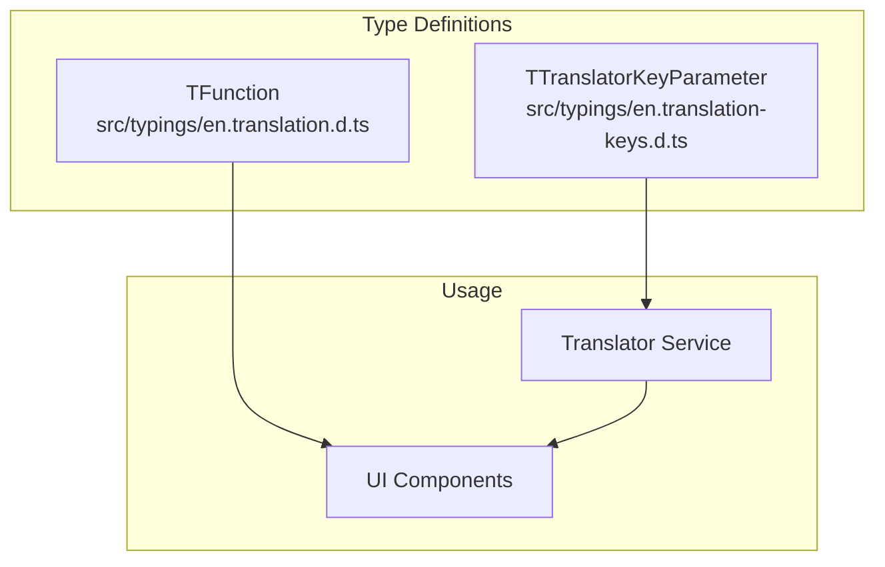
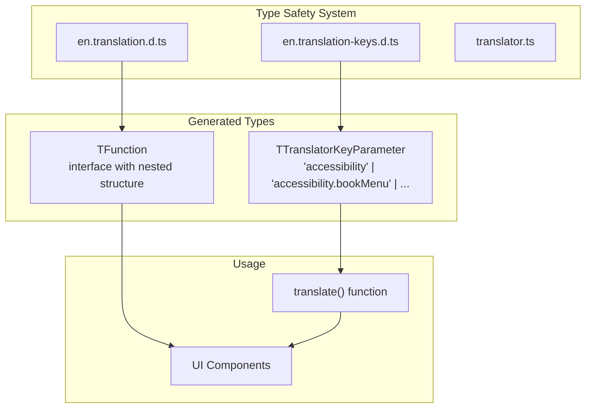
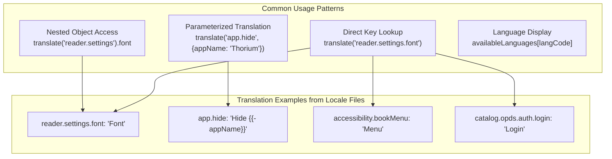
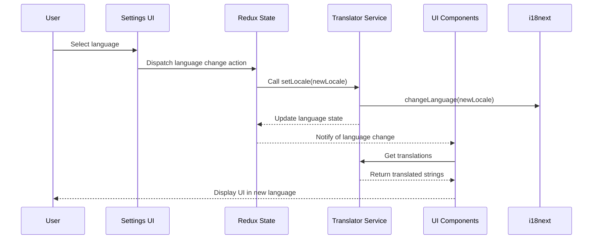

# Internationalization

> **Relevant source files**
> * [src/resources/locales/de.json](https://github.com/edrlab/thorium-reader/blob/02b67755/src/resources/locales/de.json)
> * [src/resources/locales/en.json](https://github.com/edrlab/thorium-reader/blob/02b67755/src/resources/locales/en.json)
> * [src/resources/locales/es.json](https://github.com/edrlab/thorium-reader/blob/02b67755/src/resources/locales/es.json)
> * [src/resources/locales/fr.json](https://github.com/edrlab/thorium-reader/blob/02b67755/src/resources/locales/fr.json)
> * [src/resources/locales/it.json](https://github.com/edrlab/thorium-reader/blob/02b67755/src/resources/locales/it.json)
> * [src/resources/locales/ja.json](https://github.com/edrlab/thorium-reader/blob/02b67755/src/resources/locales/ja.json)
> * [src/resources/locales/lt.json](https://github.com/edrlab/thorium-reader/blob/02b67755/src/resources/locales/lt.json)
> * [src/resources/locales/nl.json](https://github.com/edrlab/thorium-reader/blob/02b67755/src/resources/locales/nl.json)
> * [src/resources/locales/pt-br.json](https://github.com/edrlab/thorium-reader/blob/02b67755/src/resources/locales/pt-br.json)
> * [src/resources/locales/pt-pt.json](https://github.com/edrlab/thorium-reader/blob/02b67755/src/resources/locales/pt-pt.json)
> * [src/resources/locales/ru.json](https://github.com/edrlab/thorium-reader/blob/02b67755/src/resources/locales/ru.json)
> * [src/resources/locales/zh-cn.json](https://github.com/edrlab/thorium-reader/blob/02b67755/src/resources/locales/zh-cn.json)
> * [src/typings/en.translation-keys.d.ts](https://github.com/edrlab/thorium-reader/blob/02b67755/src/typings/en.translation-keys.d.ts)
> * [src/typings/en.translation.d.ts](https://github.com/edrlab/thorium-reader/blob/02b67755/src/typings/en.translation.d.ts)

This document describes the internationalization (i18n) system in Thorium Reader. It covers how the application supports multiple languages, how translation files are structured and loaded, and how the UI components access translated strings. For information about specific language preferences in the reader configuration, see page [Reader Configuration](/edrlab/thorium-reader/2.5-reader-configuration).

## Overview

Thorium Reader has a comprehensive internationalization system that supports 39+ languages through JSON locale files. The application uses the i18next library to handle translations and provides a custom translator service to make translations available throughout the application. This system integrates with both the Library Renderer and Reader Renderer processes as part of the overall Electron architecture.

**I18N System Architecture**



Sources:

* [src/common/services/translator.ts](https://github.com/edrlab/thorium-reader/blob/02b67755/src/common/services/translator.ts)
* [src/resources/locales/en.json L1-L10](https://github.com/edrlab/thorium-reader/blob/02b67755/src/resources/locales/en.json#L1-L10)
* [src/resources/locales/fr.json L1-L10](https://github.com/edrlab/thorium-reader/blob/02b67755/src/resources/locales/fr.json#L1-L10)
* [src/typings/en.translation.d.ts L1-L10](https://github.com/edrlab/thorium-reader/blob/02b67755/src/typings/en.translation.d.ts#L1-L10)
* [src/typings/en.translation-keys.d.ts L1-L5](https://github.com/edrlab/thorium-reader/blob/02b67755/src/typings/en.translation-keys.d.ts#L1-L5)

## Locale Files

The translation strings are stored in JSON files located in the `src/resources/locales/` directory. Each supported language has its own file, named with the language code (e.g., `en.json` for English, `fr.json` for French).

### Structure

Each locale file follows the same structure with nested objects representing keys for different parts of the application. This hierarchical organization helps keep translations organized by feature or component.

**Locale File Hierarchical Structure**



Example structure from `en.json`:

```json
{    "accessibility": {        "bookMenu": "Menu",        "closeDialog": "Close",        "importFile": "Import publication"    },    "app": {        "edit": {            "copy": "Copy",            "cut": "Cut",            "paste": "Paste"        },        "hide": "Hide {{- appName}}"    },    "reader": {        "annotations": {            "Color": "Color",            "addNote": "Annotate"        },        "settings": {            "font": "Font",            "fontSize": "Font size"        }    }}
```

Sources:

* [src/resources/locales/en.json L1-L50](https://github.com/edrlab/thorium-reader/blob/02b67755/src/resources/locales/en.json#L1-L50)
* [src/resources/locales/en.json L617-L700](https://github.com/edrlab/thorium-reader/blob/02b67755/src/resources/locales/en.json#L617-L700)
* [src/resources/locales/en.json L775-L850](https://github.com/edrlab/thorium-reader/blob/02b67755/src/resources/locales/en.json#L775-L850)
* [src/resources/locales/fr.json L1-L50](https://github.com/edrlab/thorium-reader/blob/02b67755/src/resources/locales/fr.json#L1-L50)
* [src/resources/locales/de.json L1-L50](https://github.com/edrlab/thorium-reader/blob/02b67755/src/resources/locales/de.json#L1-L50)

### Available Languages

The application supports 39+ languages, with locale files stored in `src/resources/locales/`. Key supported languages include:

| Code | Language | File |
| --- | --- | --- |
| en | English | en.json |
| fr | Français (French) | fr.json |
| de | Deutsch (German) | de.json |
| es | Español (Spanish) | es.json |
| pt-pt | Português (Portuguese) | pt-pt.json |
| pt-br | Português do Brasil | pt-br.json |
| ja | 日本語 (Japanese) | ja.json |
| zh-cn | 中文简体 (Chinese Simplified) | zh-cn.json |
| it | Italiano (Italian) | it.json |
| nl | Nederlands (Dutch) | nl.json |
| lt | Lietuvių (Lithuanian) | lt.json |

The `availableLanguages` object in the translator service defines the mapping between language codes and display names used throughout the application.

Sources:

* [src/resources/locales/en.json L1](https://github.com/edrlab/thorium-reader/blob/02b67755/src/resources/locales/en.json#L1-L1)
* [src/resources/locales/fr.json L1](https://github.com/edrlab/thorium-reader/blob/02b67755/src/resources/locales/fr.json#L1-L1)
* [src/resources/locales/de.json L1](https://github.com/edrlab/thorium-reader/blob/02b67755/src/resources/locales/de.json#L1-L1)
* [src/resources/locales/es.json L1](https://github.com/edrlab/thorium-reader/blob/02b67755/src/resources/locales/es.json#L1-L1)
* [src/resources/locales/pt-pt.json L1](https://github.com/edrlab/thorium-reader/blob/02b67755/src/resources/locales/pt-pt.json#L1-L1)
* [src/resources/locales/pt-br.json L1](https://github.com/edrlab/thorium-reader/blob/02b67755/src/resources/locales/pt-br.json#L1-L1)
* [src/resources/locales/ja.json L1](https://github.com/edrlab/thorium-reader/blob/02b67755/src/resources/locales/ja.json#L1-L1)
* [src/resources/locales/zh-cn.json L1](https://github.com/edrlab/thorium-reader/blob/02b67755/src/resources/locales/zh-cn.json#L1-L1)
* [src/resources/locales/it.json L1](https://github.com/edrlab/thorium-reader/blob/02b67755/src/resources/locales/it.json#L1-L1)
* [src/resources/locales/nl.json L1](https://github.com/edrlab/thorium-reader/blob/02b67755/src/resources/locales/nl.json#L1-L1)
* [src/resources/locales/lt.json L1](https://github.com/edrlab/thorium-reader/blob/02b67755/src/resources/locales/lt.json#L1-L1)
* [src/common/services/translator.ts](https://github.com/edrlab/thorium-reader/blob/02b67755/src/common/services/translator.ts)

## Translator Service

The translator service at `src/common/services/translator.ts` is the core of the internationalization system. It initializes the i18next library, loads the locale files, and provides functions for accessing translations.

**Translator Service Internal Architecture**



Sources:

* [src/common/services/translator.ts](https://github.com/edrlab/thorium-reader/blob/02b67755/src/common/services/translator.ts)
* [src/typings/en.translation-keys.d.ts L1-L5](https://github.com/edrlab/thorium-reader/blob/02b67755/src/typings/en.translation-keys.d.ts#L1-L5)
* [src/typings/en.translation.d.ts L1-L20](https://github.com/edrlab/thorium-reader/blob/02b67755/src/typings/en.translation.d.ts#L1-L20)

### Key Components

| Component | Purpose | Type Signature |
| --- | --- | --- |
| `i18nextInstance` | Main translation instance with all languages | `i18n.i18n` |
| `i18nextInstanceEN` | English-only fallback instance | `i18n.i18n` |
| `translate()` | Primary translation function | `(key: TTranslatorKeyParameter, options?) => string` |
| `setLocale()` | Language switching function | `(locale: string) => Promise<void>` |
| `translateContentFieldHelper()` | Multi-language content helper | `(content: MultiLangString) => string` |
| `availableLanguages` | Language code to name mapping | `Record<string, string>` |

**Function Flow**



Sources:

* [src/common/services/translator.ts](https://github.com/edrlab/thorium-reader/blob/02b67755/src/common/services/translator.ts)
* [src/typings/en.translation-keys.d.ts L2](https://github.com/edrlab/thorium-reader/blob/02b67755/src/typings/en.translation-keys.d.ts#L2-L2)

## Type Safety for Translations

Thorium Reader uses TypeScript to provide type safety for translations. This ensures that translation keys are valid and helps catch errors at compile time.



### Translation Keys Type System

The TypeScript type system provides compile-time safety for translation keys through two complementary approaches:

**Type Definition Files**



**Key Type Examples:**

* `TTranslatorKeyParameter` includes keys like: * `"accessibility.bookMenu"` * `"reader.settings.font"` * `"catalog.opds.auth.login"` * `"publication.accessibility.name"`

**Nested Structure Example:**

```
interface TFunction {  (_: "reader.settings"): {    readonly "font": string,    readonly "fontSize": string,    readonly "display": string  };  (_: "reader.settings.font"): string;}
```

Sources:

* [src/typings/en.translation-keys.d.ts L1-L5](https://github.com/edrlab/thorium-reader/blob/02b67755/src/typings/en.translation-keys.d.ts#L1-L5)
* [src/typings/en.translation.d.ts L1-L50](https://github.com/edrlab/thorium-reader/blob/02b67755/src/typings/en.translation.d.ts#L1-L50)
* [src/typings/en.translation.d.ts L775-L850](https://github.com/edrlab/thorium-reader/blob/02b67755/src/typings/en.translation.d.ts#L775-L850)
* [src/common/services/translator.ts](https://github.com/edrlab/thorium-reader/blob/02b67755/src/common/services/translator.ts)

## Usage in UI Components

UI components use the translator service to access translations. This is typically done through the translator API or through a custom hook in React components.

### Usage in UI Components

UI components access translations through the translator service API. Common patterns include direct key lookups, parameterized translations, and language display formatting.

**Translation Usage Patterns**



**Language Display Example:**

```javascript
// Extract base language code and format display nameconst l = lang.split("-")[0] as keyof typeof availableLanguages;const ll = availableLanguages[l] || lang;
```

This pattern extracts the base language code from a full locale tag (e.g., "en" from "en-US") and maps it to a human-readable name using the `availableLanguages` object.

Sources:

* [src/resources/locales/en.json L29](https://github.com/edrlab/thorium-reader/blob/02b67755/src/resources/locales/en.json#L29-L29)
* [src/resources/locales/en.json L789](https://github.com/edrlab/thorium-reader/blob/02b67755/src/resources/locales/en.json#L789-L789)
* [src/resources/locales/en.json L3](https://github.com/edrlab/thorium-reader/blob/02b67755/src/resources/locales/en.json#L3-L3)
* [src/resources/locales/en.json L91](https://github.com/edrlab/thorium-reader/blob/02b67755/src/resources/locales/en.json#L91-L91)
* [src/common/services/translator.ts](https://github.com/edrlab/thorium-reader/blob/02b67755/src/common/services/translator.ts)

## Language Selection Process

Users can select their preferred language in the application settings. The selected language is stored in the Redux state and applied using the `setLocale` function.



When a language is selected:

1. The Redux state is updated with the new language preference
2. The `setLocale` function is called with the new locale code
3. The i18next instance changes the language
4. UI components re-render with the new translations

Sources:

* src/common/services/translator.ts:215-224

## Adding New Languages or Translations

New languages can be added to Thorium Reader by creating a new locale JSON file and updating the `availableLanguages` object in the translator service.

### Adding New Languages

**New Language Integration Process**

```mermaid
flowchart TD

step1["1. Create locale JSON file"]
step2["2. Import in translator.ts"]
step3["3. Add to i18next resources"]
step4["4. Add to availableLanguages"]
step5["5. Test translation coverage"]
newLocaleJson["new-lang.json<br>(structured translation keys)"]
translatorUpdate["translator.ts<br>(import & configure)"]
accessibility["accessibility.*"]
app["app.*"]
catalog["catalog.*"]
dialog["dialog.*"]
header["header.*"]
library["library.*"]
message["message.*"]
opds["opds.*"]
publication["publication.*"]
reader["reader.*"]

newLocaleJson --> accessibility
newLocaleJson --> app
newLocaleJson --> catalog
newLocaleJson --> dialog
newLocaleJson --> header
newLocaleJson --> library
newLocaleJson --> message
newLocaleJson --> opds
newLocaleJson --> publication
newLocaleJson --> reader

subgraph subGraph1 ["Required Structure Sections"]
    accessibility
    app
    catalog
    dialog
    header
    library
    message
    opds
    publication
    reader
end

subgraph subGraph0 ["New Language Files"]
    newLocaleJson
    translatorUpdate
end

subgraph subGraph2 ["Integration Steps"]
    step1
    step2
    step3
    step4
    step5
    step1 --> step2
    step2 --> step3
    step3 --> step4
    step4 --> step5
end
```



**Required Translation Sections:**

* `accessibility`: UI accessibility labels
* `app`: Application menu and session management
* `catalog`: Publication library management
* `dialog`: Modal dialogs and confirmations
* `header`: Main navigation and search
* `library`: LCP and publication access
* `message`: Status and error messages
* `opds`: Catalog feed management
* `publication`: Book metadata and details
* `reader`: Reading interface and settings

**Translation Management Tools:**

* `scripts/csvToJson.py`: Convert CSV translation data to JSON format
* TypeScript compiler: Validates translation key completeness

Sources:

* [scripts/csvToJson.py](https://github.com/edrlab/thorium-reader/blob/02b67755/scripts/csvToJson.py)
* [scripts/readme.md](https://github.com/edrlab/thorium-reader/blob/02b67755/scripts/readme.md?plain=1)
* [src/common/services/translator.ts](https://github.com/edrlab/thorium-reader/blob/02b67755/src/common/services/translator.ts)
* [src/resources/locales/en.json L1-L15](https://github.com/edrlab/thorium-reader/blob/02b67755/src/resources/locales/en.json#L1-L15)
* [src/resources/locales/en.json L50-L125](https://github.com/edrlab/thorium-reader/blob/02b67755/src/resources/locales/en.json#L50-L125)
* [src/resources/locales/en.json L620-L700](https://github.com/edrlab/thorium-reader/blob/02b67755/src/resources/locales/en.json#L620-L700)

## Load Flow of Translations

The following diagram shows how translations are loaded and used in the application:

```mermaid
flowchart TD

uiRender["UI Component Rendering"]
translateCall["Call translate() function"]
i18nLookup["i18next Lookup"]
fallback["Fallback to English if missing"]
displayString["Display Translated String"]
appInit["App Initialization"]
createI18n["Create i18next Instance"]
loadResources["Load Translation Resources"]
createTranslator["Create Translator API"]

subgraph subGraph1 ["Runtime Translation"]
    uiRender
    translateCall
    i18nLookup
    fallback
    displayString
    uiRender --> translateCall
    translateCall --> i18nLookup
    i18nLookup --> fallback
    fallback --> displayString
end

subgraph subGraph0 ["Application Startup"]
    appInit
    createI18n
    loadResources
    createTranslator
    appInit --> createI18n
    createI18n --> loadResources
    loadResources --> createTranslator
end
```



Sources:

* src/common/services/translator.ts:45-170
* src/common/services/translator.ts:226-232