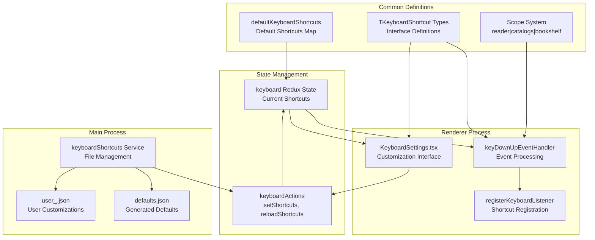
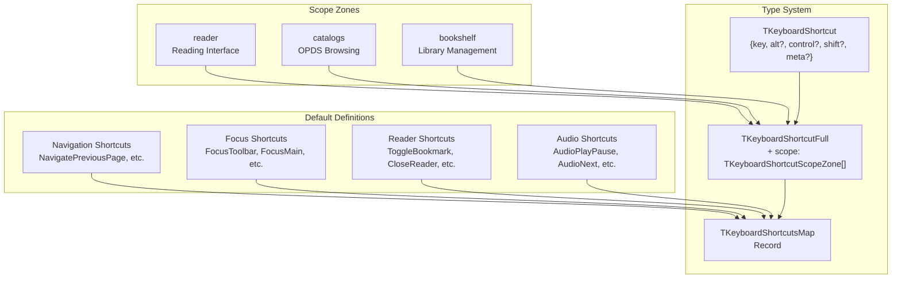
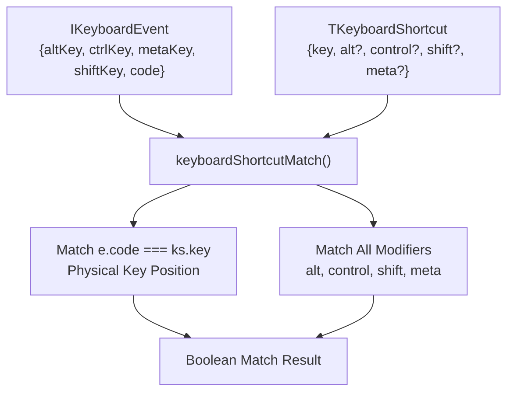
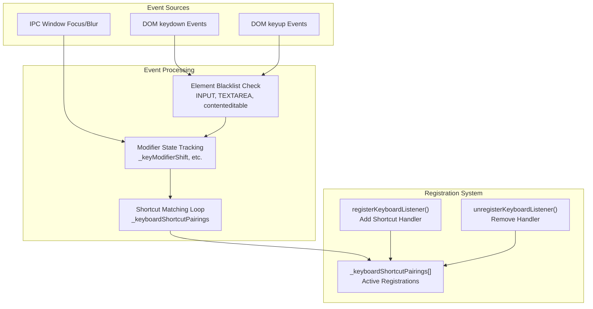
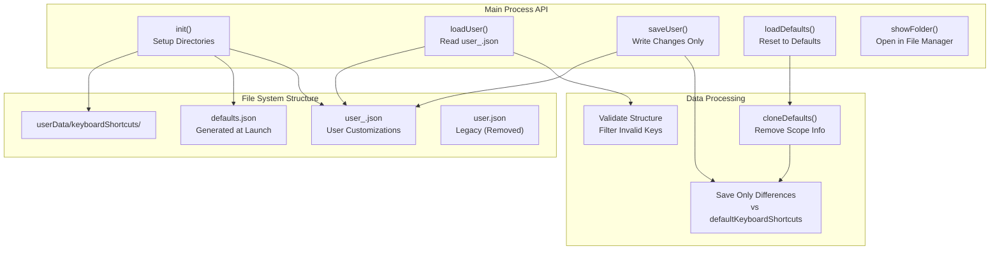
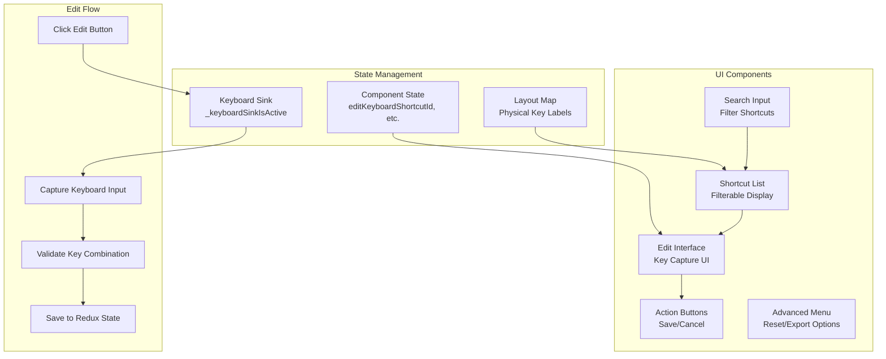
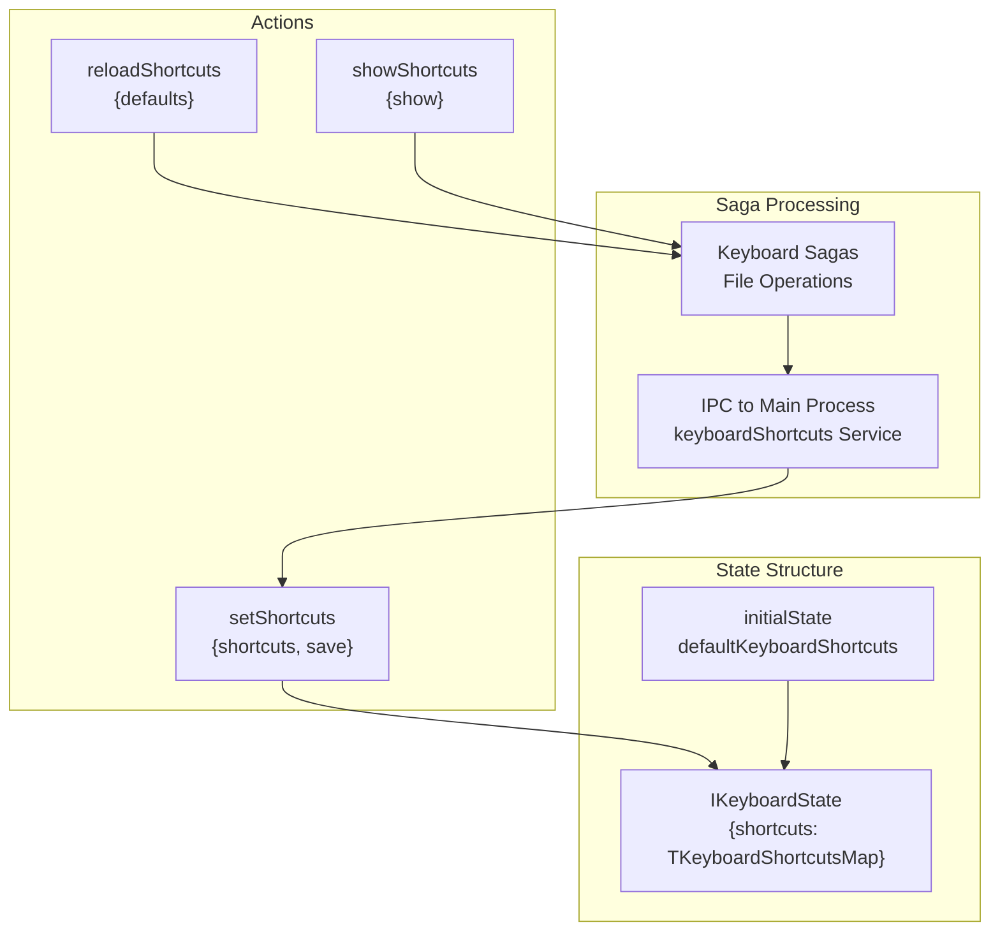

# Keyboard Shortcuts

> **Relevant source files**
> * [src/common/keyboard.ts](https://github.com/edrlab/thorium-reader/blob/02b67755/src/common/keyboard.ts)
> * [src/common/redux/actions/keyboard/setShortcuts.ts](https://github.com/edrlab/thorium-reader/blob/02b67755/src/common/redux/actions/keyboard/setShortcuts.ts)
> * [src/common/redux/reducers/keyboard.ts](https://github.com/edrlab/thorium-reader/blob/02b67755/src/common/redux/reducers/keyboard.ts)
> * [src/common/redux/states/keyboard.ts](https://github.com/edrlab/thorium-reader/blob/02b67755/src/common/redux/states/keyboard.ts)
> * [src/main/keyboard.ts](https://github.com/edrlab/thorium-reader/blob/02b67755/src/main/keyboard.ts)
> * [src/renderer/assets/icons/windows-icon.svg](https://github.com/edrlab/thorium-reader/blob/02b67755/src/renderer/assets/icons/windows-icon.svg)
> * [src/renderer/common/hooks/useKeyboardShortcut.ts](https://github.com/edrlab/thorium-reader/blob/02b67755/src/renderer/common/hooks/useKeyboardShortcut.ts)
> * [src/renderer/common/hooks/useSyncExternalStore.ts](https://github.com/edrlab/thorium-reader/blob/02b67755/src/renderer/common/hooks/useSyncExternalStore.ts)
> * [src/renderer/common/keyboard.ts](https://github.com/edrlab/thorium-reader/blob/02b67755/src/renderer/common/keyboard.ts)
> * [src/renderer/library/components/settings/KeyboardSettings.tsx](https://github.com/edrlab/thorium-reader/blob/02b67755/src/renderer/library/components/settings/KeyboardSettings.tsx)
> * [src/typings/keyboard.d.ts](https://github.com/edrlab/thorium-reader/blob/02b67755/src/typings/keyboard.d.ts)

## Purpose and Scope

This document covers Thorium Reader's keyboard shortcut system, including shortcut definitions, event handling, customization capabilities, and persistence mechanisms. The system provides comprehensive keyboard navigation and control across all application areas including the reader, library, and OPDS catalogs.

For information about general UI components and settings management, see [Settings UI](/edrlab/thorium-reader/8.4-settings-ui).

## Architecture Overview

The keyboard shortcut system consists of several interconnected components spanning the main and renderer processes:



Sources: [src/common/keyboard.ts L1-L595](https://github.com/edrlab/thorium-reader/blob/02b67755/src/common/keyboard.ts#L1-L595)

 [src/main/keyboard.ts L1-L238](https://github.com/edrlab/thorium-reader/blob/02b67755/src/main/keyboard.ts#L1-L238)

 [src/renderer/common/keyboard.ts L1-L302](https://github.com/edrlab/thorium-reader/blob/02b67755/src/renderer/common/keyboard.ts#L1-L302)

 [src/renderer/library/components/settings/KeyboardSettings.tsx L1-L1167](https://github.com/edrlab/thorium-reader/blob/02b67755/src/renderer/library/components/settings/KeyboardSettings.tsx#L1-L1167)

## Shortcut Definition System

### Default Shortcuts Structure

All keyboard shortcuts are defined with a comprehensive type system and default mappings:



The default shortcuts are defined in `_defaults_` object with full type safety and include categories such as:

| Category | Examples | Scope |
| --- | --- | --- |
| Navigation | `NavigatePreviousPage` (ArrowLeft), `NavigateNextPage` (ArrowRight) | reader |
| Focus Management | `FocusToolbar` (Ctrl+T), `FocusMain` (Ctrl+F10) | all scopes |
| Reader Controls | `ToggleBookmark` (Ctrl+B), `CloseReader` (Ctrl+W) | reader |
| Audio/Media | `AudioPlayPause` (Ctrl+2), `AudioNext` (Ctrl+3) | reader |
| Search | `FocusSearch` (Ctrl+F), `SearchNext` (F3) | multiple |

Sources: [src/common/keyboard.ts L33-L525](https://github.com/edrlab/thorium-reader/blob/02b67755/src/common/keyboard.ts#L33-L525)

 [src/common/keyboard.ts L14-L31](https://github.com/edrlab/thorium-reader/blob/02b67755/src/common/keyboard.ts#L14-L31)

### Shortcut Matching Logic

The system uses precise key code matching rather than logical key interpretation:



Sources: [src/common/keyboard.ts L550-L562](https://github.com/edrlab/thorium-reader/blob/02b67755/src/common/keyboard.ts#L550-L562)

 [src/common/keyboard.ts L533-L541](https://github.com/edrlab/thorium-reader/blob/02b67755/src/common/keyboard.ts#L533-L541)

## Event Handling and Registration

### Keyboard Event Processing

The renderer process handles keyboard events through a sophisticated filtering and routing system:



The system maintains reliable modifier key state tracking because DOM events can be unreliable, especially on Windows with complex modifier combinations.

Sources: [src/renderer/common/keyboard.ts L65-L149](https://github.com/edrlab/thorium-reader/blob/02b67755/src/renderer/common/keyboard.ts#L65-L149)

 [src/renderer/common/keyboard.ts L266-L301](https://github.com/edrlab/thorium-reader/blob/02b67755/src/renderer/common/keyboard.ts#L266-L301)

 [src/renderer/common/keyboard.ts L172-L259](https://github.com/edrlab/thorium-reader/blob/02b67755/src/renderer/common/keyboard.ts#L172-L259)

### Element Blacklisting

Keyboard shortcuts are automatically disabled for interactive elements to prevent conflicts:

| Element Type | Blacklist Conditions |
| --- | --- |
| `INPUT` | `type="search"`, `type="text"`, `type="password"` |
| `INPUT` (range) | Arrow keys only |
| `INPUT` (radio) | Arrow keys only |
| `INPUT` (checkbox) | Enter/Return/Space only |
| `INPUT` (file) | Enter/Return/Space only |
| `TEXTAREA` | All shortcuts |
| `contenteditable="true"` | All shortcuts |

Sources: [src/renderer/common/keyboard.ts L77-L88](https://github.com/edrlab/thorium-reader/blob/02b67755/src/renderer/common/keyboard.ts#L77-L88)

## Customization and Persistence

### File-Based Storage

The main process manages keyboard shortcut persistence through a dedicated file system:



The system only saves differences from defaults to keep user files minimal and maintainable.

Sources: [src/main/keyboard.ts L58-L89](https://github.com/edrlab/thorium-reader/blob/02b67755/src/main/keyboard.ts#L58-L89)

 [src/main/keyboard.ts L136-L149](https://github.com/edrlab/thorium-reader/blob/02b67755/src/main/keyboard.ts#L136-L149)

 [src/main/keyboard.ts L150-L179](https://github.com/edrlab/thorium-reader/blob/02b67755/src/main/keyboard.ts#L150-L179)

### Loading and Validation

User customizations undergo strict validation during loading:

| Validation Step | Purpose |
| --- | --- |
| File existence check | Handle missing user file gracefully |
| JSON parsing | Catch malformed JSON |
| ID filtering | Remove unrecognized shortcut names |
| Object validation | Ensure proper structure |
| Key validation | Require valid `key` property |
| Type coercion | Normalize boolean modifiers |

Sources: [src/main/keyboard.ts L91-L135](https://github.com/edrlab/thorium-reader/blob/02b67755/src/main/keyboard.ts#L91-L135)

## Settings UI

### Customization Interface

The `KeyboardSettings` component provides a comprehensive interface for shortcut customization:



### Keyboard Layout Detection

The interface uses the Web Keyboard API to display platform-appropriate key labels:

```javascript
// From KeyboardSettings.tsx lines 206-227const layoutMapAPI = await navigator.keyboard?.getLayoutMap();const newMap = new Map<string, string>();for (const code of KEY_CODES) {    const label = layoutMapAPI.get(code as KeyMapCode) ?? code;    newMap.set(code, label);}
```

Sources: [src/renderer/library/components/settings/KeyboardSettings.tsx L202-L227](https://github.com/edrlab/thorium-reader/blob/02b67755/src/renderer/library/components/settings/KeyboardSettings.tsx#L202-L227)

 [src/renderer/library/components/settings/KeyboardSettings.tsx L139-L643](https://github.com/edrlab/thorium-reader/blob/02b67755/src/renderer/library/components/settings/KeyboardSettings.tsx#L139-L643)

### Duplicate Detection

The UI automatically detects and highlights conflicting shortcuts:

| Detection Logic | Implementation |
| --- | --- |
| Scope overlap check | Compare `defaultKeyboardShortcuts[].scope` arrays |
| Key combination match | Use `keyboardShortcutMatches()` function |
| Visual indication | Red border for duplicated shortcuts |
| Cross-scope conflicts | Only flag overlapping scopes |

Sources: [src/renderer/library/components/settings/KeyboardSettings.tsx L522-L527](https://github.com/edrlab/thorium-reader/blob/02b67755/src/renderer/library/components/settings/KeyboardSettings.tsx#L522-L527)

## State Management Integration

### Redux Architecture

Keyboard shortcuts integrate with the application's Redux state management:



### Action Flow

The state management follows a clear action-saga pattern:

1. **UI Action**: User clicks save in settings UI
2. **Action Dispatch**: `setShortcuts.build(shortcuts, true)`
3. **Saga Processing**: Handle file persistence via main process
4. **State Update**: Reducer updates current shortcuts
5. **UI Sync**: Components re-render with new shortcuts

Sources: [src/common/redux/states/keyboard.ts L1-L13](https://github.com/edrlab/thorium-reader/blob/02b67755/src/common/redux/states/keyboard.ts#L1-L13)

 [src/common/redux/reducers/keyboard.ts L1-L53](https://github.com/edrlab/thorium-reader/blob/02b67755/src/common/redux/reducers/keyboard.ts#L1-L53)

 [src/common/redux/actions/keyboard/setShortcuts.ts L1-L30](https://github.com/edrlab/thorium-reader/blob/02b67755/src/common/redux/actions/keyboard/setShortcuts.ts#L1-L30)