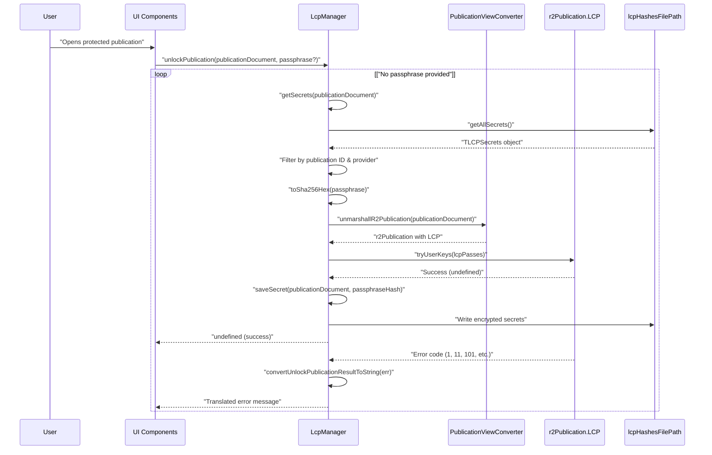
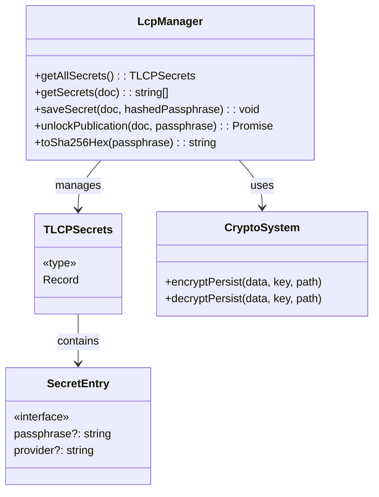
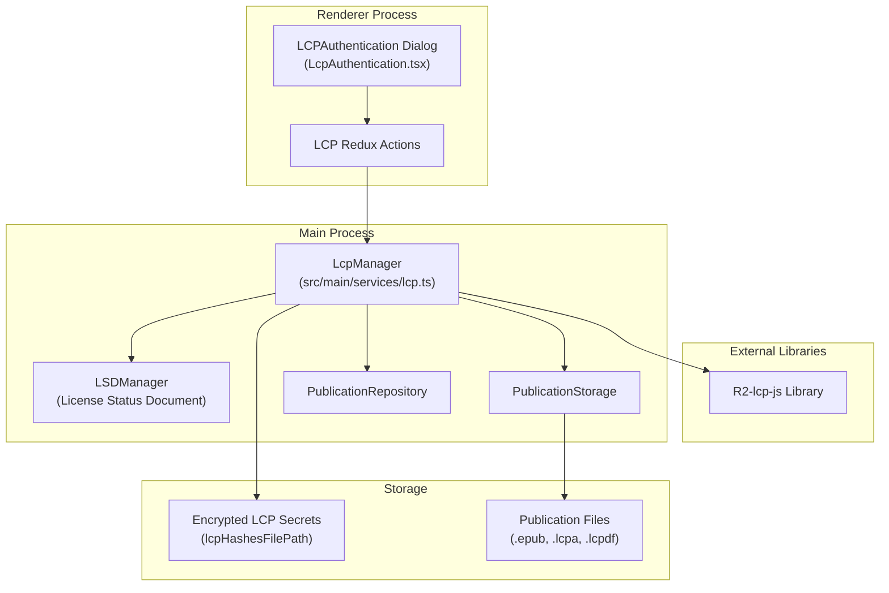
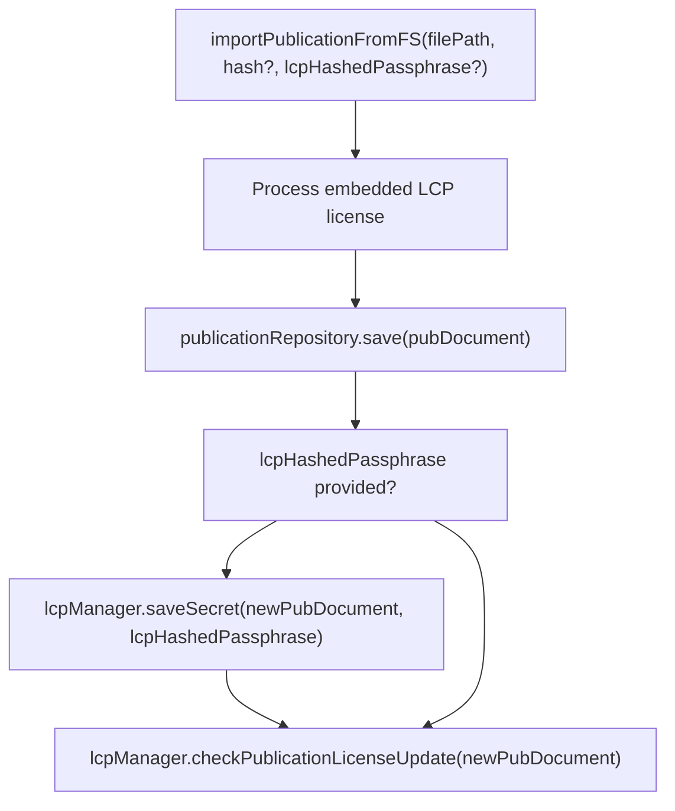
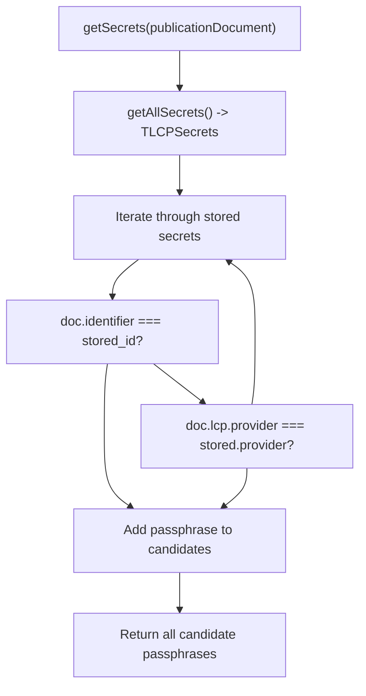

# LCP Authentication

> **Relevant source files**
> * [src/common/views/publication.ts](https://github.com/edrlab/thorium-reader/blob/02b67755/src/common/views/publication.ts)
> * [src/main/converter/publication.ts](https://github.com/edrlab/thorium-reader/blob/02b67755/src/main/converter/publication.ts)
> * [src/main/db/document/publication.ts](https://github.com/edrlab/thorium-reader/blob/02b67755/src/main/db/document/publication.ts)
> * [src/main/db/repository/publication.ts](https://github.com/edrlab/thorium-reader/blob/02b67755/src/main/db/repository/publication.ts)
> * [src/main/redux/sagas/api/publication/import/importFromLink.ts](https://github.com/edrlab/thorium-reader/blob/02b67755/src/main/redux/sagas/api/publication/import/importFromLink.ts)
> * [src/main/redux/sagas/api/publication/import/importPublicationFromFs.ts](https://github.com/edrlab/thorium-reader/blob/02b67755/src/main/redux/sagas/api/publication/import/importPublicationFromFs.ts)
> * [src/main/services/lcp.ts](https://github.com/edrlab/thorium-reader/blob/02b67755/src/main/services/lcp.ts)
> * [src/main/storage/publication-storage.ts](https://github.com/edrlab/thorium-reader/blob/02b67755/src/main/storage/publication-storage.ts)

This document describes the Lightweight Content Protection (LCP) authentication system in Thorium Reader, including how passphrases are managed, the authentication flow, and technical implementation details.

For information about managing LCP licenses after authentication (renewal, returns, etc.), see [LCP License Management](/edrlab/thorium-reader/5.2-lcp-authentication).

## Overview

LCP is a DRM system developed by EDRLab that protects digital publications while providing a user-friendly experience. Thorium Reader fully supports LCP, allowing users to open protected content after authenticating with the correct passphrase.

The LCP authentication system in Thorium Reader:

* Prompts users for passphrases when needed
* Securely stores validated passphrases
* Reuses passphrases across publications from the same provider
* Handles various types of LCP-protected content (EPUB, PDF, audiobooks, etc.)

Sources: [src/main/services/lcp.ts L1-L27](https://github.com/edrlab/thorium-reader/blob/02b67755/src/main/services/lcp.ts#L1-L27)

## Authentication Flow

When a user attempts to open an LCP-protected publication, Thorium follows this authentication process through the `unlockPublication` method:



**Core Authentication Logic**:

1. **Secret Resolution**: `getSecrets()` searches stored passphrases by publication identifier and LCP provider
2. **Passphrase Hashing**: User-provided passphrases are hashed with `toSha256Hex()` from `readium-desktop/utils/lcp`
3. **Publication Loading**: `unmarshallR2Publication()` loads the R2Publication with embedded LCP license
4. **Cryptographic Validation**: `r2Publication.LCP.tryUserKeys()` attempts decryption with provided key array
5. **Success Handling**: Valid passphrases are stored via `saveSecret()` for future use
6. **Error Translation**: Numeric error codes are converted to user-readable messages

Sources: [src/main/services/lcp.ts L724-L826](https://github.com/edrlab/thorium-reader/blob/02b67755/src/main/services/lcp.ts#L724-L826)

 [src/main/services/lcp.ts L113-L164](https://github.com/edrlab/thorium-reader/blob/02b67755/src/main/services/lcp.ts#L113-L164)

 [src/main/services/lcp.ts L649-L718](https://github.com/edrlab/thorium-reader/blob/02b67755/src/main/services/lcp.ts#L649-L718)

## Passphrase Management

Thorium Reader securely stores LCP passphrases to provide a seamless experience when reopening protected publications:



Key aspects of the passphrase management:

1. **Storage Format**: * Passphrases are stored in an encrypted JSON file at `lcpHashesFilePath` * Publication identifiers serve as keys in the JSON object * File is encrypted/decrypted when read or written
2. **Storage Structure**: ``` // Type definition for LCP secrets storagetype TLCPSecrets = Record<string, { passphrase?: string, provider?: string }>; ```
3. **Passphrase Handling**: * Only hashed passphrases are stored (SHA-256) * The system associates passphrases with both publication IDs and providers * When trying to unlock a publication, Thorium tries: * Passphrases specifically stored for that publication * Passphrases from the same provider (publishers often use the same passphrase)
4. **Security**: * The passphrase store is encrypted at rest * The hashing is one-way (original passphrase cannot be recovered)

Sources: [src/main/services/lcp.ts L63-L164](https://github.com/edrlab/thorium-reader/blob/02b67755/src/main/services/lcp.ts#L63-L164)

 [src/utils/lcp.ts](https://github.com/edrlab/thorium-reader/blob/02b67755/src/utils/lcp.ts)

## Technical Implementation

The LCP implementation consists of several cooperating components:



### Key Components

**LcpManager Authentication Methods**:

| Method | Purpose | Return Type |
| --- | --- | --- |
| `unlockPublication(doc, passphrase?)` | Primary authentication entry point | `Promise<string \| number \| null \| undefined>` |
| `getSecrets(doc)` | Retrieves stored passphrases for publication | `Promise<string[]>` |
| `saveSecret(doc, lcpHashedPassphrase)` | Persists successful passphrase | `Promise<void>` |
| `getAllSecrets()` | Loads complete secret store from filesystem | `Promise<TLCPSecrets>` |
| `convertUnlockPublicationResultToString(val, licenseIssueDate)` | Translates error codes to user messages | `string \| undefined` |

**Authentication Data Types**:

```typescript
// Secret storage type from lcp.ts:62type TLCPSecrets = Record<string, { passphrase?: string, provider?: string }>; // Authentication constants from lcp.ts:55const CONFIGREPOSITORY_LCP_SECRETS = "CONFIGREPOSITORY_LCP_SECRETS";
```

**Integration Points**:

* `PublicationViewConverter.unmarshallR2Publication()`: Loads R2Publication with LCP data
* `toSha256Hex()`: Passphrase hashing utility from `readium-desktop/utils/lcp`
* `encryptPersist()/decryptPersist()`: Secure storage for secret persistence
* `lcpActions.publicationFileLock`: Prevents concurrent authentication attempts

Sources: [src/main/services/lcp.ts L65-L826](https://github.com/edrlab/thorium-reader/blob/02b67755/src/main/services/lcp.ts#L65-L826)

 [src/main/converter/publication.ts L98-L187](https://github.com/edrlab/thorium-reader/blob/02b67755/src/main/converter/publication.ts#L98-L187)

 [src/main/services/lcp.ts L26](https://github.com/edrlab/thorium-reader/blob/02b67755/src/main/services/lcp.ts#L26-L26)

## Authentication During Import

When importing LCP-protected content, authentication can occur at import time if a passphrase is provided:

**Import-Time Authentication Flow**:



**Key Import Authentication Points**:

1. **Passphrase Pre-Storage**: If `lcpHashedPassphrase` parameter is provided to `importPublicationFromFS()`, it's stored immediately via `saveSecret()`
2. **License Processing**: LCP licenses are extracted from ZIP archives and validated using `lcpLicenseIsNotWellFormed()`
3. **Deferred Authentication**: `checkPublicationLicenseUpdate()` is scheduled to handle LSD status validation post-import

**LCP License Extraction in Import**:

```javascript
// From importPublicationFromFS.ts:158-176const r2LCPBuffer = await extractFileFromZipToBuffer(filePath, "license.lcpl");if (r2LCPBuffer) {    const r2LCPStr = r2LCPBuffer.toString("utf-8");    const r2LCPJson = JSON.parse(r2LCPStr);        if (lcpLicenseIsNotWellFormed(r2LCPJson)) {        throw new Error(`LCP license malformed: ${JSON.stringify(r2LCPJson)}`);    }        const r2LCP = TaJsonDeserialize(r2LCPJson, LCP);    r2LCP.JsonSource = r2LCPStr;    r2LCP.init();}
```

Sources: [src/main/redux/sagas/api/publication/import/importPublicationFromFs.ts L295-L303](https://github.com/edrlab/thorium-reader/blob/02b67755/src/main/redux/sagas/api/publication/import/importPublicationFromFs.ts#L295-L303)

 [src/main/redux/sagas/api/publication/import/importPublicationFromFs.ts L158-L176](https://github.com/edrlab/thorium-reader/blob/02b67755/src/main/redux/sagas/api/publication/import/importPublicationFromFs.ts#L158-L176)

## UI Components

The LCP authentication dialog presents a user-friendly interface:

![LCP Authentication Dialog]

The dialog includes:

* A title explaining the requirement
* The passphrase hint from the license
* Password input field
* Error messages if authentication fails
* Information about LCP
* URL hint if provided in the license (links to publisher help)
* Cancel and Unlock buttons

Sources: [src/renderer/library/components/dialog/LcpAuthentication.tsx L85-L170](https://github.com/edrlab/thorium-reader/blob/02b67755/src/renderer/library/components/dialog/LcpAuthentication.tsx#L85-L170)

## Error Handling

The system provides specific error messages for authentication failures:

| Error Code | Description | User Message |
| --- | --- | --- |
| 1 | Incorrect passphrase | "Incorrect passphrase" |
| 11 | License expired/not yet valid | "License is out of date" |
| 101 | Certificate revoked | "Certificate has been revoked" |
| 102 | Certificate signature invalid | "Certificate signature is invalid" |
| 111 | License certificate date invalid | "License certificate date is invalid" |
| 112 | License signature invalid | "License signature is invalid" |
| 141 | User key check invalid | "User key check is invalid" |

These messages help users understand why authentication failed and what action might be needed.

Sources: [src/main/services/lcp.ts L650-L719](https://github.com/edrlab/thorium-reader/blob/02b67755/src/main/services/lcp.ts#L650-L719)

## Secret Sharing Across Provider

The authentication system implements intelligent passphrase sharing based on LCP provider information:

**Provider-Based Secret Sharing**:



**Secret Matching Logic** (from `getSecrets()` method):

```javascript
// Lines 113-134 in lcp.ts show the matching algorithmfor (const id of ids) {    const val = allSecrets[id];    if (val.passphrase) {        const provider = doc.lcp?.provider;                if (doc.identifier === id ||            provider && val.provider && provider === val.provider) {            secrets.push(val.passphrase);        }    }}
```

This allows users to authenticate once per publisher, with passphrases automatically tried for other publications from the same LCP provider.

Sources: [src/main/services/lcp.ts L113-L134](https://github.com/edrlab/thorium-reader/blob/02b67755/src/main/services/lcp.ts#L113-L134)

 [src/main/services/lcp.ts L150-L157](https://github.com/edrlab/thorium-reader/blob/02b67755/src/main/services/lcp.ts#L150-L157)

## Supported File Types

Thorium Reader supports various LCP-protected file formats:

| File Extension | Description | Content Type |
| --- | --- | --- |
| .lcpl | LCP License File | application/vnd.readium.lcp.license.v1.0+json |
| .epub | LCP-protected EPUB | application/epub+zip |
| .lcpa, .audiobookLcp | LCP-protected Audiobook | application/audiobook+zip |
| .lcpdf | LCP-protected PDF | application/pdf |
| .divina | LCP-protected Divina | application/divina+zip |

The system detects the appropriate content type based on the file extension and internal metadata.

Sources: [src/common/extension.ts L1-L45](https://github.com/edrlab/thorium-reader/blob/02b67755/src/common/extension.ts#L1-L45)

 [src/utils/mimeTypes.ts](https://github.com/edrlab/thorium-reader/blob/02b67755/src/utils/mimeTypes.ts)