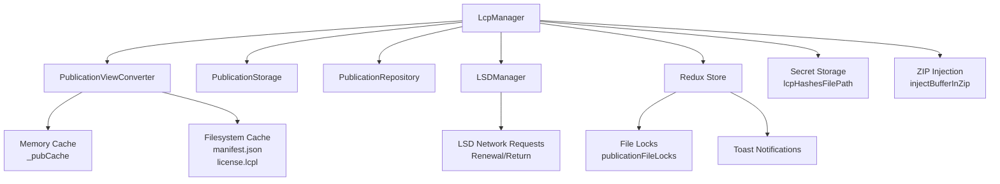
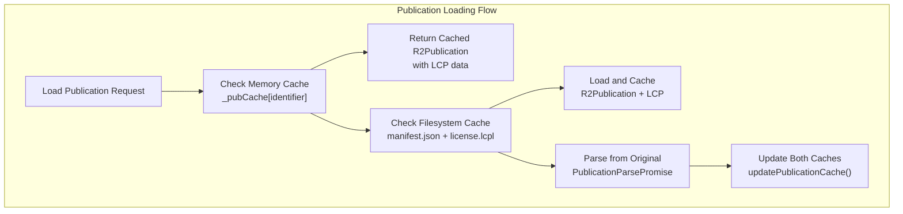
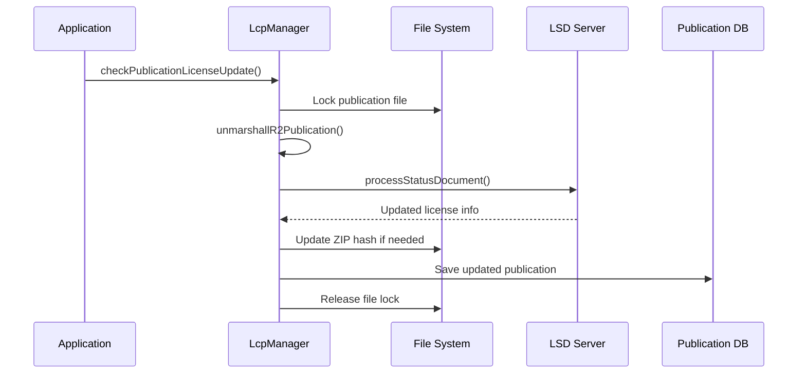

# LCP License Management

> **Relevant source files**
> * [src/common/views/publication.ts](https://github.com/edrlab/thorium-reader/blob/02b67755/src/common/views/publication.ts)
> * [src/main/converter/publication.ts](https://github.com/edrlab/thorium-reader/blob/02b67755/src/main/converter/publication.ts)
> * [src/main/db/document/publication.ts](https://github.com/edrlab/thorium-reader/blob/02b67755/src/main/db/document/publication.ts)
> * [src/main/db/repository/publication.ts](https://github.com/edrlab/thorium-reader/blob/02b67755/src/main/db/repository/publication.ts)
> * [src/main/redux/sagas/api/publication/import/importFromLink.ts](https://github.com/edrlab/thorium-reader/blob/02b67755/src/main/redux/sagas/api/publication/import/importFromLink.ts)
> * [src/main/redux/sagas/api/publication/import/importPublicationFromFs.ts](https://github.com/edrlab/thorium-reader/blob/02b67755/src/main/redux/sagas/api/publication/import/importPublicationFromFs.ts)
> * [src/main/services/lcp.ts](https://github.com/edrlab/thorium-reader/blob/02b67755/src/main/services/lcp.ts)
> * [src/main/storage/publication-storage.ts](https://github.com/edrlab/thorium-reader/blob/02b67755/src/main/storage/publication-storage.ts)

This document covers the Licensed Content Protection (LCP) license management system in Thorium Reader, focusing on license operations, secret storage, and publication integration. For LCP authentication and passphrase handling, see [LCP Authentication](/edrlab/thorium-reader/5.2-lcp-authentication).

The LCP license management system handles the complete lifecycle of DRM-protected publications, including license validation, renewal, return operations, and secure secret storage. It integrates deeply with the publication storage system to inject and manage LCP licenses within publication files.

## Architecture Overview

The LCP license management system is centered around the `LcpManager` class, which coordinates with several other services to provide comprehensive license handling.

### LCP Manager Dependencies



Sources: [src/main/services/lcp.ts L64-L86](https://github.com/edrlab/thorium-reader/blob/02b67755/src/main/services/lcp.ts#L64-L86)

 [src/main/converter/publication.ts L44-L51](https://github.com/edrlab/thorium-reader/blob/02b67755/src/main/converter/publication.ts#L44-L51)

## Core Components

### LcpManager Class

The `LcpManager` class serves as the central coordinator for all LCP operations. It is registered in the dependency injection container and provides the following key capabilities:

| Method | Purpose |
| --- | --- |
| `checkPublicationLicenseUpdate()` | Validates and updates license status |
| `renewPublicationLicense()` | Renews licenses through LSD protocol |
| `returnPublication()` | Returns borrowed publications |
| `unlockPublication()` | Unlocks publications using passphrases |
| `saveSecret()` / `getSecrets()` | Manages encrypted passphrase storage |
| `injectLcplIntoZip()` | Embeds LCP licenses into publication files |

Sources: [src/main/services/lcp.ts L64-L65](https://github.com/edrlab/thorium-reader/blob/02b67755/src/main/services/lcp.ts#L64-L65)

### Publication View Converter Integration

The `PublicationViewConverter` handles caching and serialization of LCP data both in memory and on the filesystem:



Sources: [src/main/converter/publication.ts L98-L186](https://github.com/edrlab/thorium-reader/blob/02b67755/src/main/converter/publication.ts#L98-L186)

## License Operations

### License Update and Validation

The license update process ensures publications have current license status by checking with License Status Document (LSD) servers:



The process includes file locking to prevent concurrent modifications during license operations.

Sources: [src/main/services/lcp.ts L373-L432](https://github.com/edrlab/thorium-reader/blob/02b67755/src/main/services/lcp.ts#L373-L432)

### License Renewal

License renewal allows users to extend the loan period of borrowed publications:

1. **Link Discovery**: Find renewal link in LSD document
2. **User Input**: Optional end date specification
3. **Network Request**: POST to renewal endpoint via `LSDManager`
4. **Update Processing**: Handle renewed license and update publication
5. **Notification**: Display success/failure toast to user

The renewal process handles both LSD-type renewals (automatic) and HTML-type renewals (opens external browser).

Sources: [src/main/services/lcp.ts L434-L544](https://github.com/edrlab/thorium-reader/blob/02b67755/src/main/services/lcp.ts#L434-L544)

### Publication Return

Similar to renewal, the return process allows users to return borrowed publications early:

1. **Link Discovery**: Find return link in LSD document
2. **Network Request**: POST to return endpoint
3. **License Update**: Process returned license status
4. **File Updates**: Update publication hash and database record

Sources: [src/main/services/lcp.ts L546-L647](https://github.com/edrlab/thorium-reader/blob/02b67755/src/main/services/lcp.ts#L546-L647)

## Secret Management

### Encrypted Secret Storage

LCP passphrases are stored encrypted on disk using the `encryptPersist()` and `decryptPersist()` functions:

```
type TLCPSecrets = Record<string, { passphrase?: string, provider?: string }>;
```

The secret storage system:

* **File Location**: `lcpHashesFilePath` (defined in dependency injection)
* **Encryption Key**: `CONFIGREPOSITORY_LCP_SECRETS` constant
* **Structure**: JSON object mapping publication identifiers to passphrase/provider pairs
* **Provider Sharing**: Passphrases can be shared across publications from the same provider

### Secret Retrieval Strategy

The `getSecrets()` method implements intelligent passphrase lookup:

1. **Direct Match**: Check for secrets associated with publication identifier
2. **Provider Match**: Check for secrets from the same LCP provider
3. **Deduplication**: Return unique passphrases only

This allows passphrases to work across multiple publications from the same provider without requiring re-entry.

Sources: [src/main/services/lcp.ts L94-L140](https://github.com/edrlab/thorium-reader/blob/02b67755/src/main/services/lcp.ts#L94-L140)

 [src/main/services/lcp.ts L142-L164](https://github.com/edrlab/thorium-reader/blob/02b67755/src/main/services/lcp.ts#L142-L164)

## File System Integration

### License Injection

The system can inject LCP licenses directly into publication ZIP files using the `injectLcplIntoZip()` method:

| Publication Type | License Path |
| --- | --- |
| EPUB/Standard | `META-INF/license.lcpl` |
| Audiobook | `license.lcpl` (root) |
| Divina | `license.lcpl` (root) |
| PDF LCP | `license.lcpl` (root) |

The injection process:

1. **Temporary File**: Creates `.tmplcpl` temporary file
2. **ZIP Modification**: Uses `injectBufferInZip` to add license
3. **Atomic Replace**: Replaces original with modified version
4. **Cleanup**: Includes filesystem delays for compatibility

Sources: [src/main/services/lcp.ts L166-L213](https://github.com/edrlab/thorium-reader/blob/02b67755/src/main/services/lcp.ts#L166-L213)

### Cache Management

The `PublicationViewConverter` maintains dual caching:

* **Memory Cache**: `_pubCache` object for fast access
* **Filesystem Cache**: Separate `manifest.json` and `license.lcpl` files

Cache updates occur during publication import and license operations to ensure consistency.

Sources: [src/main/converter/publication.ts L37-L96](https://github.com/edrlab/thorium-reader/blob/02b67755/src/main/converter/publication.ts#L37-L96)

## Concurrency Control

### Publication File Locks

The system uses Redux state to track file locks during LCP operations:

```
// State structurerootState.lcp.publicationFileLocks[publicationIdentifier]: boolean
```

Lock management prevents concurrent LCP operations on the same publication:

1. **Acquire Lock**: Set lock flag before operation
2. **Operation**: Perform license update/renewal/return
3. **Release Lock**: Clear lock flag in finally block
4. **Rejection**: Return error if lock already held

This ensures data integrity during license modifications and prevents race conditions.

Sources: [src/main/services/lcp.ts L376-L388](https://github.com/edrlab/thorium-reader/blob/02b67755/src/main/services/lcp.ts#L376-L388)

 [src/main/services/lcp.ts L438-L442](https://github.com/edrlab/thorium-reader/blob/02b67755/src/main/services/lcp.ts#L438-L442)