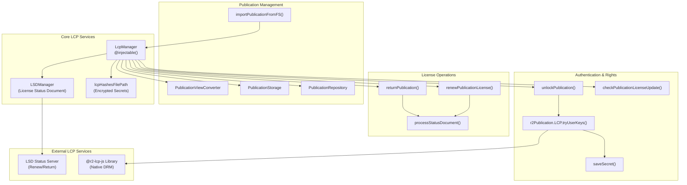
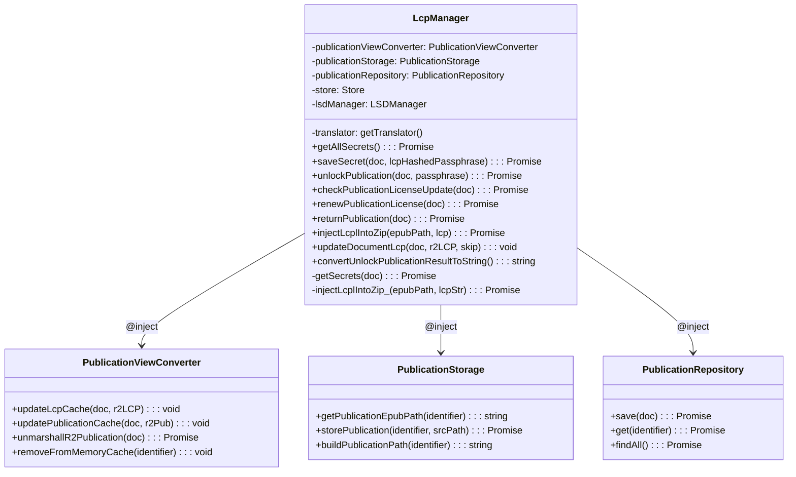
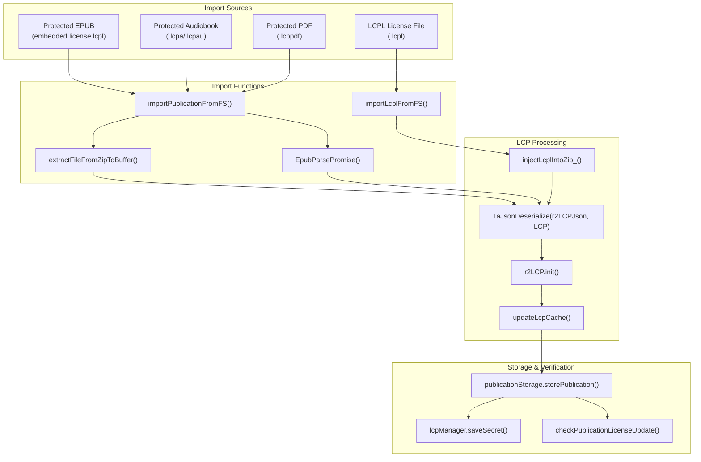
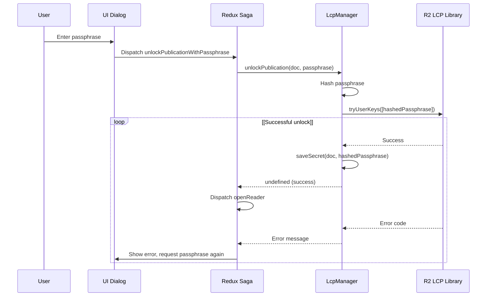

# LCP Rights Management

> **Relevant source files**
> * [src/common/views/publication.ts](https://github.com/edrlab/thorium-reader/blob/02b67755/src/common/views/publication.ts)
> * [src/main/converter/publication.ts](https://github.com/edrlab/thorium-reader/blob/02b67755/src/main/converter/publication.ts)
> * [src/main/db/document/publication.ts](https://github.com/edrlab/thorium-reader/blob/02b67755/src/main/db/document/publication.ts)
> * [src/main/db/repository/publication.ts](https://github.com/edrlab/thorium-reader/blob/02b67755/src/main/db/repository/publication.ts)
> * [src/main/redux/sagas/api/publication/import/importFromLink.ts](https://github.com/edrlab/thorium-reader/blob/02b67755/src/main/redux/sagas/api/publication/import/importFromLink.ts)
> * [src/main/redux/sagas/api/publication/import/importPublicationFromFs.ts](https://github.com/edrlab/thorium-reader/blob/02b67755/src/main/redux/sagas/api/publication/import/importPublicationFromFs.ts)
> * [src/main/services/lcp.ts](https://github.com/edrlab/thorium-reader/blob/02b67755/src/main/services/lcp.ts)
> * [src/main/storage/publication-storage.ts](https://github.com/edrlab/thorium-reader/blob/02b67755/src/main/storage/publication-storage.ts)

## Purpose and Scope

This document describes the Lightweight Content Protection (LCP) rights management system within Thorium Reader. It covers how DRM-protected content is imported, unlocked, and managed, including the license renewal and return functionality. For information about importing publications in general, see [Publication Management](/edrlab/thorium-reader/3.2-publication-management).

The LCP system enables Thorium Reader to handle protected content in various formats (EPUB, PDF, audiobooks) while enforcing rights defined in LCP licenses, such as lending periods and usage restrictions.

## Overview of LCP Rights Management

LCP (Lightweight Content Protection) is a DRM system developed by the Readium Foundation that protects digital publications while maintaining a user-friendly experience. Thorium Reader implements the LCP specification to support:

* Importing protected publications
* Unlocking content with user passphrases
* Managing license status (checking, renewing, returning)
* Enforcing usage rights like expiration dates



Sources:

* [src/main/services/lcp.ts L64-L88](https://github.com/edrlab/thorium-reader/blob/02b67755/src/main/services/lcp.ts#L64-L88)
* [src/main/services/lcp.ts L142-L164](https://github.com/edrlab/thorium-reader/blob/02b67755/src/main/services/lcp.ts#L142-L164)
* [src/main/services/lcp.ts L724-L826](https://github.com/edrlab/thorium-reader/blob/02b67755/src/main/services/lcp.ts#L724-L826)
* [src/main/redux/sagas/api/publication/import/importPublicationFromFs.ts L197-L306](https://github.com/edrlab/thorium-reader/blob/02b67755/src/main/redux/sagas/api/publication/import/importPublicationFromFs.ts#L197-L306)

## LCP Manager Architecture

The central component of the LCP rights management system is the `LcpManager` class, which coordinates all LCP-related operations. It interacts with the `LSDManager` to handle License Status Document operations and maintains a secure storage for LCP secrets (passphrases).



Sources:

* [src/main/services/lcp.ts L64-L88](https://github.com/edrlab/thorium-reader/blob/02b67755/src/main/services/lcp.ts#L64-L88)
* [src/main/services/lcp.ts L142-L164](https://github.com/edrlab/thorium-reader/blob/02b67755/src/main/services/lcp.ts#L142-L164)
* [src/main/services/lcp.ts L724-L826](https://github.com/edrlab/thorium-reader/blob/02b67755/src/main/services/lcp.ts#L724-L826)
* [src/main/converter/publication.ts L44-L334](https://github.com/edrlab/thorium-reader/blob/02b67755/src/main/converter/publication.ts#L44-L334)
* [src/main/storage/publication-storage.ts L35-L360](https://github.com/edrlab/thorium-reader/blob/02b67755/src/main/storage/publication-storage.ts#L35-L360)
* [src/main/db/repository/publication.ts L35-L287](https://github.com/edrlab/thorium-reader/blob/02b67755/src/main/db/repository/publication.ts#L35-L287)

### LCP Secrets Management

The `LcpManager` stores and manages LCP secrets (hashed passphrases) securely using the `CONFIGREPOSITORY_LCP_SECRETS` storage system:

| Feature | Implementation |
| --- | --- |
| Storage Location | `lcpHashesFilePath` (filesystem) |
| Encryption | `encryptPersist()` / `decryptPersist()` |
| Key Structure | Publication identifier → { passphrase, provider } |
| Sharing | Provider-based passphrase reuse across publications |

```
type TLCPSecrets = Record<string, { passphrase?: string, provider?: string }>;
```

The secrets management enables:

1. **Persistent Access**: Users don't need to re-enter passphrases for known publications
2. **Provider Sharing**: Passphrases from the same LCP provider can be reused across different publications
3. **Secure Storage**: All secrets are encrypted using `encryptPersist()` before filesystem storage

Sources:

* [src/main/services/lcp.ts L55-L62](https://github.com/edrlab/thorium-reader/blob/02b67755/src/main/services/lcp.ts#L55-L62)
* [src/main/services/lcp.ts L94-L164](https://github.com/edrlab/thorium-reader/blob/02b67755/src/main/services/lcp.ts#L94-L164)
* [src/main/fs/persistCrypto.ts](https://github.com/edrlab/thorium-reader/blob/02b67755/src/main/fs/persistCrypto.ts)  (referenced in imports)

## LCP Rights Management

### License Rights Structure

LCP rights are defined in the `LcpRights` interface and include:

| Right | Description |
| --- | --- |
| print | Number of pages that can be printed |
| copy | Number of characters that can be copied |
| start | Start date of license validity |
| end | End date of license validity (expiration) |

These rights are enforced by the Readium LCP native module when accessing protected content.

Sources:

* [src/common/models/lcp.ts L21-L26](https://github.com/edrlab/thorium-reader/blob/02b67755/src/common/models/lcp.ts#L21-L26)
* [src/main/services/lcp.ts L856-L865](https://github.com/edrlab/thorium-reader/blob/02b67755/src/main/services/lcp.ts#L856-L865)

### License Status Document (LSD)

The LSD component enables the management of license status, including:

1. Checking license status with the LSD server
2. Renewing licenses to extend the lending period
3. Returning publications early to release loans

The `LSDManager` class (injected into `LcpManager`) handles these operations by communicating with LCP provider servers.

Sources:

* [src/main/services/lcp.ts L435-L645](https://github.com/edrlab/thorium-reader/blob/02b67755/src/main/services/lcp.ts#L435-L645)
* [src/common/models/lcp.ts L12-L19](https://github.com/edrlab/thorium-reader/blob/02b67755/src/common/models/lcp.ts#L12-L19)
* [src/common/models/lcp.ts L52-L74](https://github.com/edrlab/thorium-reader/blob/02b67755/src/common/models/lcp.ts#L52-L74)

## Publication Import Process with LCP

### Importing LCP-Protected Content

Thorium Reader supports importing LCP-protected content through multiple pathways:

| Content Type | File Extensions | Import Function |
| --- | --- | --- |
| LCPL License Files | `.lcpl` | `importLcplFromFS()` |
| Protected EPUB | `.epub` with embedded license | `EpubParsePromise()` |
| Protected Audiobooks | `.lcpa`, `.lcpau` | `extractFileFromZipToBuffer()` |
| Protected PDF | `.lcppdf` | `extractFileFromZipToBuffer()` |



Sources:

* [src/main/redux/sagas/api/publication/import/importPublicationFromFs.ts L47-L306](https://github.com/edrlab/thorium-reader/blob/02b67755/src/main/redux/sagas/api/publication/import/importPublicationFromFs.ts#L47-L306)
* [src/main/redux/sagas/api/publication/import/importLcplFromFs.ts](https://github.com/edrlab/thorium-reader/blob/02b67755/src/main/redux/sagas/api/publication/import/importLcplFromFs.ts)  (referenced in imports)
* [src/main/services/lcp.ts L166-L207](https://github.com/edrlab/thorium-reader/blob/02b67755/src/main/services/lcp.ts#L166-L207)
* [src/main/services/lcp.ts L209-L213](https://github.com/edrlab/thorium-reader/blob/02b67755/src/main/services/lcp.ts#L209-L213)

### LCPL Import Process

When importing an LCPL license file:

1. The file is parsed and validated
2. The linked publication is downloaded from the provider
3. The LCP license is injected into the publication
4. The publication is stored with its LCP license

For direct import of protected publications, the embedded license is extracted and processed similarly.

Sources:

* [src/main/redux/sagas/api/publication/import/importLcplFromFs.ts L32-L147](https://github.com/edrlab/thorium-reader/blob/02b67755/src/main/redux/sagas/api/publication/import/importLcplFromFs.ts#L32-L147)
* [src/main/services/lcp.ts L210-L225](https://github.com/edrlab/thorium-reader/blob/02b67755/src/main/services/lcp.ts#L210-L225)

## LCP Authentication

### Unlocking Publications

The unlocking process verifies the user's passphrase against the LCP license:

1. User enters passphrase in the UI
2. Passphrase is hashed and sent to `LcpManager.unlockPublication()`
3. The hashed passphrase is tried against the LCP license
4. If successful, the passphrase is saved for future use
5. If unsuccessful, an error message is displayed



Sources:

* [src/main/services/lcp.ts L725-L826](https://github.com/edrlab/thorium-reader/blob/02b67755/src/main/services/lcp.ts#L725-L826)
* [src/main/redux/sagas/lcp.ts L40-L98](https://github.com/edrlab/thorium-reader/blob/02b67755/src/main/redux/sagas/lcp.ts#L40-L98)

### Error Handling

The system handles various LCP-related errors, including:

* Incorrect passphrase
* Expired license
* Revoked certificate
* Invalid signature

Error codes are converted to user-friendly messages for display.

Sources:

* [src/main/services/lcp.ts L650-L719](https://github.com/edrlab/thorium-reader/blob/02b67755/src/main/services/lcp.ts#L650-L719)

## LCP License Management

### License Renewal

Publications with renewable licenses can have their lending period extended:

1. User initiates renewal from the publication info UI
2. `LcpManager.renewPublicationLicense()` is called
3. The system checks for a valid renewal link in the LSD
4. If available, `lsdManager.lsdRenew()` is called to contact the LSD server
5. The updated license is saved and the UI is updated

Sources:

* [src/main/services/lcp.ts L435-L545](https://github.com/edrlab/thorium-reader/blob/02b67755/src/main/services/lcp.ts#L435-L545)
* [src/main/redux/sagas/lcp.ts L20-L28](https://github.com/edrlab/thorium-reader/blob/02b67755/src/main/redux/sagas/lcp.ts#L20-L28)

### License Return

Publications can be returned before their expiration date:

1. User initiates return from the publication info UI
2. `LcpManager.returnPublication()` is called
3. The system checks for a valid return link in the LSD
4. If available, `lsdManager.lsdReturn()` is called to contact the LSD server
5. The license status is updated to reflect the return

Sources:

* [src/main/services/lcp.ts L547-L648](https://github.com/edrlab/thorium-reader/blob/02b67755/src/main/services/lcp.ts#L547-L648)
* [src/main/redux/sagas/lcp.ts L30-L38](https://github.com/edrlab/thorium-reader/blob/02b67755/src/main/redux/sagas/lcp.ts#L30-L38)

### License Status Check

The system periodically checks license status:

1. `checkPublicationLicenseUpdate()` is called to verify license status
2. The LCP license is updated with the latest information from the LSD server
3. License status changes are reflected in the UI

Sources:

* [src/main/services/lcp.ts L374-L433](https://github.com/edrlab/thorium-reader/blob/02b67755/src/main/services/lcp.ts#L374-L433)
* [src/main/redux/sagas/api/publication/import/importPublicationFromFs.ts L290](https://github.com/edrlab/thorium-reader/blob/02b67755/src/main/redux/sagas/api/publication/import/importPublicationFromFs.ts#L290-L290)

## OPDS Integration for LCP Content

Thorium Reader supports acquiring LCP-protected content from OPDS catalogs:

1. Protected content is identified in OPDS feeds
2. User initiates download/import
3. LCP license is processed during import
4. User is prompted for passphrase if needed

The UI distinguishes between different content types, including LCP-protected formats.

Sources:

* [src/renderer/library/components/dialog/publicationInfos/opdsControls/OpdsControls.tsx L49-L339](https://github.com/edrlab/thorium-reader/blob/02b67755/src/renderer/library/components/dialog/publicationInfos/opdsControls/OpdsControls.tsx#L49-L339)
* [src/renderer/library/components/dialog/publicationInfos/opdsControls/OpdsLinkProperties.tsx L37-L159](https://github.com/edrlab/thorium-reader/blob/02b67755/src/renderer/library/components/dialog/publicationInfos/opdsControls/OpdsLinkProperties.tsx#L37-L159)

## Technical Implementation Details

### State Management

LCP-related state is managed in Redux:

```
interface ILcpState {    publicationFileLocks: {        [identifier: string]: boolean;    };}
```

This prevents concurrent operations on the same publication that could cause conflicts.

Sources:

* [src/common/redux/states/lcp.ts L8-L13](https://github.com/edrlab/thorium-reader/blob/02b67755/src/common/redux/states/lcp.ts#L8-L13)
* [src/common/redux/reducers/lcp.ts L17-L34](https://github.com/edrlab/thorium-reader/blob/02b67755/src/common/redux/reducers/lcp.ts#L17-L34)

### File Handling and Storage

Protected content is stored using a specialized file handling system:

| Operation | Function | Purpose |
| --- | --- | --- |
| Publication Storage | `storePublication()` | Stores protected files in publication directories |
| License Injection | `injectLcplIntoZip_()` | Injects LCPL license into publication ZIP files |
| License Caching | `updateLcpCache()` | Writes LCP license to `license.lcpl` in pub folder |
| Path Resolution | `getPublicationEpubPath()` | Resolves publication file paths by extension |

The system supports various LCP-protected formats:

```javascript
// Extension mapping for protected contentconst isAudioBookLcp = new RegExp(`\\${acceptedExtensionObject.audiobookLcp}$`, "i").test(extension);const isLcpPdf = new RegExp(`\\${acceptedExtensionObject.pdfLcp}$`, "i").test(extension);
```

License injection logic varies by content type:

* **EPUB/WebPub**: License placed in `META-INF/license.lcpl`
* **Audiobooks/PDF/Divina**: License placed in root `license.lcpl`

Sources:

* [src/main/storage/publication-storage.ts L53-L301](https://github.com/edrlab/thorium-reader/blob/02b67755/src/main/storage/publication-storage.ts#L53-L301)
* [src/main/services/lcp.ts L166-L207](https://github.com/edrlab/thorium-reader/blob/02b67755/src/main/services/lcp.ts#L166-L207)
* [src/main/converter/publication.ts L59-L95](https://github.com/edrlab/thorium-reader/blob/02b67755/src/main/converter/publication.ts#L59-L95)
* [src/common/extension.ts](https://github.com/edrlab/thorium-reader/blob/02b67755/src/common/extension.ts)  (referenced in imports)

### LCP Utils

Utility functions provide helper functionality:

* `lcpLicenseIsNotWellFormed()`: Validates LCP license structure
* `toSha256Hex()`: Creates hash for passphrases
* Content type detection for protected formats

Sources:

* [src/common/lcp.ts L12-L22](https://github.com/edrlab/thorium-reader/blob/02b67755/src/common/lcp.ts#L12-L22)
* [src/utils/mimeTypes.ts L1-L1934](https://github.com/edrlab/thorium-reader/blob/02b67755/src/utils/mimeTypes.ts#L1-L1934)

## Conclusion

The LCP rights management system in Thorium Reader provides comprehensive support for protected content while maintaining a user-friendly experience. It implements the Readium LCP specification to handle license acquisition, verification, and management, allowing users to access protected content from various sources while respecting publishers' rights constraints.