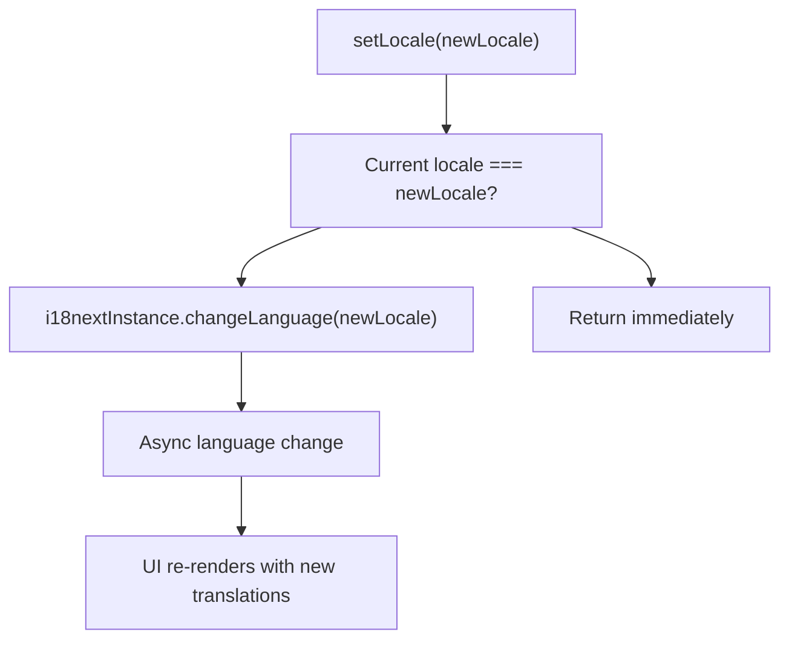
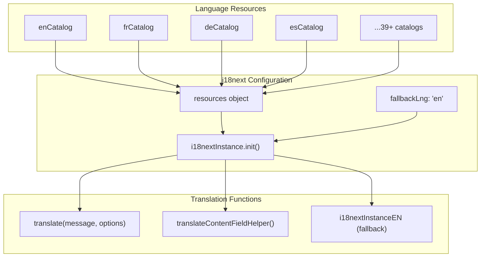
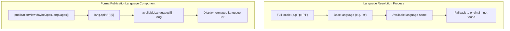
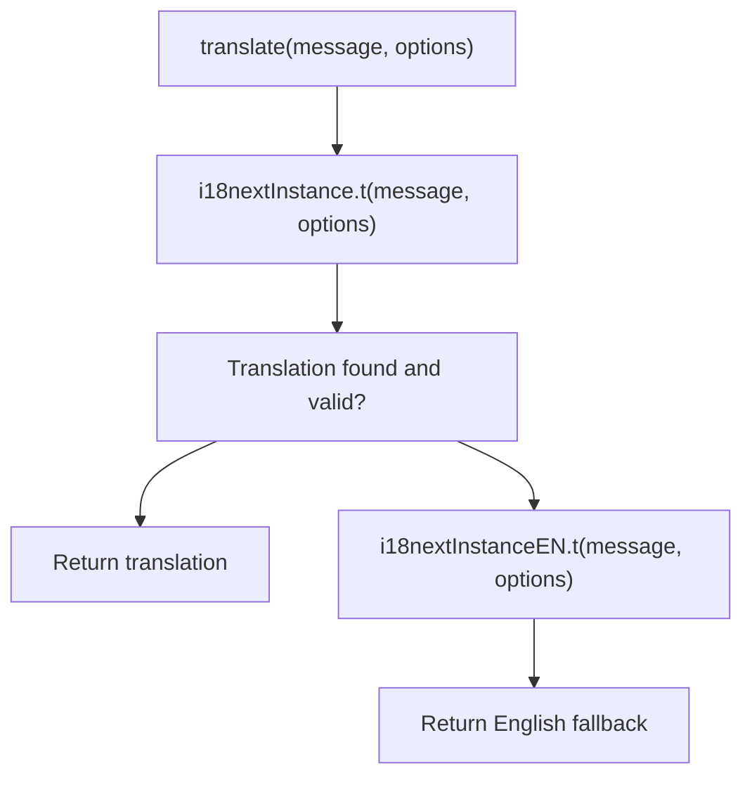
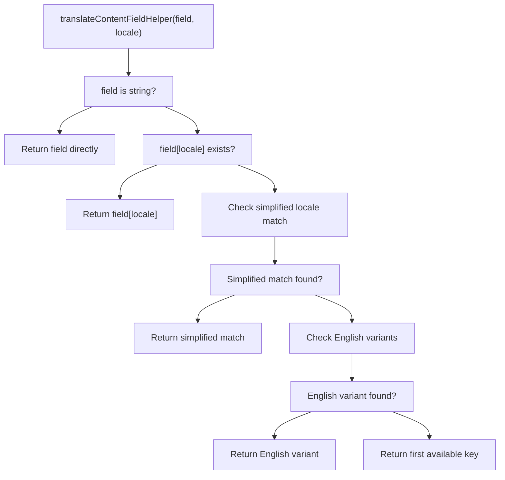

# Language Selection

> **Relevant source files**
> * [scripts/csvToJson.py](https://github.com/edrlab/thorium-reader/blob/02b67755/scripts/csvToJson.py)
> * [scripts/readme.md](https://github.com/edrlab/thorium-reader/blob/02b67755/scripts/readme.md?plain=1)
> * [src/common/services/translator.ts](https://github.com/edrlab/thorium-reader/blob/02b67755/src/common/services/translator.ts)
> * [src/renderer/common/components/dialog/publicationInfos/formatPublicationLanguage.tsx](https://github.com/edrlab/thorium-reader/blob/02b67755/src/renderer/common/components/dialog/publicationInfos/formatPublicationLanguage.tsx)

## Purpose and Scope

This document describes the language selection and locale management system in Thorium Reader, focusing on how language switching is implemented, how available languages are managed, and how UI language formatting works throughout the application.

For information about the general internationalization system, see [Internationalization](/edrlab/thorium-reader/7-internationalization). For details about locale files structure, see [Locale Files](/edrlab/thorium-reader/7.1-locale-files), and for the translator service implementation, see [Translator Service](/edrlab/thorium-reader/7.2-translator-service).

## Available Languages Configuration

The language selection system is built around the `availableLanguages` object in the translator service, which defines all supported languages with their ISO codes and display names.

### Supported Languages

| Language Code | Display Name |
| --- | --- |
| en | English |
| fr | Français (French) |
| de | Deutsch (German) |
| es | Español (Spanish) |
| zh-CN | 简体中文 - 中国 (Simplified Chinese / China) |
| ja | 日本語 (Japanese) |
| ar | عَرَبِيّ (Arabic) |
| ... | (39+ total languages) |

The complete list includes European languages (French, German, Spanish, Italian, etc.), Asian languages (Japanese, Korean, Chinese variants), and other regional languages like Georgian, Lithuanian, and Tamil.

Sources: [src/common/services/translator.ts L186-L216](https://github.com/edrlab/thorium-reader/blob/02b67755/src/common/services/translator.ts#L186-L216)

## Language Switching Implementation

### setLocale Function

The core language switching functionality is provided by the `setLocale` function in the translator service:

The function performs an optimization check to avoid unnecessary language changes and uses the i18next library's `changeLanguage` method for the actual locale switching.

Sources: [src/common/services/translator.ts L220-L229](https://github.com/edrlab/thorium-reader/blob/02b67755/src/common/services/translator.ts#L220-L229)

### Language Code Structure

The system handles various locale formats including region-specific variants:

| Standard Codes | Regional Variants |
| --- | --- |
| en, fr, de, es | pt-BR, pt-PT |
| ja, ko, zh | zh-CN, zh-TW |

Sources: [src/common/services/translator.ts L97-L107](https://github.com/edrlab/thorium-reader/blob/02b67755/src/common/services/translator.ts#L97-L107)

## Technical Architecture

### i18next Configuration and Language Resources

The translator service initializes i18next with comprehensive language support:

The configuration uses English as the fallback language and supports v4 compatibility for JSON structure.

Sources: [src/common/services/translator.ts L48-L174](https://github.com/edrlab/thorium-reader/blob/02b67755/src/common/services/translator.ts#L48-L174)

### Language Formatting for Publications

The system includes specialized handling for publication metadata languages:

This component handles language code normalization and provides fallback display for unsupported language codes.

Sources: [src/renderer/common/components/dialog/publicationInfos/formatPublicationLanguage.tsx L18-L58](https://github.com/edrlab/thorium-reader/blob/02b67755/src/renderer/common/components/dialog/publicationInfos/formatPublicationLanguage.tsx#L18-L58)

## Core Translation Functions

### translate Function

The primary translation function handles message translation with fallback logic:

This ensures users always see readable text even if translations are missing for their selected language.

Sources: [src/common/services/translator.ts L231-L237](https://github.com/edrlab/thorium-reader/blob/02b67755/src/common/services/translator.ts#L231-L237)

### translateContentFieldHelper Function

For publication metadata that may be in multiple languages, the system uses `translateContentFieldHelper`:

This function implements a sophisticated fallback strategy for multilingual content fields in publications.

Sources: [src/common/services/translator.ts L240-L277](https://github.com/edrlab/thorium-reader/blob/02b67755/src/common/services/translator.ts#L240-L277)

### Publication Language Display

The `FormatPublicationLanguage` component demonstrates practical language formatting:

| Input | Processing | Output |
| --- | --- | --- |
| `["pt-PT"]` | `lang.split("-")[0] → "pt"` | `"Português (Portuguese - Portugal) (pt-PT)"` |
| `["en"]` | Direct lookup | `"English"` |
| `["xyz"]` | No match found | `"xyz"` |

Sources: [src/renderer/common/components/dialog/publicationInfos/formatPublicationLanguage.tsx L26-L44](https://github.com/edrlab/thorium-reader/blob/02b67755/src/renderer/common/components/dialog/publicationInfos/formatPublicationLanguage.tsx#L26-L44)

## User Experience

When a user changes the language:

1. The change is applied immediately without requiring an application restart
2. All UI text throughout the application is updated to the selected language
3. The selected language preference is persisted and will be used the next time the application is launched

This immediate feedback helps users quickly determine if the selected language meets their needs.

## Supported Languages

Thorium Reader supports multiple languages through the `availableLanguages` object. The exact set of supported languages may change as new translations are added to the application.

## Conclusion

The language selection system in Thorium Reader provides a straightforward way for users to customize the application's interface language. It leverages the application's internationalization framework to provide a seamless experience when switching between languages.

The implementation follows a clean architecture where UI components dispatch actions that update the application state, which then triggers updates to all translated text throughout the application.