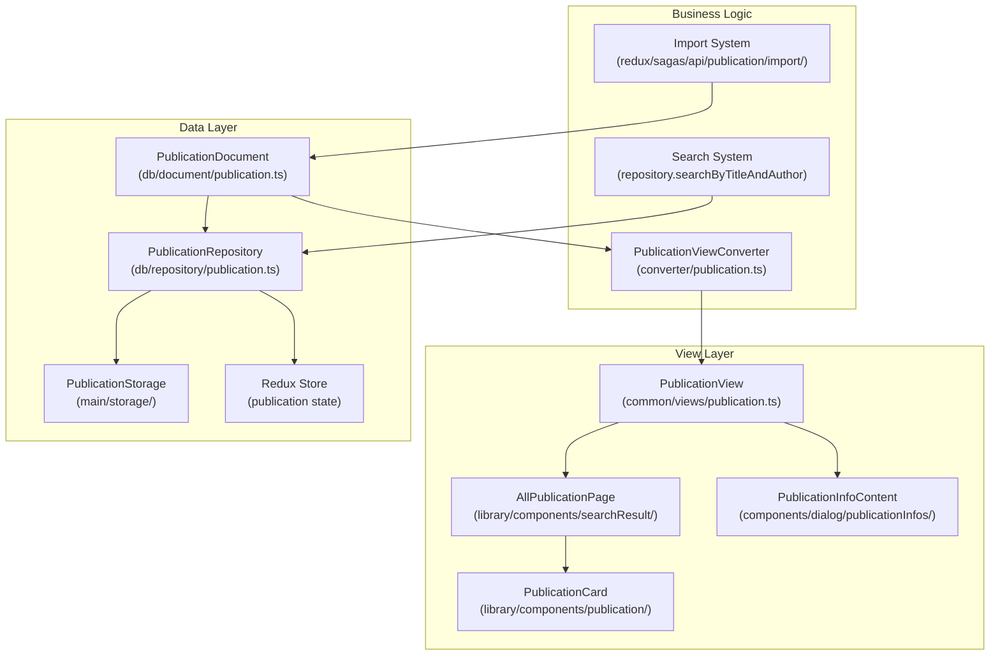
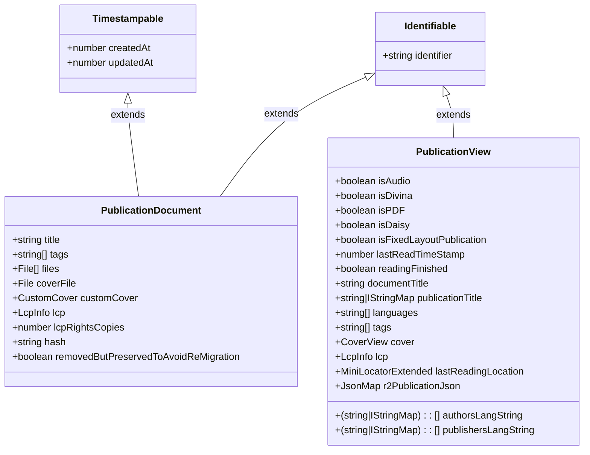
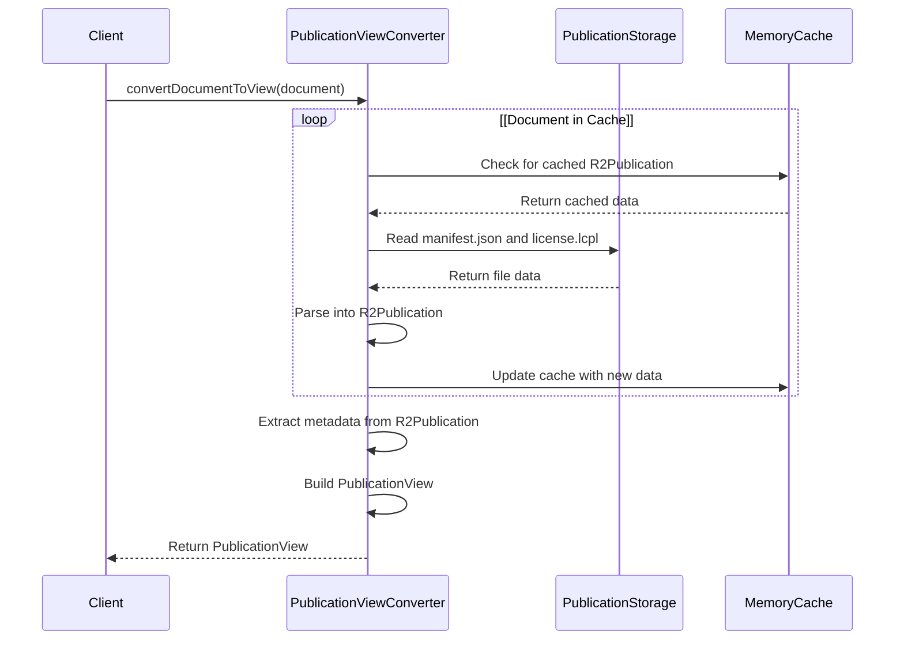
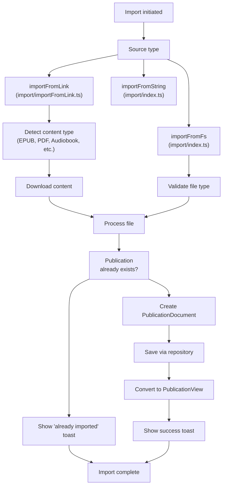
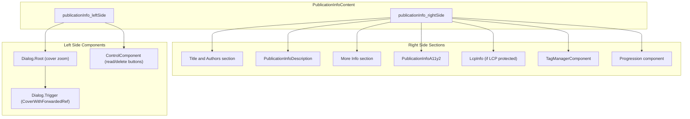
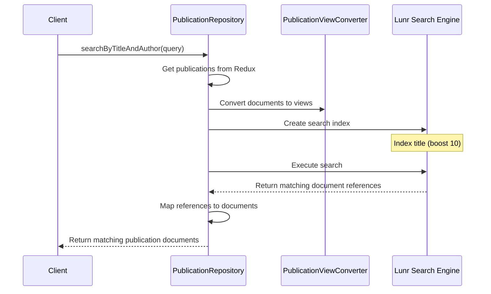

# Library System

> **Relevant source files**
> * [scripts/translator-key-type.js](https://github.com/edrlab/thorium-reader/blob/02b67755/scripts/translator-key-type.js)
> * [src/renderer/assets/styles/components/allPublicationsPage.scss](https://github.com/edrlab/thorium-reader/blob/02b67755/src/renderer/assets/styles/components/allPublicationsPage.scss)
> * [src/renderer/assets/styles/components/allPublicationsPage.scss.d.ts](https://github.com/edrlab/thorium-reader/blob/02b67755/src/renderer/assets/styles/components/allPublicationsPage.scss.d.ts)
> * [src/renderer/assets/styles/components/breadcrumb.scss.d.ts](https://github.com/edrlab/thorium-reader/blob/02b67755/src/renderer/assets/styles/components/breadcrumb.scss.d.ts)
> * [src/renderer/assets/styles/components/catalogs.scss.d.ts](https://github.com/edrlab/thorium-reader/blob/02b67755/src/renderer/assets/styles/components/catalogs.scss.d.ts)
> * [src/renderer/assets/styles/components/columns.scss](https://github.com/edrlab/thorium-reader/blob/02b67755/src/renderer/assets/styles/components/columns.scss)
> * [src/renderer/assets/styles/components/combobox.scss.d.ts](https://github.com/edrlab/thorium-reader/blob/02b67755/src/renderer/assets/styles/components/combobox.scss.d.ts)
> * [src/renderer/assets/styles/components/modals.scss.d.ts](https://github.com/edrlab/thorium-reader/blob/02b67755/src/renderer/assets/styles/components/modals.scss.d.ts)
> * [src/renderer/assets/styles/components/settings.scss.d.ts](https://github.com/edrlab/thorium-reader/blob/02b67755/src/renderer/assets/styles/components/settings.scss.d.ts)
> * [src/renderer/common/components/dialog/publicationInfos/PublicationInfoDescription.tsx](https://github.com/edrlab/thorium-reader/blob/02b67755/src/renderer/common/components/dialog/publicationInfos/PublicationInfoDescription.tsx)
> * [src/renderer/common/components/dialog/publicationInfos/formatPublisherDate.tsx](https://github.com/edrlab/thorium-reader/blob/02b67755/src/renderer/common/components/dialog/publicationInfos/formatPublisherDate.tsx)
> * [src/renderer/common/components/dialog/publicationInfos/publicationInfoA11y.tsx](https://github.com/edrlab/thorium-reader/blob/02b67755/src/renderer/common/components/dialog/publicationInfos/publicationInfoA11y.tsx)
> * [src/renderer/common/components/dialog/publicationInfos/publicationInfoContent.tsx](https://github.com/edrlab/thorium-reader/blob/02b67755/src/renderer/common/components/dialog/publicationInfos/publicationInfoContent.tsx)
> * [src/renderer/common/components/hoc/translator.tsx](https://github.com/edrlab/thorium-reader/blob/02b67755/src/renderer/common/components/hoc/translator.tsx)
> * [src/renderer/library/components/searchResult/AllPublicationPage.tsx](https://github.com/edrlab/thorium-reader/blob/02b67755/src/renderer/library/components/searchResult/AllPublicationPage.tsx)

The Library System in Thorium Reader provides functionality for managing, displaying, and interacting with publications. It handles the complete lifecycle of publications including import, storage, organization, search, and display.

For information about reading publications, see the [Reader System](/edrlab/thorium-reader/2-reader-system). For information about accessing online catalogs and content, see the [OPDS Integration](/edrlab/thorium-reader/4-opds-integration).

## System Architecture

The Library System follows a layered architecture with separation between data models, business logic, and UI components. The system is primarily built around two key models: `PublicationDocument` (storage model) and `PublicationView` (presentation model).



Sources: [src/main/db/document/publication.ts](https://github.com/edrlab/thorium-reader/blob/02b67755/src/main/db/document/publication.ts)

 [src/common/views/publication.ts](https://github.com/edrlab/thorium-reader/blob/02b67755/src/common/views/publication.ts)

 [src/main/converter/publication.ts](https://github.com/edrlab/thorium-reader/blob/02b67755/src/main/converter/publication.ts)

 [src/main/db/repository/publication.ts](https://github.com/edrlab/thorium-reader/blob/02b67755/src/main/db/repository/publication.ts)

## Publication Data Models

The Library System uses two primary data models which work together to separate storage concerns from presentation.



Sources: [src/main/db/document/publication.ts L30-L56](https://github.com/edrlab/thorium-reader/blob/02b67755/src/main/db/document/publication.ts#L30-L56)

 [src/common/views/publication.ts L27-L78](https://github.com/edrlab/thorium-reader/blob/02b67755/src/common/views/publication.ts#L27-L78)

### PublicationDocument

`PublicationDocument` is the storage model that extends both `Identifiable` and `Timestampable` interfaces. Key properties include:

* `identifier`: Unique identifier for the publication
* `title`: Publication title
* `tags`: User-defined tags for organization
* `files`: Associated files for the publication
* `coverFile`: Cover image file
* `hash`: Hash value used for deduplication
* `lcp`: LCP rights information for protected content

This model is primarily used for persistence and does not contain all the information needed for display.

Sources: [src/main/db/document/publication.ts L30-L56](https://github.com/edrlab/thorium-reader/blob/02b67755/src/main/db/document/publication.ts#L30-L56)

### PublicationView

`PublicationView` is the presentation model used by UI components. It extends `Identifiable` and includes:

* Type indicators: `isAudio`, `isDivina`, `isPDF`, `isDaisy`, `isFixedLayoutPublication`
* Reading state: `lastReadTimeStamp`, `readingFinished`, `lastReadingLocation`
* Multilingual metadata: `publicationTitle`, `authorsLangString`, `publishersLangString`
* Display metadata: `documentTitle`, `description`, `languages`, `tags`
* Accessibility metadata: `a11y_accessMode`, `a11y_accessibilityFeature`, etc.
* Visual elements: `cover`, `customCover`
* Rights management: `lcp`, `lcpRightsCopies`
* Readium data: `r2PublicationJson`

Sources: [src/common/views/publication.ts L27-L78](https://github.com/edrlab/thorium-reader/blob/02b67755/src/common/views/publication.ts#L27-L78)

### Model Conversion

The `PublicationViewConverter` class handles conversion between `PublicationDocument` and `PublicationView`:



The converter maintains a memory cache to minimize filesystem access, improving performance when repeatedly accessing the same publication.

Sources: [src/main/converter/publication.ts L189-L332](https://github.com/edrlab/thorium-reader/blob/02b67755/src/main/converter/publication.ts#L189-L332)

## Publication Repository

The `PublicationRepository` class provides CRUD operations and search functionality for publications. It serves as the primary interface for accessing and managing the publication database.

### Core Repository Methods

* `save(document)`: Saves a publication to the Redux store
* `delete(identifier)`: Marks a publication as removed
* `get(identifier)`: Retrieves a publication by identifier
* `findAll()`: Gets all non-removed publications
* `findAllSortDesc()`: Gets all publications sorted by creation date
* `findByTag(tag)`: Finds publications with a specific tag
* `findByTitle(title)`: Finds publications by title
* `searchByTitleAndAuthor(query)`: Performs full-text search
* `getAllTags()`: Gets all unique tags used in the library

The repository uses Redux as its backing store, with publications stored in the `state.publication.db` object.

Sources: [src/main/db/repository/publication.ts L34-L287](https://github.com/edrlab/thorium-reader/blob/02b67755/src/main/db/repository/publication.ts#L34-L287)

### Search Implementation

The repository implements full-text search using Lunr.js with multi-language support:

```javascript
const indexer = lunr(function() {    this.use(lunr.multiLanguage("en", "fr", "de"));    this.field("title", { boost: 10 });    this.field("author", { boost: 5 });        // Add documents to the index    docs.forEach((v) => {        this.add(v);    });});
```

This provides powerful search capabilities with higher weights given to matches in titles compared to authors.

Sources: [src/main/db/repository/publication.ts L209-L240](https://github.com/edrlab/thorium-reader/blob/02b67755/src/main/db/repository/publication.ts#L209-L240)

## Publication Import System

The Import System handles importing publications into the library from various sources.



Sources: [src/main/redux/sagas/api/publication/import/index.ts L33-L188](https://github.com/edrlab/thorium-reader/blob/02b67755/src/main/redux/sagas/api/publication/import/index.ts#L33-L188)

 [src/main/redux/sagas/api/publication/import/importFromLink.ts L24-L151](https://github.com/edrlab/thorium-reader/blob/02b67755/src/main/redux/sagas/api/publication/import/importFromLink.ts#L24-L151)

### Import Sources

Publications can be imported from:

1. **Files**: Local EPUB, PDF, LCP, audiobook, or Divina files
2. **Links**: URLs pointing to publications (direct or via OPDS)
3. **Strings**: Raw manifest data with a base file URL

### Import Process

The import process follows these general steps:

1. **Source Validation**: Verify the source is valid and supported
2. **Content Retrieval**: Download remote content if needed
3. **Content Type Detection**: Determine the publication type
4. **Deduplication Check**: Verify the publication isn't already imported
5. **Document Creation**: Create a `PublicationDocument`
6. **Storage**: Save the publication files and metadata
7. **View Conversion**: Convert to `PublicationView` for UI display
8. **User Notification**: Display a success or error toast

Sources: [src/main/redux/sagas/api/publication/import/index.ts L114-L167](https://github.com/edrlab/thorium-reader/blob/02b67755/src/main/redux/sagas/api/publication/import/index.ts#L114-L167)

### Deduplication

The system prevents duplicate imports by checking if a publication with the same hash already exists:

```
if (alreadyImported) {    yield put(        toastActions.openRequest.build(            ToastType.Success,            translate("message.import.alreadyImport",                 { title: publicationView.documentTitle }),        ),    );}
```

When a duplicate is detected, the user is notified that the publication is already in their library.

Sources: [src/main/redux/sagas/api/publication/import/index.ts L146-L167](https://github.com/edrlab/thorium-reader/blob/02b67755/src/main/redux/sagas/api/publication/import/index.ts#L146-L167)

 [src/renderer/library/redux/sagas/sameFileImport.ts L25-L59](https://github.com/edrlab/thorium-reader/blob/02b67755/src/renderer/library/redux/sagas/sameFileImport.ts#L25-L59)

## Library User Interface

The Library UI provides the interface for users to browse, search, and manage their publications. The primary interface is built around the `AllPublicationPage` React class component and uses react-table for data display and filtering.

### Library UI Component Architecture

```mermaid
flowchart TD

LibraryLayout["LibraryLayout"]
AllPublicationPage["AllPublicationPage<br>(class component)"]
Header["Header"]
TableView["TableView<br>(functional component)"]
AboutThoriumButton["AboutThoriumButton"]
useTable["useTable"]
useFilters["useFilters"]
useGlobalFilter["useGlobalFilter"]
useSortBy["useSortBy"]
usePagination["usePagination"]
useAsyncDebounce["useAsyncDebounce"]
CellGlobalFilter["CellGlobalFilter"]
CellColumnFilter["CellColumnFilter"]
CellCoverImage["CellCoverImage"]
CellAuthors["CellAuthors"]
CellPublishers["CellPublishers"]
CellLangs["CellLangs"]
CellFormat["CellFormat"]
PublicationInfoContent["PublicationInfoContent"]
PublicationInfoDescription["PublicationInfoDescription"]
PublicationInfoA11y2["PublicationInfoA11y2"]
TagManagerComponent["TagManagerComponent"]
LcpInfo["LcpInfo"]
Progression["Progression"]

TableView --> useTable
TableView --> useFilters
TableView --> useGlobalFilter
TableView --> useSortBy
TableView --> usePagination
TableView --> CellGlobalFilter
TableView --> CellColumnFilter
TableView --> CellCoverImage
TableView --> CellAuthors
TableView --> CellPublishers
TableView --> CellLangs
TableView --> CellFormat
AllPublicationPage --> PublicationInfoContent

subgraph subGraph3 ["Publication Detail Dialog"]
    PublicationInfoContent
    PublicationInfoDescription
    PublicationInfoA11y2
    TagManagerComponent
    LcpInfo
    Progression
    PublicationInfoContent --> PublicationInfoDescription
    PublicationInfoContent --> PublicationInfoA11y2
    PublicationInfoContent --> TagManagerComponent
    PublicationInfoContent --> LcpInfo
    PublicationInfoContent --> Progression
end

subgraph subGraph2 ["Table Cell Components"]
    CellGlobalFilter
    CellColumnFilter
    CellCoverImage
    CellAuthors
    CellPublishers
    CellLangs
    CellFormat
end

subgraph subGraph1 ["React Table Implementation"]
    useTable
    useFilters
    useGlobalFilter
    useSortBy
    usePagination
    useAsyncDebounce
end

subgraph subGraph0 ["Main Library Interface"]
    LibraryLayout
    AllPublicationPage
    Header
    TableView
    AboutThoriumButton
    LibraryLayout --> AllPublicationPage
    AllPublicationPage --> Header
    AllPublicationPage --> TableView
    AllPublicationPage --> AboutThoriumButton
end
```



Sources: [src/renderer/library/components/searchResult/AllPublicationPage.tsx L61-L90](https://github.com/edrlab/thorium-reader/blob/02b67755/src/renderer/library/components/searchResult/AllPublicationPage.tsx#L61-L90)

 [src/renderer/library/components/searchResult/AllPublicationPage.tsx L139-L284](https://github.com/edrlab/thorium-reader/blob/02b67755/src/renderer/library/components/searchResult/AllPublicationPage.tsx#L139-L284)

 [src/renderer/common/components/dialog/publicationInfos/publicationInfoContent.tsx L367-L539](https://github.com/edrlab/thorium-reader/blob/02b67755/src/renderer/common/components/dialog/publicationInfos/publicationInfoContent.tsx#L367-L539)

### Main Library View

The `AllPublicationPage` component serves as the primary library interface. It is a React class component that manages the publication list state and integrates with the API subscription system.

#### AllPublicationPage Component Structure

| Property | Description |
| --- | --- |
| `publicationViews` | Array of `PublicationView[]` objects for display |
| `accessibilitySupportEnabled` | Boolean flag for screen reader support |
| `tags` | Available tags for filtering |
| `focusInputRef` | Ref for keyboard focus management |

The component provides:

* Publication table with sortable columns and filtering
* Global search with debounced input via `useAsyncDebounce`
* Column-specific filters for tags, authors, languages, format, etc.
* Accessibility features including keyboard shortcuts and screen reader support
* Integration with Redux state via `apiSubscribe` for real-time updates
* Keyboard shortcuts for search focus via `FocusSearch` shortcut

#### API Integration

The component subscribes to multiple API endpoints for real-time updates:

```javascript
this.unsubscribe = apiSubscribe([    "publication/importFromFs",    "publication/delete",     "publication/importFromLink",    "publication/updateTags",    "publication/readingFinishedRefresh",], () => {    apiAction("publication/findAll")        .then((publicationViews) => {            this.setState({ publicationViews });        });});
```

Sources: [src/renderer/library/components/searchResult/AllPublicationPage.tsx L139-L154](https://github.com/edrlab/thorium-reader/blob/02b67755/src/renderer/library/components/searchResult/AllPublicationPage.tsx#L139-L154)

 [src/renderer/library/components/searchResult/AllPublicationPage.tsx L169-L185](https://github.com/edrlab/thorium-reader/blob/02b67755/src/renderer/library/components/searchResult/AllPublicationPage.tsx#L169-L185)

 [src/renderer/library/components/searchResult/AllPublicationPage.tsx L219-L253](https://github.com/edrlab/thorium-reader/blob/02b67755/src/renderer/library/components/searchResult/AllPublicationPage.tsx#L219-L253)

### React Table Implementation

The library interface is built around react-table hooks providing comprehensive search and filtering capabilities:

#### Table Configuration

The `TableView` component uses multiple react-table hooks:

| Hook | Purpose |
| --- | --- |
| `useTable` | Core table functionality |
| `useGlobalFilter` | Cross-column search |
| `useFilters` | Column-specific filtering |
| `useSortBy` | Column sorting |
| `usePagination` | Table pagination |

#### Global Search Implementation

The `CellGlobalFilter` component provides search across all publication metadata:

```javascript
const onInputChange = useAsyncDebounce((v) => {    props.setShowColumnFilters(true);    props.setGlobalFilter(v);}, 500);
```

Key features:

* Debounced input with 500ms delay via `useAsyncDebounce`
* Live result count display: `(${globalFilteredRows.length} / ${preGlobalFilteredRows.length})`
* Accessibility support with dedicated search button for screen readers
* Keyboard shortcut integration via `FocusSearch` keyboard shortcut

#### Column Filtering

The `CellColumnFilter` component provides per-column filtering:

* Tag filtering with tag selection
* Author/publisher filtering with clickable links
* Language filtering
* Format filtering
* URL parameter integration for focus and value state

Column filters support:

* Real-time filtering with `useAsyncDebounce`
* Accessibility mode with manual search trigger
* URL state management for direct linking to filtered views

#### Cell Components

Specialized cell components handle different data types:

| Component | Purpose | Key Features |
| --- | --- | --- |
| `CellCoverImage` | Publication cover display | Click to open reader |
| `CellAuthors` | Author display with links | Multi-language support, RTL text |
| `CellPublishers` | Publisher information | Clickable filtering links |
| `CellLangs` | Language information | Multi-language display |
| `CellFormat` | File format display | Format-based filtering |

Sources: [src/renderer/library/components/searchResult/AllPublicationPage.tsx L377-L447](https://github.com/edrlab/thorium-reader/blob/02b67755/src/renderer/library/components/searchResult/AllPublicationPage.tsx#L377-L447)

 [src/renderer/library/components/searchResult/AllPublicationPage.tsx L470-L609](https://github.com/edrlab/thorium-reader/blob/02b67755/src/renderer/library/components/searchResult/AllPublicationPage.tsx#L470-L609)

 [src/renderer/library/components/searchResult/AllPublicationPage.tsx L626-L645](https://github.com/edrlab/thorium-reader/blob/02b67755/src/renderer/library/components/searchResult/AllPublicationPage.tsx#L626-L645)

 [src/renderer/library/components/searchResult/AllPublicationPage.tsx L682-L726](https://github.com/edrlab/thorium-reader/blob/02b67755/src/renderer/library/components/searchResult/AllPublicationPage.tsx#L682-L726)

 [src/renderer/library/components/searchResult/AllPublicationPage.tsx L795-L825](https://github.com/edrlab/thorium-reader/blob/02b67755/src/renderer/library/components/searchResult/AllPublicationPage.tsx#L795-L825)

### Publication Information Dialog

The `PublicationInfoContent` component displays detailed publication metadata in a structured layout using Radix UI dialog primitives.

#### Publication Info Dialog Structure



#### Key Information Sections

| Section | Component | Content |
| --- | --- | --- |
| Cover | `CoverWithForwardedRef` + `Dialog.Root` | Zoomable cover image |
| Title/Authors | `FormatContributorWithLink` | Multi-language title, clickable author links |
| Description | `PublicationInfoDescription` | Expandable description with "see more" |
| Publisher Info | `FormatPublisherDate` | Publication date, publisher, language, page count |
| Accessibility | `PublicationInfoA11y2` | Accessibility features and compliance |
| LCP Rights | `LcpInfo` | DRM license information (if protected) |
| Reading Progress | `Progression` | Current reading position and navigation |

#### Multi-language Support

The dialog handles multi-language metadata using `convertMultiLangStringToLangString`:

```javascript
const pubTitleLangStr = convertMultiLangStringToLangString(    (publicationViewMaybeOpds as PublicationView).publicationTitle ||     publicationViewMaybeOpds.documentTitle, locale);const pubTitleIsRTL = langStringIsRTL(pubTitleLang);
```

#### Reading Progress Display

The `Progression` component shows detailed reading progress:

* Progress percentage and time information for audiobooks
* Page numbers for PDF and Divina publications
* Chapter navigation with headings hierarchy
* Clickable heading links for EPUB navigation

Sources: [src/renderer/common/components/dialog/publicationInfos/publicationInfoContent.tsx L392-L439](https://github.com/edrlab/thorium-reader/blob/02b67755/src/renderer/common/components/dialog/publicationInfos/publicationInfoContent.tsx#L392-L439)

 [src/renderer/common/components/dialog/publicationInfos/publicationInfoContent.tsx L441-L535](https://github.com/edrlab/thorium-reader/blob/02b67755/src/renderer/common/components/dialog/publicationInfos/publicationInfoContent.tsx#L441-L535)

 [src/renderer/common/components/dialog/publicationInfos/publicationInfoContent.tsx L92-L347](https://github.com/edrlab/thorium-reader/blob/02b67755/src/renderer/common/components/dialog/publicationInfos/publicationInfoContent.tsx#L92-L347)

#### Description Display Component

The `PublicationInfoDescription` component is a React class component that handles expandable text display for publication descriptions:

| State Property | Type | Purpose |
| --- | --- | --- |
| `seeMore` | boolean | Controls expanded/collapsed state |
| `needSeeMore` | boolean | Determines if expand button is needed |

**Expandable Text Logic:**

The component measures text overflow to determine if a "see more" button is needed:

```javascript
private needSeeMoreButton = () => {    if (!this.descriptionWrapperRef?.current || !this.descriptionRef?.current) {        return;    }    const need = this.descriptionWrapperRef.current.offsetHeight <                  this.descriptionRef.current.offsetHeight;    this.setState({ needSeeMore: need });};
```

**Content Sanitization:**

HTML content is sanitized using DOMPurify with font-size CSS property blocking:

```javascript
const descriptionSanitized = DOMPurify.sanitize(description)    .replace(/font-size:/g, "font-sizexx:");
```

**Toggle Control:**

The expand/collapse toggle uses SVG icons (`ChevronUp`/`ChevronDown`) and internationalized labels:

```xml
<button onClick={this.toggleSeeMore}>    <SVG ariaHidden svg={this.state.seeMore ? ChevronUp : ChevronDown} />    {this.state.seeMore ? __("publication.seeLess") : __("publication.seeMore")}</button>
```

Sources: [src/renderer/common/components/dialog/publicationInfos/PublicationInfoDescription.tsx L36-L50](https://github.com/edrlab/thorium-reader/blob/02b67755/src/renderer/common/components/dialog/publicationInfos/PublicationInfoDescription.tsx#L36-L50)

 [src/renderer/common/components/dialog/publicationInfos/PublicationInfoDescription.tsx L64-L104](https://github.com/edrlab/thorium-reader/blob/02b67755/src/renderer/common/components/dialog/publicationInfos/PublicationInfoDescription.tsx#L64-L104)

 [src/renderer/common/components/dialog/publicationInfos/PublicationInfoDescription.tsx L107-L119](https://github.com/edrlab/thorium-reader/blob/02b67755/src/renderer/common/components/dialog/publicationInfos/PublicationInfoDescription.tsx#L107-L119)

#### Accessibility Information Display

The accessibility information is displayed by the `PublicationInfoA11y2` component, which processes various EPUB Accessibility metadata properties from the publication:

**Accessibility Metadata Properties:**

| Property | Description |
| --- | --- |
| `a11y_accessModeSufficient` | Sufficient access modes (e.g., textual) |
| `a11y_accessibilityFeature` | Features like `printPageNumbers`, `displayTransformability`, `synchronizedAudioText` |
| `a11y_accessibilityHazard` | Hazards like `flashing`, `motionSimulation`, or `none` |
| `a11y_conformsTo` | Standards compliance (WCAG levels, EPUB Accessibility) |
| `a11y_certifierReport` | Links to certification reports |
| `a11y_certifiedBy` | Certification authority |
| `a11y_accessibilitySummary` | Detailed accessibility description |

**Feature Detection Logic:**

The component uses utility functions to detect specific accessibility features:

```javascript
const findStrInArray = (array: string[] | undefined, str: string): boolean =>     Array.isArray(array) && array.findIndex((a) => a === str) > -1; const isPrintPageNumbers = findStrInArray(a11y_accessibilityFeature, "printPageNumbers") ||                           findStrInArray(a11y_accessibilityFeature, "pageBreakMarkers") ||                           findStrInArray(a11y_accessibilityFeature, "pageNavigation");
```

**Standards Compliance Display:**

For conformance information, the component recognizes standard EPUB Accessibility URLs and displays user-friendly labels:

* `http://www.idpf.org/epub/a11y/accessibility-20170105.html#wcag-a` → "EPUB Accessibility 1.0 - WCAG 2.0 Level A"
* `http://www.idpf.org/epub/a11y/accessibility-20170105.html#wcag-aa` → "EPUB Accessibility 1.0 - WCAG 2.0 Level AA"

**External Link Handling:**

Certification report links are opened externally using Electron's shell API:

```javascript
onClick={async (ev) => {    ev.preventDefault();    await shell.openExternal(value);}}
```

Sources: [src/renderer/common/components/dialog/publicationInfos/publicationInfoA11y.tsx L70-L71](https://github.com/edrlab/thorium-reader/blob/02b67755/src/renderer/common/components/dialog/publicationInfos/publicationInfoA11y.tsx#L70-L71)

 [src/renderer/common/components/dialog/publicationInfos/publicationInfoA11y.tsx L139-L143](https://github.com/edrlab/thorium-reader/blob/02b67755/src/renderer/common/components/dialog/publicationInfos/publicationInfoA11y.tsx#L139-L143)

 [src/renderer/common/components/dialog/publicationInfos/publicationInfoA11y.tsx L178-L199](https://github.com/edrlab/thorium-reader/blob/02b67755/src/renderer/common/components/dialog/publicationInfos/publicationInfoA11y.tsx#L178-L199)

 [src/renderer/common/components/dialog/publicationInfos/publicationInfoA11y.tsx L210-L220](https://github.com/edrlab/thorium-reader/blob/02b67755/src/renderer/common/components/dialog/publicationInfos/publicationInfoA11y.tsx#L210-L220)

## Integration with Other Systems

### Reader System Integration

The Library System interacts with the Reader System in several ways:

1. **Publication Opening**: When a user selects a publication, the library opens it in the reader
2. **Reading Progress**: Reading progress is stored and displayed in the library view
3. **Last Reading Location**: The library tracks and displays the last reading position
4. **Reading Finished Status**: Publications can be marked as completed

```javascript
// Retrieving reading location data from Redux storeconst readerStateLocator = tryCatchSync(() =>     state.win.registry.reader[document.identifier]?.reduxState.locator, ""); // Checking if reading is finishedconst readingFinished = tryCatchSync(() =>     state.publication.readingFinishedQueue.findIndex(        ([, pubIndentifier]) => pubIndentifier === document.identifier    ) > -1, "") || false;
```

Sources: [src/main/converter/publication.ts L230-L264](https://github.com/edrlab/thorium-reader/blob/02b67755/src/main/converter/publication.ts#L230-L264)

### OPDS Integration

The Library System integrates with OPDS catalogs to allow:

1. **Browsing OPDS Catalogs**: Users can browse online publication catalogs
2. **Importing Publications**: Direct import from OPDS feeds to the library
3. **Metadata Preservation**: OPDS metadata is retained during import

The import process handles various content types from OPDS including EPUB, audiobooks, Divina, and PDF.

Sources: [src/main/redux/sagas/api/publication/import/importFromLink.ts L74-L117](https://github.com/edrlab/thorium-reader/blob/02b67755/src/main/redux/sagas/api/publication/import/importFromLink.ts#L74-L117)

### LCP Rights Management

For LCP-protected publications, the Library System provides:

1. **License Storage**: The `PublicationDocument` includes LCP license information
2. **Rights Display**: Shows rights information in the publication details
3. **License Integration**: Works with the LCP system for license handling

The system keeps track of copy limits and other DRM restrictions imposed by the license.

Sources: [src/main/db/document/publication.ts L38-L39](https://github.com/edrlab/thorium-reader/blob/02b67755/src/main/db/document/publication.ts#L38-L39)

 [src/common/views/publication.ts L70-L71](https://github.com/edrlab/thorium-reader/blob/02b67755/src/common/views/publication.ts#L70-L71)

## Publication Search

Beyond the UI-based filtering, the Library System provides a robust search implementation through the `PublicationRepository`:



The search implementation uses Lunr.js with:

* Boosted weights for title fields (10) compared to author fields (5)
* Multi-language support for English, French, and German
* Exact and partial text matching

Sources: [src/main/db/repository/publication.ts L193-L262](https://github.com/edrlab/thorium-reader/blob/02b67755/src/main/db/repository/publication.ts#L193-L262)

## Notification System

The Library System uses toasts to notify users about import results and other operations:

```
yield put(    toastActions.openRequest.build(        ToastType.Success,        translate("message.import.success",             { title: publicationView.documentTitle }),    ),);
```

Toast messages include:

* Import success notifications
* Duplicate import notifications
* Import error messages
* Action confirmations

Sources: [src/main/redux/sagas/api/publication/import/index.ts L146-L167](https://github.com/edrlab/thorium-reader/blob/02b67755/src/main/redux/sagas/api/publication/import/index.ts#L146-L167)

 [src/renderer/common/components/toast/Toast.tsx L133-L208](https://github.com/edrlab/thorium-reader/blob/02b67755/src/renderer/common/components/toast/Toast.tsx#L133-L208)

The Library System serves as the foundation of the Thorium Reader application, providing a comprehensive set of tools for managing and interacting with a user's digital publication collection.