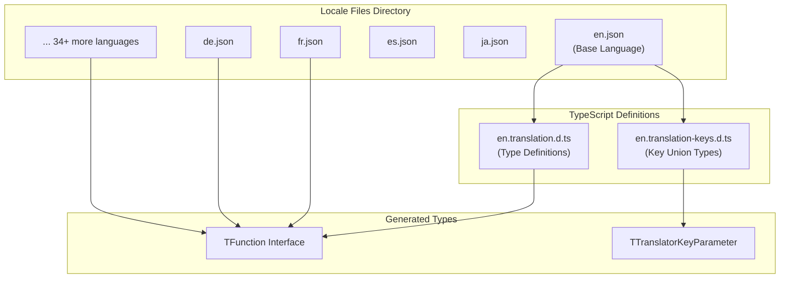
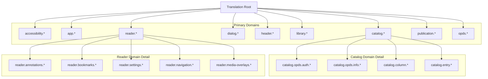
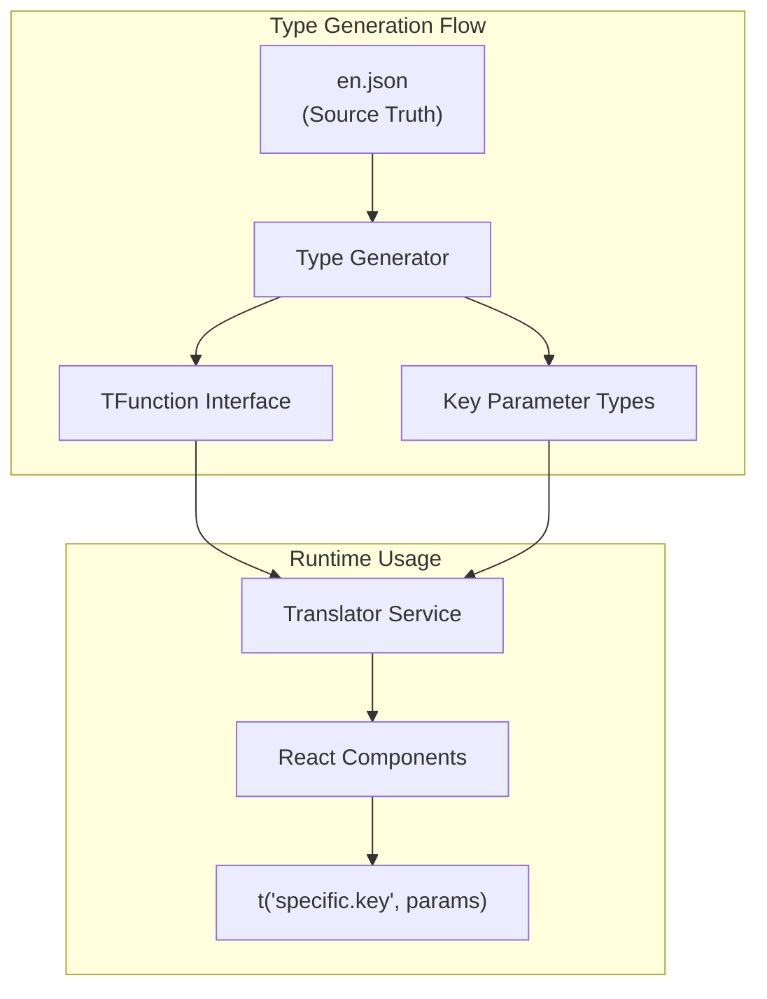

# Locale Files

> **Relevant source files**
> * [src/resources/locales/ar.json](https://github.com/edrlab/thorium-reader/blob/02b67755/src/resources/locales/ar.json)
> * [src/resources/locales/da.json](https://github.com/edrlab/thorium-reader/blob/02b67755/src/resources/locales/da.json)
> * [src/resources/locales/de.json](https://github.com/edrlab/thorium-reader/blob/02b67755/src/resources/locales/de.json)
> * [src/resources/locales/el.json](https://github.com/edrlab/thorium-reader/blob/02b67755/src/resources/locales/el.json)
> * [src/resources/locales/en.json](https://github.com/edrlab/thorium-reader/blob/02b67755/src/resources/locales/en.json)
> * [src/resources/locales/es.json](https://github.com/edrlab/thorium-reader/blob/02b67755/src/resources/locales/es.json)
> * [src/resources/locales/fi.json](https://github.com/edrlab/thorium-reader/blob/02b67755/src/resources/locales/fi.json)
> * [src/resources/locales/fr.json](https://github.com/edrlab/thorium-reader/blob/02b67755/src/resources/locales/fr.json)
> * [src/resources/locales/it.json](https://github.com/edrlab/thorium-reader/blob/02b67755/src/resources/locales/it.json)
> * [src/resources/locales/ja.json](https://github.com/edrlab/thorium-reader/blob/02b67755/src/resources/locales/ja.json)
> * [src/resources/locales/lt.json](https://github.com/edrlab/thorium-reader/blob/02b67755/src/resources/locales/lt.json)
> * [src/resources/locales/nl.json](https://github.com/edrlab/thorium-reader/blob/02b67755/src/resources/locales/nl.json)
> * [src/resources/locales/pt-br.json](https://github.com/edrlab/thorium-reader/blob/02b67755/src/resources/locales/pt-br.json)
> * [src/resources/locales/pt-pt.json](https://github.com/edrlab/thorium-reader/blob/02b67755/src/resources/locales/pt-pt.json)
> * [src/resources/locales/ru.json](https://github.com/edrlab/thorium-reader/blob/02b67755/src/resources/locales/ru.json)
> * [src/resources/locales/sv.json](https://github.com/edrlab/thorium-reader/blob/02b67755/src/resources/locales/sv.json)
> * [src/resources/locales/tr.json](https://github.com/edrlab/thorium-reader/blob/02b67755/src/resources/locales/tr.json)
> * [src/resources/locales/zh-cn.json](https://github.com/edrlab/thorium-reader/blob/02b67755/src/resources/locales/zh-cn.json)
> * [src/typings/en.translation-keys.d.ts](https://github.com/edrlab/thorium-reader/blob/02b67755/src/typings/en.translation-keys.d.ts)
> * [src/typings/en.translation.d.ts](https://github.com/edrlab/thorium-reader/blob/02b67755/src/typings/en.translation.d.ts)

This document covers the internationalization (i18n) locale file system that provides multi-language support for Thorium Reader's user interface. The system includes JSON translation files, TypeScript type definitions, and a hierarchical key structure supporting 39+ languages.

For information about the translation service and i18next integration, see [Translator Service](/edrlab/thorium-reader/7.2-translator-service).

## File Organization

The locale system is organized around JSON files stored in `src/resources/locales/`, with each file representing a complete translation for a specific language. The system provides type-safe access to translation keys through generated TypeScript definitions.

**Sources:** [src/resources/locales/en.json L1-L5000](https://github.com/edrlab/thorium-reader/blob/02b67755/src/resources/locales/en.json#L1-L5000)

 [src/typings/en.translation.d.ts L1-L100](https://github.com/edrlab/thorium-reader/blob/02b67755/src/typings/en.translation.d.ts#L1-L100)

 [src/typings/en.translation-keys.d.ts L1-L10](https://github.com/edrlab/thorium-reader/blob/02b67755/src/typings/en.translation-keys.d.ts#L1-L10)

## Translation Key Hierarchy

Translation keys follow a hierarchical dot-notation structure with nested objects representing functional domains of the application. The system provides both object-level and individual key access patterns.

**Sources:** [src/resources/locales/en.json L1-L1000](https://github.com/edrlab/thorium-reader/blob/02b67755/src/resources/locales/en.json#L1-L1000)

 [src/typings/en.translation.d.ts L1-L500](https://github.com/edrlab/thorium-reader/blob/02b67755/src/typings/en.translation.d.ts#L1-L500)

## Language Support Matrix

The system supports 39+ languages with complete translation coverage. Each language file maintains the same key structure as the base English file, ensuring consistent functionality across all locales.

| Language Code | Language Name | File Path |
| --- | --- | --- |
| `en` | English (Base) | `src/resources/locales/en.json` |
| `fr` | French | `src/resources/locales/fr.json` |
| `de` | German | `src/resources/locales/de.json` |
| `es` | Spanish | `src/resources/locales/es.json` |
| `pt-pt` | Portuguese (Portugal) | `src/resources/locales/pt-pt.json` |
| `pt-br` | Portuguese (Brazil) | `src/resources/locales/pt-br.json` |
| `ja` | Japanese | `src/resources/locales/ja.json` |
| `zh-cn` | Chinese (Simplified) | `src/resources/locales/zh-cn.json` |
| `ru` | Russian | `src/resources/locales/ru.json` |
| `sv` | Swedish | `src/resources/locales/sv.json` |

**Sources:** [src/resources/locales/en.json L1-L10](https://github.com/edrlab/thorium-reader/blob/02b67755/src/resources/locales/en.json#L1-L10)

 [src/resources/locales/fr.json L1-L10](https://github.com/edrlab/thorium-reader/blob/02b67755/src/resources/locales/fr.json#L1-L10)

 [src/resources/locales/de.json L1-L10](https://github.com/edrlab/thorium-reader/blob/02b67755/src/resources/locales/de.json#L1-L10)

## Key Categories and Functional Domains

The translation keys are organized into functional categories that correspond to major application features and user interface sections.

### Core Application Keys

* `app.*` - Application-level messages, menus, and system dialogs
* `accessibility.*` - Screen reader and accessibility labels
* `error.*` - Error messages and debugging information
* `header.*` - Main navigation and toolbar elements

### Library Management Keys

* `catalog.*` - Publication catalog, sorting, filtering, and metadata display
* `library.*` - Library-specific features including LCP authentication
* `message.*` - Status messages for import, download, and file operations

### Reading Interface Keys

* `reader.*` - Complete reading interface including navigation, settings, annotations
* `publication.*` - Publication metadata, accessibility information, and DRM status

### External Integration Keys

* `opds.*` - OPDS feed integration, authentication, and catalog browsing
* `dialog.*` - Modal dialogs for confirmations, imports, and user interactions

**Sources:** [src/resources/locales/en.json L1-L200](https://github.com/edrlab/thorium-reader/blob/02b67755/src/resources/locales/en.json#L1-L200)

 [src/resources/locales/en.json L500-L1000](https://github.com/edrlab/thorium-reader/blob/02b67755/src/resources/locales/en.json#L500-L1000)

## Type Safety System

The locale system provides compile-time type safety through generated TypeScript definitions that ensure all translation keys exist and provide proper typing for interpolation parameters.

The `TFunction` interface in [src/typings/en.translation.d.ts L1-L1000](https://github.com/edrlab/thorium-reader/blob/02b67755/src/typings/en.translation.d.ts#L1-L1000)

 provides overloaded method signatures for each possible translation key, enabling autocomplete and compile-time validation. The `TTranslatorKeyParameter` union type in [src/typings/en.translation-keys.d.ts L1-L5](https://github.com/edrlab/thorium-reader/blob/02b67755/src/typings/en.translation-keys.d.ts#L1-L5)

 contains all valid key strings.

**Sources:** [src/typings/en.translation.d.ts L1-L100](https://github.com/edrlab/thorium-reader/blob/02b67755/src/typings/en.translation.d.ts#L1-L100)

 [src/typings/en.translation-keys.d.ts L1-L10](https://github.com/edrlab/thorium-reader/blob/02b67755/src/typings/en.translation-keys.d.ts#L1-L10)

## Interpolation and Parameterization

Translation strings support variable interpolation using i18next syntax with `{{variable}}` placeholders. The type system ensures parameter objects match the expected variables for each key.

Examples from the locale files:

* `app.hide`: `"Hide {{- appName}}"` - Simple variable substitution
* `catalog.noPublicationHelpL2`: `"or use the \"{{- importTitle }}\" button above."` - Template with escaped quotes
* `message.import.fail`: `"Importing [{{- path}}] failed: [{{- err}}]"` - Multiple parameters

**Sources:** [src/resources/locales/en.json L29](https://github.com/edrlab/thorium-reader/blob/02b67755/src/resources/locales/en.json#L29-L29)

 [src/resources/locales/en.json L84](https://github.com/edrlab/thorium-reader/blob/02b67755/src/resources/locales/en.json#L84-L84)

 [src/resources/locales/en.json L200](https://github.com/edrlab/thorium-reader/blob/02b67755/src/resources/locales/en.json#L200-L200)