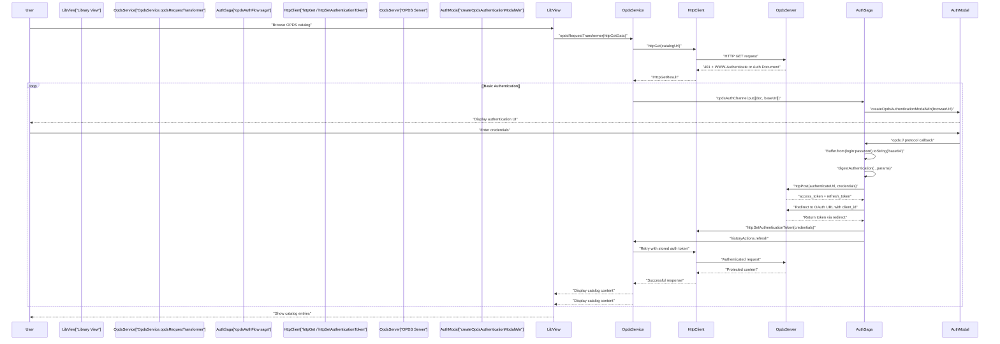
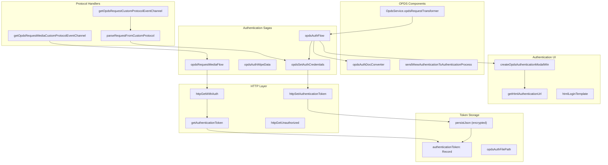
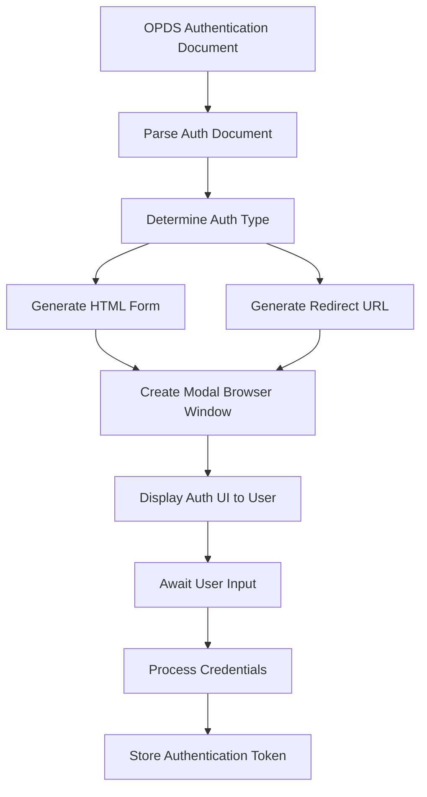
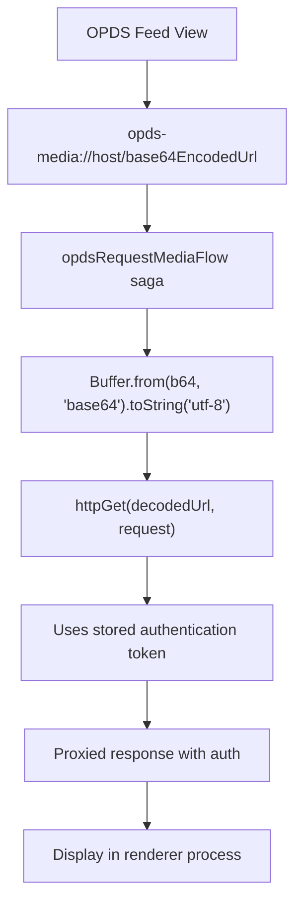

# OPDS Authentication

> **Relevant source files**
> * [src/common/utils/http.ts](https://github.com/edrlab/thorium-reader/blob/02b67755/src/common/utils/http.ts)
> * [src/main/network/fetch.ts](https://github.com/edrlab/thorium-reader/blob/02b67755/src/main/network/fetch.ts)
> * [src/main/network/http.ts](https://github.com/edrlab/thorium-reader/blob/02b67755/src/main/network/http.ts)
> * [src/main/redux/sagas/auth.ts](https://github.com/edrlab/thorium-reader/blob/02b67755/src/main/redux/sagas/auth.ts)
> * [src/main/redux/sagas/getEventChannel.ts](https://github.com/edrlab/thorium-reader/blob/02b67755/src/main/redux/sagas/getEventChannel.ts)
> * [src/main/services/opds.ts](https://github.com/edrlab/thorium-reader/blob/02b67755/src/main/services/opds.ts)

This document describes Thorium Reader's implementation of the OPDS Authentication for OPDS 1.0 specification, which allows users to access protected OPDS catalogs by authenticating with various methods. The authentication system handles credential collection, token management, and secure storage of authentication data for ongoing access to protected catalogs.

For information about general OPDS integration, see [OPDS Integration](/edrlab/thorium-reader/4-opds-integration), and for details about the OPDS feed conversion process, see [OPDS Feed Converter](/edrlab/thorium-reader/4.1-opds-feed-converter).

## Authentication Types and Specifications

Thorium Reader supports the following authentication methods as defined in the OPDS Authentication specification:

| Authentication Type | URI | Description |
| --- | --- | --- |
| Basic Authentication | `http://opds-spec.org/auth/basic` | Standard HTTP Basic authentication using username and password |
| Digest Authentication | `http://opds-spec.org/auth/digest` | HTTP Digest authentication with challenge-response mechanism |
| OAuth Password Flow | `http://opds-spec.org/auth/oauth/password` | OAuth 2.0 Resource Owner Password Credentials flow |
| API App OAuth | `http://opds-spec.org/auth/oauth/password/apiapp` | OAuth 2.0 with API-specific client credentials |
| OAuth Implicit Flow | `http://opds-spec.org/auth/oauth/implicit` | Browser-based OAuth 2.0 implicit grant flow |
| Local Authentication | `http://opds-spec.org/auth/local` | Custom authentication for local systems |
| SAML 2.0 | `http://librarysimplified.org/authtype/SAML-2.0` | Security Assertion Markup Language authentication |

Sources: [src/main/redux/sagas/auth.ts L55-L61](https://github.com/edrlab/thorium-reader/blob/02b67755/src/main/redux/sagas/auth.ts#L55-L61)

 [src/main/redux/sagas/auth.ts L63-L71](https://github.com/edrlab/thorium-reader/blob/02b67755/src/main/redux/sagas/auth.ts#L63-L71)

## Authentication Flow

The authentication process handles protected OPDS catalogs through the `opdsAuthFlow` saga function and associated HTTP authentication mechanisms.

### OPDS Authentication Flow Diagram



Sources: [src/main/redux/sagas/auth.ts L104-L225](https://github.com/edrlab/thorium-reader/blob/02b67755/src/main/redux/sagas/auth.ts#L104-L225)

 [src/main/services/opds.ts L79-L132](https://github.com/edrlab/thorium-reader/blob/02b67755/src/main/services/opds.ts#L79-L132)

 [src/main/network/http.ts L516-L563](https://github.com/edrlab/thorium-reader/blob/02b67755/src/main/network/http.ts#L516-L563)

## Authentication System Architecture

The OPDS authentication system connects multiple components through saga-based event handling and HTTP client integration:

### OPDS Authentication Component Architecture



Sources: [src/main/redux/sagas/auth.ts L273-L296](https://github.com/edrlab/thorium-reader/blob/02b67755/src/main/redux/sagas/auth.ts#L273-L296)

 [src/main/services/opds.ts L48-L49](https://github.com/edrlab/thorium-reader/blob/02b67755/src/main/services/opds.ts#L48-L49)

 [src/main/network/http.ts L127-L146](https://github.com/edrlab/thorium-reader/blob/02b67755/src/main/network/http.ts#L127-L146)

 [src/main/redux/sagas/getEventChannel.ts L108-L152](https://github.com/edrlab/thorium-reader/blob/02b67755/src/main/redux/sagas/getEventChannel.ts#L108-L152)

## Authentication Document Handling

When an OPDS catalog requires authentication, it returns an OPDS Authentication Document that follows the Authentication for OPDS 1.0 specification. Thorium Reader processes this document to determine the authentication method and required parameters.

### Authentication Document Processing

The `opdsAuthDocConverter` function transforms R2 OPDS Authentication Documents into an internal format:

| Field | Type | Source | Description |
| --- | --- | --- | --- |
| `title` | `string` | `doc.Title` | Authentication document title |
| `id` | `string` | `doc.Id` | Unique identifier |
| `authenticationType` | `TAuthenticationType` | `authentication.Type` | One of the supported auth types |
| `links.authenticate` | `IOpdsLinkView` | `authentication.Links` | Authentication endpoint URL |
| `links.refresh` | `IOpdsLinkView` | `authentication.Links` | Token refresh endpoint URL |
| `labels.login/password` | `string` | `authentication.Labels` | UI labels for login form |
| `logo` | `IOpdsLinkView` | `doc.Links` | Logo image link |
| `register` | `IOpdsLinkView` | `doc.Links` | Registration link |
| `help` | `string[]` | `doc.Links` | Help documentation links |

For Digest authentication, additional parameters are extracted from `authentication.AdditionalJSON`:

* `nonce`, `algorithm`, `qop`, `realm` for digest calculation

The `dispatchAuthenticationProcess` function routes authentication documents to the saga:

```javascript
// In OpdsServicethis.dispatchAuthenticationProcess(r2OpdsAuth, responseUrl); // Implementationprivate dispatchAuthenticationProcess(r2OpdsAuth: OPDSAuthenticationDoc, responseUrl: string) {    const opdsAuthChannel = getOpdsAuthenticationChannel();    opdsAuthChannel.put([r2OpdsAuth, responseUrl]);}
```

Sources: [src/main/redux/sagas/auth.ts L567-L594](https://github.com/edrlab/thorium-reader/blob/02b67755/src/main/redux/sagas/auth.ts#L567-L594)

 [src/main/redux/sagas/auth.ts L595-L716](https://github.com/edrlab/thorium-reader/blob/02b67755/src/main/redux/sagas/auth.ts#L595-L716)

 [src/main/services/opds.ts L217-L224](https://github.com/edrlab/thorium-reader/blob/02b67755/src/main/services/opds.ts#L217-L224)

## Authentication Modal and User Interface

Thorium creates a modal browser window to handle the authentication process. Depending on the authentication type, this window will either:

1. Display an HTML form for username/password entry (Basic, Digest, OAuth Password)
2. Redirect to an OAuth authorization URL (OAuth Implicit, SAML)

### Authentication UI Generation



Sources: [src/main/redux/sagas/auth.ts L462-L544](https://github.com/edrlab/thorium-reader/blob/02b67755/src/main/redux/sagas/auth.ts#L462-L544)

 [src/main/redux/sagas/auth.ts L697-L740](https://github.com/edrlab/thorium-reader/blob/02b67755/src/main/redux/sagas/auth.ts#L697-L740)

## Protocol Handlers for Authentication

Thorium implements custom protocol schemes to capture authentication responses and handle authenticated media requests:

| Protocol Scheme | Purpose | Handler Function |
| --- | --- | --- |
| `opds://` | Authentication callbacks | `getOpdsRequestCustomProtocolEventChannel` |
| `opds-media://` | Authenticated media requests | `getOpdsRequestMediaCustomProtocolEventChannel` |

### Protocol Handler Implementation

The `OPDS_AUTH_SCHEME` constant defines the authentication protocol:

```javascript
export const OPDS_AUTH_SCHEME = "opds"; export function getOpdsRequestCustomProtocolEventChannel() {    const channel = eventChannel<TregisterHttpProtocolHandler>(        (emit) => {            const handler = (                request: Electron.ProtocolRequest,                callback: (response: Electron.ProtocolResponse) => void,            ) => emit({ request, callback });            protocol.registerHttpProtocol(OPDS_AUTH_SCHEME, handler);             return () => {                protocol.unregisterProtocol(OPDS_AUTH_SCHEME);            };        },    );    return channel;}
```

The `parseRequestFromCustomProtocol` function processes incoming `opds://` requests to extract authentication credentials from both GET and POST requests. For OAuth implicit flow, it handles the fragment-to-query conversion required by the OPDS specification.

Sources: [src/main/redux/sagas/getEventChannel.ts L101](https://github.com/edrlab/thorium-reader/blob/02b67755/src/main/redux/sagas/getEventChannel.ts#L101-L101)

 [src/main/redux/sagas/getEventChannel.ts L108-L125](https://github.com/edrlab/thorium-reader/blob/02b67755/src/main/redux/sagas/getEventChannel.ts#L108-L125)

 [src/main/redux/sagas/auth.ts L770-L898](https://github.com/edrlab/thorium-reader/blob/02b67755/src/main/redux/sagas/auth.ts#L770-L898)

## Authentication Token Management

Authentication tokens are securely stored and managed by the system:

### Token Storage Structure

```typescript
export interface IOpdsAuthenticationToken {    id?: string;    opdsAuthenticationUrl?: string; // application/opds-authentication+json    refreshUrl?: string;    authenticateUrl?: string;    accessToken?: string;    refreshToken?: string;    tokenType?: string;    password?: string; // digest only}
```

### Token Lifecycle Management

```css
#mermaid-za7v8wtw7mo{font-family:ui-sans-serif,-apple-system,system-ui,Segoe UI,Helvetica;font-size:16px;fill:#333;}@keyframes edge-animation-frame{from{stroke-dashoffset:0;}}@keyframes dash{to{stroke-dashoffset:0;}}#mermaid-za7v8wtw7mo .edge-animation-slow{stroke-dasharray:9,5!important;stroke-dashoffset:900;animation:dash 50s linear infinite;stroke-linecap:round;}#mermaid-za7v8wtw7mo .edge-animation-fast{stroke-dasharray:9,5!important;stroke-dashoffset:900;animation:dash 20s linear infinite;stroke-linecap:round;}#mermaid-za7v8wtw7mo .error-icon{fill:#dddddd;}#mermaid-za7v8wtw7mo .error-text{fill:#222222;stroke:#222222;}#mermaid-za7v8wtw7mo .edge-thickness-normal{stroke-width:1px;}#mermaid-za7v8wtw7mo .edge-thickness-thick{stroke-width:3.5px;}#mermaid-za7v8wtw7mo .edge-pattern-solid{stroke-dasharray:0;}#mermaid-za7v8wtw7mo .edge-thickness-invisible{stroke-width:0;fill:none;}#mermaid-za7v8wtw7mo .edge-pattern-dashed{stroke-dasharray:3;}#mermaid-za7v8wtw7mo .edge-pattern-dotted{stroke-dasharray:2;}#mermaid-za7v8wtw7mo .marker{fill:#999;stroke:#999;}#mermaid-za7v8wtw7mo .marker.cross{stroke:#999;}#mermaid-za7v8wtw7mo svg{font-family:ui-sans-serif,-apple-system,system-ui,Segoe UI,Helvetica;font-size:16px;}#mermaid-za7v8wtw7mo p{margin:0;}#mermaid-za7v8wtw7mo defs #statediagram-barbEnd{fill:#999;stroke:#999;}#mermaid-za7v8wtw7mo g.stateGroup text{fill:#dddddd;stroke:none;font-size:10px;}#mermaid-za7v8wtw7mo g.stateGroup text{fill:#333;stroke:none;font-size:10px;}#mermaid-za7v8wtw7mo g.stateGroup .state-title{font-weight:bolder;fill:#333;}#mermaid-za7v8wtw7mo g.stateGroup rect{fill:#ffffff;stroke:#dddddd;}#mermaid-za7v8wtw7mo g.stateGroup line{stroke:#999;stroke-width:1;}#mermaid-za7v8wtw7mo .transition{stroke:#999;stroke-width:1;fill:none;}#mermaid-za7v8wtw7mo .stateGroup .composit{fill:#f4f4f4;border-bottom:1px;}#mermaid-za7v8wtw7mo .stateGroup .alt-composit{fill:#e0e0e0;border-bottom:1px;}#mermaid-za7v8wtw7mo .state-note{stroke:#e6d280;fill:#fff5ad;}#mermaid-za7v8wtw7mo .state-note text{fill:#333;stroke:none;font-size:10px;}#mermaid-za7v8wtw7mo .stateLabel .box{stroke:none;stroke-width:0;fill:#ffffff;opacity:0.5;}#mermaid-za7v8wtw7mo .edgeLabel .label rect{fill:#ffffff;opacity:0.5;}#mermaid-za7v8wtw7mo .edgeLabel{background-color:#ffffff;text-align:center;}#mermaid-za7v8wtw7mo .edgeLabel p{background-color:#ffffff;}#mermaid-za7v8wtw7mo .edgeLabel rect{opacity:0.5;background-color:#ffffff;fill:#ffffff;}#mermaid-za7v8wtw7mo .edgeLabel .label text{fill:#333;}#mermaid-za7v8wtw7mo .label div .edgeLabel{color:#333;}#mermaid-za7v8wtw7mo .stateLabel text{fill:#333;font-size:10px;font-weight:bold;}#mermaid-za7v8wtw7mo .node circle.state-start{fill:#999;stroke:#999;}#mermaid-za7v8wtw7mo .node .fork-join{fill:#999;stroke:#999;}#mermaid-za7v8wtw7mo .node circle.state-end{fill:#dddddd;stroke:#f4f4f4;stroke-width:1.5;}#mermaid-za7v8wtw7mo .end-state-inner{fill:#f4f4f4;stroke-width:1.5;}#mermaid-za7v8wtw7mo .node rect{fill:#ffffff;stroke:#dddddd;stroke-width:1px;}#mermaid-za7v8wtw7mo .node polygon{fill:#ffffff;stroke:#dddddd;stroke-width:1px;}#mermaid-za7v8wtw7mo #statediagram-barbEnd{fill:#999;}#mermaid-za7v8wtw7mo .statediagram-cluster rect{fill:#ffffff;stroke:#dddddd;stroke-width:1px;}#mermaid-za7v8wtw7mo .cluster-label,#mermaid-za7v8wtw7mo .nodeLabel{color:#333;}#mermaid-za7v8wtw7mo .statediagram-cluster rect.outer{rx:5px;ry:5px;}#mermaid-za7v8wtw7mo .statediagram-state .divider{stroke:#dddddd;}#mermaid-za7v8wtw7mo .statediagram-state .title-state{rx:5px;ry:5px;}#mermaid-za7v8wtw7mo .statediagram-cluster.statediagram-cluster .inner{fill:#f4f4f4;}#mermaid-za7v8wtw7mo .statediagram-cluster.statediagram-cluster-alt .inner{fill:#f8f8f8;}#mermaid-za7v8wtw7mo .statediagram-cluster .inner{rx:0;ry:0;}#mermaid-za7v8wtw7mo .statediagram-state rect.basic{rx:5px;ry:5px;}#mermaid-za7v8wtw7mo .statediagram-state rect.divider{stroke-dasharray:10,10;fill:#f8f8f8;}#mermaid-za7v8wtw7mo .note-edge{stroke-dasharray:5;}#mermaid-za7v8wtw7mo .statediagram-note rect{fill:#fff5ad;stroke:#e6d280;stroke-width:1px;rx:0;ry:0;}#mermaid-za7v8wtw7mo .statediagram-note rect{fill:#fff5ad;stroke:#e6d280;stroke-width:1px;rx:0;ry:0;}#mermaid-za7v8wtw7mo .statediagram-note text{fill:#333;}#mermaid-za7v8wtw7mo .statediagram-note .nodeLabel{color:#333;}#mermaid-za7v8wtw7mo .statediagram .edgeLabel{color:red;}#mermaid-za7v8wtw7mo #dependencyStart,#mermaid-za7v8wtw7mo #dependencyEnd{fill:#999;stroke:#999;stroke-width:1;}#mermaid-za7v8wtw7mo .statediagramTitleText{text-anchor:middle;font-size:18px;fill:#333;}#mermaid-za7v8wtw7mo :root{--mermaid-font-family:"trebuchet ms",verdana,arial,sans-serif;}"authenticationTokenInit()""User accesses protected catalog""httpSetAuthenticationToken() succeeds""Authentication fails""httpGetWithAuth() called""getAuthenticationToken() returns valid token""HTTP 401 response""httpGetUnauthorizedRefresh() if refreshToken exists""deleteAuthenticationToken() if no refresh""Refresh succeeds, httpSetAuthenticationToken() updates""Refresh fails""Start fresh auth flow""opdsAuthWipeData saga called""wipeAuthenticationTokenStorage()"NoTokenauthTokenInitAuthenticatingHasTokenUsingTokenValidRequestTokenExpiredRefreshingTokendeleteTokenTokenCleared
```

Authentication tokens are persisted using the `persistJson` function with host-based identifiers (`CONFIGREPOSITORY_OPDS_AUTHENTICATION_TOKEN_fn`) and encrypted storage via `encryptPersist`.

Sources: [src/main/network/http.ts L92-L125](https://github.com/edrlab/thorium-reader/blob/02b67755/src/main/network/http.ts#L92-L125)

 [src/main/network/http.ts L127-L146](https://github.com/edrlab/thorium-reader/blob/02b67755/src/main/network/http.ts#L127-L146)

 [src/main/network/http.ts L179-L187](https://github.com/edrlab/thorium-reader/blob/02b67755/src/main/network/http.ts#L179-L187)

 [src/main/redux/sagas/auth.ts L227-L237](https://github.com/edrlab/thorium-reader/blob/02b67755/src/main/redux/sagas/auth.ts#L227-L237)

## Authentication Flow by Type

Each authentication type has a specific flow:

### Basic Authentication

1. User enters username and password in the authentication form
2. Credentials are Base64 encoded as `username:password`
3. Authentication token is set with type "Basic"
4. Future requests include `Authorization: Basic {token}` header

### Digest Authentication

1. User enters username and password in the authentication form
2. System computes a digest response based on the challenge parameters
3. Authentication token is set with type "Digest"
4. Future requests include `Authorization: Digest {token}` header

### OAuth Password Flow

1. User enters username and password in the authentication form
2. Credentials are sent to the token endpoint with `grant_type=password`
3. System receives and stores access and refresh tokens
4. Future requests include `Authorization: Bearer {token}` header

### OAuth Implicit Flow

1. User is redirected to the OAuth authorization URL
2. After authentication, the authorization server redirects back with a token
3. The token is captured by the custom protocol handler and stored
4. Future requests include `Authorization: Bearer {token}` header

### SAML 2.0 Authentication

1. User is redirected to the SAML authentication URL
2. After authentication, the SAML service redirects back with a token
3. The token is captured and stored
4. Future requests include the appropriate authorization header

Sources: [src/main/redux/sagas/auth.ts L279-L456](https://github.com/edrlab/thorium-reader/blob/02b67755/src/main/redux/sagas/auth.ts#L279-L456)

 [src/main/network/http.ts L546-L667](https://github.com/edrlab/thorium-reader/blob/02b67755/src/main/network/http.ts#L546-L667)

## Secure Storage of Authentication Data

Authentication tokens are stored securely:

1. Tokens are encrypted before being stored on disk
2. The encryption key is derived from a constant and the file path
3. Tokens are stored with a host-specific identifier

```javascript
const persistJson = () => tryCatch(() => {    if (!authenticationToken) return Promise.resolve();    const encrypted = encryptPersist(JSON.stringify(authenticationToken), CONFIGREPOSITORY_OPDS_AUTHENTICATION_TOKEN, opdsAuthFilePath);    return fsp.writeFile(opdsAuthFilePath, encrypted);}, "");
```

Users can wipe stored authentication data through the application interface, which clears all stored tokens.

Sources: [src/main/network/http.ts L128-L137](https://github.com/edrlab/thorium-reader/blob/02b67755/src/main/network/http.ts#L128-L137)

 [src/main/redux/sagas/auth.ts L206-L216](https://github.com/edrlab/thorium-reader/blob/02b67755/src/main/redux/sagas/auth.ts#L206-L216)

## Media Handling with Authentication

## Authenticated Media Request Handling

For authenticated media requests (images, covers), Thorium uses the `opds-media://` protocol scheme with Base64 URL encoding:

### Media Protocol Flow



The `opdsRequestMediaFlow` saga handles media requests by:

1. Extracting the Base64-encoded URL from the `opds-media://` scheme
2. Decoding it to get the original media URL
3. Making an authenticated HTTP request using `httpGet` (which automatically applies stored tokens)
4. Proxying the response back to the renderer with appropriate headers

```javascript
function* opdsRequestMediaFlow({request, callback}: TregisterHttpProtocolHandler) {    const schemePrefix = OPDS_MEDIA_SCHEME + "://" + OPDS_MEDIA_SCHEME__IP_ORIGIN_OPDS_MEDIA + "/";    if (request && request.url.startsWith(schemePrefix)) {        const b64 = decodeURIComponent(request.url.slice(schemePrefix.length));        const url = Buffer.from(b64, "base64").toString("utf-8");                httpGet(url, { ...request }, (response) => {            callback({                method: "GET",                url: request.url,                statusCode: response?.statusCode || 500,                headers: {                    "Content-Type": response.contentType,                },                data: response.body || undefined,            });        });    }}
```

This protocol ensures that media resources from protected OPDS catalogs are fetched with the appropriate authentication credentials.

Sources: [src/main/redux/sagas/auth.ts L239-L271](https://github.com/edrlab/thorium-reader/blob/02b67755/src/main/redux/sagas/auth.ts#L239-L271)

 [src/common/streamerProtocol.ts L9-L10](https://github.com/edrlab/thorium-reader/blob/02b67755/src/common/streamerProtocol.ts#L9-L10)

 [src/main/redux/sagas/auth.ts L290-L294](https://github.com/edrlab/thorium-reader/blob/02b67755/src/main/redux/sagas/auth.ts#L290-L294)

## Integration with Thorium

The OPDS authentication system is integrated with the rest of Thorium Reader through:

1. Redux sagas for managing authentication state and flows
2. Protocol handlers for capturing authentication responses
3. HTTP client extensions for adding authentication to requests
4. Token storage for maintaining authentication between sessions

During application startup, Thorium initializes the authentication system:

```javascript
yield call(() => {    return absorbDBToJsonOpdsAuth();});
```

This loads any previously stored authentication tokens and ensures they're available for OPDS requests.

Sources: [src/main/redux/sagas/app.ts L215-L222](https://github.com/edrlab/thorium-reader/blob/02b67755/src/main/redux/sagas/app.ts#L215-L222)

 [src/main/network/http.ts L134-L137](https://github.com/edrlab/thorium-reader/blob/02b67755/src/main/network/http.ts#L134-L137)

## Conclusion

The OPDS Authentication system in Thorium Reader provides a comprehensive implementation of the Authentication for OPDS 1.0 specification, supporting various authentication methods for accessing protected OPDS catalogs. The system handles the authentication flow, securely stores authentication tokens, and integrates with the rest of the application to provide seamless access to protected content.