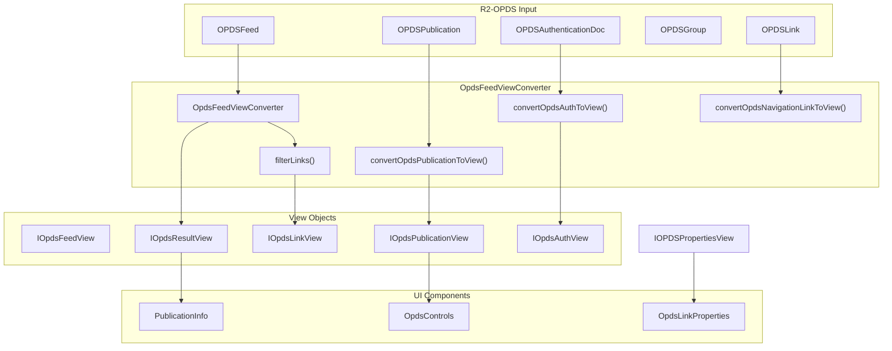
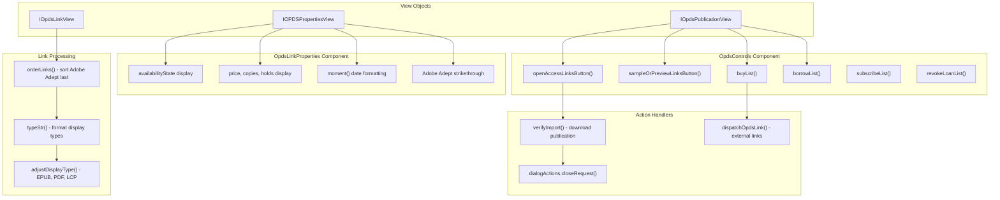

# OPDS Feed Converter

> **Relevant source files**
> * [src/common/isManifestType.ts](https://github.com/edrlab/thorium-reader/blob/02b67755/src/common/isManifestType.ts)
> * [src/common/lcp.ts](https://github.com/edrlab/thorium-reader/blob/02b67755/src/common/lcp.ts)
> * [src/common/views/opds.ts](https://github.com/edrlab/thorium-reader/blob/02b67755/src/common/views/opds.ts)
> * [src/main/converter/opds.ts](https://github.com/edrlab/thorium-reader/blob/02b67755/src/main/converter/opds.ts)
> * [src/main/redux/sagas/api/publication/import/importLcplFromFs.ts](https://github.com/edrlab/thorium-reader/blob/02b67755/src/main/redux/sagas/api/publication/import/importLcplFromFs.ts)
> * [src/renderer/library/components/dialog/publicationInfos/opdsControls/OpdsControls.tsx](https://github.com/edrlab/thorium-reader/blob/02b67755/src/renderer/library/components/dialog/publicationInfos/opdsControls/OpdsControls.tsx)
> * [src/renderer/library/components/dialog/publicationInfos/opdsControls/OpdsLinkProperties.tsx](https://github.com/edrlab/thorium-reader/blob/02b67755/src/renderer/library/components/dialog/publicationInfos/opdsControls/OpdsLinkProperties.tsx)
> * [src/utils/mimeTypes.ts](https://github.com/edrlab/thorium-reader/blob/02b67755/src/utils/mimeTypes.ts)

The OPDS Feed Converter system transforms raw OPDS (Open Publication Distribution System) feed data from the R2-OPDS library format into structured view objects that can be consumed by Thorium's user interface components. This conversion layer provides a clean abstraction between the low-level OPDS protocol implementation and the application's presentation layer.

For information about OPDS authentication flows, see [OPDS Authentication](/edrlab/thorium-reader/4.2-opds-authentication). For details about the overall OPDS integration architecture, see [OPDS Integration](/edrlab/thorium-reader/4-opds-integration).

## Architecture Overview

The converter system consists of a main converter class that transforms various OPDS entities into corresponding view objects, with specialized handling for links, metadata, and authentication.



Sources: [src/main/converter/opds.ts L66-L603](https://github.com/edrlab/thorium-reader/blob/02b67755/src/main/converter/opds.ts#L66-L603)

 [src/common/views/opds.ts L1-L172](https://github.com/edrlab/thorium-reader/blob/02b67755/src/common/views/opds.ts#L1-L172)

## Core Conversion Process

The conversion process involves multiple stages of data transformation, with special handling for different OPDS entity types and link processing.

```mermaid
flowchart TD

FeedInput["r2OpdsFeed: OPDSFeed"]
BaseUrl["baseUrl: string"]
Store["Redux Store (i18n)"]
ExtractTitle["convertMultiLangStringToString(Title)"]
ProcessPubs["Publications.map(convertOpdsPublicationToView)"]
ProcessNav["Navigation.map(convertOpdsNavigationLinkToView)"]
ProcessGroups["Groups.map(convertOpdsGroupToView)"]
ProcessLinks["Links processing for pagination"]
ExtractMeta["Extract metadata (title, authors, etc)"]
ProcessImages["Process cover/thumbnail links"]
ProcessAcquisition["Process acquisition links"]
ProcessSample["Process sample/preview links"]
ProcessBuy["Process buy/borrow/subscribe links"]
ResolveUrls["urlPathResolve(baseUrl, href)"]
TypeFilter["filterTypeLink()"]
RelFilter["filterRelLink()"]
LinkConvert["convertLinkToView()"]
PropsConvert["convertOpdsPropertiesToView()"]
ResultView["IOpdsResultView"]
PubViews["IOpdsPublicationView[]"]
LinkViews["IOpdsLinkView[]"]

FeedInput --> ExtractTitle
Store --> ExtractTitle
BaseUrl --> ResolveUrls
ProcessPubs --> ExtractMeta
ProcessAcquisition --> TypeFilter
PropsConvert --> LinkViews
ProcessPubs --> PubViews
ProcessNav --> ResultView
ProcessGroups --> ResultView
ProcessLinks --> ResultView

subgraph Output ["Output"]
    ResultView
    PubViews
    LinkViews
    PubViews --> ResultView
end

subgraph subGraph3 ["filterLinks() & convertFilterLinksToView()"]
    TypeFilter
    RelFilter
    LinkConvert
    PropsConvert
    TypeFilter --> RelFilter
    RelFilter --> LinkConvert
    LinkConvert --> PropsConvert
end

subgraph convertOpdsPublicationToView() ["convertOpdsPublicationToView()"]
    ExtractMeta
    ProcessImages
    ProcessAcquisition
    ProcessSample
    ProcessBuy
    ResolveUrls
    ExtractMeta --> ProcessImages
    ProcessImages --> ProcessAcquisition
end

subgraph convertOpdsFeedToView() ["convertOpdsFeedToView()"]
    ExtractTitle
    ProcessPubs
    ProcessNav
    ProcessGroups
    ProcessLinks
    ExtractTitle --> ProcessPubs
end

subgraph subGraph0 ["Input Processing"]
    FeedInput
    BaseUrl
    Store
end
```

Sources: [src/main/converter/opds.ts L544-L602](https://github.com/edrlab/thorium-reader/blob/02b67755/src/main/converter/opds.ts#L544-L602)

 [src/main/converter/opds.ts L272-L430](https://github.com/edrlab/thorium-reader/blob/02b67755/src/main/converter/opds.ts#L272-L430)

 [src/main/converter/opds.ts L221-L269](https://github.com/edrlab/thorium-reader/blob/02b67755/src/main/converter/opds.ts#L221-L269)

## View Object Structure

The converter produces a hierarchy of view objects that represent different aspects of OPDS feeds in a format optimized for UI consumption.

| View Interface | Purpose | Key Properties |
| --- | --- | --- |
| `IOpdsResultView` | Top-level feed representation | `title`, `publications`, `navigation`, `links`, `groups`, `auth` |
| `IOpdsPublicationView` | Individual publication details | `documentTitle`, `authorsLangString`, `openAccessLinks`, `buyLinks`, `cover` |
| `IOpdsFeedView` | Basic feed metadata | `identifier`, `title`, `url` |
| `IOpdsLinkView` | Processed link with metadata | `url`, `title`, `type`, `properties`, `rel` |
| `IOPDSPropertiesView` | Link properties and availability | `priceValue`, `availabilityState`, `lcpHashedPassphrase` |
| `IOpdsAuthView` | Authentication information | `logoImageUrl`, `oauthUrl`, `labelLogin`, `labelPassword` |

Sources: [src/common/views/opds.ts L19-L172](https://github.com/edrlab/thorium-reader/blob/02b67755/src/common/views/opds.ts#L19-L172)

## Link Processing and Filtering

The converter includes sophisticated link filtering and processing logic to handle different types of OPDS links and their associated metadata.

```mermaid
flowchart TD

BaseUrl["baseUrl"]
AbsoluteUrl["urlPathResolve()"]
RelativeUrl["link.Href"]
OpenAccess["http://opds-spec.org/acquisition/open-access"]
Sample["http://opds-spec.org/acquisition/sample"]
Buy["http://opds-spec.org/acquisition/buy"]
Borrow["http://opds-spec.org/acquisition/borrow"]
Subscribe["http://opds-spec.org/acquisition/subscribe"]
RawLinks["TLinkMayBeOpds[]"]
FilterCriteria["ILinkFilter {rel, type}"]
HrefPatch["Href monkey patch for malformed feeds"]
RelCheck["filterRelLink()"]
TypeCheck["filterTypeLink()"]
CombineFilters["Combine rel && type filters"]
SupportedTypes["supportedFileTypeLinkArray"]
Epub["ContentType.Epub"]
Pdf["ContentType.pdf"]
Audiobook["ContentType.AudioBook"]
LCP["ContentType.Lcp"]
Html["ContentType.Html"]
IndirectAcq["IndirectAcquisitions"]
LcpPassphrase["lcpHashedPassphrase (hex/base64)"]
Availability["availabilityState, availabilitySince"]
Pricing["priceValue, priceCurrency"]

RawLinks --> HrefPatch
FilterCriteria --> RelCheck
FilterCriteria --> TypeCheck
SupportedTypes --> TypeCheck
CombineFilters --> IndirectAcq

subgraph subGraph5 ["Properties Processing"]
    IndirectAcq
    LcpPassphrase
    Availability
    Pricing
    IndirectAcq --> LcpPassphrase
    LcpPassphrase --> Availability
    Availability --> Pricing
end

subgraph subGraph2 ["Link Types Supported"]
    SupportedTypes
    Epub
    Pdf
    Audiobook
    LCP
    Html
    Epub --> SupportedTypes
    Pdf --> SupportedTypes
    Audiobook --> SupportedTypes
    LCP --> SupportedTypes
    Html --> SupportedTypes
end

subgraph filterLinks() ["filterLinks()"]
    HrefPatch
    RelCheck
    TypeCheck
    CombineFilters
    HrefPatch --> RelCheck
    HrefPatch --> TypeCheck
    RelCheck --> CombineFilters
    TypeCheck --> CombineFilters
end

subgraph subGraph0 ["Link Input"]
    RawLinks
    FilterCriteria
end

subgraph subGraph4 ["URL Resolution"]
    BaseUrl
    AbsoluteUrl
    RelativeUrl
    BaseUrl --> AbsoluteUrl
    RelativeUrl --> AbsoluteUrl
end

subgraph subGraph3 ["Acquisition Types"]
    OpenAccess
    Sample
    Buy
    Borrow
    Subscribe
end
```

Sources: [src/main/converter/opds.ts L47-L64](https://github.com/edrlab/thorium-reader/blob/02b67755/src/main/converter/opds.ts#L47-L64)

 [src/main/converter/opds.ts L221-L255](https://github.com/edrlab/thorium-reader/blob/02b67755/src/main/converter/opds.ts#L221-L255)

 [src/main/converter/opds.ts L93-L175](https://github.com/edrlab/thorium-reader/blob/02b67755/src/main/converter/opds.ts#L93-L175)

## UI Integration

The converted view objects are consumed by UI components to render OPDS publications and their associated actions.



Sources: [src/renderer/library/components/dialog/publicationInfos/opdsControls/OpdsControls.tsx L43-L339](https://github.com/edrlab/thorium-reader/blob/02b67755/src/renderer/library/components/dialog/publicationInfos/opdsControls/OpdsControls.tsx#L43-L339)

 [src/renderer/library/components/dialog/publicationInfos/opdsControls/OpdsLinkProperties.tsx L37-L159](https://github.com/edrlab/thorium-reader/blob/02b67755/src/renderer/library/components/dialog/publicationInfos/opdsControls/OpdsLinkProperties.tsx#L37-L159)

## LCP and Authentication Handling

The converter includes specialized processing for Licensed Content Protection (LCP) metadata and OPDS authentication documents.

```mermaid
flowchart TD

AvailState["OPDSAvailabilityEnum"]
Available["Available"]
Unavailable["Unavailable"]
Ready["Ready"]
Reserved["Reserved"]
DateRange["availabilitySince, availabilityUntil"]
IndirectAcq["properties.IndirectAcquisitions"]
TopType["TypeAcquisition (top level)"]
ChildType["Children[].TypeAcquisition"]
AcquisitionChain["{ top: string, child: string }"]
AuthDoc["OPDSAuthenticationDoc"]
AuthTitle["r2OpdsAuth.Title"]
LogoLink["Links.find(rel='logo')"]
OAuthFlow["Authentication.find(type='oauth/password')"]
LabelsExtract["Labels.Login, Labels.Password"]
AuthLinks["Links.find(rel='authenticate|refresh')"]
LcpProps["IOPDSPropertiesView.lcpHashedPassphrase"]
HexCheck["isHex validation"]
HexConvert["Buffer.from(hex).toString('hex')"]
Base64Check["isBase64 validation"]
B64Convert["Buffer.from(base64).toString('hex')"]

subgraph subGraph3 ["Availability States"]
    AvailState
    Available
    Unavailable
    Ready
    Reserved
    DateRange
    AvailState --> Available
    AvailState --> Unavailable
    AvailState --> Ready
    AvailState --> Reserved
    AvailState --> DateRange
end

subgraph subGraph2 ["Indirect Acquisitions"]
    IndirectAcq
    TopType
    ChildType
    AcquisitionChain
    IndirectAcq --> TopType
    IndirectAcq --> ChildType
    TopType --> AcquisitionChain
    ChildType --> AcquisitionChain
end

subgraph subGraph1 ["Authentication Conversion"]
    AuthDoc
    AuthTitle
    LogoLink
    OAuthFlow
    LabelsExtract
    AuthLinks
    AuthDoc --> AuthTitle
    AuthDoc --> LogoLink
    AuthDoc --> OAuthFlow
    OAuthFlow --> LabelsExtract
    OAuthFlow --> AuthLinks
end

subgraph subGraph0 ["LCP Processing"]
    LcpProps
    HexCheck
    HexConvert
    Base64Check
    B64Convert
    LcpProps --> HexCheck
    HexCheck --> HexConvert
    HexCheck --> Base64Check
    Base64Check --> B64Convert
end
```



Sources: [src/main/converter/opds.ts L93-L175](https://github.com/edrlab/thorium-reader/blob/02b67755/src/main/converter/opds.ts#L93-L175)

 [src/main/converter/opds.ts L431-L490](https://github.com/edrlab/thorium-reader/blob/02b67755/src/main/converter/opds.ts#L431-L490)

 [src/utils/mimeTypes.ts L8-L198](https://github.com/edrlab/thorium-reader/blob/02b67755/src/utils/mimeTypes.ts#L8-L198)