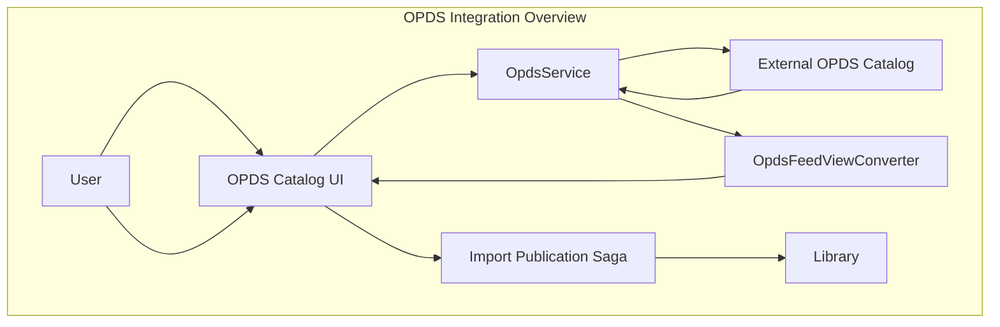
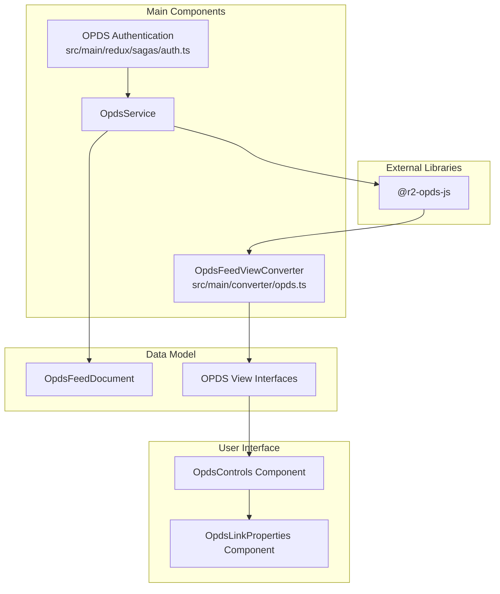
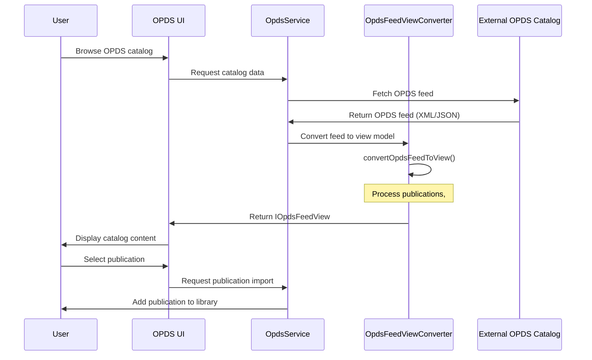
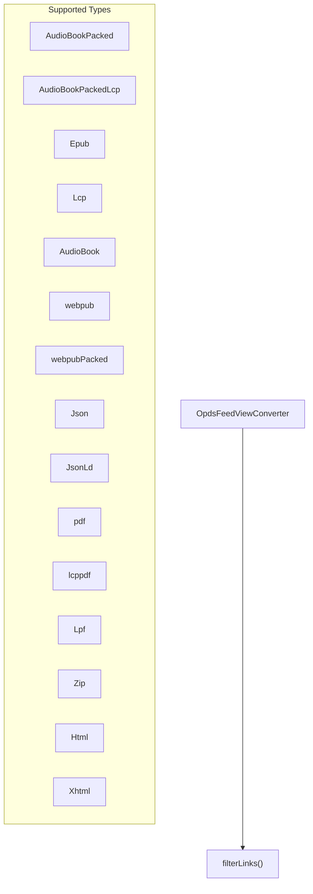
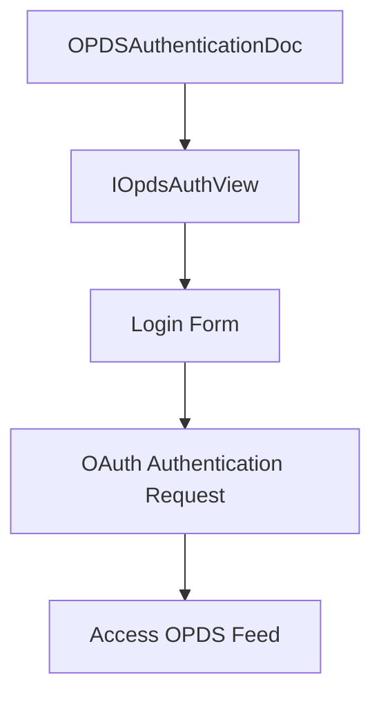
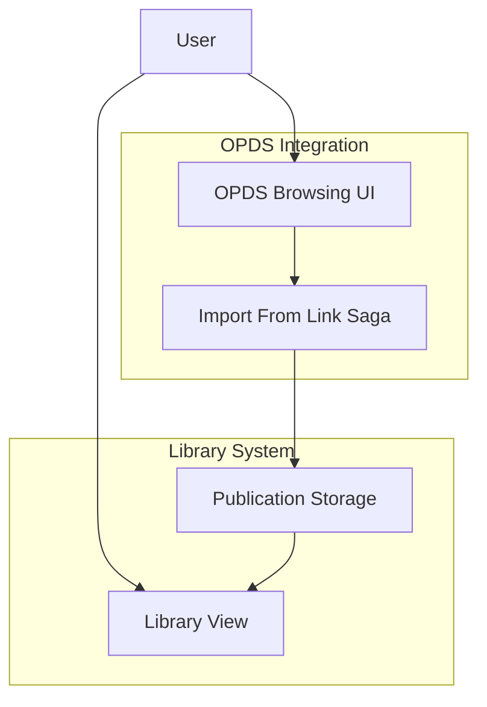

# OPDS Integration

> **Relevant source files**
> * [src/common/isManifestType.ts](https://github.com/edrlab/thorium-reader/blob/02b67755/src/common/isManifestType.ts)
> * [src/common/lcp.ts](https://github.com/edrlab/thorium-reader/blob/02b67755/src/common/lcp.ts)
> * [src/common/views/opds.ts](https://github.com/edrlab/thorium-reader/blob/02b67755/src/common/views/opds.ts)
> * [src/main/converter/opds.ts](https://github.com/edrlab/thorium-reader/blob/02b67755/src/main/converter/opds.ts)
> * [src/main/redux/sagas/api/publication/import/importLcplFromFs.ts](https://github.com/edrlab/thorium-reader/blob/02b67755/src/main/redux/sagas/api/publication/import/importLcplFromFs.ts)
> * [src/renderer/library/components/dialog/publicationInfos/opdsControls/OpdsControls.tsx](https://github.com/edrlab/thorium-reader/blob/02b67755/src/renderer/library/components/dialog/publicationInfos/opdsControls/OpdsControls.tsx)
> * [src/renderer/library/components/dialog/publicationInfos/opdsControls/OpdsLinkProperties.tsx](https://github.com/edrlab/thorium-reader/blob/02b67755/src/renderer/library/components/dialog/publicationInfos/opdsControls/OpdsLinkProperties.tsx)
> * [src/utils/mimeTypes.ts](https://github.com/edrlab/thorium-reader/blob/02b67755/src/utils/mimeTypes.ts)

This document describes the OPDS (Open Publication Distribution System) integration in Thorium Reader, which enables users to access and browse online catalogs of electronic publications, search for content, and import publications into their library.

## Overview

OPDS is an open standard for distributing digital publications. Thorium Reader implements OPDS to allow users to:

* Browse OPDS catalogs
* Search for publications in OPDS catalogs
* Import publications from OPDS catalogs into the library
* Access protected content through OPDS authentication

Sources: [src/main/converter/opds.ts L66-L603](https://github.com/edrlab/thorium-reader/blob/02b67755/src/main/converter/opds.ts#L66-L603)

 [src/common/views/opds.ts L19-L171](https://github.com/edrlab/thorium-reader/blob/02b67755/src/common/views/opds.ts#L19-L171)

## Architecture

The OPDS integration consists of several components that work together to fetch, parse, convert, and display OPDS catalogs and their publications.

Sources: [src/main/converter/opds.ts L1-L66](https://github.com/edrlab/thorium-reader/blob/02b67755/src/main/converter/opds.ts#L1-L66)

 [src/common/views/opds.ts L1-L171](https://github.com/edrlab/thorium-reader/blob/02b67755/src/common/views/opds.ts#L1-L171)

## Core Components

### OPDS Feed Converter

The OPDS Feed Converter is responsible for transforming OPDS data structures from the R2 OPDS JS library into view models that can be easily consumed by the UI components.

The main class is `OpdsFeedViewConverter` which is an injectable service that provides methods to convert various OPDS entities to their corresponding view models.

Key conversion methods:

| Method | Description |
| --- | --- |
| `convertDocumentToView` | Converts an OPDS feed document to a view model |
| `convertOpdsFeedToView` | Converts an OPDS feed to a result view model |
| `convertOpdsPublicationToView` | Converts an OPDS publication to a view model |
| `convertOpdsGroupToView` | Converts an OPDS group to a view model |
| `convertOpdsAuthToView` | Converts an OPDS authentication document to a view model |
| `convertOpdsNavigationLinkToView` | Converts an OPDS link to a navigation link view model |

Sources: [src/main/converter/opds.ts L67-L603](https://github.com/edrlab/thorium-reader/blob/02b67755/src/main/converter/opds.ts#L67-L603)

### OPDS Data Flow

The following diagram illustrates the data flow from an external OPDS catalog to the user interface:

Sources: [src/main/converter/opds.ts L544-L602](https://github.com/edrlab/thorium-reader/blob/02b67755/src/main/converter/opds.ts#L544-L602)

## View Models

The OPDS integration uses a set of interfaces to represent OPDS data in a format that can be easily consumed by the UI components. These interfaces are defined in `src/common/views/opds.ts`.

### Main View Models

| Interface | Description |
| --- | --- |
| `IOpdsFeedView` | Represents an OPDS feed with title and URL |
| `IOpdsResultView` | Represents the result of an OPDS feed request |
| `IOpdsPublicationView` | Represents a publication in an OPDS feed |
| `IOpdsNavigationLinkView` | Represents a navigation link in an OPDS feed |
| `IOpdsGroupView` | Represents a group in an OPDS feed |
| `IOpdsFacetView` | Represents a facet in an OPDS feed |
| `IOpdsAuthView` | Represents authentication information for an OPDS feed |

Sources: [src/common/views/opds.ts L19-L171](https://github.com/edrlab/thorium-reader/blob/02b67755/src/common/views/opds.ts#L19-L171)

## Content Type Support

Thorium Reader supports various content types through OPDS integration. The supported file types for acquisition links are defined in the `supportedFileTypeLinkArray` constant:

| Content Type | Constant | Description |
| --- | --- | --- |
| EPUB | `ContentType.Epub` | Standard EPUB publications |
| LCP Protected EPUB | `ContentType.Lcp` | LCP-protected EPUB files |
| Audiobook (Packed) | `ContentType.AudioBookPacked` | Packaged audiobook files |
| Audiobook (LCP) | `ContentType.AudioBookPackedLcp` | LCP-protected packaged audiobooks |
| Audiobook (Unpacked) | `ContentType.AudioBook` | Unpacked audiobook manifests |
| Web Publication | `ContentType.webpub` | Web publication manifests |
| Web Publication (Packed) | `ContentType.webpubPacked` | Packaged web publications |
| PDF | `ContentType.pdf` | Standard PDF files |
| LCP Protected PDF | `ContentType.lcppdf` | LCP-protected PDF files |
| LPF | `ContentType.Lpf` | Lightweight Packaging Format |
| JSON/JSON-LD | `ContentType.Json`, `ContentType.JsonLd` | JSON-based manifests |
| ZIP | `ContentType.Zip` | Generic ZIP archives |
| HTML/XHTML | `ContentType.Html`, `ContentType.Xhtml` | Web content |

Sources: [src/main/converter/opds.ts L47-L64](https://github.com/edrlab/thorium-reader/blob/02b67755/src/main/converter/opds.ts#L47-L64)

## Authentication

OPDS catalogs may require authentication. Thorium Reader supports OPDS authentication through the OAuth password flow.

The `convertOpdsAuthToView` method in the `OpdsFeedViewConverter` class processes authentication information from an OPDS feed:

Key authentication properties:

* Logo URL for the catalog
* Login and password field labels
* OAuth authentication endpoint URL
* OAuth token refresh URL

Sources: [src/main/converter/opds.ts L431-L490](https://github.com/edrlab/thorium-reader/blob/02b67755/src/main/converter/opds.ts#L431-L490)

## Link Processing

OPDS feeds contain links that need to be processed based on their relationship types and media types. The `OpdsFeedViewConverter` class provides methods to filter and convert these links:

* `filterLinks`: Filters links based on relationship and media type criteria
* `convertFilterLinksToView`: Filters links and converts them to view models

These methods support common OPDS link relationships:

* Acquisition links (buy, borrow, sample, subscribe)
* Navigation links (next, previous, first, last)
* Cover images and thumbnails

Sources: [src/main/converter/opds.ts L221-L269](https://github.com/edrlab/thorium-reader/blob/02b67755/src/main/converter/opds.ts#L221-L269)

## Integration with Library System

Publications from OPDS catalogs can be imported into the user's library. The process flows through the OPDS UI components to the import saga:

For more details on how publications are managed in the library, see [Publication Management](/edrlab/thorium-reader/3.2-publication-management).

Sources: [src/main/converter/opds.ts L271-L430](https://github.com/edrlab/thorium-reader/blob/02b67755/src/main/converter/opds.ts#L271-L430)

## URL Resolution

The OPDS converter ensures that all URLs in OPDS feeds are properly resolved to absolute URLs. This is done using the `urlPathResolve` function which combines the base URL of the OPDS feed with relative URLs in the feed.

This is particularly important for:

* Publication acquisition links
* Cover image links
* Navigation links to other parts of the catalog

Sources: [src/main/converter/opds.ts L36](https://github.com/edrlab/thorium-reader/blob/02b67755/src/main/converter/opds.ts#L36-L36)

 [src/main/converter/opds.ts L209-L210](https://github.com/edrlab/thorium-reader/blob/02b67755/src/main/converter/opds.ts#L209-L210)

## Related Components

For additional information about related components, please refer to:

* [OPDS Feed Converter](/edrlab/thorium-reader/4.1-opds-feed-converter) - Details on how OPDS feeds are parsed and converted
* [OPDS Authentication](/edrlab/thorium-reader/4.2-opds-authentication) - Information about the authentication with OPDS catalogs
* [OPDS UI Components](#4.3) - Description of the UI components for browsing OPDS catalogs
* [Publication Management](/edrlab/thorium-reader/3.2-publication-management) - How publications are imported and managed in the library