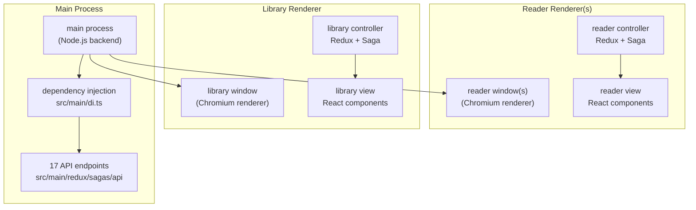
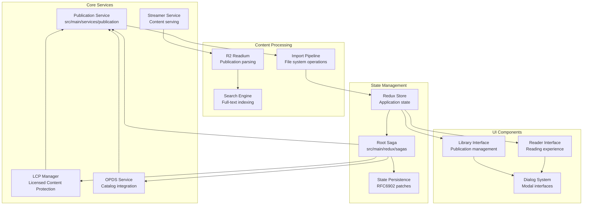
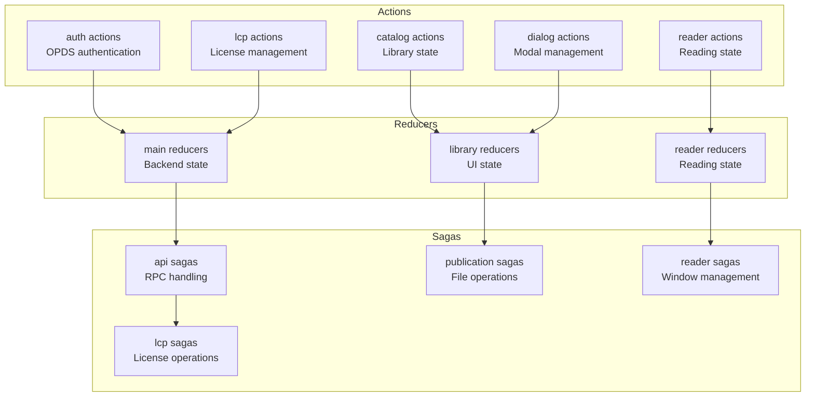

# Overview

> **Relevant source files**
> * [.nvmrc](https://github.com/edrlab/thorium-reader/blob/02b67755/.nvmrc)
> * [README.md](https://github.com/edrlab/thorium-reader/blob/02b67755/README.md?plain=1)
> * [scripts/package-ci-patch.js](https://github.com/edrlab/thorium-reader/blob/02b67755/scripts/package-ci-patch.js)

## Purpose and Scope

This document provides a high-level overview of Thorium Reader, an open-source EPUB and audiobook reading application built on Electron. It covers the application's architecture, core technologies, and major system components. For detailed information about specific subsystems, see the [Application Architecture](/edrlab/thorium-reader/1.1-application-architecture), [Build & Deployment](/edrlab/thorium-reader/1.2-build-and-deployment), [Reader System](/edrlab/thorium-reader/2-reader-system), [Library System](/edrlab/thorium-reader/3-library-system), [State Management](/edrlab/thorium-reader/6-state-management), and [Internationalization](/edrlab/thorium-reader/7-internationalization) pages.

## Application Overview

Thorium Reader is a cross-platform desktop application that enables users to read EPUB publications, audiobooks, and PDF files. It provides accessibility features for visually impaired users, supports DRM-protected content via LCP (Licensed Content Protection), and integrates with OPDS (Open Publication Distribution System) catalogs for content discovery.

**Key Features:**

* Multi-format support (EPUB, audiobook, PDF)
* Accessibility compliance (NVDA, JAWS, Narrator)
* LCP DRM support for protected content
* OPDS catalog integration
* Internationalization support for 28+ languages
* Annotation and bookmark management
* Text-to-speech and media overlay support

Sources: [README.md L1-L52](https://github.com/edrlab/thorium-reader/blob/02b67755/README.md?plain=1#L1-L52)

## Architecture Overview

Thorium Reader follows a multi-process Electron architecture with three main components:

**Process Architecture**

* **Main Process**: Node.js backend handling file system operations, publication management, and API endpoints
* **Library Renderer**: Publication management interface with grid/list views and import functionality
* **Reader Renderer(s)**: Reading interface with navigation, settings, and annotation features

Sources: [README.md L135-L151](https://github.com/edrlab/thorium-reader/blob/02b67755/README.md?plain=1#L135-L151)

## Core Technologies

| Technology | Purpose | Key Components |
| --- | --- | --- |
| **Electron** | Cross-platform desktop framework | Main process, renderer processes, IPC |
| **TypeScript** | Type-safe JavaScript development | All source code with strict typing |
| **React** | UI component library | Class components with Redux integration |
| **Redux** | State management | Centralized application state |
| **Redux-Saga** | Side effect management | Async operations and application logic |
| **i18next** | Internationalization | 28+ language translations |
| **Webpack** | Module bundling | Separate configs for main/renderer processes |

Sources: [README.md L61-L69](https://github.com/edrlab/thorium-reader/blob/02b67755/README.md?plain=1#L61-L69)

## System Components

The application is organized into several major subsystems:

Sources: [README.md L174-L198](https://github.com/edrlab/thorium-reader/blob/02b67755/README.md?plain=1#L174-L198)

## API Architecture

The application uses an RPC-style API system for communication between processes:

**API Categories:**

* **Library APIs**: Publication management (get, delete, findAll, search, import)
* **OPDS APIs**: Feed management (getFeed, addFeed, deleteFeed, browse)
* **Browser APIs**: HTTP browsing and OPDS parsing
* **Publication APIs**: Metadata operations and file system operations

The API system encapsulates Redux actions and reducers, providing a structured interface for inter-process communication through Electron's IPC mechanism.

Sources: [README.md L160-L198](https://github.com/edrlab/thorium-reader/blob/02b67755/README.md?plain=1#L160-L198)

## State Management Architecture

The Redux architecture spans all processes with synchronized state through IPC middleware, enabling consistent application behavior across the main process and multiple renderer windows.

Sources: [README.md L200-L259](https://github.com/edrlab/thorium-reader/blob/02b67755/README.md?plain=1#L200-L259)

## Build and Development

**Development Commands:**

* `npm run start:dev` - Development mode with hot reload
* `npm run start:dev:quick` - Skip TypeScript checks for faster startup
* `npm start` - Production mode

**Build Targets:**

* `npm run package:win` - Windows installer
* `npm run package:mac` - macOS installer
* `npm run package:linux` - Linux installer

The build system uses separate Webpack configurations for different processes and supports cross-platform compilation with native module handling.

Sources: [README.md L72-L91](https://github.com/edrlab/thorium-reader/blob/02b67755/README.md?plain=1#L72-L91)