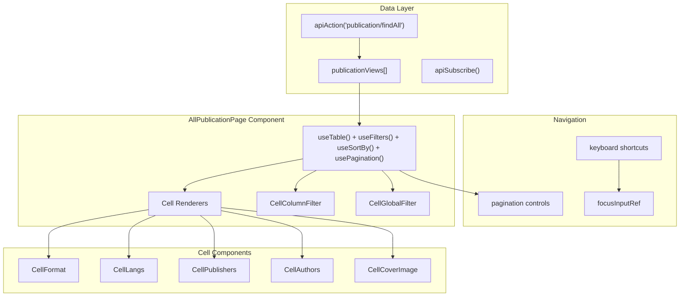
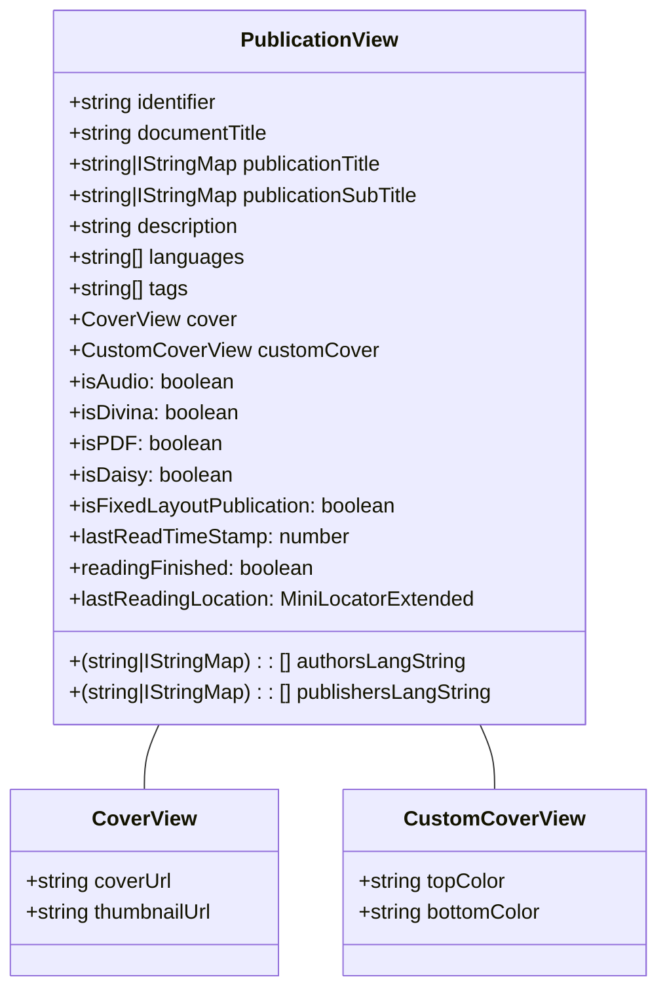
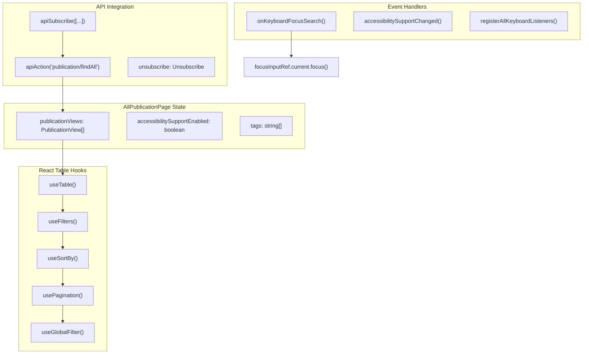
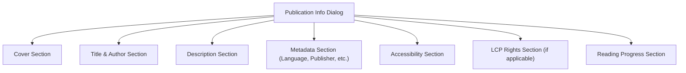
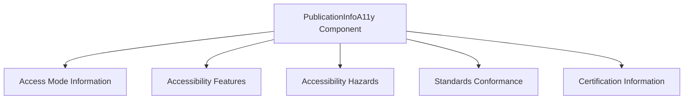
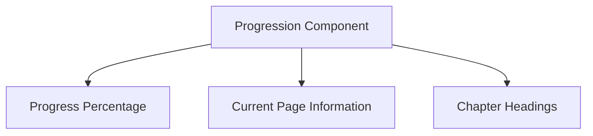
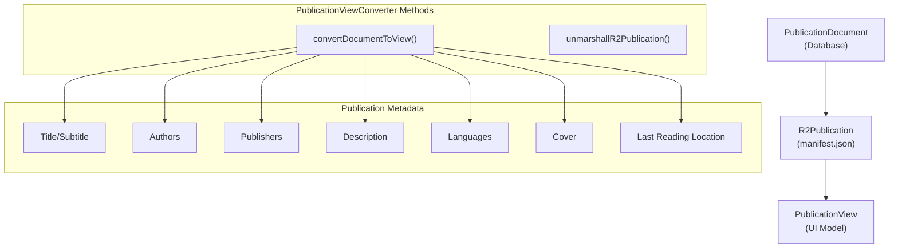
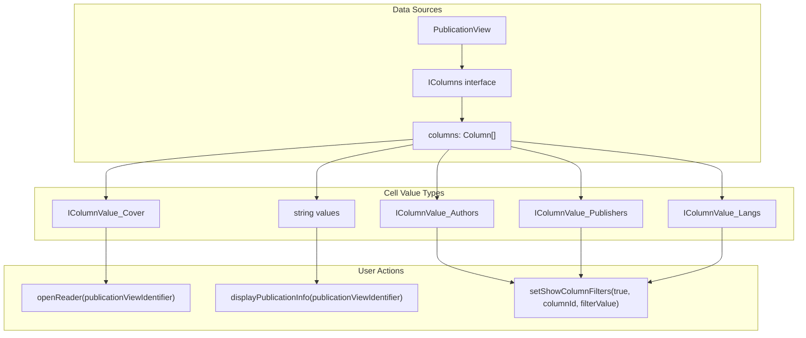

# Publication Display

> **Relevant source files**
> * [scripts/translator-key-type.js](https://github.com/edrlab/thorium-reader/blob/02b67755/scripts/translator-key-type.js)
> * [src/renderer/assets/styles/components/allPublicationsPage.scss](https://github.com/edrlab/thorium-reader/blob/02b67755/src/renderer/assets/styles/components/allPublicationsPage.scss)
> * [src/renderer/assets/styles/components/allPublicationsPage.scss.d.ts](https://github.com/edrlab/thorium-reader/blob/02b67755/src/renderer/assets/styles/components/allPublicationsPage.scss.d.ts)
> * [src/renderer/assets/styles/components/breadcrumb.scss.d.ts](https://github.com/edrlab/thorium-reader/blob/02b67755/src/renderer/assets/styles/components/breadcrumb.scss.d.ts)
> * [src/renderer/assets/styles/components/catalogs.scss.d.ts](https://github.com/edrlab/thorium-reader/blob/02b67755/src/renderer/assets/styles/components/catalogs.scss.d.ts)
> * [src/renderer/assets/styles/components/columns.scss](https://github.com/edrlab/thorium-reader/blob/02b67755/src/renderer/assets/styles/components/columns.scss)
> * [src/renderer/assets/styles/components/combobox.scss.d.ts](https://github.com/edrlab/thorium-reader/blob/02b67755/src/renderer/assets/styles/components/combobox.scss.d.ts)
> * [src/renderer/assets/styles/components/modals.scss.d.ts](https://github.com/edrlab/thorium-reader/blob/02b67755/src/renderer/assets/styles/components/modals.scss.d.ts)
> * [src/renderer/assets/styles/components/settings.scss.d.ts](https://github.com/edrlab/thorium-reader/blob/02b67755/src/renderer/assets/styles/components/settings.scss.d.ts)
> * [src/renderer/common/components/dialog/publicationInfos/PublicationInfoDescription.tsx](https://github.com/edrlab/thorium-reader/blob/02b67755/src/renderer/common/components/dialog/publicationInfos/PublicationInfoDescription.tsx)
> * [src/renderer/common/components/dialog/publicationInfos/formatPublisherDate.tsx](https://github.com/edrlab/thorium-reader/blob/02b67755/src/renderer/common/components/dialog/publicationInfos/formatPublisherDate.tsx)
> * [src/renderer/common/components/dialog/publicationInfos/publicationInfoA11y.tsx](https://github.com/edrlab/thorium-reader/blob/02b67755/src/renderer/common/components/dialog/publicationInfos/publicationInfoA11y.tsx)
> * [src/renderer/common/components/dialog/publicationInfos/publicationInfoContent.tsx](https://github.com/edrlab/thorium-reader/blob/02b67755/src/renderer/common/components/dialog/publicationInfos/publicationInfoContent.tsx)
> * [src/renderer/common/components/hoc/translator.tsx](https://github.com/edrlab/thorium-reader/blob/02b67755/src/renderer/common/components/hoc/translator.tsx)
> * [src/renderer/library/components/searchResult/AllPublicationPage.tsx](https://github.com/edrlab/thorium-reader/blob/02b67755/src/renderer/library/components/searchResult/AllPublicationPage.tsx)

## Purpose and Scope

The Publication Display system is responsible for presenting and organizing publications in the library view of Thorium Reader. It handles how publications are visually represented to users, including covers, metadata display, filtering, sorting, and search capabilities. This system focuses on the library browsing experience rather than the actual reading experience.

For information about reading publications, see [Reader System](/edrlab/thorium-reader/2-reader-system). For details on how publications are imported and managed, see [Publication Management](/edrlab/thorium-reader/3.2-publication-management).

## System Overview

The Publication Display system provides a comprehensive table-based interface for viewing and managing publications in the library. Built using `react-table`, it supports advanced filtering, sorting, pagination, and accessibility features.



Sources: [src/renderer/library/components/searchResult/AllPublicationPage.tsx L139-L284](https://github.com/edrlab/thorium-reader/blob/02b67755/src/renderer/library/components/searchResult/AllPublicationPage.tsx#L139-L284)

 [src/renderer/library/components/searchResult/AllPublicationPage.tsx L61](https://github.com/edrlab/thorium-reader/blob/02b67755/src/renderer/library/components/searchResult/AllPublicationPage.tsx#L61-L61)

 [src/renderer/library/components/searchResult/AllPublicationPage.tsx L169-L185](https://github.com/edrlab/thorium-reader/blob/02b67755/src/renderer/library/components/searchResult/AllPublicationPage.tsx#L169-L185)

## Publication View Model

The foundation of the display system is the `PublicationView` interface, which defines the structure of publication data used by UI components:



Sources: [src/common/views/publication.ts L17-L78](https://github.com/edrlab/thorium-reader/blob/02b67755/src/common/views/publication.ts#L17-L78)

## Library View Components

### AllPublicationPage Component

The `AllPublicationPage` component is a React class component that implements the main library interface using `react-table` hooks. It manages publication display, filtering, and user interactions.



Sources: [src/renderer/library/components/searchResult/AllPublicationPage.tsx L133-L153](https://github.com/edrlab/thorium-reader/blob/02b67755/src/renderer/library/components/searchResult/AllPublicationPage.tsx#L133-L153)

 [src/renderer/library/components/searchResult/AllPublicationPage.tsx L156-L185](https://github.com/edrlab/thorium-reader/blob/02b67755/src/renderer/library/components/searchResult/AllPublicationPage.tsx#L156-L185)

 [src/renderer/library/components/searchResult/AllPublicationPage.tsx L265-L283](https://github.com/edrlab/thorium-reader/blob/02b67755/src/renderer/library/components/searchResult/AllPublicationPage.tsx#L265-L283)

### React Table Implementation

The component implements a sophisticated table using multiple `react-table` hooks with advanced features:

#### Core Table Features

* **Global Search**: `CellGlobalFilter` component with `useAsyncDebounce` for performance
* **Column Filtering**: `CellColumnFilter` components with individual search inputs
* **Sorting**: Click column headers to sort ascending/descending
* **Pagination**: Navigate between pages with configurable page sizes
* **Accessibility**: Screen reader support and keyboard navigation

#### Column Definitions and Cell Renderers

| Cell Component | Purpose | Key Features |
| --- | --- | --- |
| `CellCoverImage` | Publication cover thumbnails | Click to open reader, fallback placeholder image |
| `CellAuthors` | Author names with i18n support | RTL text detection, clickable filter links |
| `CellPublishers` | Publisher information | Multi-language string handling |
| `CellLangs` | Publication languages | Clickable language codes for filtering |
| `CellFormat` | File format badges | Clickable format filters (EPUB, PDF, etc.) |

#### Filter Implementation

```mermaid
flowchart TD

CellColumnFilter["CellColumnFilter"]
columnSetFilter["column.setFilter()"]
columnFilterValue["column.filterValue"]
showColumnFilters["showColumnFilters state"]
CellGlobalFilter["CellGlobalFilter"]
useAsyncDebounce["useAsyncDebounce(500ms)"]
setGlobalFilter["setGlobalFilter()"]
globalFilteredRows["globalFilteredRows"]

subgraph subGraph1 ["Column Filters"]
    CellColumnFilter
    columnSetFilter
    columnFilterValue
    showColumnFilters
    CellColumnFilter --> columnSetFilter
    columnSetFilter --> columnFilterValue
    showColumnFilters --> CellColumnFilter
end

subgraph subGraph0 ["Global Filter"]
    CellGlobalFilter
    useAsyncDebounce
    setGlobalFilter
    globalFilteredRows
    CellGlobalFilter --> useAsyncDebounce
    useAsyncDebounce --> setGlobalFilter
    setGlobalFilter --> globalFilteredRows
end
```



Sources: [src/renderer/library/components/searchResult/AllPublicationPage.tsx L377-L447](https://github.com/edrlab/thorium-reader/blob/02b67755/src/renderer/library/components/searchResult/AllPublicationPage.tsx#L377-L447)

 [src/renderer/library/components/searchResult/AllPublicationPage.tsx L470-L609](https://github.com/edrlab/thorium-reader/blob/02b67755/src/renderer/library/components/searchResult/AllPublicationPage.tsx#L470-L609)

 [src/renderer/library/components/searchResult/AllPublicationPage.tsx L626-L674](https://github.com/edrlab/thorium-reader/blob/02b67755/src/renderer/library/components/searchResult/AllPublicationPage.tsx#L626-L674)

## Publication Info Dialog

Detailed publication information is displayed in a dialog, implemented through the `PublicationInfoContent` component:



Sources: [src/renderer/common/components/dialog/publicationInfos/publicationInfoContent.tsx L367-L539](https://github.com/edrlab/thorium-reader/blob/02b67755/src/renderer/common/components/dialog/publicationInfos/publicationInfoContent.tsx#L367-L539)

 [src/common/models/dialog.ts L15-L26](https://github.com/edrlab/thorium-reader/blob/02b67755/src/common/models/dialog.ts#L15-L26)

### Description Display

The publication description is displayed with special handling for long text, providing a "see more" button that expands the content when clicked:

```html
<div    ref={this.descriptionWrapperRef}    className={classNames(        stylesBookDetailsDialog.descriptionWrapper,        this.state.needSeeMore && stylesBookDetailsDialog.hideEnd,        this.state.seeMore && stylesBookDetailsDialog.seeMore,    )}>    <div        ref={this.descriptionRef}        className={stylesBookDetailsDialog.allowUserSelect}        dangerouslySetInnerHTML={{ __html: descriptionSanitized }}    >    </div></div>{    this.state.needSeeMore &&    <button aria-hidden className={stylePublication.publicationInfo_description_bloc_seeMore} onClick={this.toggleSeeMore}>        <SVG ariaHidden svg={this.state.seeMore ? ChevronUp : ChevronDown} />        {            this.state.seeMore                ? __("publication.seeLess")                : __("publication.seeMore")        }    </button>}
```

Sources: [src/renderer/common/components/dialog/publicationInfos/PublicationInfoDescription.tsx L36-L119](https://github.com/edrlab/thorium-reader/blob/02b67755/src/renderer/common/components/dialog/publicationInfos/PublicationInfoDescription.tsx#L36-L119)

### Accessibility Information

The publication info dialog includes a dedicated section for accessibility information that displays:

* Access mode requirements
* Accessibility features (print page numbers, transformability, etc.)
* Accessibility hazards (flashing, motion simulation, sound)
* Standards conformance
* Certification information



Sources: [src/renderer/common/components/dialog/publicationInfos/publicationInfoA11y.tsx L37-L254](https://github.com/edrlab/thorium-reader/blob/02b67755/src/renderer/common/components/dialog/publicationInfos/publicationInfoA11y.tsx#L37-L254)

### Reading Progress

For publications that have been partially read, the info dialog displays reading progress information:



The component adapts to different publication types:

* For EPUB reflowable: Shows chapter position and reading progression
* For EPUB fixed layout: Shows current page and total pages
* For PDF: Shows page numbers
* For audiobooks: Shows playing time and total duration
* For Divina (comics): Shows current page in sequence

Sources: [src/renderer/common/components/dialog/publicationInfos/publicationInfoContent.tsx L102-L348](https://github.com/edrlab/thorium-reader/blob/02b67755/src/renderer/common/components/dialog/publicationInfos/publicationInfoContent.tsx#L102-L348)

## Data Flow

### Converting Publication Documents to Views

The `PublicationViewConverter` class is responsible for transforming raw publication data into the format needed for display:



Key steps in the conversion process:

1. Load R2Publication from filesystem or memory cache
2. Extract metadata (title, authors, publishers, etc.)
3. Format dates (published and modified dates)
4. Handle cover image references
5. Determine publication type (audio, PDF, Divina, fixed layout)
6. Retrieve last reading location from reader state
7. Create a PublicationView object with all extracted data

Sources: [src/main/converter/publication.ts L188-L332](https://github.com/edrlab/thorium-reader/blob/02b67755/src/main/converter/publication.ts#L188-L332)

### Publication Data Rendering

The table renders `PublicationView` data through specialized cell components that handle different data types and user interactions:



Sources: [src/renderer/library/components/searchResult/AllPublicationPage.tsx L618-L645](https://github.com/edrlab/thorium-reader/blob/02b67755/src/renderer/library/components/searchResult/AllPublicationPage.tsx#L618-L645)

 [src/renderer/library/components/searchResult/AllPublicationPage.tsx L682-L726](https://github.com/edrlab/thorium-reader/blob/02b67755/src/renderer/library/components/searchResult/AllPublicationPage.tsx#L682-L726)

 [src/renderer/library/components/searchResult/AllPublicationPage.tsx L795-L823](https://github.com/edrlab/thorium-reader/blob/02b67755/src/renderer/library/components/searchResult/AllPublicationPage.tsx#L795-L823)

## Internationalization Support

The Publication Display system provides comprehensive internationalization support:

1. Component text is translated using the translator service: ```javascript const [__] = useTranslator();// ...<h4>{__("catalog.description")}</h4> ```
2. Multilingual publication metadata is handled with special consideration for language preferences and right-to-left languages: ```javascript const pubTitleLangStr = convertMultiLangStringToLangString(    (publicationViewMaybeOpds as PublicationView).publicationTitle ||     publicationViewMaybeOpds.documentTitle,     locale);const pubTitleLang = pubTitleLangStr && pubTitleLangStr[0] ?     pubTitleLangStr[0].toLowerCase() : "";const pubTitleIsRTL = langStringIsRTL(pubTitleLang); ```
3. Dates are formatted according to the user's locale using `moment.js`.

Sources: [src/renderer/common/components/dialog/publicationInfos/publicationInfoContent.tsx L382-L386](https://github.com/edrlab/thorium-reader/blob/02b67755/src/renderer/common/components/dialog/publicationInfos/publicationInfoContent.tsx#L382-L386)

 [src/renderer/common/components/dialog/publicationInfos/formatPublisherDate.tsx L20-L38](https://github.com/edrlab/thorium-reader/blob/02b67755/src/renderer/common/components/dialog/publicationInfos/formatPublisherDate.tsx#L20-L38)

## Integration Points

The Publication Display system integrates with several other systems in Thorium Reader:

### Library System

The display system receives publication data from the library system via Redux. When publications are added, deleted, or updated, the display is refreshed to show the current state.

### Dialog System

The application's dialog system is used to show detailed publication information:

```javascript
displayPublicationInfo: (publicationViewIdentifier: string) => {    dispatch(dialogActions.openRequest.build(DialogTypeName.PublicationInfoLib,        {            publicationIdentifier: publicationViewIdentifier,        },    ));}
```

Sources: [src/renderer/library/components/searchResult/AllPublicationPage.tsx L336-L348](https://github.com/edrlab/thorium-reader/blob/02b67755/src/renderer/library/components/searchResult/AllPublicationPage.tsx#L336-L348)

### Reader System

When a user clicks to open a publication, the display system interacts with the reader system:

```javascript
openReader: (publicationViewIdentifier: string) => {    dispatch(readerActions.openRequest.build(publicationViewIdentifier));}
```

Sources: [src/renderer/library/components/searchResult/AllPublicationPage.tsx L345-L347](https://github.com/edrlab/thorium-reader/blob/02b67755/src/renderer/library/components/searchResult/AllPublicationPage.tsx#L345-L347)

## Conclusion

The Publication Display system provides a comprehensive and flexible way to present publication data to users in the library view. Its modular architecture allows for specialized handling of different metadata types and presentation contexts, making it adaptable to various publication formats and display requirements.

Through integration with other systems like the library management, dialog handling, and reader components, it creates a cohesive user experience for browsing and managing digital publications.