# Publication Management

> **Relevant source files**
> * [src/common/views/publication.ts](https://github.com/edrlab/thorium-reader/blob/02b67755/src/common/views/publication.ts)
> * [src/main/converter/publication.ts](https://github.com/edrlab/thorium-reader/blob/02b67755/src/main/converter/publication.ts)
> * [src/main/db/document/publication.ts](https://github.com/edrlab/thorium-reader/blob/02b67755/src/main/db/document/publication.ts)
> * [src/main/db/repository/publication.ts](https://github.com/edrlab/thorium-reader/blob/02b67755/src/main/db/repository/publication.ts)
> * [src/main/redux/sagas/api/publication/import/importFromLink.ts](https://github.com/edrlab/thorium-reader/blob/02b67755/src/main/redux/sagas/api/publication/import/importFromLink.ts)
> * [src/main/redux/sagas/api/publication/import/importPublicationFromFs.ts](https://github.com/edrlab/thorium-reader/blob/02b67755/src/main/redux/sagas/api/publication/import/importPublicationFromFs.ts)
> * [src/main/services/lcp.ts](https://github.com/edrlab/thorium-reader/blob/02b67755/src/main/services/lcp.ts)
> * [src/main/storage/publication-storage.ts](https://github.com/edrlab/thorium-reader/blob/02b67755/src/main/storage/publication-storage.ts)

This document describes the system that handles importing, storing, and managing publications within Thorium Reader. Publication management encompasses the complete lifecycle from initial import through storage and retrieval to eventual deletion. For information about how publications are displayed in the library interface, see [Publication Display](/edrlab/thorium-reader/3.1-publication-display), and for details on LCP-protected publications, see [LCP Rights Management](/edrlab/thorium-reader/5-lcp-rights-management).

## Core Components

The Publication Management system consists of several key components that work together to provide comprehensive publication handling from import through storage and retrieval.

### Architecture Overview

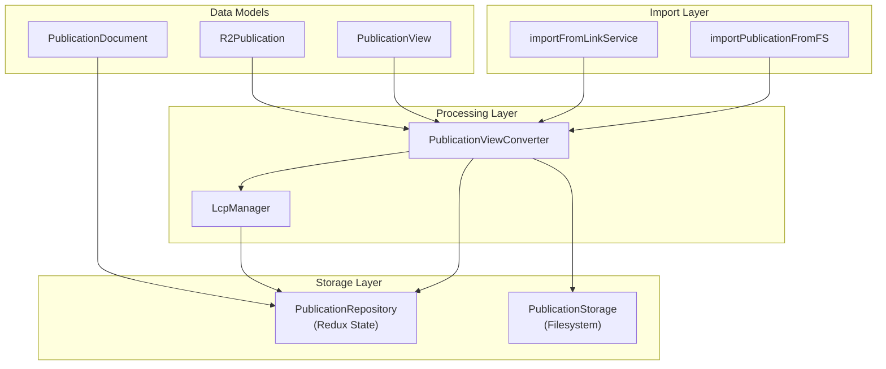

Sources: [src/main/converter/publication.ts L44-L334](https://github.com/edrlab/thorium-reader/blob/02b67755/src/main/converter/publication.ts#L44-L334)

 [src/main/storage/publication-storage.ts L34-L360](https://github.com/edrlab/thorium-reader/blob/02b67755/src/main/storage/publication-storage.ts#L34-L360)

 [src/main/db/repository/publication.ts L34-L287](https://github.com/edrlab/thorium-reader/blob/02b67755/src/main/db/repository/publication.ts#L34-L287)

### Publication Document Structure

Publications are stored as `PublicationDocument` objects, which contain metadata and file references:

| Field | Type | Description |
| --- | --- | --- |
| `identifier` | string | Unique publication identifier (UUID) |
| `title` | string | Publication title |
| `tags` | string[] | User-assigned tags |
| `files` | File[] | Associated publication files |
| `coverFile` | File | Cover image file reference |
| `customCover` | CustomCover | Generated cover when no image available |
| `lcp` | LcpInfo | DRM license information |
| `hash` | string | File content hash for duplicate detection |
| `createdAt/updatedAt` | number | Timestamps |

Sources: [src/main/db/document/publication.ts L30-L57](https://github.com/edrlab/thorium-reader/blob/02b67755/src/main/db/document/publication.ts#L30-L57)

### Publication Repository

The `PublicationRepository` provides Redux-based CRUD operations:

| Method | Purpose | Returns |
| --- | --- | --- |
| `save(document)` | Persists publication to Redux state | `PublicationDocument` |
| `delete(identifier)` | Marks publication as removed | `void` |
| `get(identifier)` | Retrieves single publication | `PublicationDocument \| undefined` |
| `findAll()` | Returns all non-removed publications | `PublicationDocument[]` |
| `findByHashId(hash)` | Locates publication by content hash | `PublicationDocument \| undefined` |
| `searchByTitleAndAuthor(term)` | Full-text search with Lunr.js | `PublicationDocument[]` |
| `getAllTags()` | Returns all unique tags | `string[]` |

Sources: [src/main/db/repository/publication.ts L35-L287](https://github.com/edrlab/thorium-reader/blob/02b67755/src/main/db/repository/publication.ts#L35-L287)

### Publication Storage

The `PublicationStorage` class manages filesystem operations for publication files:

| Method | Purpose |
| --- | --- |
| `storePublication(identifier, srcPath)` | Copies publication to storage directory |
| `getPublicationEpubPath(identifier)` | Returns path to main publication file |
| `removePublication(identifier)` | Deletes publication directory |
| `buildPublicationPath(identifier)` | Constructs publication directory path |
| `storePublicationCover(identifier, srcPath)` | Extracts and stores cover image |

Sources: [src/main/storage/publication-storage.ts L35-L360](https://github.com/edrlab/thorium-reader/blob/02b67755/src/main/storage/publication-storage.ts#L35-L360)

### Publication View Converter

The `PublicationViewConverter` transforms documents to views and manages R2 publication caching:

| Method | Purpose |
| --- | --- |
| `convertDocumentToView(document)` | Converts to UI-ready `PublicationView` |
| `unmarshallR2Publication(document)` | Loads R2 publication with caching |
| `updatePublicationCache(document, r2Publication)` | Updates filesystem manifest cache |
| `updateLcpCache(document, r2LCP)` | Updates filesystem LCP license cache |

Sources: [src/main/converter/publication.ts L44-L334](https://github.com/edrlab/thorium-reader/blob/02b67755/src/main/converter/publication.ts#L44-L334)

## Filesystem Structure

Publications are stored in individual directories within the application's data directory:

### Directory Layout

```html
publications/
├── <publication-uuid-1>/
│   ├── book.epub (or .audiobook, .divina, etc.)
│   ├── cover.jpg/.png
│   ├── manifest.json (cached R2 publication)
│   └── license.lcpl (if LCP protected)
├── <publication-uuid-2>/
│   └── ...
```

### Supported File Extensions

The system supports multiple publication formats:

| Extension | Content Type | Description |
| --- | --- | --- |
| `.epub`, `.epub3` | `ContentType.Epub` | Standard EPUB publications |
| `.audiobook` | `ContentType.AudioBookPacked` | Readium audiobooks |
| `.lcpaudiobook`, `.lcpau` | `ContentType.AudioBookPackedLcp` | LCP-protected audiobooks |
| `.divina` | `ContentType.DivinaPacked` | Visual narrative publications |
| `.webpub` | `ContentType.webpubPacked` | Readium web publications |
| `.lcpdf` | `ContentType.lcppdf` | LCP-protected PDFs |
| `.daisy` | DAISY format | Digital talking books |

Sources: [src/main/storage/publication-storage.ts L112-L196](https://github.com/edrlab/thorium-reader/blob/02b67755/src/main/storage/publication-storage.ts#L112-L196)

 [src/common/extension.ts L12-L45](https://github.com/edrlab/thorium-reader/blob/02b67755/src/common/extension.ts#L12-L45)

## Import System

The import system processes publications from multiple sources and formats, with automatic format detection and metadata extraction.

### Import Processing Flow

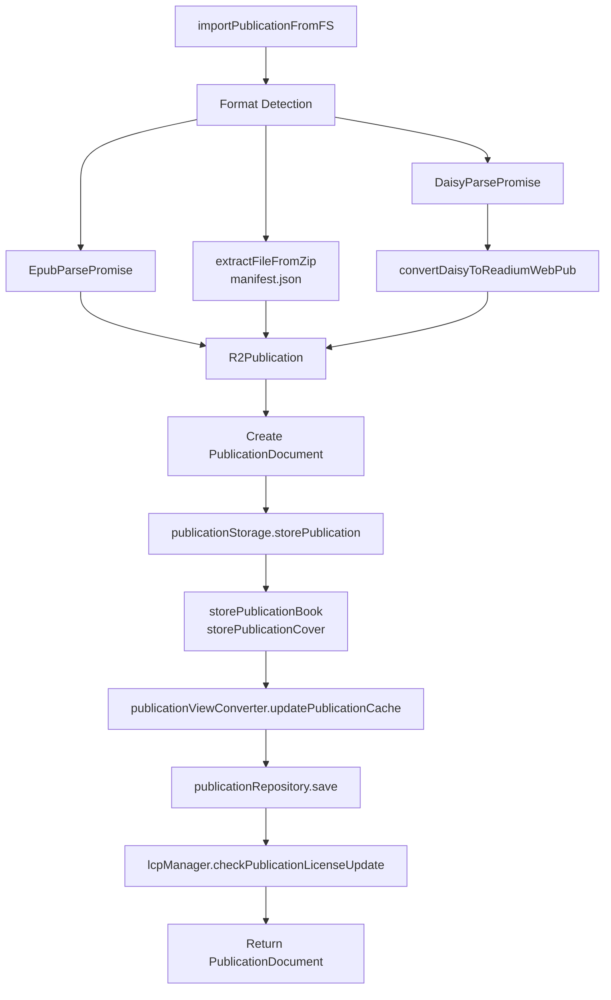

Sources: [src/main/redux/sagas/api/publication/import/importPublicationFromFs.ts L47-L307](https://github.com/edrlab/thorium-reader/blob/02b67755/src/main/redux/sagas/api/publication/import/importPublicationFromFs.ts#L47-L307)

### Format-Specific Processing

The import system handles different formats with specialized parsers:

#### EPUB Processing

* Uses `EpubParsePromise` from R2 shared library
* Automatically extracts LCP licenses from `META-INF/license.lcpl`
* Cleans up ZIP handlers after parsing with `r2Publication.freeDestroy()`

#### DAISY Processing

* Supports both ZIP archives and filesystem directories
* Converts DAISY to Readium WebPub format
* Handles audio-only fallback for failed audio+text conversions
* Processes both DAISY 2.02 and 3.0 formats

#### Readium Formats (Audiobook/WebPub/Divina)

* Extracts `manifest.json` from ZIP container
* Processes LCP licenses from `license.lcpl` entry
* Sets internal type markers for format identification

Sources: [src/main/redux/sagas/api/publication/import/importPublicationFromFs.ts L63-L186](https://github.com/edrlab/thorium-reader/blob/02b67755/src/main/redux/sagas/api/publication/import/importPublicationFromFs.ts#L63-L186)

### Storage Operations

The storage layer handles the physical file operations during import:

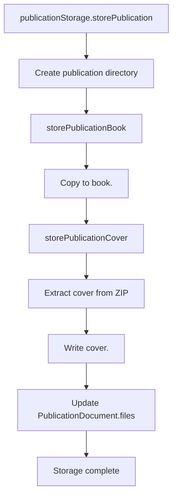

Sources: [src/main/storage/publication-storage.ts L53-L74](https://github.com/edrlab/thorium-reader/blob/02b67755/src/main/storage/publication-storage.ts#L53-L74)

 [src/main/storage/publication-storage.ts L227-L359](https://github.com/edrlab/thorium-reader/blob/02b67755/src/main/storage/publication-storage.ts#L227-L359)

### LCP Integration During Import

LCP-protected publications require special handling during import:

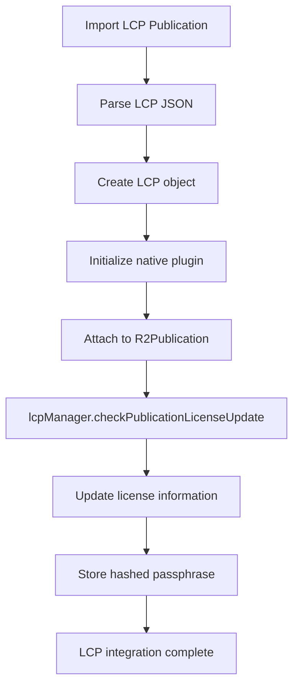

Sources: [src/main/redux/sagas/api/publication/import/importPublicationFromFs.ts L156-L176](https://github.com/edrlab/thorium-reader/blob/02b67755/src/main/redux/sagas/api/publication/import/importPublicationFromFs.ts#L156-L176)

 [src/main/redux/sagas/api/publication/import/importPublicationFromFs.ts L297-L303](https://github.com/edrlab/thorium-reader/blob/02b67755/src/main/redux/sagas/api/publication/import/importPublicationFromFs.ts#L297-L303)

## View Conversion and Caching

The `PublicationViewConverter` manages the transformation between storage documents and UI-ready views, with sophisticated caching to improve performance.

### Caching Architecture

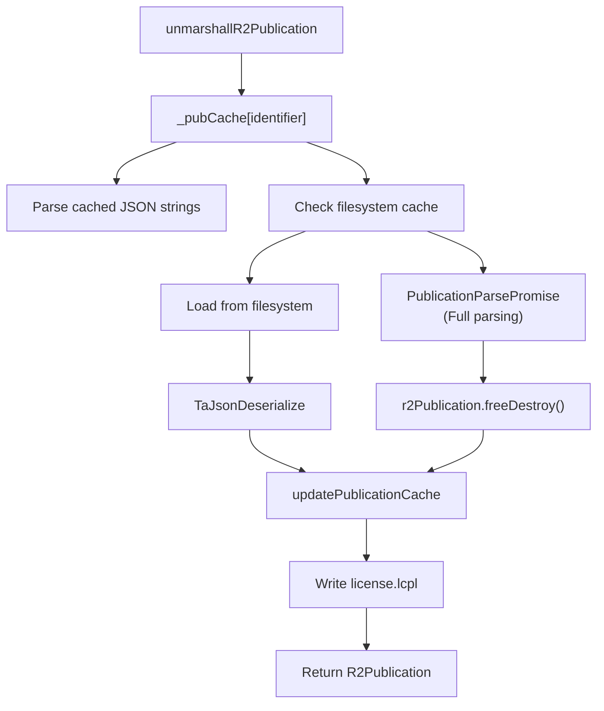

Sources: [src/main/converter/publication.ts L98-L187](https://github.com/edrlab/thorium-reader/blob/02b67755/src/main/converter/publication.ts#L98-L187)

### Document to View Conversion

The converter extracts metadata for UI display:

| View Field | Source | Processing |
| --- | --- | --- |
| `publicationTitle` | `r2Publication.Metadata.Title` | Multi-language string |
| `authorsLangString` | `r2Publication.Metadata.Author` | Contributor name extraction |
| `publishersLangString` | `r2Publication.Metadata.Publisher` | Publisher name extraction |
| `cover` | `document.coverFile` | File URL reference |
| `duration` | `r2Publication.Metadata.Duration` | Audio duration |
| `a11y_*` | `r2Publication.Metadata.Accessibility` | Accessibility metadata |
| `lastReadingLocation` | Redux state | Reading progress |

Sources: [src/main/converter/publication.ts L190-L333](https://github.com/edrlab/thorium-reader/blob/02b67755/src/main/converter/publication.ts#L190-L333)

## Storage Architecture

The system employs a three-layer architecture combining Redux state management, filesystem caching, and physical file storage:

### Three-Layer Storage Model

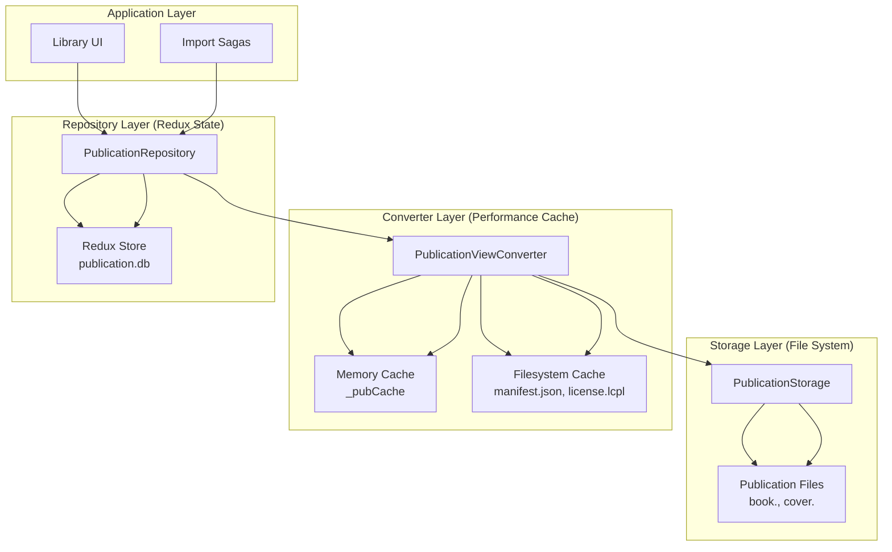

Sources: [src/main/db/repository/publication.ts L35-L147](https://github.com/edrlab/thorium-reader/blob/02b67755/src/main/db/repository/publication.ts#L35-L147)

 [src/main/converter/publication.ts L42-L96](https://github.com/edrlab/thorium-reader/blob/02b67755/src/main/converter/publication.ts#L42-L96)

 [src/main/storage/publication-storage.ts L35-L74](https://github.com/edrlab/thorium-reader/blob/02b67755/src/main/storage/publication-storage.ts#L35-L74)

### Repository Operations with Redux

The repository uses Redux subscriptions to monitor state changes:

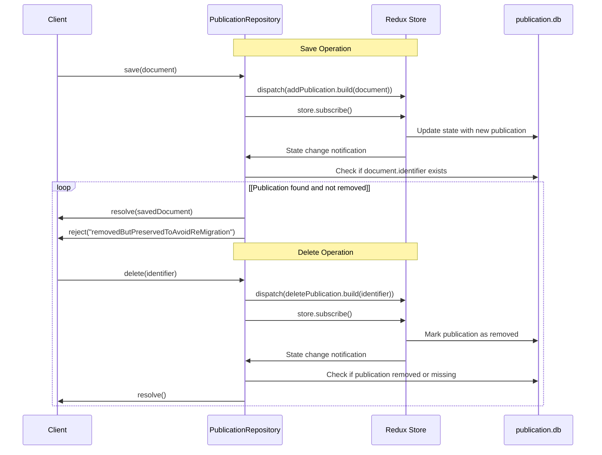

Sources: [src/main/db/repository/publication.ts L37-L121](https://github.com/edrlab/thorium-reader/blob/02b67755/src/main/db/repository/publication.ts#L37-L121)

### Cache Management Strategy

The converter maintains multi-level caching for performance:

| Cache Level | Storage | Content | Lifetime |
| --- | --- | --- | --- |
| Memory | `_pubCache[identifier]` | R2 publication JSON strings | Process lifetime |
| Filesystem | `manifest.json` | Serialized R2Publication | Persistent |
| Filesystem | `license.lcpl` | LCP license data | Persistent |

**Cache Update Flow:**

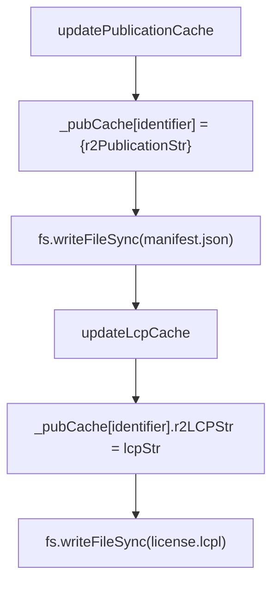

Sources: [src/main/converter/publication.ts L77-L96](https://github.com/edrlab/thorium-reader/blob/02b67755/src/main/converter/publication.ts#L77-L96)

 [src/main/converter/publication.ts L59-L75](https://github.com/edrlab/thorium-reader/blob/02b67755/src/main/converter/publication.ts#L59-L75)

## Search and Filtering

The Publication Management system provides extensive search and filtering capabilities.

### Text Search Implementation

Full-text search is implemented using Lunr.js with multi-language support:

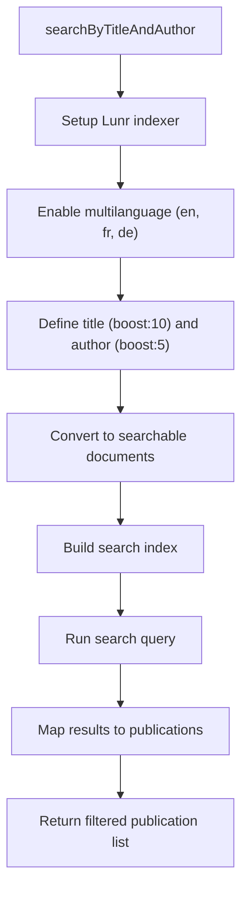

Sources: [src/main/db/repository/publication.ts L193-L262](https://github.com/edrlab/thorium-reader/blob/02b67755/src/main/db/repository/publication.ts#L193-L262)

### Tag Management

Publications can be organized and filtered using tags:

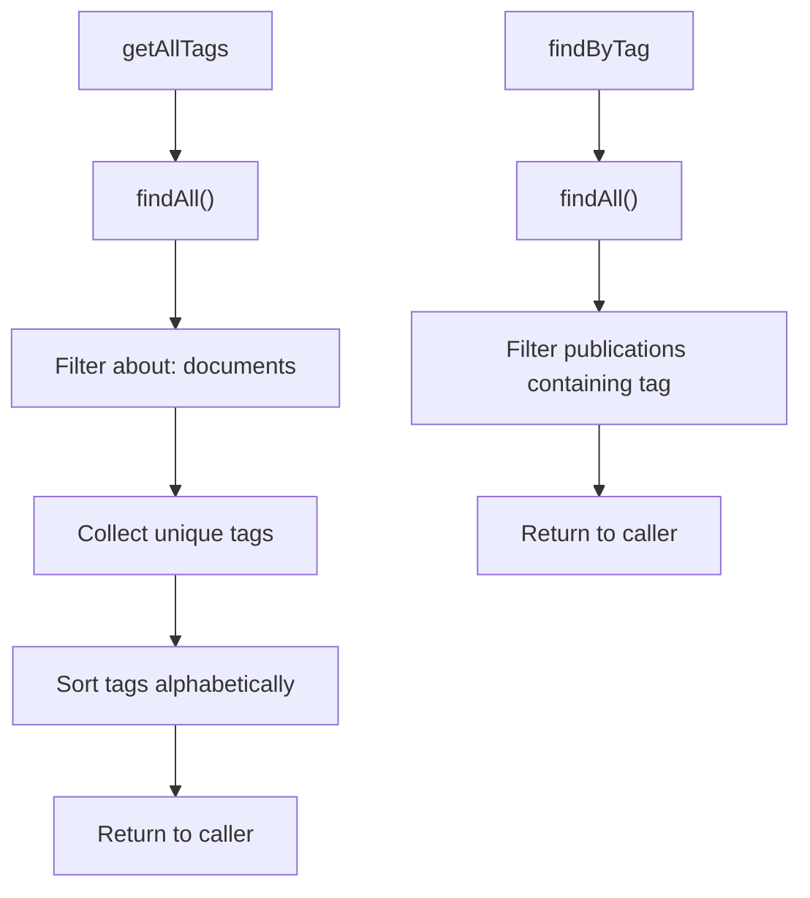

Sources: [src/main/db/repository/publication.ts L168-L174](https://github.com/edrlab/thorium-reader/blob/02b67755/src/main/db/repository/publication.ts#L168-L174)

 [src/main/db/repository/publication.ts L265-L286](https://github.com/edrlab/thorium-reader/blob/02b67755/src/main/db/repository/publication.ts#L265-L286)

## File Operations and Metadata Handling

The system performs comprehensive file operations during publication management, including hash-based duplicate detection and automatic cover extraction.

### Hash-Based Duplicate Detection

Publications are identified by CRC32 hashes of their content:

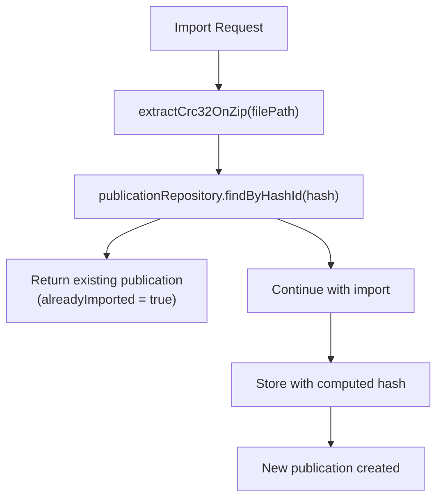

Sources: [src/main/tools/crc.ts L17-L45](https://github.com/edrlab/thorium-reader/blob/02b67755/src/main/tools/crc.ts#L17-L45)

 [src/main/redux/sagas/api/publication/import/importPublicationFromFs.ts L229](https://github.com/edrlab/thorium-reader/blob/02b67755/src/main/redux/sagas/api/publication/import/importPublicationFromFs.ts#L229-L229)

### Cover Extraction and Processing

The system automatically extracts cover images from publications:

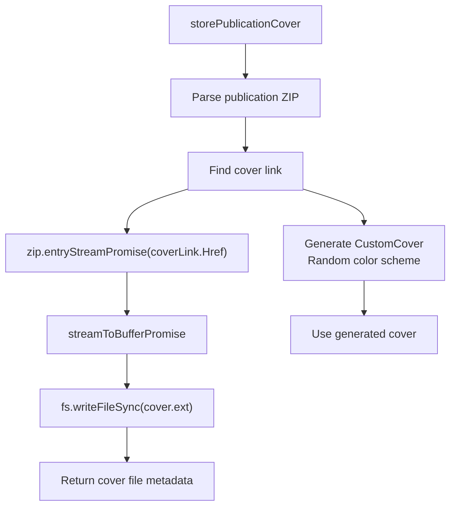

Sources: [src/main/storage/publication-storage.ts L305-L359](https://github.com/edrlab/thorium-reader/blob/02b67755/src/main/storage/publication-storage.ts#L305-L359)

 [src/main/redux/sagas/api/publication/import/importPublicationFromFs.ts L255-L262](https://github.com/edrlab/thorium-reader/blob/02b67755/src/main/redux/sagas/api/publication/import/importPublicationFromFs.ts#L255-L262)

### Publication File Path Resolution

The storage system resolves publication file paths with fallback for different extensions:

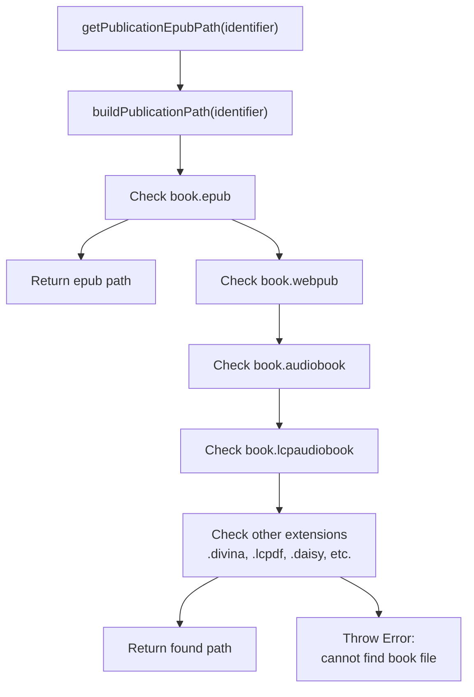

Sources: [src/main/storage/publication-storage.ts L112-L196](https://github.com/edrlab/thorium-reader/blob/02b67755/src/main/storage/publication-storage.ts#L112-L196)

## LCP Rights Management Integration

Publications with LCP protection require specialized handling throughout the management lifecycle.

### LCP Secret Management

The `LcpManager` maintains encrypted passphrase storage:

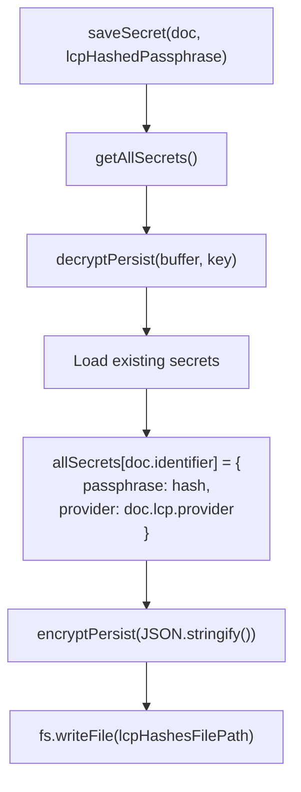

Sources: [src/main/services/lcp.ts L142-L164](https://github.com/edrlab/thorium-reader/blob/02b67755/src/main/services/lcp.ts#L142-L164)

### License Status Updates

LCP licenses are periodically updated via License Status Document (LSD) protocols:

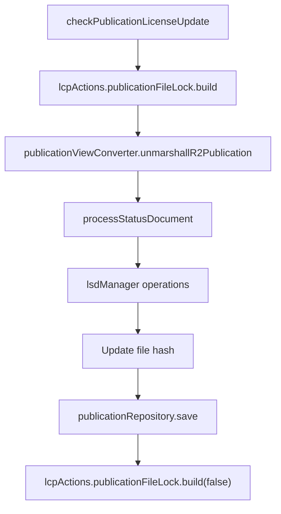

Sources: [src/main/services/lcp.ts L373-L432](https://github.com/edrlab/thorium-reader/blob/02b67755/src/main/services/lcp.ts#L373-L432)

## Summary

The Publication Management system provides a comprehensive framework for:

1. Importing publications from multiple sources
2. Storing publications in a Redux-based database
3. Providing robust search and filtering capabilities
4. Managing publication metadata and tags
5. Preventing duplicate imports

The system uses a combination of Redux for state management, Lunr.js for search, and a repository pattern for database operations.

Sources:

* [src/main/db/document/publication.ts L30-L55](https://github.com/edrlab/thorium-reader/blob/02b67755/src/main/db/document/publication.ts#L30-L55)
* [src/main/db/repository/publication.ts L35-L286](https://github.com/edrlab/thorium-reader/blob/02b67755/src/main/db/repository/publication.ts#L35-L286)
* [src/main/redux/sagas/api/publication/import/index.ts L33-L188](https://github.com/edrlab/thorium-reader/blob/02b67755/src/main/redux/sagas/api/publication/import/index.ts#L33-L188)
* [src/main/redux/sagas/api/publication/import/importFromLink.ts L24-L151](https://github.com/edrlab/thorium-reader/blob/02b67755/src/main/redux/sagas/api/publication/import/importFromLink.ts#L24-L151)