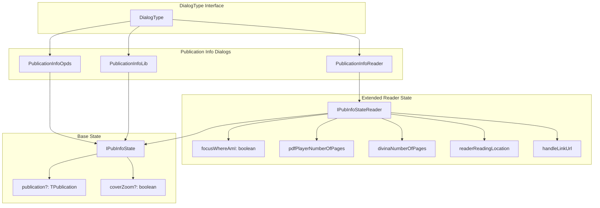
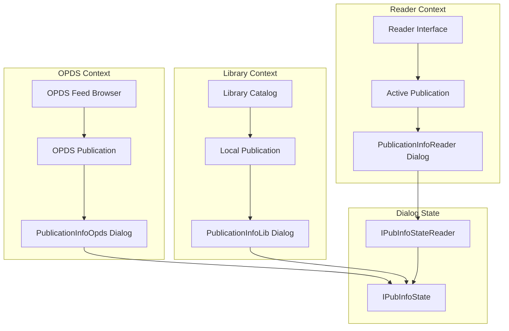
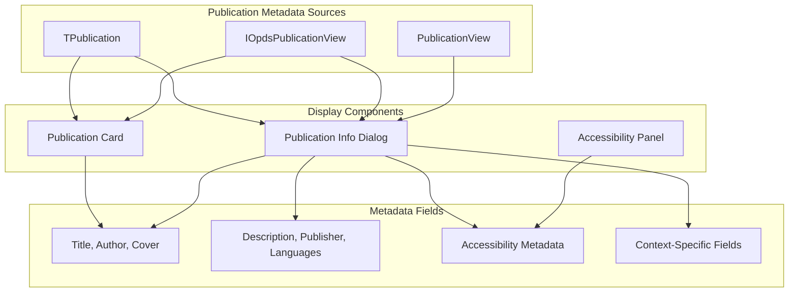
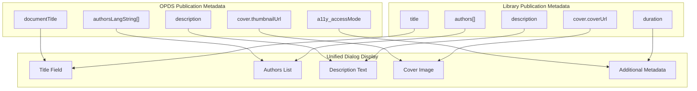
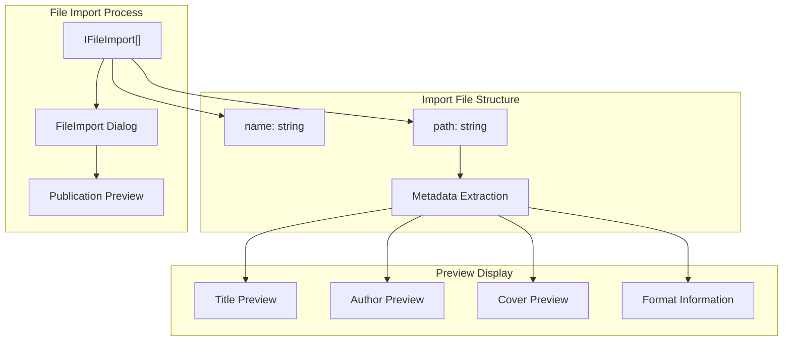
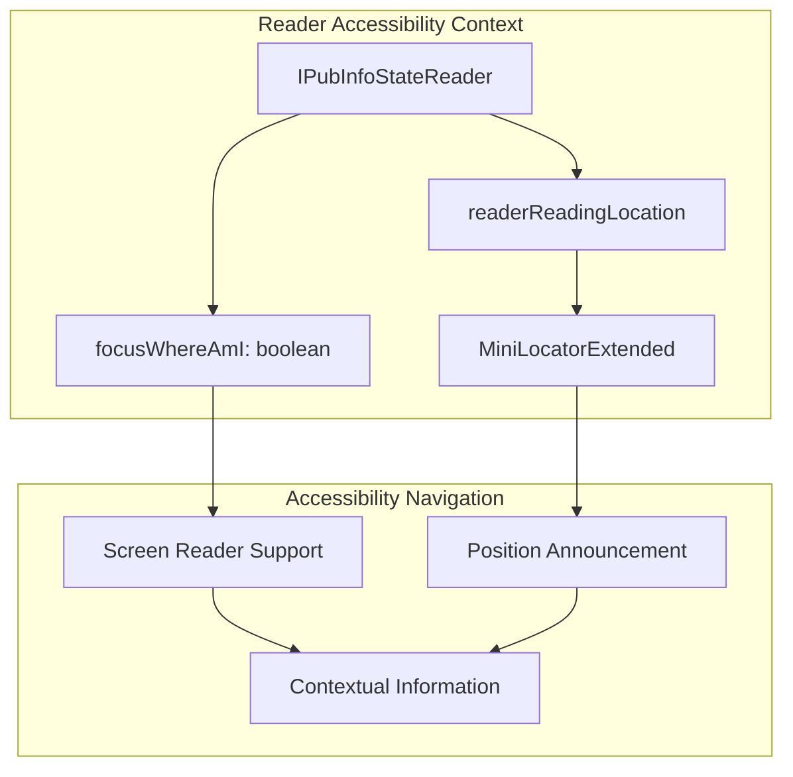
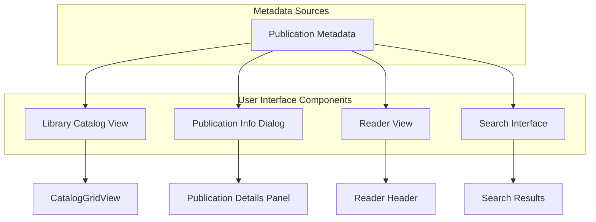

# Publication Metadata

> **Relevant source files**
> * [src/common/models/dialog.ts](https://github.com/edrlab/thorium-reader/blob/02b67755/src/common/models/dialog.ts)

## Purpose and Scope

This document describes how publication metadata is displayed in Thorium Reader through publication info dialogs, publication cards, and accessibility information presentation. The system provides three different dialog types for displaying publication metadata depending on context: OPDS feeds, library view, and reader view. Each context has different metadata requirements and display capabilities.

For information about how publications are imported and metadata is extracted, see [Publication Management](/edrlab/thorium-reader/3.2-publication-management).

## Publication Info Dialog Types

Thorium Reader defines three distinct publication info dialog types in the `DialogType` interface, each tailored for specific contexts and use cases.

### Dialog Type Hierarchy

Sources: [src/common/models/dialog.ts L15-L26](https://github.com/edrlab/thorium-reader/blob/02b67755/src/common/models/dialog.ts#L15-L26)

 [src/common/models/dialog.ts L51-L84](https://github.com/edrlab/thorium-reader/blob/02b67755/src/common/models/dialog.ts#L51-L84)

### Core Metadata Display Fields

The following table shows the metadata fields displayed in publication info dialogs:

| Metadata Field | Display Context | Description |
| --- | --- | --- |
| `publication` | All dialogs | Core publication object containing metadata |
| `coverZoom` | All dialogs | Whether cover image is displayed in zoom mode |
| `focusWhereAmI` | Reader only | Focus accessibility feature for location |
| `pdfPlayerNumberOfPages` | Reader only | Total pages for PDF publications |
| `divinaNumberOfPages` | Reader only | Total pages for visual narratives |
| `readerReadingLocation` | Reader only | Current reading position as `MiniLocatorExtended` |
| `handleLinkUrl` | Reader only | Function to handle URL navigation from metadata |

## Dialog Context and State Management

Each publication info dialog type serves a specific context within the application, with different state requirements and capabilities.

### Dialog Context Flow

Sources: [src/common/models/dialog.ts L33-L49](https://github.com/edrlab/thorium-reader/blob/02b67755/src/common/models/dialog.ts#L33-L49)

 [src/common/models/dialog.ts L57-L59](https://github.com/edrlab/thorium-reader/blob/02b67755/src/common/models/dialog.ts#L57-L59)

### Reader-Specific Metadata Features

The `PublicationInfoReader` dialog includes additional contextual information not available in library or OPDS contexts:

* **Reading Progress**: Current location via `readerReadingLocation` as `MiniLocatorExtended`
* **Format-Specific Pages**: Separate page counts for PDF (`pdfPlayerNumberOfPages`) and Divina (`divinaNumberOfPages`) publications
* **Accessibility Navigation**: `focusWhereAmI` boolean for screen reader navigation
* **Link Handling**: `handleLinkUrl` function for processing URLs within publication metadata
* **Continuous Reading**: `divinaContinousEqualTrue` flag for visual narrative reading mode

## Publication Cards vs Detailed Dialogs

Publication metadata is displayed at different levels of detail depending on the UI context. Publication cards show summary information while dialogs provide comprehensive metadata.

### Metadata Display Hierarchy

Sources: [src/common/models/dialog.ts L15-L26](https://github.com/edrlab/thorium-reader/blob/02b67755/src/common/models/dialog.ts#L15-L26)

 [src/common/views/opds.ts L29-L74](https://github.com/edrlab/thorium-reader/blob/02b67755/src/common/views/opds.ts#L29-L74)

### Card Display vs Dialog Display

| Component | Fields Shown | Purpose |
| --- | --- | --- |
| Publication Card | Title, author, cover thumbnail | Quick identification in catalog view |
| Publication Info Dialog | Full metadata, description, accessibility | Detailed information before opening |
| Reader Info Dialog | All metadata + reading context | In-reading reference and navigation |

### OPDS vs Library Publication Display

OPDS publications and library publications have different metadata structures that affect how information is displayed in dialogs:

Sources: [src/common/views/opds.ts L29-L74](https://github.com/edrlab/thorium-reader/blob/02b67755/src/common/views/opds.ts#L29-L74)

 [src/common/models/dialog.ts L57-L59](https://github.com/edrlab/thorium-reader/blob/02b67755/src/common/models/dialog.ts#L57-L59)

## File Import Dialog Integration

Publication metadata is also displayed during file import processes, where users can preview publication information before adding files to their library.

### File Import Dialog Structure

Sources: [src/common/models/dialog.ts L28-L31](https://github.com/edrlab/thorium-reader/blob/02b67755/src/common/models/dialog.ts#L28-L31)

 [src/common/models/dialog.ts L54-L56](https://github.com/edrlab/thorium-reader/blob/02b67755/src/common/models/dialog.ts#L54-L56)

## Accessibility Metadata Display

Thorium Reader provides comprehensive accessibility metadata display in publication info dialogs, supporting both modern and legacy accessibility metadata structures.

### Accessibility Fields in OPDS Publications

The accessibility metadata fields are prefixed with `a11y_` in the `IOpdsPublicationView` interface:

| Field | Description | Display Context |
| --- | --- | --- |
| `a11y_accessMode` | Primary content perception modes | All dialog types |
| `a11y_accessibilityFeature` | Accessibility enhancement features | All dialog types |
| `a11y_accessibilityHazard` | Potential accessibility hazards | All dialog types |
| `a11y_accessModeSufficient` | Sufficient access mode combinations | All dialog types |
| `a11y_accessibilitySummary` | Human-readable accessibility description | All dialog types |
| `a11y_certifiedBy` | Certification organization | OPDS dialogs only |
| `a11y_certifierCredential` | Certifier credentials | OPDS dialogs only |
| `a11y_certifierReport` | Link to certification report | OPDS dialogs only |
| `a11y_conformsTo` | Standards compliance statement | OPDS dialogs only |

### Reader-Specific Accessibility Features

The `PublicationInfoReader` dialog includes additional accessibility context through the `focusWhereAmI` field, which enables screen reader users to quickly understand their current location within the publication structure.

Sources: [src/common/models/dialog.ts L19-L26](https://github.com/edrlab/thorium-reader/blob/02b67755/src/common/models/dialog.ts#L19-L26)

 [src/common/views/opds.ts L63-L74](https://github.com/edrlab/thorium-reader/blob/02b67755/src/common/views/opds.ts#L63-L74)

## Metadata Integration with User Interface

Metadata is displayed in various parts of the Thorium Reader interface:

Sources:
[src/renderer/library/components/catalog/Catalog.tsx L63-L77](https://github.com/edrlab/thorium-reader/blob/02b67755/src/renderer/library/components/catalog/Catalog.tsx#L63-L77)

[src/renderer/library/components/opds/Browser.tsx](https://github.com/edrlab/thorium-reader/blob/02b67755/src/renderer/library/components/opds/Browser.tsx)

## Conclusion

Publication metadata is a core component of Thorium Reader, powering much of the user experience. The metadata is extracted during publication import, converted to standardized internal formats, and used for display, search, and accessibility features. The flexible metadata handling allows Thorium to work with both EPUB publications and OPDS catalogs while maintaining a consistent user experience.