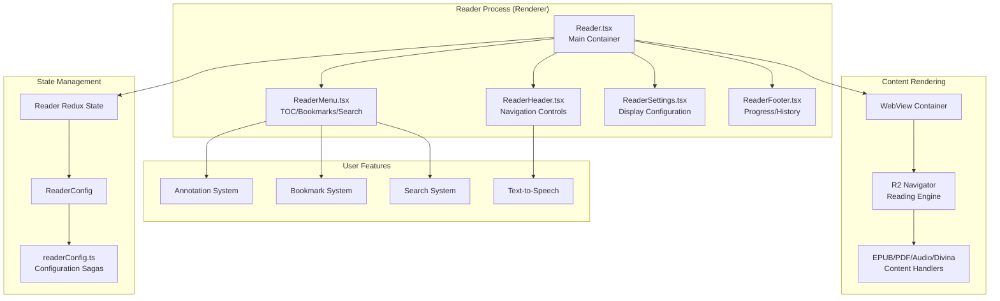
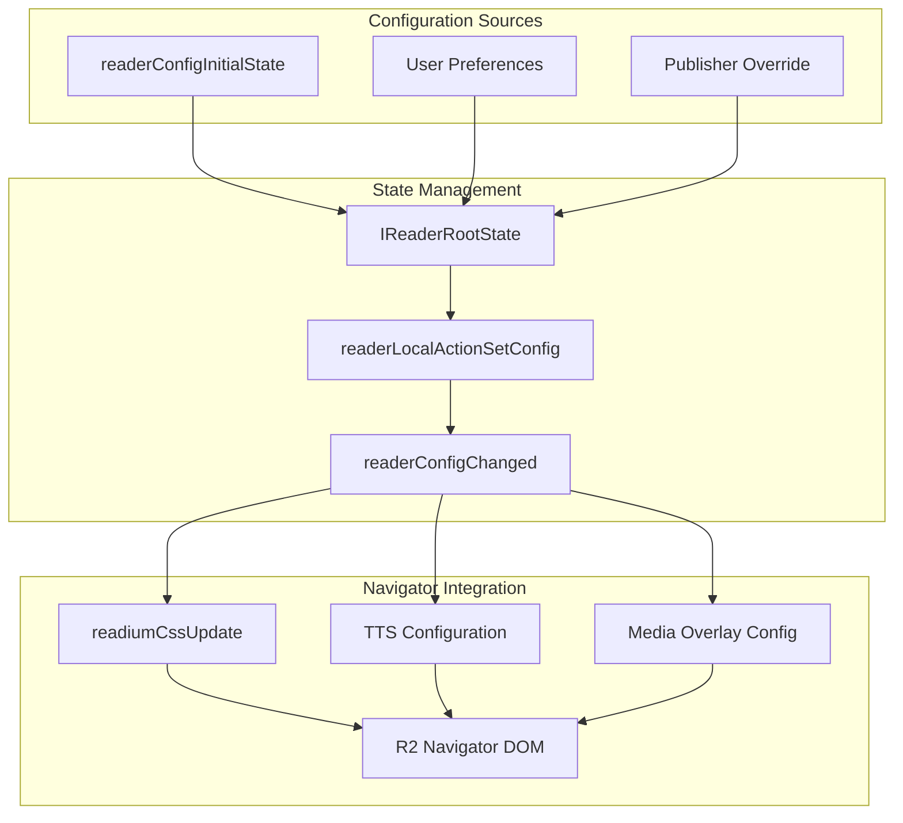
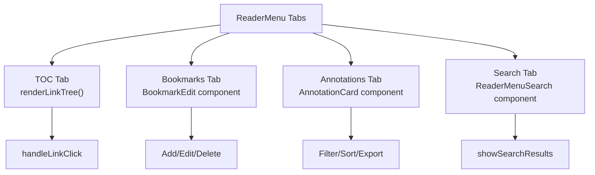
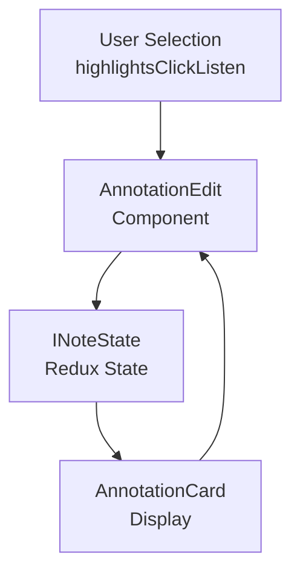

# Reader System

> **Relevant source files**
> * [src/common/models/reader.ts](https://github.com/edrlab/thorium-reader/blob/02b67755/src/common/models/reader.ts)
> * [src/common/redux/states/reader.ts](https://github.com/edrlab/thorium-reader/blob/02b67755/src/common/redux/states/reader.ts)
> * [src/renderer/assets/styles/components/annotations.scss](https://github.com/edrlab/thorium-reader/blob/02b67755/src/renderer/assets/styles/components/annotations.scss)
> * [src/renderer/assets/styles/components/popoverDialog.scss](https://github.com/edrlab/thorium-reader/blob/02b67755/src/renderer/assets/styles/components/popoverDialog.scss)
> * [src/renderer/reader/components/Reader.tsx](https://github.com/edrlab/thorium-reader/blob/02b67755/src/renderer/reader/components/Reader.tsx)
> * [src/renderer/reader/components/ReaderFooter.tsx](https://github.com/edrlab/thorium-reader/blob/02b67755/src/renderer/reader/components/ReaderFooter.tsx)
> * [src/renderer/reader/components/ReaderHeader.tsx](https://github.com/edrlab/thorium-reader/blob/02b67755/src/renderer/reader/components/ReaderHeader.tsx)
> * [src/renderer/reader/components/ReaderMenu.tsx](https://github.com/edrlab/thorium-reader/blob/02b67755/src/renderer/reader/components/ReaderMenu.tsx)
> * [src/renderer/reader/components/ReaderSettings.tsx](https://github.com/edrlab/thorium-reader/blob/02b67755/src/renderer/reader/components/ReaderSettings.tsx)
> * [src/renderer/reader/components/header/voiceSelection.tsx](https://github.com/edrlab/thorium-reader/blob/02b67755/src/renderer/reader/components/header/voiceSelection.tsx)
> * [src/renderer/reader/components/options-values.ts](https://github.com/edrlab/thorium-reader/blob/02b67755/src/renderer/reader/components/options-values.ts)
> * [src/renderer/reader/redux/sagas/readerConfig.ts](https://github.com/edrlab/thorium-reader/blob/02b67755/src/renderer/reader/redux/sagas/readerConfig.ts)
> * [src/typings/react.d.ts](https://github.com/edrlab/thorium-reader/blob/02b67755/src/typings/react.d.ts)

## Purpose and Scope

The Reader System is responsible for providing the core reading experience in Thorium Reader. It manages the display and interaction with publications including EPUB, PDF, audiobooks, and Divina (comic/manga) formats. This system handles the reading interface, navigation controls, settings management, annotations, bookmarks, search functionality, and accessibility features like text-to-speech.

For information about publication management and library functionality, see [Library System](/edrlab/thorium-reader/3-library-system). For content processing and streaming, see the relevant sections in [Overview](/edrlab/thorium-reader/1-overview).

## Architecture Overview

The Reader System follows an Electron multi-process architecture with React components managing the user interface and Redux handling state management.

### Reader System Component Architecture



Sources: [src/renderer/reader/components/Reader.tsx L1-L2500](https://github.com/edrlab/thorium-reader/blob/02b67755/src/renderer/reader/components/Reader.tsx#L1-L2500)

 [src/renderer/reader/components/ReaderHeader.tsx L1-L200](https://github.com/edrlab/thorium-reader/blob/02b67755/src/renderer/reader/components/ReaderHeader.tsx#L1-L200)

 [src/renderer/reader/components/ReaderMenu.tsx L1-L200](https://github.com/edrlab/thorium-reader/blob/02b67755/src/renderer/reader/components/ReaderMenu.tsx#L1-L200)

 [src/renderer/reader/components/ReaderSettings.tsx L1-L200](https://github.com/edrlab/thorium-reader/blob/02b67755/src/renderer/reader/components/ReaderSettings.tsx#L1-L200)

 [src/renderer/reader/redux/sagas/readerConfig.ts L1-L249](https://github.com/edrlab/thorium-reader/blob/02b67755/src/renderer/reader/redux/sagas/readerConfig.ts#L1-L249)

### Reader State and Configuration Flow



Sources: [src/common/redux/states/reader.ts L43-L92](https://github.com/edrlab/thorium-reader/blob/02b67755/src/common/redux/states/reader.ts#L43-L92)

 [src/renderer/reader/redux/sagas/readerConfig.ts L29-L207](https://github.com/edrlab/thorium-reader/blob/02b67755/src/renderer/reader/redux/sagas/readerConfig.ts#L29-L207)

 [src/common/models/reader.ts L124-L133](https://github.com/edrlab/thorium-reader/blob/02b67755/src/common/models/reader.ts#L124-L133)

## Core Components

### Reader Component (Reader.tsx)

The `Reader` component serves as the main container and orchestrator for the reading experience. It manages:

| Responsibility | Implementation |
| --- | --- |
| Publication Loading | `loadPublicationIntoViewport()` method |
| Window Lifecycle | Component mount/unmount handlers |
| Keyboard Shortcuts | Event listener registration/unregistration |
| Content Navigation | History management and location tracking |
| Content Types | Support for EPUB, PDF, audiobooks, and Divina |

Key state properties managed:

* `currentLocation: MiniLocatorExtended` - Current reading position
* `fullscreen: boolean` - Fullscreen mode state
* `zenMode: boolean` - Distraction-free reading mode
* `contentTableOpen: boolean` - Navigation panel visibility

Sources: [src/renderer/reader/components/Reader.tsx L223-L365](https://github.com/edrlab/thorium-reader/blob/02b67755/src/renderer/reader/components/Reader.tsx#L223-L365)

 [src/renderer/reader/components/Reader.tsx L433-L665](https://github.com/edrlab/thorium-reader/blob/02b67755/src/renderer/reader/components/Reader.tsx#L433-L665)

### ReaderHeader Component (ReaderHeader.tsx)

Provides the top navigation bar with reading controls:

| Feature | Code Reference |
| --- | --- |
| Back to Library | `handleReaderClose` handler |
| Publication Info | `PublicationInfoReaderWithRadix` integration |
| TTS Controls | `handleTTS*` methods for text-to-speech |
| Media Overlay Controls | `handleMediaOverlays*` methods |
| Voice Selection | `VoiceSelection` component integration |

The header dynamically shows different controls based on content type (`isDivina`, `isPdf`, `isAudiobook` flags).

Sources: [src/renderer/reader/components/ReaderHeader.tsx L200-L330](https://github.com/edrlab/thorium-reader/blob/02b67755/src/renderer/reader/components/ReaderHeader.tsx#L200-L330)

 [src/renderer/reader/components/ReaderHeader.tsx L509-L700](https://github.com/edrlab/thorium-reader/blob/02b67755/src/renderer/reader/components/ReaderHeader.tsx#L509-L700)

### ReaderMenu Component (ReaderMenu.tsx)

Manages the side navigation panel with multiple tabs:



Sources: [src/renderer/reader/components/ReaderMenu.tsx L158-L212](https://github.com/edrlab/thorium-reader/blob/02b67755/src/renderer/reader/components/ReaderMenu.tsx#L158-L212)

 [src/renderer/reader/components/ReaderMenu.tsx L454-L533](https://github.com/edrlab/thorium-reader/blob/02b67755/src/renderer/reader/components/ReaderMenu.tsx#L454-L533)

### ReaderSettings Component (ReaderSettings.tsx)

Provides reading customization through tabbed interface:

| Tab | Configuration Options |
| --- | --- |
| Display | `Theme`, `FontFamily`, `FontSize` components |
| Text | Publisher font overrides, custom fonts |
| Spacing | Margins, line height, letter/word spacing |
| Audio | TTS and media overlay settings |

Configuration is managed through hooks:

* `useReaderConfig()` - Access current settings
* `useSaveReaderConfig()` - Persist setting changes
* `useSaveReaderConfigDebounced()` - Debounced updates

Sources: [src/renderer/reader/components/ReaderSettings.tsx L123-L231](https://github.com/edrlab/thorium-reader/blob/02b67755/src/renderer/reader/components/ReaderSettings.tsx#L123-L231)

 [src/renderer/reader/components/ReaderSettings.tsx L295-L406](https://github.com/edrlab/thorium-reader/blob/02b67755/src/renderer/reader/components/ReaderSettings.tsx#L295-L406)

## State Management

### Redux State Structure

The reader state is organized in `IReaderRootState`:

```
interface IReaderRootState {  reader: {    config: ReaderConfig;           // Display and behavior settings    info: ReaderInfo;               // Publication metadata    locator: MiniLocatorExtended;   // Current reading position    tts: TTSStateEnum;              // Text-to-speech status    mediaOverlay: MediaOverlayState; // Audio overlay status    highlight: HighlightState;       // Annotations state  };  // ... other state slices}
```

### Configuration Management

Reader configuration flows through several layers:

1. **Initial State**: `readerConfigInitialState` provides defaults
2. **Publisher Overrides**: `ReaderConfigPublisher` allows content-specific settings
3. **User Preferences**: Persisted through Redux state
4. **Runtime Updates**: Via `readerLocalActionSetConfig` actions

The `readerConfigChanged` saga processes configuration updates and applies them to the reading engine through calls to `readiumCssUpdate()`, `ttsHighlightStyle()`, and other R2 Navigator functions.

Sources: [src/common/redux/states/reader.ts L20-L42](https://github.com/edrlab/thorium-reader/blob/02b67755/src/common/redux/states/reader.ts#L20-L42)

 [src/renderer/reader/redux/sagas/readerConfig.ts L29-L70](https://github.com/edrlab/thorium-reader/blob/02b67755/src/renderer/reader/redux/sagas/readerConfig.ts#L29-L70)

 [src/common/models/reader.ts L52-L73](https://github.com/edrlab/thorium-reader/blob/02b67755/src/common/models/reader.ts#L52-L73)

## User Interaction Features

### Annotations System

Annotations are managed through a comprehensive state system:



Key annotation features:

* Multiple draw types: `solid_background`, `underline`, `outline`, `strikethrough`
* Color customization through `IColor` interface
* Tagging and filtering capabilities
* Export functionality via `exportAnnotationSet()`

Sources: [src/renderer/reader/components/ReaderMenu.tsx L454-L516](https://github.com/edrlab/thorium-reader/blob/02b67755/src/renderer/reader/components/ReaderMenu.tsx#L454-L516)

 [src/renderer/assets/styles/components/annotations.scss L267-L446](https://github.com/edrlab/thorium-reader/blob/02b67755/src/renderer/assets/styles/components/annotations.scss#L267-L446)

### Search Functionality

In-publication search is handled by `ReaderMenuSearch` component integrated with the R2 Navigator search API. Search results are displayed with context and allow navigation to specific locations within the publication.

### Text-to-Speech Integration

TTS functionality integrates with the `readium-speech` library and browser `SpeechSynthesisVoice` API:

* Voice selection through `VoiceSelection` component
* Playback rate control
* Sentence-level highlighting during playback
* Integration with media overlays for synchronized audio

Sources: [src/renderer/reader/components/header/voiceSelection.tsx L41-L139](https://github.com/edrlab/thorium-reader/blob/02b67755/src/renderer/reader/components/header/voiceSelection.tsx#L41-L139)

 [src/renderer/reader/components/ReaderHeader.tsx L428-L440](https://github.com/edrlab/thorium-reader/blob/02b67755/src/renderer/reader/components/ReaderHeader.tsx#L428-L440)

### Keyboard Navigation

The Reader system provides extensive keyboard shortcuts managed through:

* `registerAllKeyboardListeners()` - Setup keyboard event handlers
* `keyboardShortcutsMatch()` - Shortcut comparison and updates
* Individual handler methods like `onKeyboardPageNavigationNext()`

Sources: [src/renderer/reader/components/Reader.tsx L505-L506](https://github.com/edrlab/thorium-reader/blob/02b67755/src/renderer/reader/components/Reader.tsx#L505-L506)

 [src/renderer/reader/components/Reader.tsx L669-L672](https://github.com/edrlab/thorium-reader/blob/02b67755/src/renderer/reader/components/Reader.tsx#L669-L672)