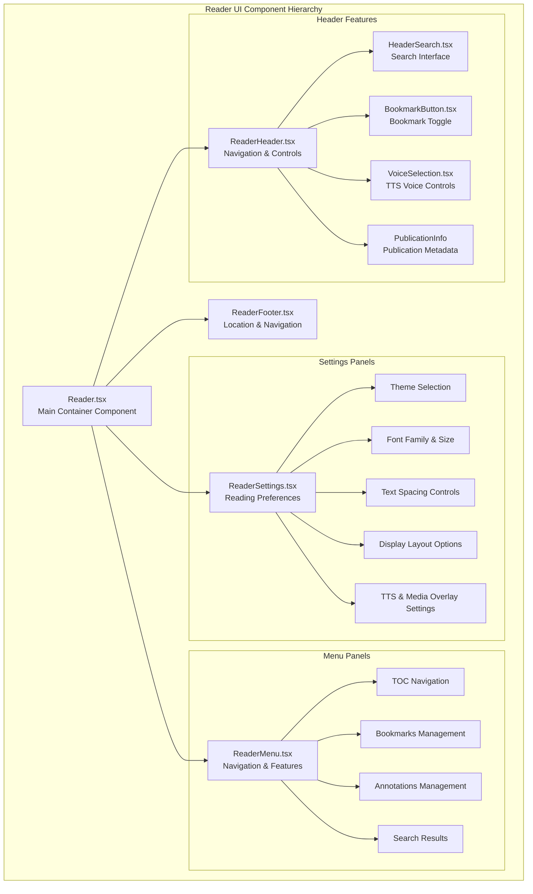
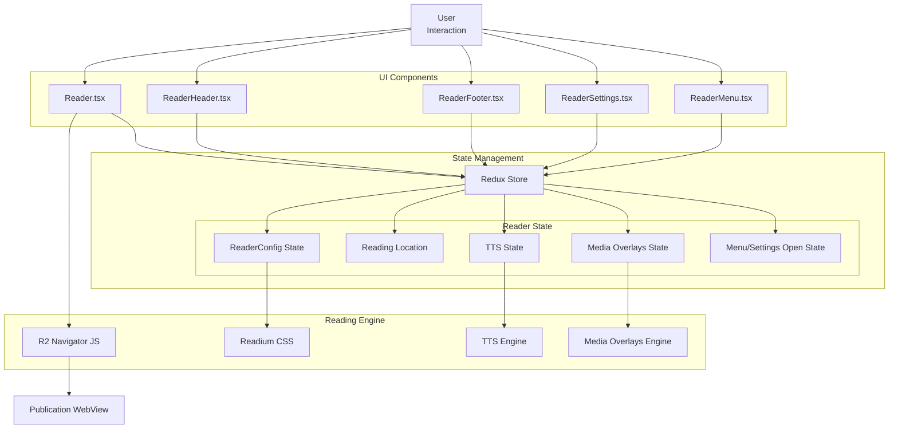
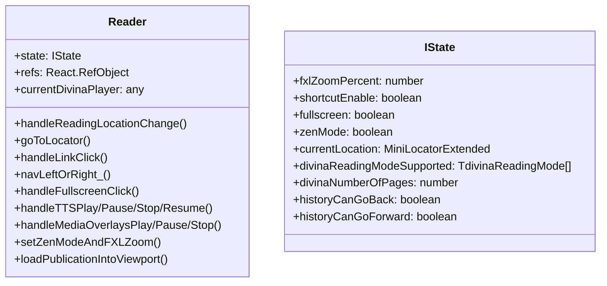
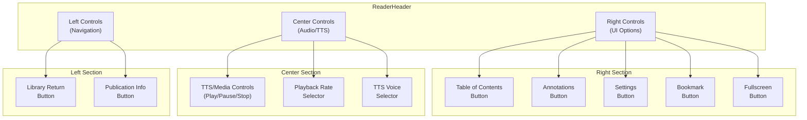
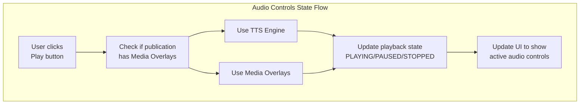
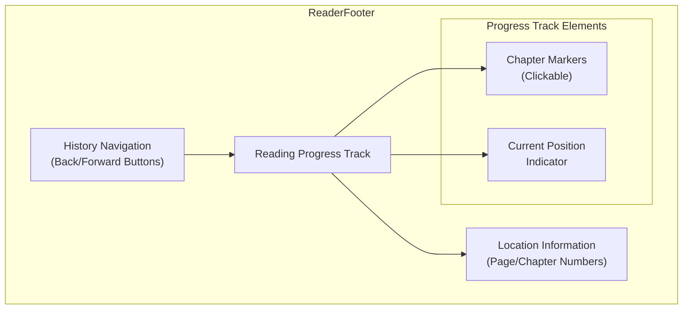
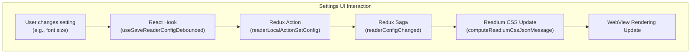
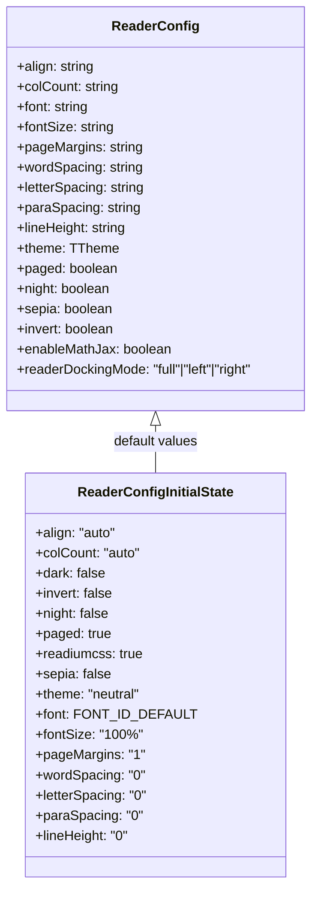

# Reader UI Components

> **Relevant source files**
> * [src/common/models/reader.ts](https://github.com/edrlab/thorium-reader/blob/02b67755/src/common/models/reader.ts)
> * [src/common/redux/states/reader.ts](https://github.com/edrlab/thorium-reader/blob/02b67755/src/common/redux/states/reader.ts)
> * [src/renderer/assets/styles/components/annotations.scss](https://github.com/edrlab/thorium-reader/blob/02b67755/src/renderer/assets/styles/components/annotations.scss)
> * [src/renderer/assets/styles/components/popoverDialog.scss](https://github.com/edrlab/thorium-reader/blob/02b67755/src/renderer/assets/styles/components/popoverDialog.scss)
> * [src/renderer/reader/components/Reader.tsx](https://github.com/edrlab/thorium-reader/blob/02b67755/src/renderer/reader/components/Reader.tsx)
> * [src/renderer/reader/components/ReaderFooter.tsx](https://github.com/edrlab/thorium-reader/blob/02b67755/src/renderer/reader/components/ReaderFooter.tsx)
> * [src/renderer/reader/components/ReaderHeader.tsx](https://github.com/edrlab/thorium-reader/blob/02b67755/src/renderer/reader/components/ReaderHeader.tsx)
> * [src/renderer/reader/components/ReaderMenu.tsx](https://github.com/edrlab/thorium-reader/blob/02b67755/src/renderer/reader/components/ReaderMenu.tsx)
> * [src/renderer/reader/components/ReaderSettings.tsx](https://github.com/edrlab/thorium-reader/blob/02b67755/src/renderer/reader/components/ReaderSettings.tsx)
> * [src/renderer/reader/components/header/voiceSelection.tsx](https://github.com/edrlab/thorium-reader/blob/02b67755/src/renderer/reader/components/header/voiceSelection.tsx)
> * [src/renderer/reader/components/options-values.ts](https://github.com/edrlab/thorium-reader/blob/02b67755/src/renderer/reader/components/options-values.ts)
> * [src/renderer/reader/redux/sagas/readerConfig.ts](https://github.com/edrlab/thorium-reader/blob/02b67755/src/renderer/reader/redux/sagas/readerConfig.ts)
> * [src/typings/react.d.ts](https://github.com/edrlab/thorium-reader/blob/02b67755/src/typings/react.d.ts)

This document describes the UI components used in the reading view of Thorium Reader. These components manage the display of publications, provide navigation controls, reading settings, and access to features like annotations and bookmarks. This page focuses specifically on the UI components and their interactions, not the underlying publication rendering engine.

For information about reader window management, see [Reader Window Management](/edrlab/thorium-reader/2.2-reader-window-management). For annotation functionality, see [Annotations and Bookmarks](/edrlab/thorium-reader/2.3-annotations-and-bookmarks).

## Reader Component Architecture

The reading interface is composed of multiple React components that work together to provide the complete reading experience.

Sources: [src/renderer/reader/components/Reader.tsx L48-L51](https://github.com/edrlab/thorium-reader/blob/02b67755/src/renderer/reader/components/Reader.tsx#L48-L51)

 [src/renderer/reader/components/ReaderSettings.tsx L89-L115](https://github.com/edrlab/thorium-reader/blob/02b67755/src/renderer/reader/components/ReaderSettings.tsx#L89-L115)

## Component Data Flow

The components communicate with each other through Redux state and props passing:

Sources: [src/renderer/reader/components/Reader.tsx L25-L30](https://github.com/edrlab/thorium-reader/blob/02b67755/src/renderer/reader/components/Reader.tsx#L25-L30)

 [src/renderer/reader/redux/sagas/readerConfig.ts L29-L207](https://github.com/edrlab/thorium-reader/blob/02b67755/src/renderer/reader/redux/sagas/readerConfig.ts#L29-L207)

## Main Reader Component (Reader.tsx)

The `Reader.tsx` component is the main container that orchestrates the entire reading interface. It maintains the overall reader state and integrates all subcomponents.

Key responsibilities:

* Rendering the publication content (through R2 Navigator)
* Handling keyboard shortcuts and navigation
* Managing reading location tracking
* Controlling UI modes (fullscreen, zen mode)
* Coordinating TTS and media overlay playback

The Reader component renders a main area with publication content and conditionally renders the header, footer, settings panel, and navigation menu components.

Sources: [src/renderer/reader/components/Reader.tsx L255-L413](https://github.com/edrlab/thorium-reader/blob/02b67755/src/renderer/reader/components/Reader.tsx#L255-L413)

 [src/renderer/reader/components/Reader.tsx L421-L596](https://github.com/edrlab/thorium-reader/blob/02b67755/src/renderer/reader/components/Reader.tsx#L421-L596)

 [src/renderer/reader/components/Reader.tsx L789-L805](https://github.com/edrlab/thorium-reader/blob/02b67755/src/renderer/reader/components/Reader.tsx#L789-L805)

## Header Component (ReaderHeader.tsx)

The `ReaderHeader.tsx` component provides the top navigation bar with controls for reader functions.

### Structure and Layout

The header component adapts based on the publication type (EPUB, PDF, audiobook, Divina) and shows different controls accordingly.

Sources: [src/renderer/reader/components/ReaderHeader.tsx L175-L241](https://github.com/edrlab/thorium-reader/blob/02b67755/src/renderer/reader/components/ReaderHeader.tsx#L175-L241)

 [src/renderer/reader/components/ReaderHeader.tsx L394-L537](https://github.com/edrlab/thorium-reader/blob/02b67755/src/renderer/reader/components/ReaderHeader.tsx#L394-L537)

### Audio and TTS Controls

The header contains specialized controls for Text-to-Speech and Media Overlays:

* Audio buttons (play, pause, stop, previous, next)
* Playback rate selection
* Voice selection interface with language filtering
* Audio/TTS state indication through CSS

Sources: [src/renderer/reader/components/ReaderHeader.tsx L563-L602](https://github.com/edrlab/thorium-reader/blob/02b67755/src/renderer/reader/components/ReaderHeader.tsx#L563-L602)

 [src/renderer/reader/components/header/voiceSelection.tsx L31-L124](https://github.com/edrlab/thorium-reader/blob/02b67755/src/renderer/reader/components/header/voiceSelection.tsx#L31-L124)

## Footer Component (ReaderFooter.tsx)

The `ReaderFooter.tsx` component displays the reading progress and provides navigation controls.

Key features:

* History navigation buttons (back/forward)
* Reading progress track with chapter markers
* Current location indicator
* Location information (page numbers, percentages)

The footer adapts to different publication types:

* EPUB: Shows spine items as markers
* PDF: Shows page numbers
* Divina: Shows page positions based on Divina format

Sources: [src/renderer/reader/components/ReaderFooter.tsx L115-L140](https://github.com/edrlab/thorium-reader/blob/02b67755/src/renderer/reader/components/ReaderFooter.tsx#L115-L140)

 [src/renderer/reader/components/ReaderFooter.tsx L189-L398](https://github.com/edrlab/thorium-reader/blob/02b67755/src/renderer/reader/components/ReaderFooter.tsx#L189-L398)

## Settings Component (ReaderSettings.tsx)

The `ReaderSettings.tsx` component provides a comprehensive interface for customizing the reading experience.

### Settings Structure

```mermaid
flowchart TD

DisplayTab["Display Tab<br>(Theme & Layout)"]
TextTab["Text Tab<br>(Font & Size)"]
SpacingTab["Spacing Tab<br>(Margins & Spacing)"]
AudioTab["Audio Tab<br>(TTS & Media)"]
PDFTab["PDF Tab<br>(PDF-specific)"]
DivinaTab["Divina Tab<br>(Divina-specific)"]
ThemeOptions["Theme Options<br>(Neutral/Sepia/Night/Contrast)"]
PagedScrolled["Paged/Scrolled Mode"]
ColumnCount["Column Count"]
TextAlignment["Text Alignment"]
FontFamily["Font Family Selection"]
FontSize["Font Size Slider"]
Margins["Page Margins"]
WordSpacing["Word Spacing"]
LetterSpacing["Letter Spacing"]
ParaSpacing["Paragraph Spacing"]
LineHeight["Line Height"]

DisplayTab --> ThemeOptions
DisplayTab --> PagedScrolled
DisplayTab --> ColumnCount
DisplayTab --> TextAlignment
TextTab --> FontFamily
TextTab --> FontSize
SpacingTab --> Margins
SpacingTab --> WordSpacing
SpacingTab --> LetterSpacing
SpacingTab --> ParaSpacing
SpacingTab --> LineHeight

subgraph subGraph3 ["Spacing Settings (SpacingTab)"]
    Margins
    WordSpacing
    LetterSpacing
    ParaSpacing
    LineHeight
end

subgraph subGraph2 ["Text Settings (TextTab)"]
    FontFamily
    FontSize
end

subgraph subGraph1 ["Theme Settings (DisplayTab)"]
    ThemeOptions
    PagedScrolled
    ColumnCount
    TextAlignment
end

subgraph subGraph0 ["ReaderSettings Tabs"]
    DisplayTab
    TextTab
    SpacingTab
    AudioTab
    PDFTab
    DivinaTab
end
```

Sources: [src/renderer/reader/components/ReaderSettings.tsx L89-L115](https://github.com/edrlab/thorium-reader/blob/02b67755/src/renderer/reader/components/ReaderSettings.tsx#L89-L115)

 [src/renderer/reader/components/ReaderSettings.tsx L192-L232](https://github.com/edrlab/thorium-reader/blob/02b67755/src/renderer/reader/components/ReaderSettings.tsx#L192-L232)

 [src/renderer/reader/components/ReaderSettings.tsx L234-L293](https://github.com/edrlab/thorium-reader/blob/02b67755/src/renderer/reader/components/ReaderSettings.tsx#L234-L293)

 [src/renderer/reader/components/ReaderSettings.tsx L489-L547](https://github.com/edrlab/thorium-reader/blob/02b67755/src/renderer/reader/components/ReaderSettings.tsx#L489-L547)

### Settings State Management

The settings component uses React hooks to interact with the Redux store:

* `useReaderConfig`: Retrieves values from the reader configuration
* `useSaveReaderConfigDebounced`: Saves changes to the reader configuration with debouncing
* `usePublisherReaderConfig`: Gets publisher-specific settings
* `useSavePublisherReaderConfig`: Saves publisher-specific settings

Changes to settings trigger Redux actions that update the state and apply the changes through the reading engine.

Sources: [src/renderer/reader/redux/sagas/readerConfig.ts L29-L207](https://github.com/edrlab/thorium-reader/blob/02b67755/src/renderer/reader/redux/sagas/readerConfig.ts#L29-L207)

 [src/common/redux/states/reader.ts L14-L92](https://github.com/edrlab/thorium-reader/blob/02b67755/src/common/redux/states/reader.ts#L14-L92)

## Configuration Models

The reader settings are controlled through several configuration models:

Sources: [src/common/models/reader.ts L124-L133](https://github.com/edrlab/thorium-reader/blob/02b67755/src/common/models/reader.ts#L124-L133)

 [src/common/redux/states/reader.ts L42-L92](https://github.com/edrlab/thorium-reader/blob/02b67755/src/common/redux/states/reader.ts#L42-L92)

## Reader UI Adaptability

The reader UI adapts to different publication types and reading modes:

1. **Publication Type Adaptation** * EPUB: Full set of controls and settings * PDF: PDF-specific zoom and layout controls * Audiobook: Audio controls focused * Divina: Special Divina navigation and display modes
2. **Reading Mode Adaptation** * Fixed layout vs. reflowable layout * Right-to-left vs. left-to-right reading * Paginated vs. scrolled view * Single column vs. multi-column layout
3. **Device Adaptation** * Responsive design for different screen sizes * Fullscreen and zen reading modes * Keyboard shortcut support
4. **Accessibility Features** * Text-to-speech capabilities * Media overlay support * Theme options for different contrast needs * Screen reader compatibility

Sources: [src/renderer/reader/components/Reader.tsx L739-L765](https://github.com/edrlab/thorium-reader/blob/02b67755/src/renderer/reader/components/Reader.tsx#L739-L765)

 [src/renderer/reader/components/ReaderSettings.tsx L569-L625](https://github.com/edrlab/thorium-reader/blob/02b67755/src/renderer/reader/components/ReaderSettings.tsx#L569-L625)

## Component Integration Points

The reader UI components interact with several other systems:

1. **Navigation System** * History navigation (back/forward) * TOC navigation * Page navigation * Link handling
2. **Reading Engine (R2 Navigator)** * Content rendering * CSS styling application * Reading location tracking * Media playback
3. **State Management (Redux)** * Reader configuration state * UI state (open/closed panels) * Location state * Media state
4. **Internationalization** * UI translations via translator service

These integration points allow the UI components to provide a cohesive reading experience while maintaining separation of concerns.

Sources: [src/renderer/reader/components/Reader.tsx L130-L185](https://github.com/edrlab/thorium-reader/blob/02b67755/src/renderer/reader/components/Reader.tsx#L130-L185)

 [src/renderer/reader/redux/sagas/readerConfig.ts L182-L207](https://github.com/edrlab/thorium-reader/blob/02b67755/src/renderer/reader/redux/sagas/readerConfig.ts#L182-L207)

## Summary

The Reader UI components in Thorium Reader form a comprehensive system for displaying and interacting with digital publications. The components are organized into a hierarchy with the main Reader component orchestrating subcomponents for the header, footer, settings, and navigation. The UI is highly adaptable to different publication types and reading preferences, providing extensive customization options through the settings interface. State management through Redux ensures consistent behavior across components and persistent settings between reading sessions.

Sources: [src/renderer/reader/components/Reader.tsx](https://github.com/edrlab/thorium-reader/blob/02b67755/src/renderer/reader/components/Reader.tsx)

 [src/renderer/reader/components/ReaderHeader.tsx](https://github.com/edrlab/thorium-reader/blob/02b67755/src/renderer/reader/components/ReaderHeader.tsx)

 [src/renderer/reader/components/ReaderFooter.tsx](https://github.com/edrlab/thorium-reader/blob/02b67755/src/renderer/reader/components/ReaderFooter.tsx)

 [src/renderer/reader/components/ReaderSettings.tsx](https://github.com/edrlab/thorium-reader/blob/02b67755/src/renderer/reader/components/ReaderSettings.tsx)