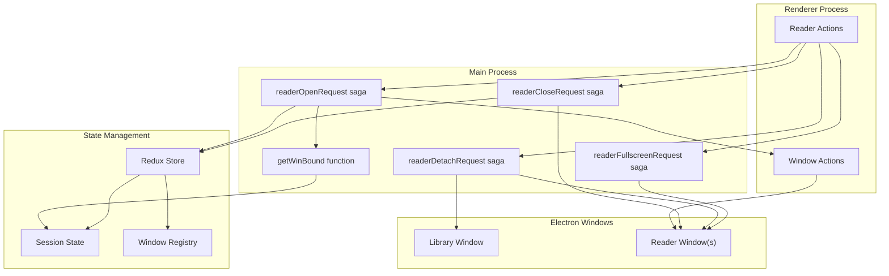
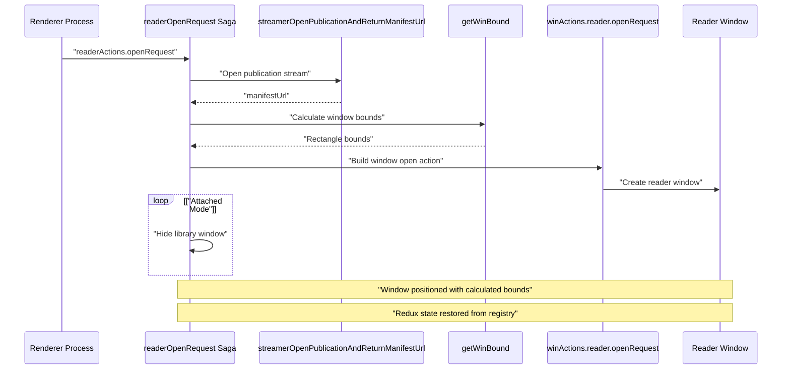
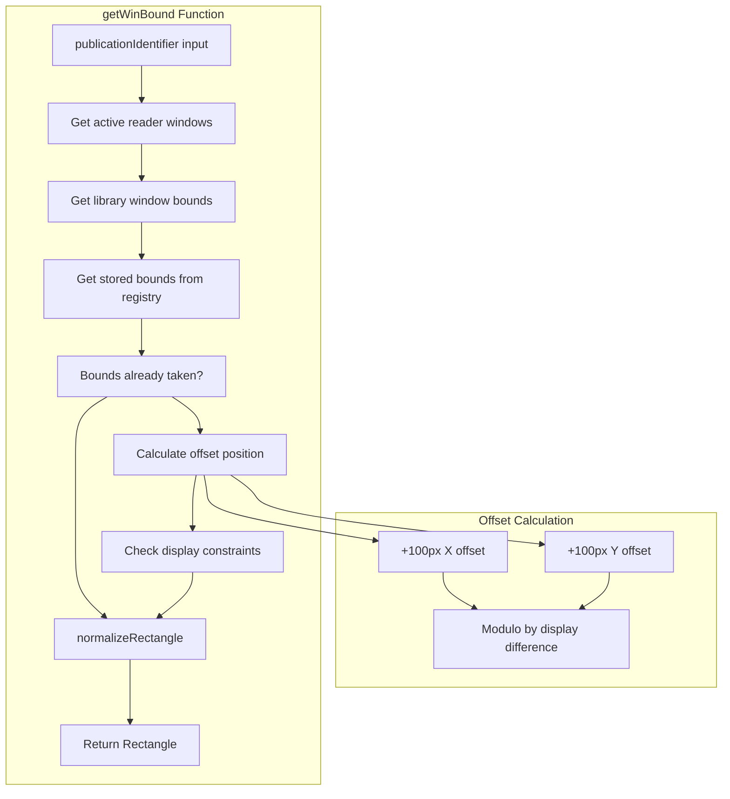
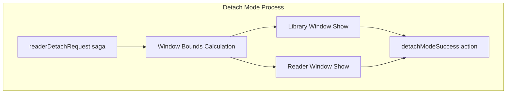
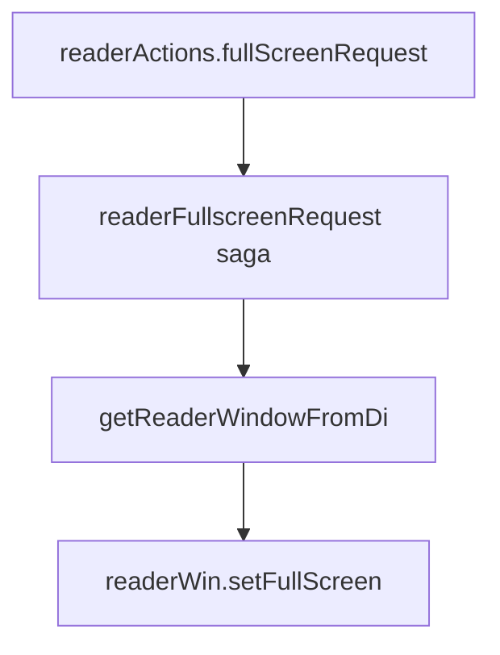
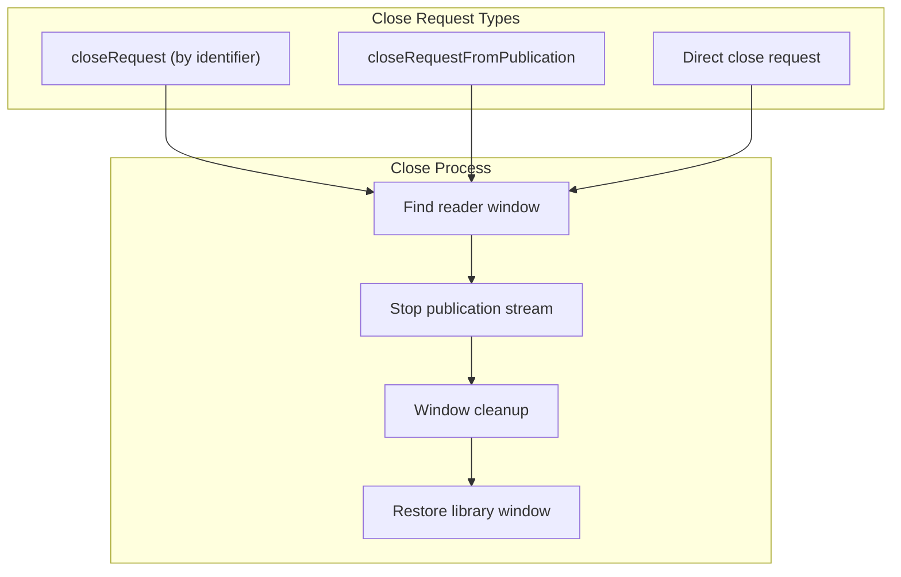
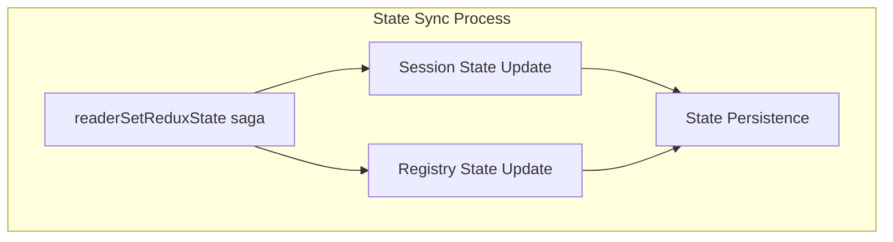
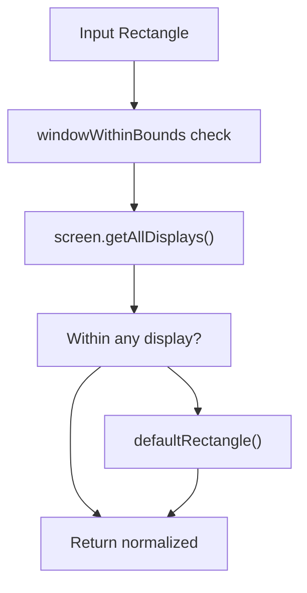

# Reader Window Management

> **Relevant source files**
> * [src/common/rectangle/window.ts](https://github.com/edrlab/thorium-reader/blob/02b67755/src/common/rectangle/window.ts)
> * [src/main/menu.ts](https://github.com/edrlab/thorium-reader/blob/02b67755/src/main/menu.ts)
> * [src/main/redux/sagas/reader.ts](https://github.com/edrlab/thorium-reader/blob/02b67755/src/main/redux/sagas/reader.ts)
> * [src/renderer/common/apiAction.ts](https://github.com/edrlab/thorium-reader/blob/02b67755/src/renderer/common/apiAction.ts)
> * [src/renderer/common/redux/api/api.ts](https://github.com/edrlab/thorium-reader/blob/02b67755/src/renderer/common/redux/api/api.ts)

## Purpose and Scope

The Reader Window Management system handles the lifecycle of reader windows in Thorium Reader, including window creation, positioning, state synchronization, and cleanup operations. This system coordinates between the main Electron process and renderer processes through Redux sagas to manage multiple concurrent reading sessions.

For information about reader UI components and their interactions, see [Reader UI Components](/edrlab/thorium-reader/2.1-reader-ui-components). For details about publication streaming and content serving, see the relevant sections in the overall system documentation.

## Window Lifecycle Management

The reader window management system operates through a saga-based architecture that handles window operations asynchronously. The core functionality is implemented in the main process and communicates with renderer processes through Redux action dispatching.

*Sources: [src/main/redux/sagas/reader.ts L168-L250](https://github.com/edrlab/thorium-reader/blob/02b67755/src/main/redux/sagas/reader.ts#L168-L250)

 [src/main/redux/sagas/reader.ts L290-L323](https://github.com/edrlab/thorium-reader/blob/02b67755/src/main/redux/sagas/reader.ts#L290-L323)*

## Reader Window Opening Process

The reader window opening process begins with a `readerOpenRequest` action and involves several coordinated steps including publication streaming, window bounds calculation, and state initialization.

*Sources: [src/main/redux/sagas/reader.ts L168-L250](https://github.com/edrlab/thorium-reader/blob/02b67755/src/main/redux/sagas/reader.ts#L168-L250)

 [src/main/redux/sagas/reader.ts L97-L166](https://github.com/edrlab/thorium-reader/blob/02b67755/src/main/redux/sagas/reader.ts#L97-L166)*

## Window Bounds Management

The window bounds management system ensures proper positioning of reader windows on screen, handling multi-monitor setups and preventing window overlap through offset calculations.

### Window Bounds Calculation Algorithm

The `getWinBound` function implements a sophisticated algorithm for calculating optimal window positions:

| Step | Operation | Purpose |
| --- | --- | --- |
| 1 | Check existing reader windows | Prevent overlap with active windows |
| 2 | Retrieve stored bounds from registry | Restore user's preferred positioning |
| 3 | Calculate display area constraints | Ensure window fits on screen |
| 4 | Apply offset algorithm | Position new windows with 100px offset |
| 5 | Normalize rectangle bounds | Validate against display boundaries |

*Sources: [src/main/redux/sagas/reader.ts L97-L166](https://github.com/edrlab/thorium-reader/blob/02b67755/src/main/redux/sagas/reader.ts#L97-L166)

 [src/common/rectangle/window.ts L22-L49](https://github.com/edrlab/thorium-reader/blob/02b67755/src/common/rectangle/window.ts#L22-L49)*

## Window Mode Operations

### Detach Mode

The detach mode operation allows users to view both library and reader windows simultaneously. The `readerDetachRequest` saga handles this coordination:

*Sources: [src/main/redux/sagas/reader.ts L55-L95](https://github.com/edrlab/thorium-reader/blob/02b67755/src/main/redux/sagas/reader.ts#L55-L95)*

### Fullscreen Mode

Fullscreen mode is handled through the `readerFullscreenRequest` saga, which directly manipulates the Electron BrowserWindow:

*Sources: [src/main/redux/sagas/reader.ts L41-L53](https://github.com/edrlab/thorium-reader/blob/02b67755/src/main/redux/sagas/reader.ts#L41-L53)*

## Reader Window Closing

The window closing process involves multiple cleanup operations including publication streaming termination, window destruction, and state cleanup.

### Close Operation Types

The system supports three types of close operations:

1. **Close by Window ID** - `readerCLoseRequestFromIdentifier`
2. **Close by Publication ID** - `readerCloseRequestFromPublication`
3. **Direct Close Request** - `readerCloseRequest`

*Sources: [src/main/redux/sagas/reader.ts L252-L323](https://github.com/edrlab/thorium-reader/blob/02b67755/src/main/redux/sagas/reader.ts#L252-L323)*

## State Synchronization

The reader window management system maintains state synchronization between the main process and renderer processes through the `readerSetReduxState` saga.

### State Persistence Flow

The saga receives a `winId` and `reduxState` payload and updates both the session state and the persistent registry state for the publication.

*Sources: [src/main/redux/sagas/reader.ts L325-L347](https://github.com/edrlab/thorium-reader/blob/02b67755/src/main/redux/sagas/reader.ts#L325-L347)*

## Window Rectangle Normalization

The window rectangle normalization system ensures windows are positioned within visible screen boundaries and provides fallback positioning when windows are positioned outside the viewable area.

### Rectangle Validation Process

The `normalizeRectangle` function validates window bounds against all available displays and returns a default rectangle if the window would be positioned outside visible areas.

*Sources: [src/common/rectangle/window.ts L22-L49](https://github.com/edrlab/thorium-reader/blob/02b67755/src/common/rectangle/window.ts#L22-L49)*

## Integration with Main Saga System

The reader window management sagas are integrated into the main saga system through the exported `saga` function, which uses `takeSpawnEvery` and `takeSpawnLeading` patterns for different operation types:

| Saga Function | Pattern | Purpose |
| --- | --- | --- |
| `readerOpenRequest` | `takeSpawnEvery` | Allow multiple concurrent opens |
| `readerCloseRequest` | `takeSpawnEvery` | Handle multiple close requests |
| `readerDetachRequest` | `takeSpawnLeading` | Prevent concurrent detach operations |
| `readerFullscreenRequest` | `takeSpawnLeading` | Prevent concurrent fullscreen toggles |

*Sources: [src/main/redux/sagas/reader.ts L460-L503](https://github.com/edrlab/thorium-reader/blob/02b67755/src/main/redux/sagas/reader.ts#L460-L503)*