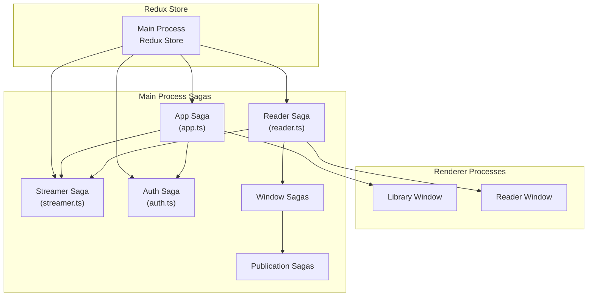
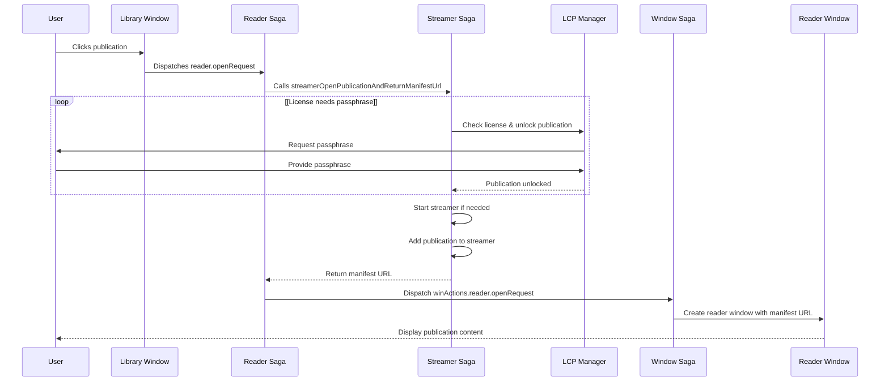
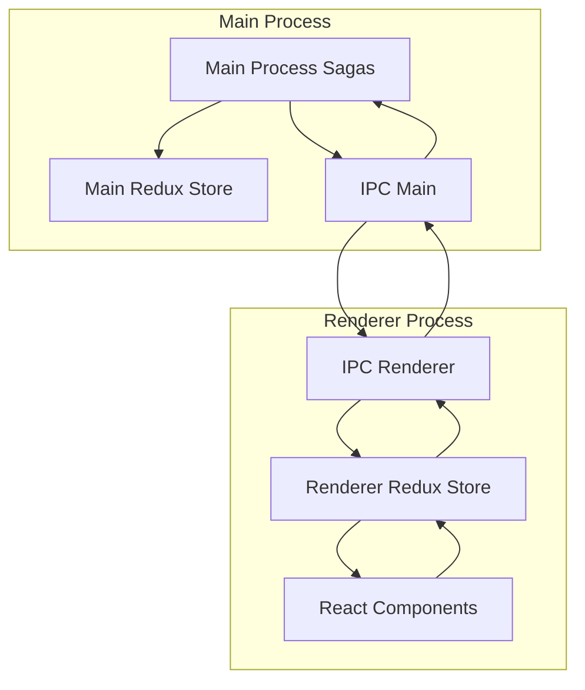
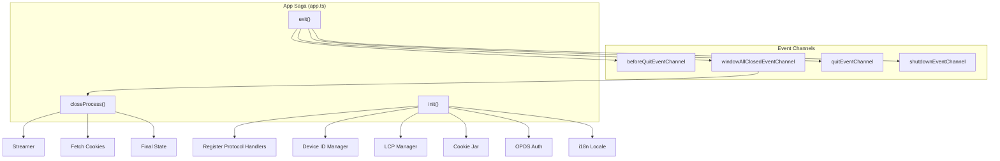
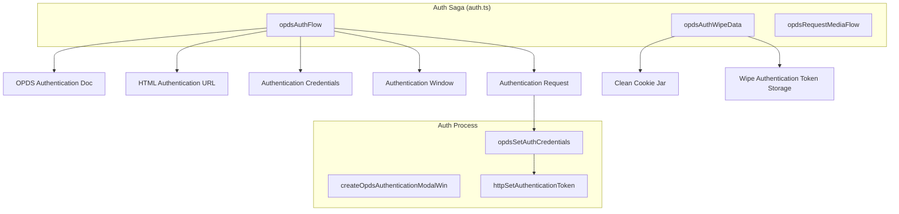

# Redux Sagas

> **Relevant source files**
> * [scripts/afterPack.js](https://github.com/edrlab/thorium-reader/blob/02b67755/scripts/afterPack.js)
> * [scripts/go-ts-checker-webpack-plugin.js](https://github.com/edrlab/thorium-reader/blob/02b67755/scripts/go-ts-checker-webpack-plugin.js)
> * [src/main/pdf/extract.ts](https://github.com/edrlab/thorium-reader/blob/02b67755/src/main/pdf/extract.ts)
> * [src/main/redux/sagas/api/publication/export.ts](https://github.com/edrlab/thorium-reader/blob/02b67755/src/main/redux/sagas/api/publication/export.ts)
> * [src/main/redux/sagas/app.ts](https://github.com/edrlab/thorium-reader/blob/02b67755/src/main/redux/sagas/app.ts)
> * [src/main/redux/sagas/win/browserWindow/createLibraryWindow.ts](https://github.com/edrlab/thorium-reader/blob/02b67755/src/main/redux/sagas/win/browserWindow/createLibraryWindow.ts)
> * [src/main/redux/sagas/win/browserWindow/createReaderWindow.ts](https://github.com/edrlab/thorium-reader/blob/02b67755/src/main/redux/sagas/win/browserWindow/createReaderWindow.ts)
> * [src/main/redux/sagas/win/library.ts](https://github.com/edrlab/thorium-reader/blob/02b67755/src/main/redux/sagas/win/library.ts)
> * [src/main/streamer/streamerNoHttp.ts](https://github.com/edrlab/thorium-reader/blob/02b67755/src/main/streamer/streamerNoHttp.ts)
> * [src/preprocessor-directives.ts](https://github.com/edrlab/thorium-reader/blob/02b67755/src/preprocessor-directives.ts)
> * [src/renderer/reader/pdf/driver.ts](https://github.com/edrlab/thorium-reader/blob/02b67755/src/renderer/reader/pdf/driver.ts)
> * [tsconfig-cli.json](https://github.com/edrlab/thorium-reader/blob/02b67755/tsconfig-cli.json)
> * [tsconfig.json](https://github.com/edrlab/thorium-reader/blob/02b67755/tsconfig.json)
> * [typings.d.ts](https://github.com/edrlab/thorium-reader/blob/02b67755/typings.d.ts)
> * [webpack.config-preprocessor-directives.js](https://github.com/edrlab/thorium-reader/blob/02b67755/webpack.config-preprocessor-directives.js)
> * [webpack.config.js](https://github.com/edrlab/thorium-reader/blob/02b67755/webpack.config.js)

Redux Sagas are used in Thorium Reader to handle complex asynchronous operations and side effects in a maintainable, testable way. This page documents how sagas are implemented and used throughout the application to manage operations like opening publications, authenticating with OPDS catalogs, and coordinating between Electron's main and renderer processes.

For information about the Redux store setup, see [Redux Store](/edrlab/thorium-reader/6.1-redux-store). For details on inter-process communication, see [Inter-Process Communication](/edrlab/thorium-reader/6.4-inter-process-communication).

## Saga Architecture Overview

### Saga Flow Diagram



Sources: [src/main/redux/sagas/app.ts](https://github.com/edrlab/thorium-reader/blob/02b67755/src/main/redux/sagas/app.ts)

 [src/main/redux/sagas/reader.ts](https://github.com/edrlab/thorium-reader/blob/02b67755/src/main/redux/sagas/reader.ts)

 [src/main/redux/sagas/auth.ts](https://github.com/edrlab/thorium-reader/blob/02b67755/src/main/redux/sagas/auth.ts)

 [src/main/redux/sagas/streamer.ts](https://github.com/edrlab/thorium-reader/blob/02b67755/src/main/redux/sagas/streamer.ts)

 [src/main/redux/sagas/win/browserWindow/createReaderWindow.ts](https://github.com/edrlab/thorium-reader/blob/02b67755/src/main/redux/sagas/win/browserWindow/createReaderWindow.ts)

 [src/main/redux/sagas/win/browserWindow/createLibraryWindow.ts](https://github.com/edrlab/thorium-reader/blob/02b67755/src/main/redux/sagas/win/browserWindow/createLibraryWindow.ts)

### Saga Helper Functions

Thorium Reader implements custom saga helpers to provide better error handling and task isolation:

```mermaid
flowchart TD

callTyped["callTyped"]
putTyped["putTyped"]
selectTyped["selectTyped"]
put["put"]
take["take"]
call["call"]
select["select"]
all["all"]
race["race"]
takeSpawnEvery["takeSpawnEvery"]
takeSpawnLeading["takeSpawnLeading"]
takeSpawnEveryChannel["takeSpawnEveryChannel"]
takeSpawnLeadingChannel["takeSpawnLeadingChannel"]
SagaTask["Saga Task"]
EventChannel["Event Channels"]
ErrorHandling["Error Handling<br>Callback"]

takeSpawnEvery --> SagaTask
takeSpawnLeading --> SagaTask
takeSpawnEveryChannel --> EventChannel
takeSpawnLeadingChannel --> EventChannel
SagaTask --> ErrorHandling

subgraph subGraph0 ["Custom Saga Helpers"]
    takeSpawnEvery
    takeSpawnLeading
    takeSpawnEveryChannel
    takeSpawnLeadingChannel
end

subgraph subGraph2 ["Typed Effects"]
    callTyped
    putTyped
    selectTyped
end

subgraph subGraph1 ["Redux-Saga Standard Effects"]
    put
    take
    call
    select
    all
    race
end
```

Sources: [src/common/redux/sagas/takeSpawnEvery.ts](https://github.com/edrlab/thorium-reader/blob/02b67755/src/common/redux/sagas/takeSpawnEvery.ts)

 [src/common/redux/sagas/takeSpawnLeading.ts](https://github.com/edrlab/thorium-reader/blob/02b67755/src/common/redux/sagas/takeSpawnLeading.ts)

## Key Saga Types

### Core Process Management Sagas

1. **App Saga**: Initializes the application, handles app lifecycle events
2. **Reader Saga**: Manages reader window operations and content display
3. **Streamer Saga**: Controls the publication content streaming service
4. **Auth Saga**: Manages authentication for OPDS catalogs and DRM

### Window Management Sagas

1. **Library Window Saga**: Creates and manages the library window
2. **Reader Window Saga**: Creates and manages reader windows
3. **Window Session Saga**: Maintains window state between sessions

### Content Management Sagas

1. **Publication Saga**: Handles opening and displaying publications
2. **Catalog Saga**: Manages catalog loading and display

## Publication Opening Flow

The following diagram shows how sagas coordinate to open a publication:



Sources: [src/main/redux/sagas/reader.ts L168-L250](https://github.com/edrlab/thorium-reader/blob/02b67755/src/main/redux/sagas/reader.ts#L168-L250)

 [src/main/redux/sagas/publication/openPublication.ts L68-L366](https://github.com/edrlab/thorium-reader/blob/02b67755/src/main/redux/sagas/publication/openPublication.ts#L68-L366)

 [src/main/redux/sagas/win/browserWindow/createReaderWindow.ts L33-L151](https://github.com/edrlab/thorium-reader/blob/02b67755/src/main/redux/sagas/win/browserWindow/createReaderWindow.ts#L33-L151)

## Saga Implementation Patterns

### Error Handling Pattern

Sagas use a consistent error handling pattern through custom helpers:

```javascript
takeSpawnEvery(    readerActions.openRequest.ID,    readerOpenRequest,    (e) => error(filename_ + ":readerOpenRequest", e),),
```

This ensures errors in one saga don't crash the whole application.

### Event Channel Pattern

Sagas use event channels to handle external events like application activation and window closing:

```javascript
// Create an event channel for app activation eventsexport const getAppActivateEventChannel = (() => {    const chan = channelSaga<boolean>();        const handler = () => chan.put(true);    if (app.listeners("activate").findIndex((v) => v === handler) === -1)        app.on("activate", handler);        return () => chan;})(); // Use the channel in a sagayield takeSpawnEveryChannel(    getAppActivateEventChannel(),    appActivate,);
```

Sources: [src/main/redux/sagas/getEventChannel.ts L68-L76](https://github.com/edrlab/thorium-reader/blob/02b67755/src/main/redux/sagas/getEventChannel.ts#L68-L76)

### IPC Communication Pattern



Sources: [src/renderer/library/index_library.ts L97-L112](https://github.com/edrlab/thorium-reader/blob/02b67755/src/renderer/library/index_library.ts#L97-L112)

## Main Saga Examples

### Reader Saga

The reader saga manages reader windows and handles reader-related actions:

```javascript
export function saga() {    return all([        takeSpawnEvery(            readerActions.closeRequestFromPublication.ID,            readerCloseRequestFromPublication,            (e) => error(filename_ + ":readerCloseRequestFromPublication", e),        ),        takeSpawnEvery(            readerActions.closeRequest.ID,            readerCLoseRequestFromIdentifier,            (e) => error(filename_ + ":readerCLoseRequestFromIdentifier", e),        ),        takeSpawnEvery(            readerActions.openRequest.ID,            readerOpenRequest,            (e) => error(filename_ + ":readerOpenRequest", e),        ),        // Additional sagas...    ]);}
```

Sources: [src/main/redux/sagas/reader.ts L401-L439](https://github.com/edrlab/thorium-reader/blob/02b67755/src/main/redux/sagas/reader.ts#L401-L439)

### App Saga

The app saga initializes the application and handles lifecycle events:



Sources: [src/main/redux/sagas/app.ts L41-L264](https://github.com/edrlab/thorium-reader/blob/02b67755/src/main/redux/sagas/app.ts#L41-L264)

 [src/main/redux/sagas/app.ts L267-L450](https://github.com/edrlab/thorium-reader/blob/02b67755/src/main/redux/sagas/app.ts#L267-L450)

### Auth Saga

The auth saga handles OPDS authentication:



Sources: [src/main/redux/sagas/auth.ts L83-L204](https://github.com/edrlab/thorium-reader/blob/02b67755/src/main/redux/sagas/auth.ts#L83-L204)

 [src/main/redux/sagas/auth.ts L206-L216](https://github.com/edrlab/thorium-reader/blob/02b67755/src/main/redux/sagas/auth.ts#L206-L216)

 [src/main/redux/sagas/auth.ts L252-L274](https://github.com/edrlab/thorium-reader/blob/02b67755/src/main/redux/sagas/auth.ts#L252-L274)

## Streamer Saga

The streamer saga manages the publication streamer:

```javascript
export function saga() {    return all([        takeSpawnEvery(            streamerActions.publicationCloseRequest.ID,            publicationCloseRequest,            (e) => error(`${filename_}:publicationCloseRequest`, e),        ),        takeSpawnLeading(            streamerActions.startRequest.ID,            startRequest,            (e) => error(`${filename_}:startRequest`, e),        ),        takeSpawnLeading(            streamerActions.stopRequest.ID,            stopRequest,            (e) => error(`${filename_}:stopRequest`, e),        ),    ]);}
```

This saga manages starting and stopping the streamer, and handling publication closing requests.

Sources: [src/main/redux/sagas/streamer.ts L119-L137](https://github.com/edrlab/thorium-reader/blob/02b67755/src/main/redux/sagas/streamer.ts#L119-L137)

## Advanced Saga Patterns

### Saga Composition

Sagas are composed using the `all` effect to run multiple sagas in parallel:

```javascript
export function saga() {    return all([        // Multiple sagas run in parallel        takeSpawnEvery(...),        takeSpawnLeading(...),        // More sagas...    ]);}
```

### Typed Redux Saga

Thorium uses typed-redux-saga to provide better TypeScript support:

```javascript
// Import typed effectsimport { call as callTyped, select as selectTyped } from "typed-redux-saga/macro"; function* someSaga() {    // Use typed effects to get proper TypeScript inference    const someValue = yield* selectTyped((state: RootState) => state.someValue);    yield* callTyped(someFunction, someValue);}
```

Sources: [src/main/redux/sagas/reader.ts L25-L26](https://github.com/edrlab/thorium-reader/blob/02b67755/src/main/redux/sagas/reader.ts#L25-L26)

## Best Practices

1. **Error Isolation**: Use `takeSpawnEvery` and `takeSpawnLeading` to isolate errors in individual sagas
2. **Typed Effects**: Use typed effects (`callTyped`, `selectTyped`) for better type safety
3. **Event Channels**: Use event channels to handle external events (app lifecycle, protocol handlers)
4. **Action Structure**: Keep action types and payload structures consistent
5. **Saga Organization**: Organize sagas by functionality (app, reader, auth, streamer)

## Common Pitfalls

1. **Saga Error Handling**: Without proper error handling, errors in one saga can crash the whole saga middleware
2. **Race Conditions**: Be careful with race conditions between sagas and use `race` effect when needed
3. **Memory Leaks**: Ensure event channels are properly cleaned up when no longer needed
4. **Process Communication**: Be aware of the asynchronous nature of IPC communication
5. **Lifecycle Management**: Properly handle window and application lifecycle events to avoid resource leaks

Sources: [src/main/redux/sagas/reader.ts](https://github.com/edrlab/thorium-reader/blob/02b67755/src/main/redux/sagas/reader.ts)

 [src/main/redux/sagas/app.ts](https://github.com/edrlab/thorium-reader/blob/02b67755/src/main/redux/sagas/app.ts)

 [src/main/redux/sagas/auth.ts](https://github.com/edrlab/thorium-reader/blob/02b67755/src/main/redux/sagas/auth.ts)

 [src/main/redux/sagas/streamer.ts](https://github.com/edrlab/thorium-reader/blob/02b67755/src/main/redux/sagas/streamer.ts)