# Redux Store

> **Relevant source files**
> * [src/main/redux/actions/publication/addPublication.ts](https://github.com/edrlab/thorium-reader/blob/02b67755/src/main/redux/actions/publication/addPublication.ts)
> * [src/main/redux/middleware/persistence.ts](https://github.com/edrlab/thorium-reader/blob/02b67755/src/main/redux/middleware/persistence.ts)
> * [src/main/redux/sagas/patch.ts](https://github.com/edrlab/thorium-reader/blob/02b67755/src/main/redux/sagas/patch.ts)
> * [src/main/redux/sagas/persist.ts](https://github.com/edrlab/thorium-reader/blob/02b67755/src/main/redux/sagas/persist.ts)
> * [src/main/redux/store/memory.ts](https://github.com/edrlab/thorium-reader/blob/02b67755/src/main/redux/store/memory.ts)
> * [src/typings/lunr.d.ts](https://github.com/edrlab/thorium-reader/blob/02b67755/src/typings/lunr.d.ts)

This document details the Redux store implementation in Thorium Reader, which serves as the central state management system for the entire application across both the main Electron process and renderer processes. The Redux store coordinates state across processes, manages state persistence to disk, and provides recovery mechanisms for application state.

For information about asynchronous operations with Redux Sagas, see [Redux Sagas](/edrlab/thorium-reader/6.2-redux-sagas). For state persistence details, see [State Persistence](/edrlab/thorium-reader/6.3-state-persistence). For information about inter-process communication, see [Inter-Process Communication](/edrlab/thorium-reader/6.4-inter-process-communication).

## Overview

Thorium Reader implements a Redux-based state management system that handles the complex requirements of an Electron application with multiple windows. The store is initialized in the main process through `initStore()` and synchronized with renderer processes through custom middleware.

### Redux Store Architecture

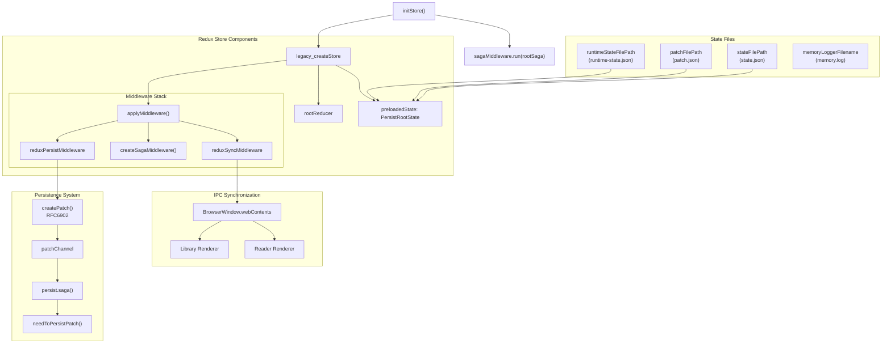

Sources: [src/main/redux/store/memory.ts L99-L474](https://github.com/edrlab/thorium-reader/blob/02b67755/src/main/redux/store/memory.ts#L99-L474)

 [src/main/redux/middleware/persistence.ts L18-L92](https://github.com/edrlab/thorium-reader/blob/02b67755/src/main/redux/middleware/persistence.ts#L18-L92)

 [src/main/redux/middleware/sync.ts](https://github.com/edrlab/thorium-reader/blob/02b67755/src/main/redux/middleware/sync.ts)

</old_str>

<old_str>

## State Structure and Persistence

The Redux state follows a strict separation between runtime state (`RootState`) and persistable state (`PersistRootState`). State persistence uses RFC6902 JSON patches for efficient incremental updates.

### State Architecture

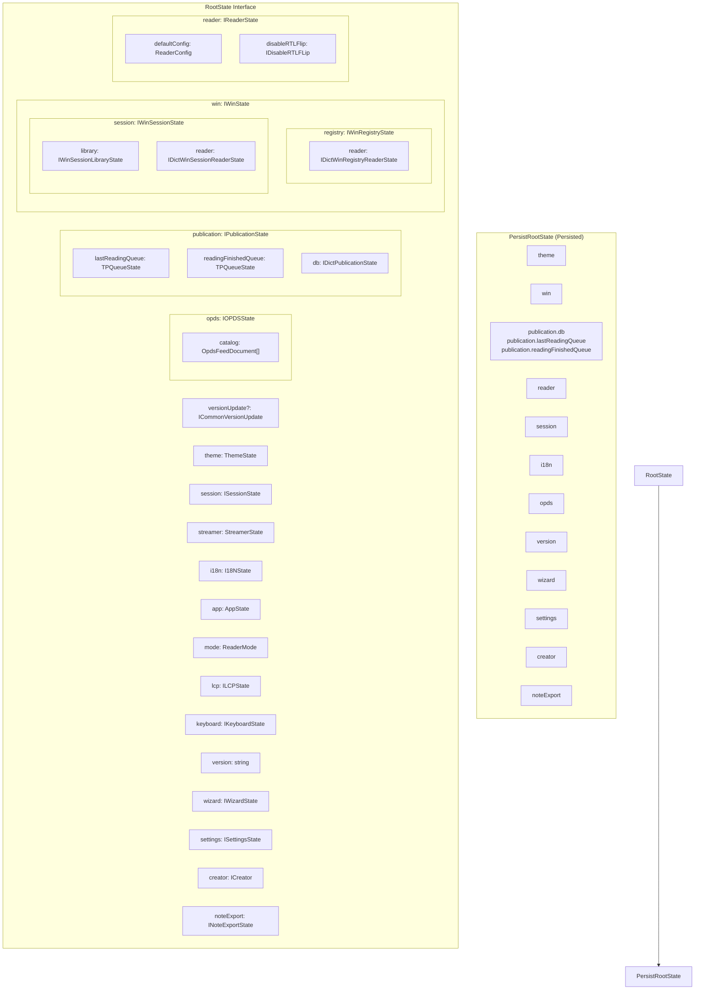

### State Persistence Mechanism

The persistence system creates a filtered version of the state that excludes runtime-only data:

```javascript
// From reduxPersistMiddlewareconst persistPrevState: PersistRootState = {    theme: prevState.theme,    win: prevState.win,    reader: prevState.reader,    i18n: prevState.i18n,    session: prevState.session,    publication: {        db: prevState.publication.db,        lastReadingQueue: prevState.publication.lastReadingQueue,        readingFinishedQueue: prevState.publication.readingFinishedQueue,    },    opds: prevState.opds,    version: prevState.version,    wizard: prevState.wizard,    settings: prevState.settings,    creator: prevState.creator,    noteExport: prevState.noteExport,};
```

### State Migration and Data Transformation

The `initStore()` function includes extensive migration logic for backwards compatibility:

| Migration | Purpose | Data Transformation |
| --- | --- | --- |
| **LocatorExtended cleanup** | Remove memory-heavy properties | Removes `followingElementIDs`, converts `rangeInfo` to `caretInfo` |
| **Bookmark to Note migration** | Consolidate annotation systems | Converts `bookmark[]` to `note[]` with `EDrawType.bookmark` |
| **Annotation to Note migration** | Consolidate annotation systems | Converts `annotation[]` to `note[]` with draw type mapping |
| **Color normalization** | Ensure color consistency | Applies `NOTE_DEFAULT_COLOR_OBJ` to bookmarks without colors |
| **Creator URN migration** | Add URN identifiers | Generates `urn:uuid:${id}` for creator objects |

Sources: [src/main/redux/store/memory.ts L247-L447](https://github.com/edrlab/thorium-reader/blob/02b67755/src/main/redux/store/memory.ts#L247-L447)

 [src/main/redux/middleware/persistence.ts L29-L67](https://github.com/edrlab/thorium-reader/blob/02b67755/src/main/redux/middleware/persistence.ts#L29-L67)

 [src/main/redux/states/index.ts](https://github.com/edrlab/thorium-reader/blob/02b67755/src/main/redux/states/index.ts)

</old_str>
<new_str>

### Four-Level State Recovery System

The `initStore()` function implements a sophisticated four-level recovery system to handle state corruption gracefully. Each level provides increasing fallback options to ensure application stability.

| Recovery Level | Method | Description | Data Loss Risk |
| --- | --- | --- | --- |
| **Level 1** | `checkReduxState()` + `recoveryReduxState()` | Runtime state + patches validated against current state | None |
| **Level 2** | `test()` on loaded state | Use potentially corrupted `state.json` if basic validation passes | Minimal |
| **Level 3** | `recoveryReduxState()` only | Apply patches to runtime state without validation | Low |
| **Level 4** | `runtimeState()` only | Use previous runtime snapshot without patches | **High** |

### State Recovery Flow

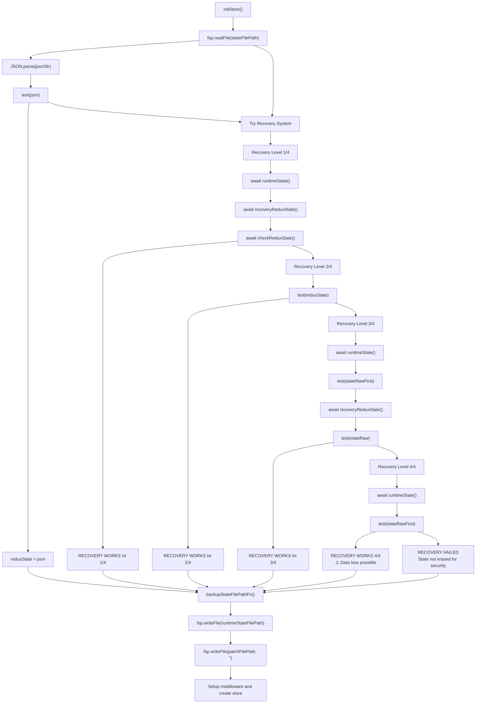

Sources: [src/main/redux/store/memory.ts L106-L214](https://github.com/edrlab/thorium-reader/blob/02b67755/src/main/redux/store/memory.ts#L106-L214)

 [src/main/redux/store/memory.ts L45-L96](https://github.com/edrlab/thorium-reader/blob/02b67755/src/main/redux/store/memory.ts#L45-L96)

</old_str>

<old_str>

### Persistence Middleware Implementation

The `reduxPersistMiddleware` uses RFC6902 JSON patches to efficiently track and persist state changes. It operates between action dispatches to capture before/after state snapshots.

```mermaid
sequenceDiagram
  participant Redux Action
  participant reduxPersistMiddleware
  participant next() middleware
  participant createPatch()
  participant patchChannel
  participant Redux Store

  Redux Action->>reduxPersistMiddleware: "Incoming action"
  reduxPersistMiddleware->>reduxPersistMiddleware: "store.getState() → prevState"
  reduxPersistMiddleware->>next() middleware: "Pass action to next middleware"
  next() middleware-->>reduxPersistMiddleware: "Return value"
  reduxPersistMiddleware->>reduxPersistMiddleware: "store.getState() → nextState"
  reduxPersistMiddleware->>reduxPersistMiddleware: "Extract PersistRootState from both states"
  reduxPersistMiddleware->>createPatch(): "createPatch(persistPrevState, persistNextState)"
  createPatch()-->>reduxPersistMiddleware: "Operation[] (RFC6902 patches)"
  loop ["For each operation"]
    reduxPersistMiddleware->>patchChannel: "patchChannel.put(operation)"
    reduxPersistMiddleware->>Redux Store: "dispatch(winActions.persistRequest.build(ops))"
  end
  reduxPersistMiddleware-->>Redux Action: "Return original return value"
```

### RFC6902 Patch Generation

The middleware creates JSON patches by comparing `persistPrevState` and `persistNextState`:

```javascript
const persistPrevState: PersistRootState = {    theme: prevState.theme,    win: prevState.win,    reader: prevState.reader,    // ... other persist-eligible state slices}; const persistNextState: PersistRootState = {    theme: nextState.theme,    win: nextState.win,     reader: nextState.reader,    // ... other persist-eligible state slices}; const ops = createPatch(persistPrevState, persistNextState);if (ops?.length) {    for (const o of ops) {        patchChannel.put(o);    }    store.dispatch(winActions.persistRequest.build(ops));}
```

Sources: [src/main/redux/middleware/persistence.ts L18-L92](https://github.com/edrlab/thorium-reader/blob/02b67755/src/main/redux/middleware/persistence.ts#L18-L92)

 [src/main/redux/sagas/patch.ts L11](https://github.com/edrlab/thorium-reader/blob/02b67755/src/main/redux/sagas/patch.ts#L11-L11)

</old_str>
<new_str>

### Middleware Configuration

The Redux store is configured with three core middleware components in a specific order:

| Order | Middleware | File | Purpose |
| --- | --- | --- | --- |
| 1 | `reduxSyncMiddleware` | `middleware/sync.ts` | Synchronizes actions to renderer processes via IPC |
| 2 | `sagaMiddleware` | `redux-saga` | Handles async operations and side effects |
| 3 | `reduxPersistMiddleware` | `middleware/persistence.ts` | Creates RFC6902 patches for state persistence |

### Middleware Stack Configuration

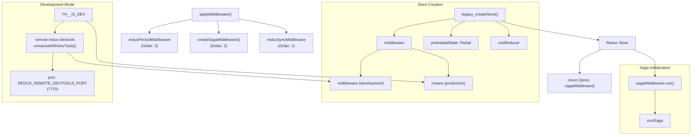

The middleware setup occurs after state recovery and migration logic:

```javascript
const sagaMiddleware = createSagaMiddleware();const mware = applyMiddleware(    reduxSyncMiddleware,    sagaMiddleware,     reduxPersistMiddleware,); const middleware = __TH__IS_DEV__ ?     require("remote-redux-devtools").composeWithDevTools({        port: REDUX_REMOTE_DEVTOOLS_PORT,    })(mware) : mware; const store = createStore(    rootReducer,    preloadedState as {},    middleware,); sagaMiddleware.run(rootSaga);
```

Sources: [src/main/redux/store/memory.ts L449-L472](https://github.com/edrlab/thorium-reader/blob/02b67755/src/main/redux/store/memory.ts#L449-L472)

## Store Initialization

The Redux store is initialized in the main process through the `initStore()` function, which handles state loading, recovery, and middleware setup.

### State Loading and Recovery

The store initialization process attempts to load the previous application state from disk with multiple fallback mechanisms:

1. Load the state from `state.json`
2. If that fails, try reconstructing the state from `runtime-state.json` plus patches from `patch.json`
3. If that fails, try using just the runtime state
4. If all recovery attempts fail, start with a fresh state

This multi-layered approach provides resilience against state corruption.

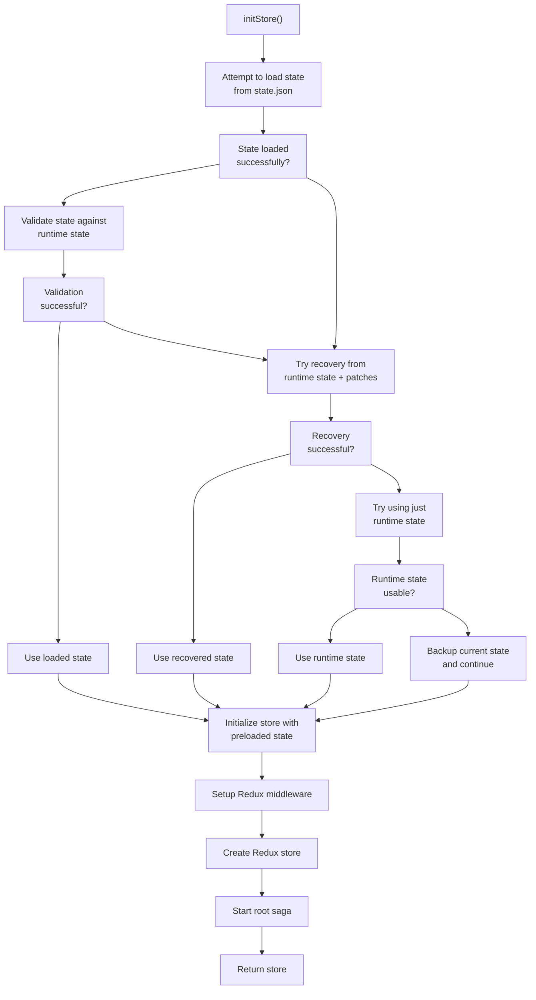

Sources: [src/main/redux/store/memory.ts L99-L474](https://github.com/edrlab/thorium-reader/blob/02b67755/src/main/redux/store/memory.ts#L99-L474)

### Middleware Configuration

The store is configured with three middleware components:

1. **Redux Sync Middleware**: Synchronizes actions between main and renderer processes
2. **Redux Saga Middleware**: Handles asynchronous operations
3. **Redux Persist Middleware**: Manages state persistence to disk

In development mode, the store also includes Redux DevTools integration.

```javascript
// Store middleware setup (simplified)const sagaMiddleware = createSagaMiddleware();const mware = applyMiddleware(    reduxSyncMiddleware,    sagaMiddleware,    reduxPersistMiddleware,);const middleware = IS_DEV ?     require("remote-redux-devtools").composeWithDevTools({ port: REDUX_REMOTE_DEVTOOLS_PORT })(mware)     : mware; const store = createStore(    rootReducer,    preloadedState as {},    middleware,); sagaMiddleware.run(rootSaga);
```

Sources: [src/main/redux/store/memory.ts L450-L473](https://github.com/edrlab/thorium-reader/blob/02b67755/src/main/redux/store/memory.ts#L450-L473)

## State Persistence System

The Redux store uses a dual-persistence system combining complete state snapshots with incremental RFC6902 patches. This provides both efficiency and recovery capabilities.

### Persistence Architecture

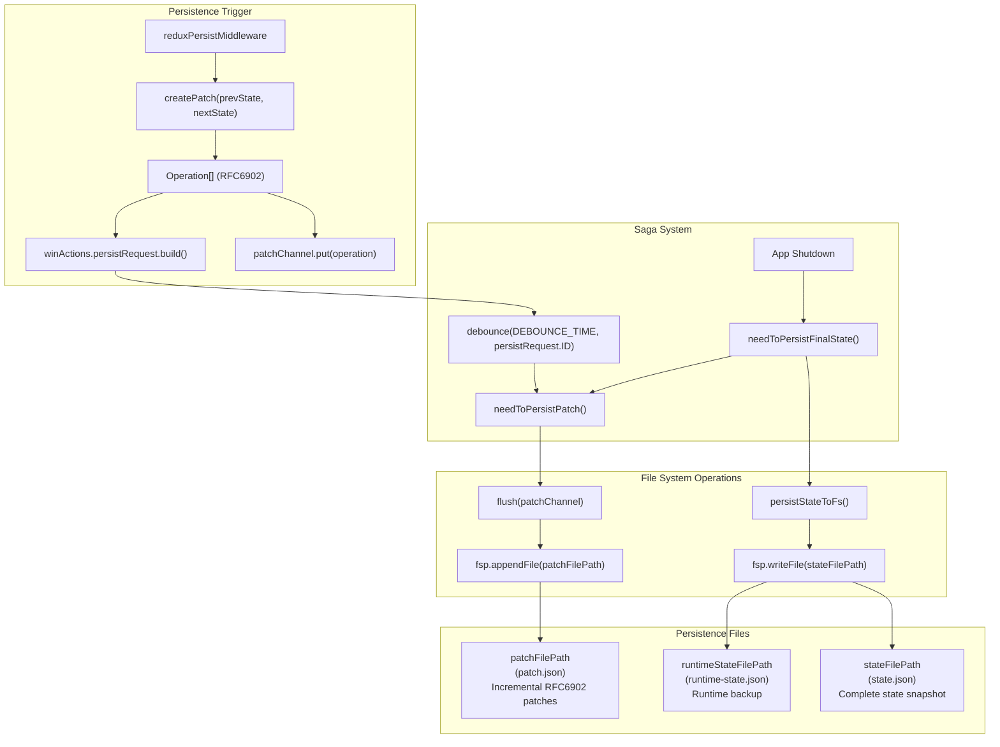

### Persistence Timing and Debouncing

| Event | Function | Timing | File Operations |
| --- | --- | --- | --- |
| **State Changes** | `reduxPersistMiddleware` | Immediate | Creates patches → `patchChannel` |
| **Patch Flush** | `needToPersistPatch()` | Debounced 3min | Appends to `patch.json` |
| **Full State Save** | `needToPersistFinalState()` | App shutdown | Writes complete `state.json` |

The debouncing mechanism prevents excessive I/O operations:

```javascript
const DEBOUNCE_TIME = 3 * 60 * 1000; // 3 minutes export function saga() {    return debounce(        DEBOUNCE_TIME,        winActions.persistRequest.ID,        needToPersistPatch,    );}
```

### Patch File Format

The `patch.json` file stores RFC6902 operations as a comma-separated list:

```javascript
export function* needToPersistPatch() {    const ops = yield* flushTyped(patchChannel);        let data = "";    let i = 0;    while (i < ops.length) {        data += JSON.stringify(ops[i]) + ",\n";        ++i;    }        if (data) {        yield call(() => fsp.appendFile(patchFilePath, data, { encoding: "utf8" }));    }}
```

During recovery, the patch file is processed by adding array brackets:

```javascript
const patchFileStr = "[" + patchFileStrRaw.slice(0, -2) + "]"; // remove the last commaconst patch = await tryCatch(() => JSON.parse(patchFileStr), "");const errors = applyPatch(runtimeState, patch);
```

Sources: [src/main/redux/sagas/persist.ts L19-L93](https://github.com/edrlab/thorium-reader/blob/02b67755/src/main/redux/sagas/persist.ts#L19-L93)

 [src/main/redux/middleware/persistence.ts L69-L89](https://github.com/edrlab/thorium-reader/blob/02b67755/src/main/redux/middleware/persistence.ts#L69-L89)

 [src/main/redux/store/memory.ts L63-L86](https://github.com/edrlab/thorium-reader/blob/02b67755/src/main/redux/store/memory.ts#L63-L86)

## Root Reducer

The root reducer combines multiple domain-specific reducers to form the complete state tree:

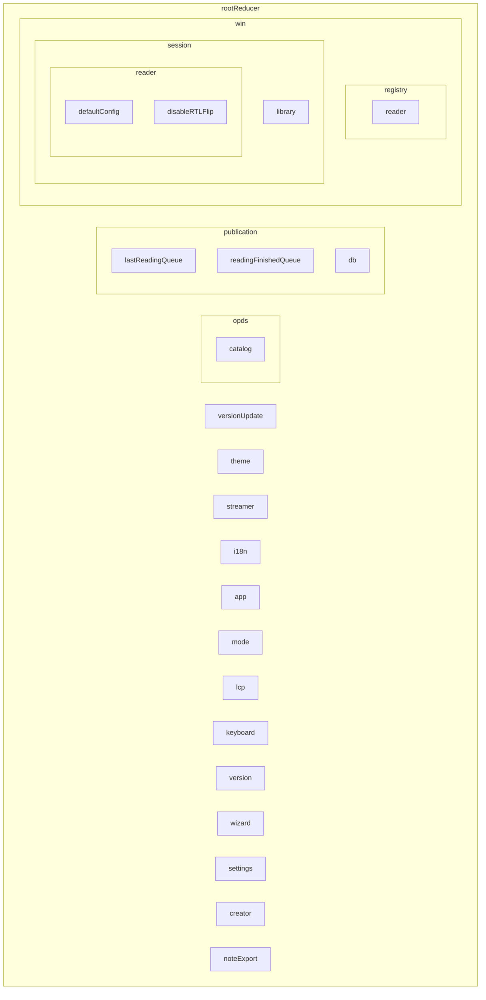

The root reducer is created using Redux's `combineReducers` function, which creates a nested structure of reducers that mirrors the state tree structure.

Sources: [src/main/redux/reducers/index.ts L36-L110](https://github.com/edrlab/thorium-reader/blob/02b67755/src/main/redux/reducers/index.ts#L36-L110)

## Redux Middleware

### Sync Middleware

The sync middleware synchronizes actions between the main process and renderer processes. It determines which actions should be synchronized based on a predefined list of synchronizable action types.

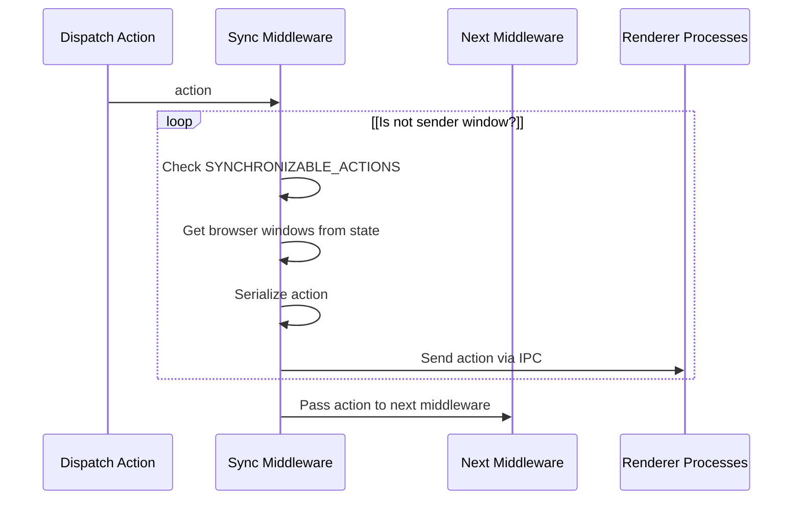

The sync middleware maintains a list of actions that should be synchronized (`SYNCHRONIZABLE_ACTIONS`), including actions related to API results, dialogs, reader configuration, LCP handling, and more.

Sources: [src/main/redux/middleware/sync.ts L28-L92](https://github.com/edrlab/thorium-reader/blob/02b67755/src/main/redux/middleware/sync.ts#L28-L92)

 [src/main/redux/middleware/sync.ts L94-L210](https://github.com/edrlab/thorium-reader/blob/02b67755/src/main/redux/middleware/sync.ts#L94-L210)

### Persistence Middleware

The persistence middleware tracks state changes and creates patches that are later persisted to disk. It selects the parts of the state to persist and uses the RFC6902 JSON Patch format to efficiently track changes.

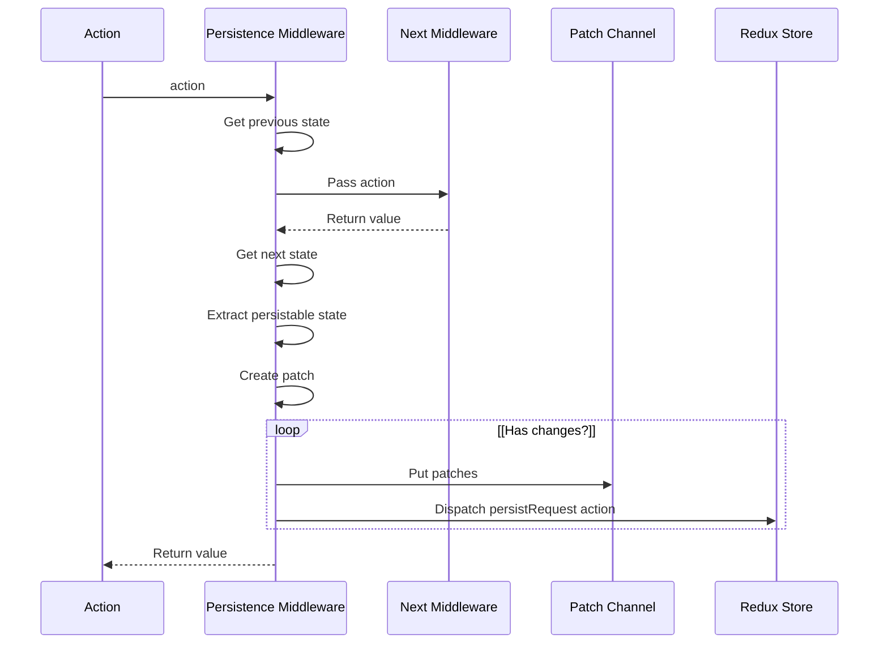

Sources: [src/main/redux/middleware/persistence.ts L18-L92](https://github.com/edrlab/thorium-reader/blob/02b67755/src/main/redux/middleware/persistence.ts#L18-L92)

## Sagas

The Redux Saga middleware is used to handle side effects and asynchronous operations. The root saga initializes the application and coordinates various subsystems.

### Root Saga

The root saga coordinates the initialization and operation of various subsystems:

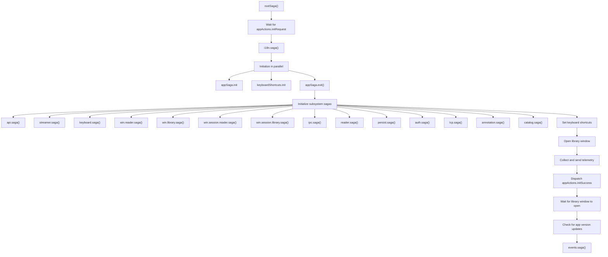

Sources: [src/main/redux/sagas/index.ts L48-L166](https://github.com/edrlab/thorium-reader/blob/02b67755/src/main/redux/sagas/index.ts#L48-L166)

## State Persistence

The Redux store's state is persisted to disk through a combination of the persistence middleware and dedicated sagas.

### Persistence Flow

The persistence process works as follows:

1. The persistence middleware tracks state changes and creates patches
2. Patches are sent to a channel and periodically flushed to disk
3. The complete state is also periodically saved to disk
4. During application initialization, the persisted state is loaded and used to initialize the store

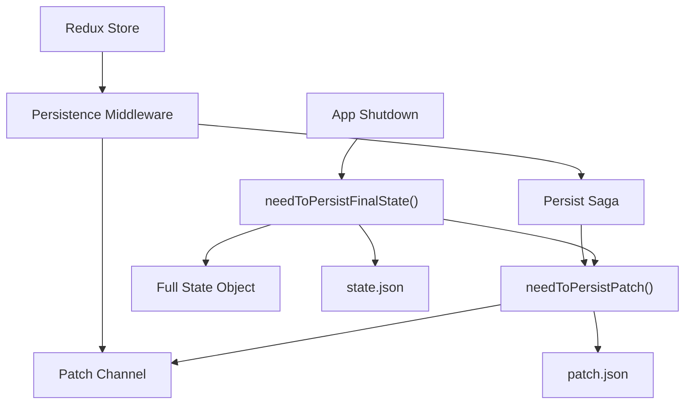

The persistence system uses three main files:

1. **state.json**: Contains the complete persisted state
2. **patch.json**: Contains incremental changes to the state
3. **runtime-state.json**: Contains the runtime state for recovery purposes

Sources: [src/main/redux/middleware/persistence.ts L18-L92](https://github.com/edrlab/thorium-reader/blob/02b67755/src/main/redux/middleware/persistence.ts#L18-L92)

 [src/main/redux/sagas/persist.ts L26-L93](https://github.com/edrlab/thorium-reader/blob/02b67755/src/main/redux/sagas/persist.ts#L26-L93)

## Inter-Process Communication with Redux

Thorium Reader uses Redux as the basis for inter-process communication between the main Electron process and renderer processes.

### Synchronizing Actions

When an action is dispatched in the main process, the sync middleware determines if it should be synchronized with renderer processes:

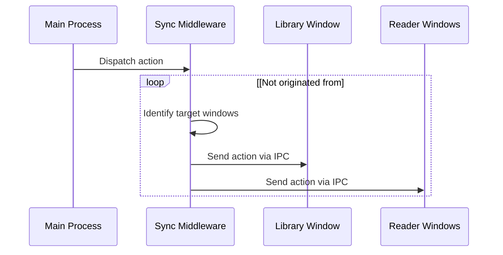

Sources: [src/main/redux/middleware/sync.ts L94-L210](https://github.com/edrlab/thorium-reader/blob/02b67755/src/main/redux/middleware/sync.ts#L94-L210)

## Conclusion

The Redux Store in Thorium Reader provides a robust central state management system that coordinates state across the main process and multiple renderer processes. It includes mechanisms for state persistence, synchronization, and recovery, ensuring that the application state remains consistent and resilient.

The store architecture follows Electron's process model while adapting Redux patterns to the needs of a cross-platform desktop application. The combination of Redux, middleware, and sagas provides a maintainable and predictable way to manage the complex state requirements of an EPUB reader application.