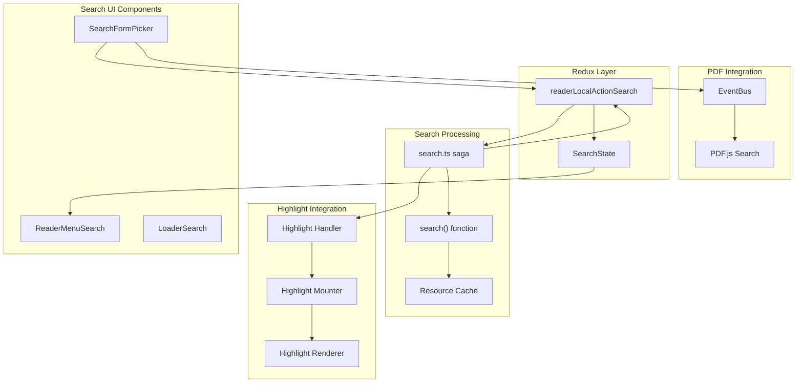
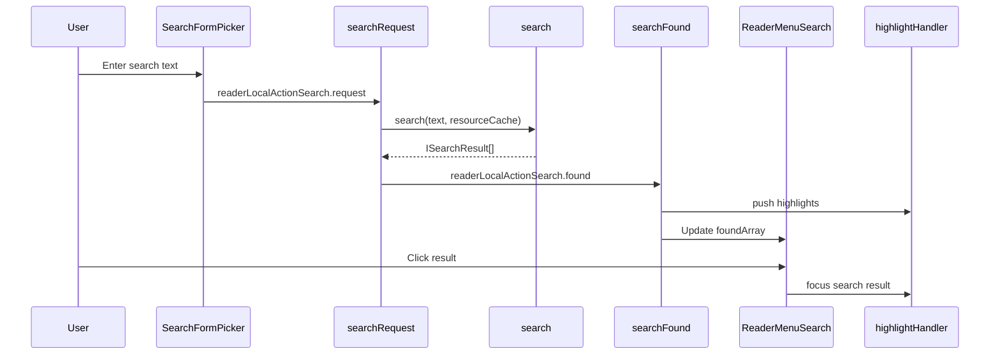
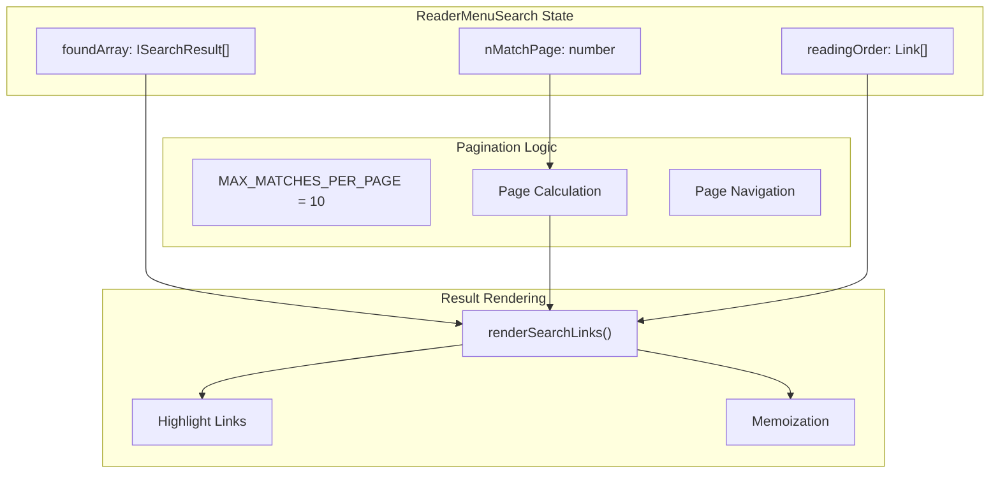
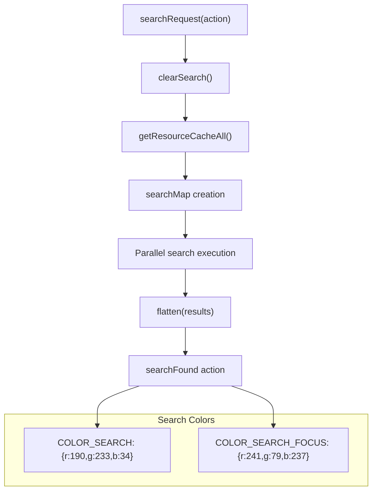
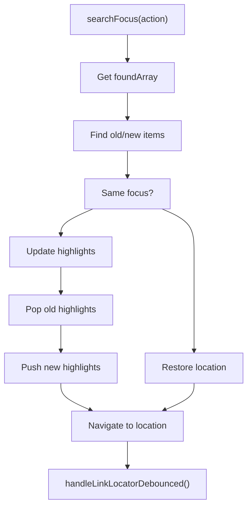
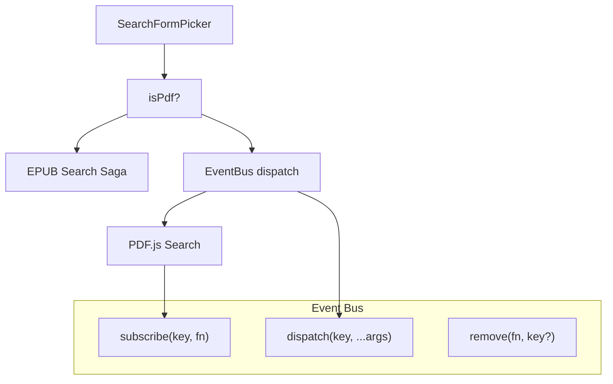

# Search Functionality

> **Relevant source files**
> * [src/renderer/reader/components/ReaderMenuSearch.tsx](https://github.com/edrlab/thorium-reader/blob/02b67755/src/renderer/reader/components/ReaderMenuSearch.tsx)
> * [src/renderer/reader/components/picker/SearchFormPicker.tsx](https://github.com/edrlab/thorium-reader/blob/02b67755/src/renderer/reader/components/picker/SearchFormPicker.tsx)
> * [src/renderer/reader/pdf/common/eventBus.ts](https://github.com/edrlab/thorium-reader/blob/02b67755/src/renderer/reader/pdf/common/eventBus.ts)
> * [src/renderer/reader/redux/sagas/highlight/handler.ts](https://github.com/edrlab/thorium-reader/blob/02b67755/src/renderer/reader/redux/sagas/highlight/handler.ts)
> * [src/renderer/reader/redux/sagas/highlight/mounter.ts](https://github.com/edrlab/thorium-reader/blob/02b67755/src/renderer/reader/redux/sagas/highlight/mounter.ts)
> * [src/renderer/reader/redux/sagas/search.ts](https://github.com/edrlab/thorium-reader/blob/02b67755/src/renderer/reader/redux/sagas/search.ts)

This document covers the in-publication search system that allows users to search for text within EPUB and PDF documents. The search functionality includes text input, result highlighting, pagination, and navigation between search matches.

For information about library-level publication search and filtering, see [Publication Display](/edrlab/thorium-reader/3.1-publication-display).

## Architecture Overview

The search system follows a Redux-Saga pattern with separate handling for EPUB and PDF content types. Search results are integrated with the highlighting system to provide visual feedback.



**Sources:** [src/renderer/reader/components/picker/SearchFormPicker.tsx L167-L175](https://github.com/edrlab/thorium-reader/blob/02b67755/src/renderer/reader/components/picker/SearchFormPicker.tsx#L167-L175)

 [src/renderer/reader/redux/sagas/search.ts L83-L101](https://github.com/edrlab/thorium-reader/blob/02b67755/src/renderer/reader/redux/sagas/search.ts#L83-L101)

 [src/renderer/reader/components/ReaderMenuSearch.tsx L524-L534](https://github.com/edrlab/thorium-reader/blob/02b67755/src/renderer/reader/components/ReaderMenuSearch.tsx#L524-L534)

## Search Workflow

The search process involves multiple stages from user input to result highlighting and navigation.



**Sources:** [src/renderer/reader/redux/sagas/search.ts L83-L141](https://github.com/edrlab/thorium-reader/blob/02b67755/src/renderer/reader/redux/sagas/search.ts#L83-L141)

 [src/renderer/reader/components/ReaderMenuSearch.tsx L418-L448](https://github.com/edrlab/thorium-reader/blob/02b67755/src/renderer/reader/components/ReaderMenuSearch.tsx#L418-L448)

## Search UI Components

### SearchFormPicker Component

The `SearchFormPicker` component provides the search input interface with keyboard shortcut support and loading states.

| Property | Type | Purpose |
| --- | --- | --- |
| `inputValue` | `string` | Current search text input |
| `isPdf` | `boolean` | Determines PDF vs EPUB search handling |
| `load` | `boolean` | Controls loading spinner display |

Key methods:

* `search()` - Handles form submission and dispatches search request
* `onKeyboardFocusSearch()` - Keyboard shortcut handler for search focus
* `focusoutSearch()` - Maintains focus on search input

**Sources:** [src/renderer/reader/components/picker/SearchFormPicker.tsx L50-L178](https://github.com/edrlab/thorium-reader/blob/02b67755/src/renderer/reader/components/picker/SearchFormPicker.tsx#L50-L178)

### ReaderMenuSearch Component

The `ReaderMenuSearch` component displays paginated search results with navigation controls.



Key features:

* Pagination with 10 results per page (`MAX_MATCHES_PER_PAGE`)
* Memoized result rendering for performance
* Integration with table of contents for result grouping
* Debounced click handling to prevent double-clicks

**Sources:** [src/renderer/reader/components/ReaderMenuSearch.tsx L49-L542](https://github.com/edrlab/thorium-reader/blob/02b67755/src/renderer/reader/components/ReaderMenuSearch.tsx#L49-L542)

## Search Processing

### Search Request Saga

The `searchRequest` saga coordinates the search process across cached document resources.



The search process:

1. Clears existing search highlights
2. Retrieves all cached document resources
3. Executes search across all resources in parallel
4. Flattens and dispatches results

**Sources:** [src/renderer/reader/redux/sagas/search.ts L83-L101](https://github.com/edrlab/thorium-reader/blob/02b67755/src/renderer/reader/redux/sagas/search.ts#L83-L101)

 [src/renderer/reader/redux/sagas/search.ts L48-L57](https://github.com/edrlab/thorium-reader/blob/02b67755/src/renderer/reader/redux/sagas/search.ts#L48-L57)

### Search Result Conversion

Search results are converted to highlight handler states for visual presentation.

```
interface ISearchResult {    uuid: string;    href: string;    cleanBefore: string;    cleanText: string;    cleanAfter: string;    rangeInfo: IRangeInfo;}
```

The `converterSearchResultToHighlightHandlerState` function transforms search results into highlight definitions with:

* UUID for unique identification
* Color coding (normal vs focused)
* Range information for precise positioning
* Text context for display

**Sources:** [src/renderer/reader/redux/sagas/search.ts L103-L126](https://github.com/edrlab/thorium-reader/blob/02b67755/src/renderer/reader/redux/sagas/search.ts#L103-L126)

 [src/common/redux/states/renderer/search.ts](https://github.com/edrlab/thorium-reader/blob/02b67755/src/common/redux/states/renderer/search.ts)

## Result Highlighting and Navigation

### Search Focus Management

The search focus system allows navigation between search results with visual highlighting.



Key functions:

* `searchFocus()` - Manages focus transitions between results
* `searchFocusPreviousOrNext()` - Cycles through results with wraparound
* `createLocatorLink()` - Creates navigation locators from search results

**Sources:** [src/renderer/reader/redux/sagas/search.ts L143-L202](https://github.com/edrlab/thorium-reader/blob/02b67755/src/renderer/reader/redux/sagas/search.ts#L143-L202)

 [src/renderer/reader/redux/sagas/search.ts L238-L265](https://github.com/edrlab/thorium-reader/blob/02b67755/src/renderer/reader/redux/sagas/search.ts#L238-L265)

### Highlight Integration

Search results integrate with the highlight system through the handler and mounter sagas.

| Component | Purpose |
| --- | --- |
| `highlightClick` | Handles clicks on search result highlights |
| `mountHighlight` | Mounts search highlights in WebView |
| `unmountHighlight` | Removes search highlights when clearing |

The search highlights use the "search" group identifier and are automatically managed during search operations.

**Sources:** [src/renderer/reader/redux/sagas/search.ts L228-L236](https://github.com/edrlab/thorium-reader/blob/02b67755/src/renderer/reader/redux/sagas/search.ts#L228-L236)

 [src/renderer/reader/redux/sagas/highlight/handler.ts L137-L224](https://github.com/edrlab/thorium-reader/blob/02b67755/src/renderer/reader/redux/sagas/highlight/handler.ts#L137-L224)

## PDF Search Integration

PDF documents use a separate search mechanism through the event bus system.



The PDF search flow:

1. `SearchFormPicker` detects PDF mode via `isPdf` prop
2. Dispatches "search" event through `createOrGetPdfEventBus()`
3. PDF.js handles the search internally
4. Results are managed separately from EPUB search system

**Sources:** [src/renderer/reader/components/picker/SearchFormPicker.tsx L169-L174](https://github.com/edrlab/thorium-reader/blob/02b67755/src/renderer/reader/components/picker/SearchFormPicker.tsx#L169-L174)

 [src/renderer/reader/pdf/common/eventBus.ts L14-L85](https://github.com/edrlab/thorium-reader/blob/02b67755/src/renderer/reader/pdf/common/eventBus.ts#L14-L85)

## Search State Management

The search state is managed through Redux with the following structure:

```
interface SearchState {    textSearch?: string;    foundArray?: ISearchResult[];    newFocusUUId?: string;    oldFocusUUId?: string;}
```

Search actions include:

* `readerLocalActionSearch.request` - Initiates search
* `readerLocalActionSearch.found` - Stores results
* `readerLocalActionSearch.focus` - Manages result focus
* `readerLocalActionSearch.next/previous` - Navigation actions
* `readerLocalActionSearch.enable/cancel` - Lifecycle management

**Sources:** [src/renderer/reader/redux/sagas/search.ts L26-L27](https://github.com/edrlab/thorium-reader/blob/02b67755/src/renderer/reader/redux/sagas/search.ts#L26-L27)

 [src/common/redux/states/renderer/search.ts](https://github.com/edrlab/thorium-reader/blob/02b67755/src/common/redux/states/renderer/search.ts)