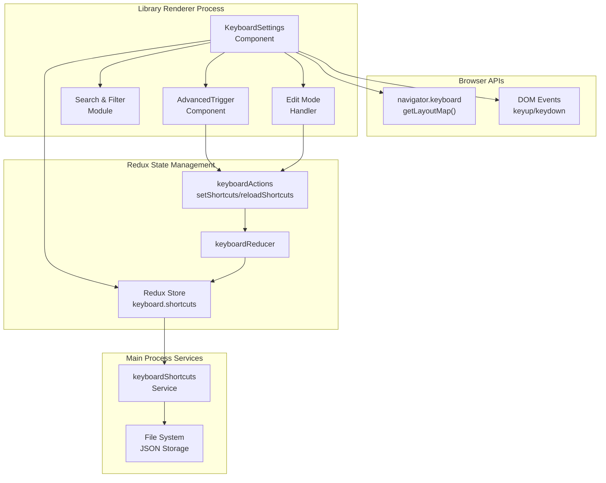
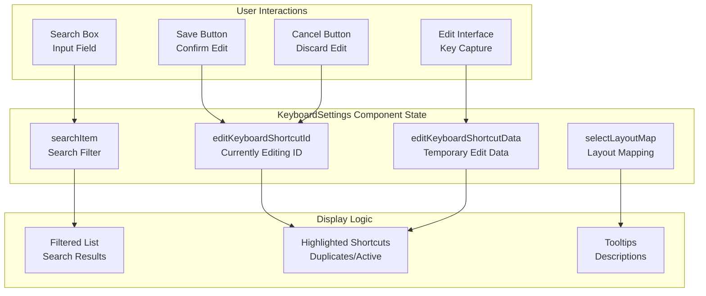
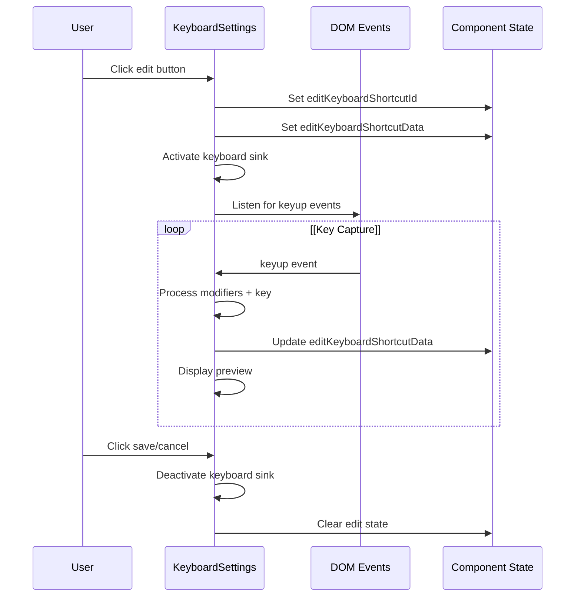
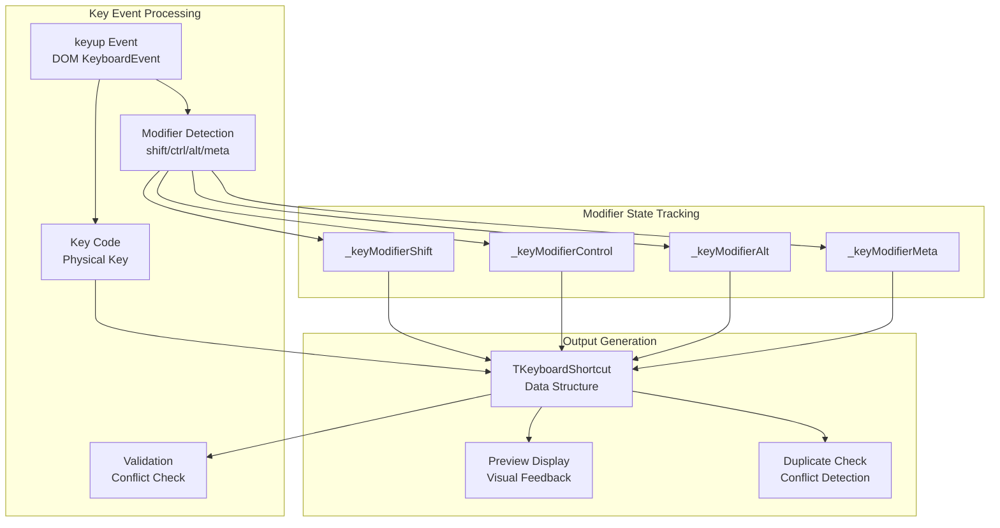
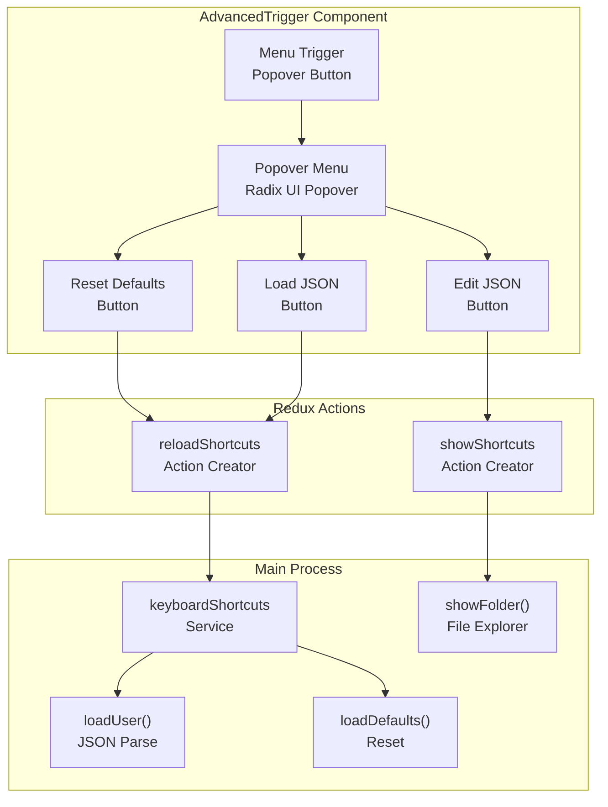
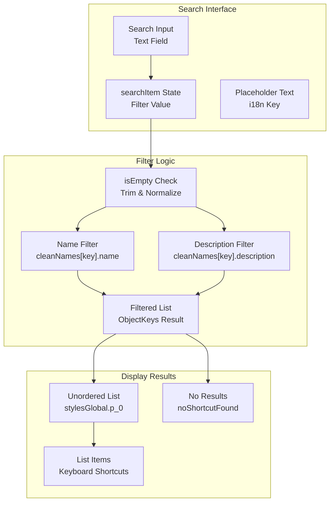
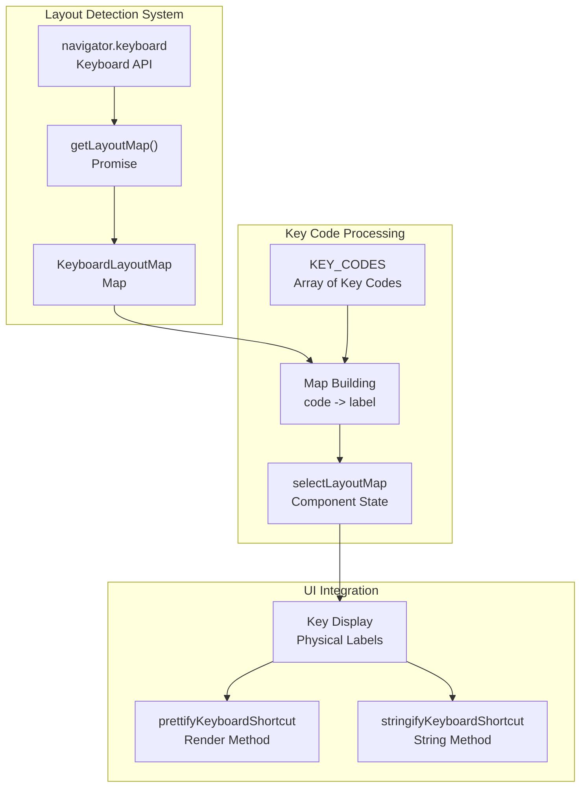
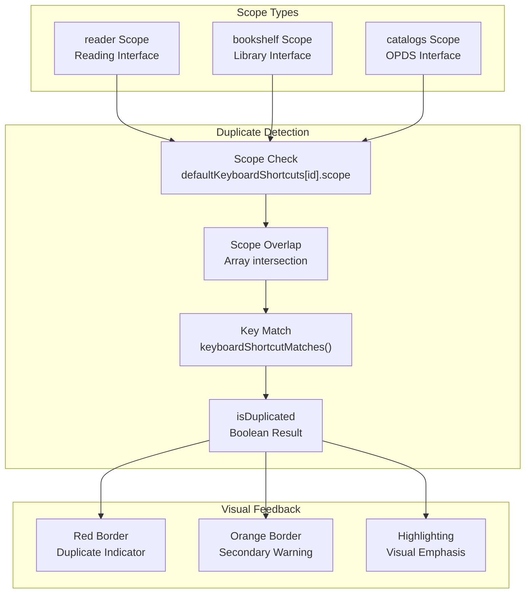
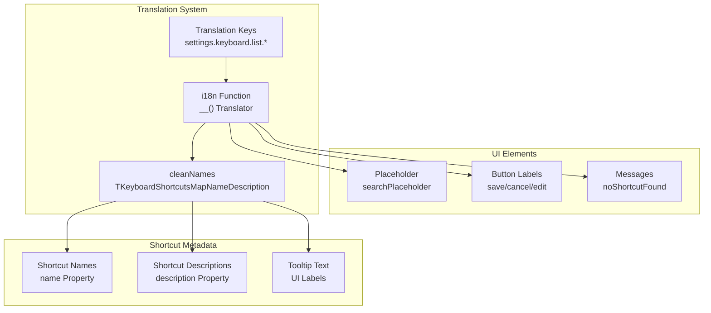

# Settings UI

> **Relevant source files**
> * [src/common/keyboard.ts](https://github.com/edrlab/thorium-reader/blob/02b67755/src/common/keyboard.ts)
> * [src/common/redux/actions/keyboard/setShortcuts.ts](https://github.com/edrlab/thorium-reader/blob/02b67755/src/common/redux/actions/keyboard/setShortcuts.ts)
> * [src/common/redux/reducers/keyboard.ts](https://github.com/edrlab/thorium-reader/blob/02b67755/src/common/redux/reducers/keyboard.ts)
> * [src/common/redux/states/keyboard.ts](https://github.com/edrlab/thorium-reader/blob/02b67755/src/common/redux/states/keyboard.ts)
> * [src/main/keyboard.ts](https://github.com/edrlab/thorium-reader/blob/02b67755/src/main/keyboard.ts)
> * [src/renderer/assets/icons/windows-icon.svg](https://github.com/edrlab/thorium-reader/blob/02b67755/src/renderer/assets/icons/windows-icon.svg)
> * [src/renderer/common/hooks/useKeyboardShortcut.ts](https://github.com/edrlab/thorium-reader/blob/02b67755/src/renderer/common/hooks/useKeyboardShortcut.ts)
> * [src/renderer/common/hooks/useSyncExternalStore.ts](https://github.com/edrlab/thorium-reader/blob/02b67755/src/renderer/common/hooks/useSyncExternalStore.ts)
> * [src/renderer/common/keyboard.ts](https://github.com/edrlab/thorium-reader/blob/02b67755/src/renderer/common/keyboard.ts)
> * [src/renderer/library/components/settings/KeyboardSettings.tsx](https://github.com/edrlab/thorium-reader/blob/02b67755/src/renderer/library/components/settings/KeyboardSettings.tsx)
> * [src/typings/keyboard.d.ts](https://github.com/edrlab/thorium-reader/blob/02b67755/src/typings/keyboard.d.ts)

This document covers the user interface components and systems for managing application settings, with primary focus on the keyboard shortcut configuration interface. The Settings UI provides users with the ability to view, edit, and manage their keyboard shortcuts through an interactive interface in the library renderer.

For information about the underlying keyboard shortcut state management and persistence, see [State Management](/edrlab/thorium-reader/6-state-management). For details about keyboard event handling and registration, see [Keyboard Shortcuts](/edrlab/thorium-reader/9-keyboard-shortcuts).

## Settings UI Architecture

The Settings UI system is built around the `KeyboardSettings` component, which provides a comprehensive interface for keyboard shortcut management. The system integrates with Redux state management for real-time updates and persistence.

Sources: [src/renderer/library/components/settings/KeyboardSettings.tsx L139-L643](https://github.com/edrlab/thorium-reader/blob/02b67755/src/renderer/library/components/settings/KeyboardSettings.tsx#L139-L643)

 [src/common/redux/reducers/keyboard.ts L14-L52](https://github.com/edrlab/thorium-reader/blob/02b67755/src/common/redux/reducers/keyboard.ts#L14-L52)

 [src/main/keyboard.ts L219-L237](https://github.com/edrlab/thorium-reader/blob/02b67755/src/main/keyboard.ts#L219-L237)

## Keyboard Settings Component Structure

The `KeyboardSettings` class component manages the complete keyboard shortcut configuration interface. It handles shortcut display, editing, validation, and user interaction.

### Core Component State

The component maintains several state properties for managing the editing workflow:

| State Property | Type | Purpose |
| --- | --- | --- |
| `displayKeyboardShortcuts` | boolean | Controls overall display visibility |
| `editKeyboardShortcutId` | `TKeyboardShortcutId \| undefined` | Currently edited shortcut ID |
| `editKeyboardShortcutData` | `TKeyboardShortcut \| undefined` | Temporary edit data |
| `searchItem` | `string \| undefined` | Search filter text |
| `selectLayoutMap` | `Map<string, string> \| null` | Keyboard layout mapping |

Sources: [src/renderer/library/components/settings/KeyboardSettings.tsx L77-L84](https://github.com/edrlab/thorium-reader/blob/02b67755/src/renderer/library/components/settings/KeyboardSettings.tsx#L77-L84)

 [src/renderer/library/components/settings/KeyboardSettings.tsx L144-L160](https://github.com/edrlab/thorium-reader/blob/02b67755/src/renderer/library/components/settings/KeyboardSettings.tsx#L144-L160)

## Keyboard Shortcut Editing Workflow

The keyboard shortcut editing system provides an inline editing interface with real-time key capture and validation.

### Edit Mode Activation

When a user clicks the edit button for a shortcut, the component enters edit mode:

Sources: [src/renderer/library/components/settings/KeyboardSettings.tsx L645-L720](https://github.com/edrlab/thorium-reader/blob/02b67755/src/renderer/library/components/settings/KeyboardSettings.tsx#L645-L720)

 [src/renderer/library/components/settings/KeyboardSettings.tsx L554-L568](https://github.com/edrlab/thorium-reader/blob/02b67755/src/renderer/library/components/settings/KeyboardSettings.tsx#L554-L568)

### Key Capture and Processing

The component implements sophisticated key capture logic that handles modifier keys and prevents conflicts:

Sources: [src/renderer/library/components/settings/KeyboardSettings.tsx L645-L720](https://github.com/edrlab/thorium-reader/blob/02b67755/src/renderer/library/components/settings/KeyboardSettings.tsx#L645-L720)

 [src/common/keyboard.ts L533-L541](https://github.com/edrlab/thorium-reader/blob/02b67755/src/common/keyboard.ts#L533-L541)

## Advanced Configuration Features

The `AdvancedTrigger` component provides additional keyboard shortcut management options through a dropdown menu interface.

### Advanced Menu Options

The advanced menu exposes three key operations:

| Action | Function | Purpose |
| --- | --- | --- |
| Reset Defaults | `reloadShortcuts(true)` | Restore factory defaults |
| Edit User JSON | `showShortcuts()` | Open JSON file in editor |
| Load User JSON | `reloadShortcuts(false)` | Reload from saved file |

Sources: [src/renderer/library/components/settings/KeyboardSettings.tsx L93-L136](https://github.com/edrlab/thorium-reader/blob/02b67755/src/renderer/library/components/settings/KeyboardSettings.tsx#L93-L136)

 [src/main/keyboard.ts L79-L89](https://github.com/edrlab/thorium-reader/blob/02b67755/src/main/keyboard.ts#L79-L89)

## Search and Filtering System

The keyboard settings interface includes a comprehensive search system that filters shortcuts by name and description:

### Search Implementation

Sources: [src/renderer/library/components/settings/KeyboardSettings.tsx L510-L517](https://github.com/edrlab/thorium-reader/blob/02b67755/src/renderer/library/components/settings/KeyboardSettings.tsx#L510-L517)

 [src/renderer/library/components/settings/KeyboardSettings.tsx L472-L478](https://github.com/edrlab/thorium-reader/blob/02b67755/src/renderer/library/components/settings/KeyboardSettings.tsx#L472-L478)

## Keyboard Layout Detection

The component integrates with the Keyboard API to provide accurate key labeling based on the user's physical keyboard layout:

Sources: [src/renderer/library/components/settings/KeyboardSettings.tsx L202-L227](https://github.com/edrlab/thorium-reader/blob/02b67755/src/renderer/library/components/settings/KeyboardSettings.tsx#L202-L227)

 [src/typings/keyboard.d.ts L1-L63](https://github.com/edrlab/thorium-reader/blob/02b67755/src/typings/keyboard.d.ts#L1-L63)

 [src/renderer/common/keyboard.ts L49-L60](https://github.com/edrlab/thorium-reader/blob/02b67755/src/renderer/common/keyboard.ts#L49-L60)

## Duplicate Detection and Validation

The settings UI includes sophisticated validation to detect and highlight duplicate keyboard shortcuts:

### Conflict Detection Logic

The system checks for shortcuts that share the same key combination within overlapping scopes:

Sources: [src/renderer/library/components/settings/KeyboardSettings.tsx L522-L527](https://github.com/edrlab/thorium-reader/blob/02b67755/src/renderer/library/components/settings/KeyboardSettings.tsx#L522-L527)

 [src/renderer/library/components/settings/KeyboardSettings.tsx L532-L533](https://github.com/edrlab/thorium-reader/blob/02b67755/src/renderer/library/components/settings/KeyboardSettings.tsx#L532-L533)

 [src/common/keyboard.ts L14-L17](https://github.com/edrlab/thorium-reader/blob/02b67755/src/common/keyboard.ts#L14-L17)

## Internationalization Integration

The keyboard settings interface fully supports internationalization with translatable labels, descriptions, and UI text:

### Translation Structure

The component uses a comprehensive translation mapping system:

Sources: [src/renderer/library/components/settings/KeyboardSettings.tsx L249-L470](https://github.com/edrlab/thorium-reader/blob/02b67755/src/renderer/library/components/settings/KeyboardSettings.tsx#L249-L470)

 [src/renderer/library/components/settings/KeyboardSettings.tsx L514](https://github.com/edrlab/thorium-reader/blob/02b67755/src/renderer/library/components/settings/KeyboardSettings.tsx#L514-L514)

 [src/renderer/library/components/settings/KeyboardSettings.tsx L52](https://github.com/edrlab/thorium-reader/blob/02b67755/src/renderer/library/components/settings/KeyboardSettings.tsx#L52-L52)