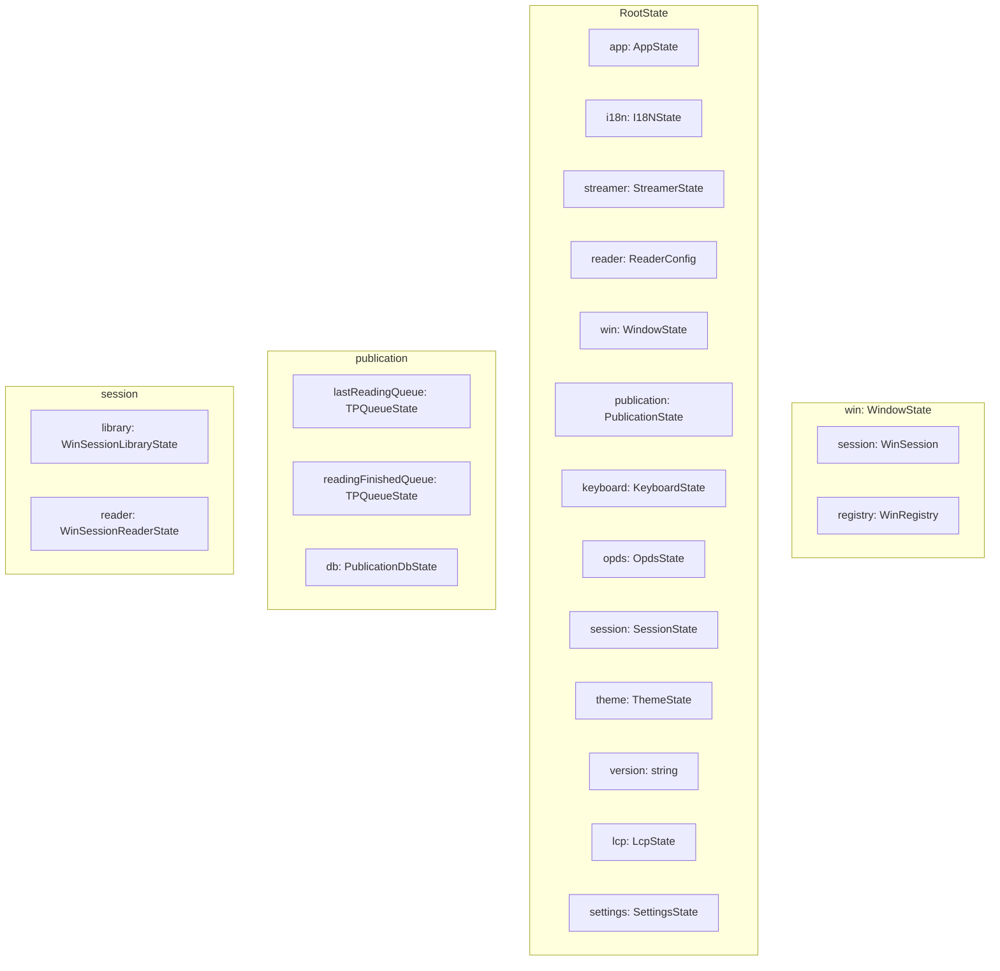
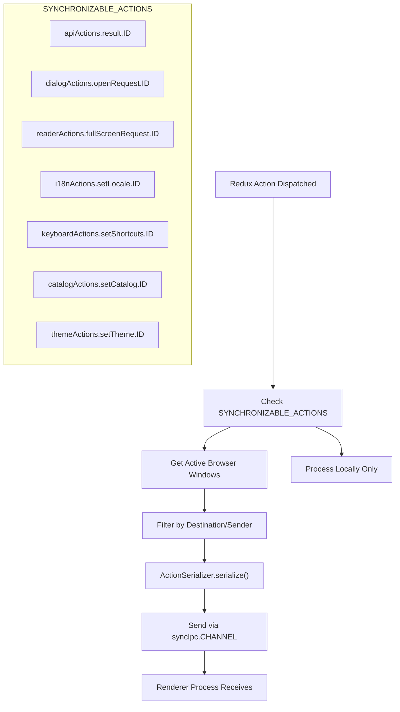
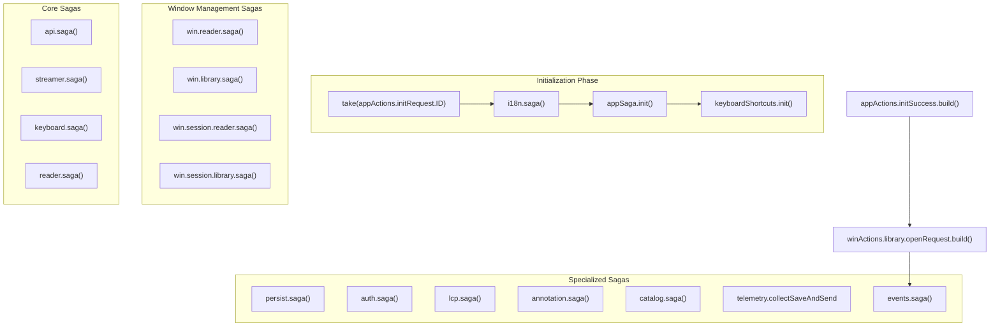
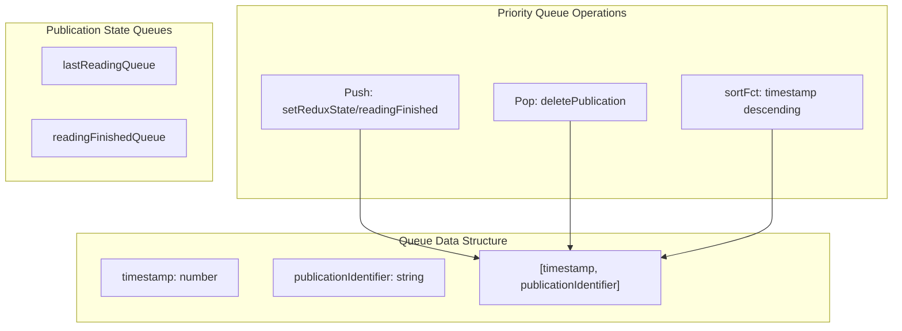

# State Management

> **Relevant source files**
> * [src/common/redux/actions/index.ts](https://github.com/edrlab/thorium-reader/blob/02b67755/src/common/redux/actions/index.ts)
> * [src/main/redux/middleware/sync.ts](https://github.com/edrlab/thorium-reader/blob/02b67755/src/main/redux/middleware/sync.ts)
> * [src/main/redux/reducers/index.ts](https://github.com/edrlab/thorium-reader/blob/02b67755/src/main/redux/reducers/index.ts)
> * [src/main/redux/sagas/index.ts](https://github.com/edrlab/thorium-reader/blob/02b67755/src/main/redux/sagas/index.ts)
> * [src/main/redux/states/index.ts](https://github.com/edrlab/thorium-reader/blob/02b67755/src/main/redux/states/index.ts)

This document covers the Redux-based state management architecture used throughout Thorium Reader. The state management system coordinates application state across Electron's multi-process architecture, synchronizing data between the main process and multiple renderer processes (library, reader, PDF viewer) via IPC communication.

For information about the overall application architecture, see [Application Architecture](/edrlab/thorium-reader/1.1-application-architecture). For details about inter-process communication patterns, see [Inter-Process Communication](/edrlab/thorium-reader/6.4-inter-process-communication).

## Architecture Overview

Thorium Reader implements a distributed Redux architecture where state is managed centrally in the main process and synchronized to renderer processes. The system uses Redux-Saga for side effects management and custom middleware for IPC synchronization.

```

```

Sources: [src/main/redux/middleware/sync.ts L1-L213](https://github.com/edrlab/thorium-reader/blob/02b67755/src/main/redux/middleware/sync.ts#L1-L213)

 [src/main/redux/sagas/index.ts L1-L271](https://github.com/edrlab/thorium-reader/blob/02b67755/src/main/redux/sagas/index.ts#L1-L271)

 [src/main/redux/reducers/index.ts L1-L111](https://github.com/edrlab/thorium-reader/blob/02b67755/src/main/redux/reducers/index.ts#L1-L111)

## Redux Store Structure

The main Redux store combines multiple state slices through the `rootReducer`. Each slice manages a specific domain of application state.



The `RootState` interface defines the complete application state structure, with a `PersistRootState` type identifying which portions are persisted to disk.

Sources: [src/main/redux/states/index.ts L24-L55](https://github.com/edrlab/thorium-reader/blob/02b67755/src/main/redux/states/index.ts#L24-L55)

 [src/main/redux/reducers/index.ts L36-L110](https://github.com/edrlab/thorium-reader/blob/02b67755/src/main/redux/reducers/index.ts#L36-L110)

## State Synchronization Between Processes

The `reduxSyncMiddleware` handles synchronization of specific actions between the main process and renderer processes. Only actions listed in `SYNCHRONIZABLE_ACTIONS` are broadcasted across process boundaries.



The middleware prevents action loops by checking the sender information and avoids sending actions back to their originating process.

Sources: [src/main/redux/middleware/sync.ts L28-L94](https://github.com/edrlab/thorium-reader/blob/02b67755/src/main/redux/middleware/sync.ts#L28-L94)

 [src/main/redux/middleware/sync.ts L96-L212](https://github.com/edrlab/thorium-reader/blob/02b67755/src/main/redux/middleware/sync.ts#L96-L212)

## Redux-Saga System

The `rootSaga` orchestrates multiple domain-specific sagas that handle side effects across the application. It follows a structured initialization sequence and runs sagas concurrently after app startup.



The saga system includes version checking functionality that compares the current application version against the latest available version from GitHub.

Sources: [src/main/redux/sagas/index.ts L47-L165](https://github.com/edrlab/thorium-reader/blob/02b67755/src/main/redux/sagas/index.ts#L47-L165)

 [src/main/redux/sagas/index.ts L167-L270](https://github.com/edrlab/thorium-reader/blob/02b67755/src/main/redux/sagas/index.ts#L167-L270)

## Action Types and Organization

Actions are organized into domain-specific modules and exported through a centralized index. The action system supports both local processing and cross-process synchronization.

| Action Category | Purpose | Key Actions |
| --- | --- | --- |
| `apiActions` | API request/response handling | `result`, `request` |
| `dialogActions` | Modal dialog management | `openRequest`, `closeRequest` |
| `readerActions` | Reading interface control | `fullScreenRequest`, `configSetDefault` |
| `i18nActions` | Internationalization | `setLocale` |
| `keyboardActions` | Keyboard shortcuts | `setShortcuts`, `showShortcuts` |
| `catalogActions` | OPDS catalog management | `setCatalog`, `setTagView` |
| `publicationActions` | Publication lifecycle | `readingFinished`, `deletePublication` |
| `sessionActions` | Session state | `save`, `enable` |
| `lcpActions` | DRM license management | `unlockPublicationWithPassphrase` |
| `annotationActions` | Note and bookmark system | `importTriggerModal` |

Actions implement a consistent pattern with action creators that include type-safe payloads and unique identifiers for synchronization.

Sources: [src/common/redux/actions/index.ts L32-L56](https://github.com/edrlab/thorium-reader/blob/02b67755/src/common/redux/actions/index.ts#L32-L56)

 [src/main/redux/middleware/sync.ts L28-L94](https://github.com/edrlab/thorium-reader/blob/02b67755/src/main/redux/middleware/sync.ts#L28-L94)

## Queue-Based Publication Management

The publication state includes specialized queue reducers that manage reading history and completion tracking using priority queue data structures.



The `priorityQueueReducer` maintains sorted queues of publications based on timestamps, enabling features like "recently read" and "recently finished" lists.

Sources: [src/main/redux/reducers/index.ts L61-L98](https://github.com/edrlab/thorium-reader/blob/02b67755/src/main/redux/reducers/index.ts#L61-L98)