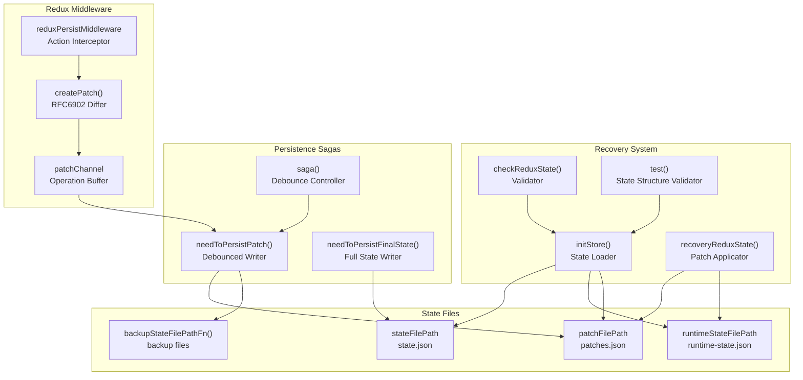
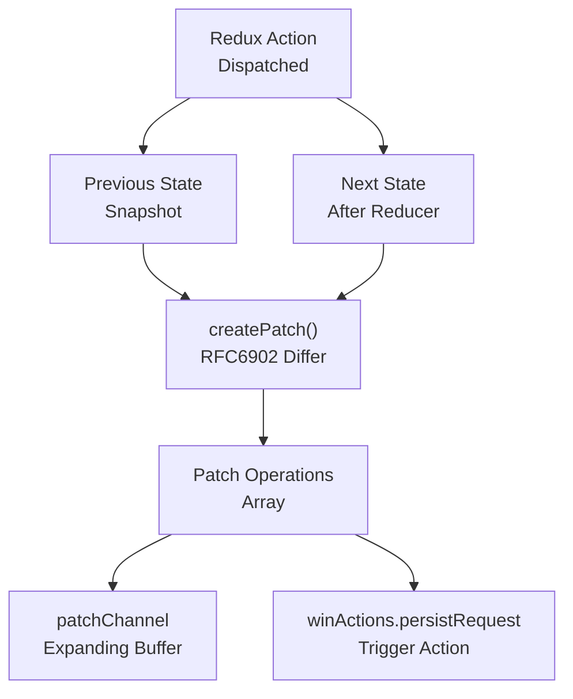
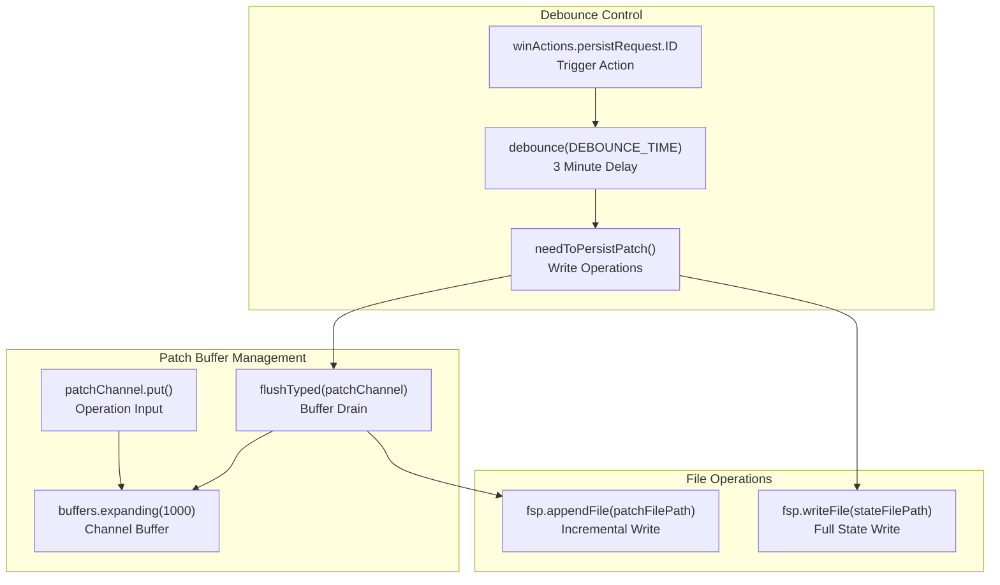
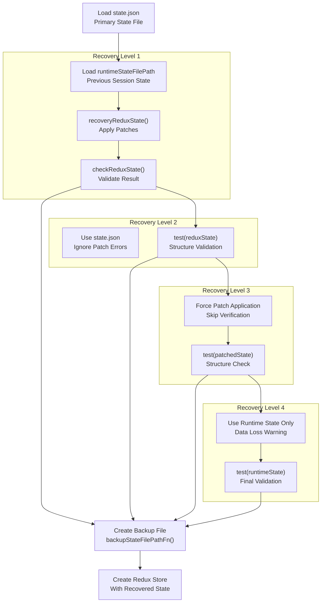
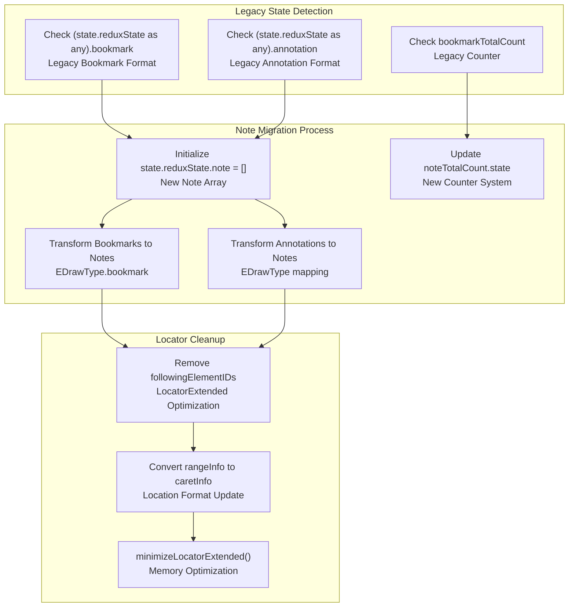
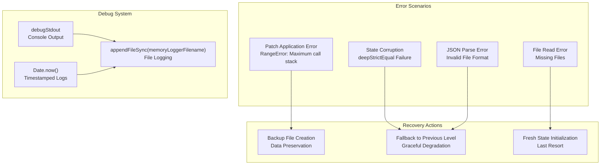

# State Persistence

> **Relevant source files**
> * [src/main/redux/actions/publication/addPublication.ts](https://github.com/edrlab/thorium-reader/blob/02b67755/src/main/redux/actions/publication/addPublication.ts)
> * [src/main/redux/middleware/persistence.ts](https://github.com/edrlab/thorium-reader/blob/02b67755/src/main/redux/middleware/persistence.ts)
> * [src/main/redux/sagas/patch.ts](https://github.com/edrlab/thorium-reader/blob/02b67755/src/main/redux/sagas/patch.ts)
> * [src/main/redux/sagas/persist.ts](https://github.com/edrlab/thorium-reader/blob/02b67755/src/main/redux/sagas/persist.ts)
> * [src/main/redux/store/memory.ts](https://github.com/edrlab/thorium-reader/blob/02b67755/src/main/redux/store/memory.ts)
> * [src/typings/lunr.d.ts](https://github.com/edrlab/thorium-reader/blob/02b67755/src/typings/lunr.d.ts)

The state persistence system in Thorium Reader provides reliable storage and recovery of application state across sessions. It uses a combination of full state snapshots, incremental patches based on RFC6902, and multi-level recovery mechanisms to ensure data integrity and prevent state corruption.

For information about the Redux store structure and initialization, see [Redux Store](/edrlab/thorium-reader/6.1-redux-store). For details about Redux sagas and asynchronous operations, see [Redux Sagas](/edrlab/thorium-reader/6.2-redux-sagas).

## Architecture Overview

The persistence system operates on three main components: full state snapshots, incremental patches, and recovery mechanisms. The system uses RFC6902 JSON patches to track state changes incrementally, with periodic full state dumps and multiple recovery strategies to handle corruption.



Sources: [src/main/redux/store/memory.ts L1-L474](https://github.com/edrlab/thorium-reader/blob/02b67755/src/main/redux/store/memory.ts#L1-L474)

 [src/main/redux/middleware/persistence.ts L1-L93](https://github.com/edrlab/thorium-reader/blob/02b67755/src/main/redux/middleware/persistence.ts#L1-L93)

 [src/main/redux/sagas/persist.ts L1-L94](https://github.com/edrlab/thorium-reader/blob/02b67755/src/main/redux/sagas/persist.ts#L1-L94)

## State File Structure

The persistence system manages multiple files to ensure data integrity and enable recovery from various failure scenarios.

| File Purpose | File Path Variable | Description |
| --- | --- | --- |
| Main State | `stateFilePath` | Complete application state snapshot |
| Runtime State | `runtimeStateFilePath` | Previous session state for patch application |
| Patch Operations | `patchFilePath` | RFC6902 operations for incremental updates |
| Backup Files | `backupStateFilePathFn()` | Emergency recovery copies |

The `PersistRootState` interface defines which parts of the application state are persisted:

```javascript
const persistNextState: PersistRootState = {    theme: nextState.theme,    win: nextState.win,    reader: nextState.reader,    i18n: nextState.i18n,    session: nextState.session,    publication: {        db: nextState.publication.db,        lastReadingQueue: nextState.publication.lastReadingQueue,        readingFinishedQueue: nextState.publication.readingFinishedQueue,    },    opds: nextState.opds,    version: nextState.version,    wizard: nextState.wizard,    settings: nextState.settings,    creator: nextState.creator,    noteExport: nextState.noteExport,};
```

Sources: [src/main/redux/middleware/persistence.ts L49-L67](https://github.com/edrlab/thorium-reader/blob/02b67755/src/main/redux/middleware/persistence.ts#L49-L67)

 [src/main/di L12-L13](https://github.com/edrlab/thorium-reader/blob/02b67755/src/main/di#L12-L13)

## RFC6902 Patch System

The middleware intercepts every Redux action and creates RFC6902 patches representing the difference between previous and next state. These patches are buffered and periodically flushed to disk.



The `reduxPersistMiddleware` operates as follows:

1. Captures state before action processing
2. Allows action to proceed through reducers
3. Captures state after action processing
4. Creates RFC6902 patch between states using `createPatch()`
5. Puts operations into `patchChannel` buffer
6. Dispatches `winActions.persistRequest` to trigger persistence

Sources: [src/main/redux/middleware/persistence.ts L18-L92](https://github.com/edrlab/thorium-reader/blob/02b67755/src/main/redux/middleware/persistence.ts#L18-L92)

 [src/main/redux/sagas/patch.ts L11](https://github.com/edrlab/thorium-reader/blob/02b67755/src/main/redux/sagas/patch.ts#L11-L11)

## Debounced Persistence

The persistence system uses a debounced approach to avoid excessive disk I/O while ensuring data safety. The `DEBOUNCE_TIME` is set to 3 minutes.



Sources: [src/main/redux/sagas/persist.ts L19](https://github.com/edrlab/thorium-reader/blob/02b67755/src/main/redux/sagas/persist.ts#L19-L19)

 [src/main/redux/sagas/persist.ts L87-L93](https://github.com/edrlab/thorium-reader/blob/02b67755/src/main/redux/sagas/persist.ts#L87-L93)

 [src/main/redux/sagas/patch.ts L8-L11](https://github.com/edrlab/thorium-reader/blob/02b67755/src/main/redux/sagas/patch.ts#L8-L11)

## Multi-Level Recovery System

The `initStore()` function implements a 4-level recovery system to handle various corruption scenarios:



Recovery levels and their purposes:

1. **Level 1**: `runtimeState + patches = currentState` with verification
2. **Level 2**: Use `state.json` directly when patches fail verification
3. **Level 3**: Force patch application without verification
4. **Level 4**: Use runtime state only (potential data loss)

Sources: [src/main/redux/store/memory.ts L98-L214](https://github.com/edrlab/thorium-reader/blob/02b67755/src/main/redux/store/memory.ts#L98-L214)

 [src/main/redux/store/memory.ts L131-L180](https://github.com/edrlab/thorium-reader/blob/02b67755/src/main/redux/store/memory.ts#L131-L180)

## State Migration System

The initialization process includes extensive migration logic to handle format changes between Thorium versions, particularly the migration from separate bookmark and annotation systems to a unified note system.



Key migration operations:

* **Bookmark to Note**: Converts legacy bookmark format to unified note system with `EDrawType.bookmark`
* **Annotation to Note**: Migrates annotations with proper draw type mapping
* **Locator Optimization**: Removes `followingElementIDs` and converts `rangeInfo` to `caretInfo`
* **Counter Migration**: Updates from `bookmarkTotalCount` to `noteTotalCount`

Sources: [src/main/redux/store/memory.ts L247-L448](https://github.com/edrlab/thorium-reader/blob/02b67755/src/main/redux/store/memory.ts#L247-L448)

 [src/main/redux/store/memory.ts L366-L427](https://github.com/edrlab/thorium-reader/blob/02b67755/src/main/redux/store/memory.ts#L366-L427)

## Error Handling and Logging

The persistence system includes comprehensive error handling and debug logging to aid in troubleshooting state corruption issues.



Error handling strategies:

* **Patch Errors**: Caught and logged, fallback to next recovery level
* **State Validation**: Uses `deepStrictEqual()` for strict state comparison
* **File Operations**: Wrapped in `tryCatch()` helpers with fallback values
* **Debug Logging**: Timestamped logs to both console and file system

Sources: [src/main/redux/store/memory.ts L35-L43](https://github.com/edrlab/thorium-reader/blob/02b67755/src/main/redux/store/memory.ts#L35-L43)

 [src/main/redux/store/memory.ts L76-L81](https://github.com/edrlab/thorium-reader/blob/02b67755/src/main/redux/store/memory.ts#L76-L81)

 [src/main/redux/store/memory.ts L132-L192](https://github.com/edrlab/thorium-reader/blob/02b67755/src/main/redux/store/memory.ts#L132-L192)