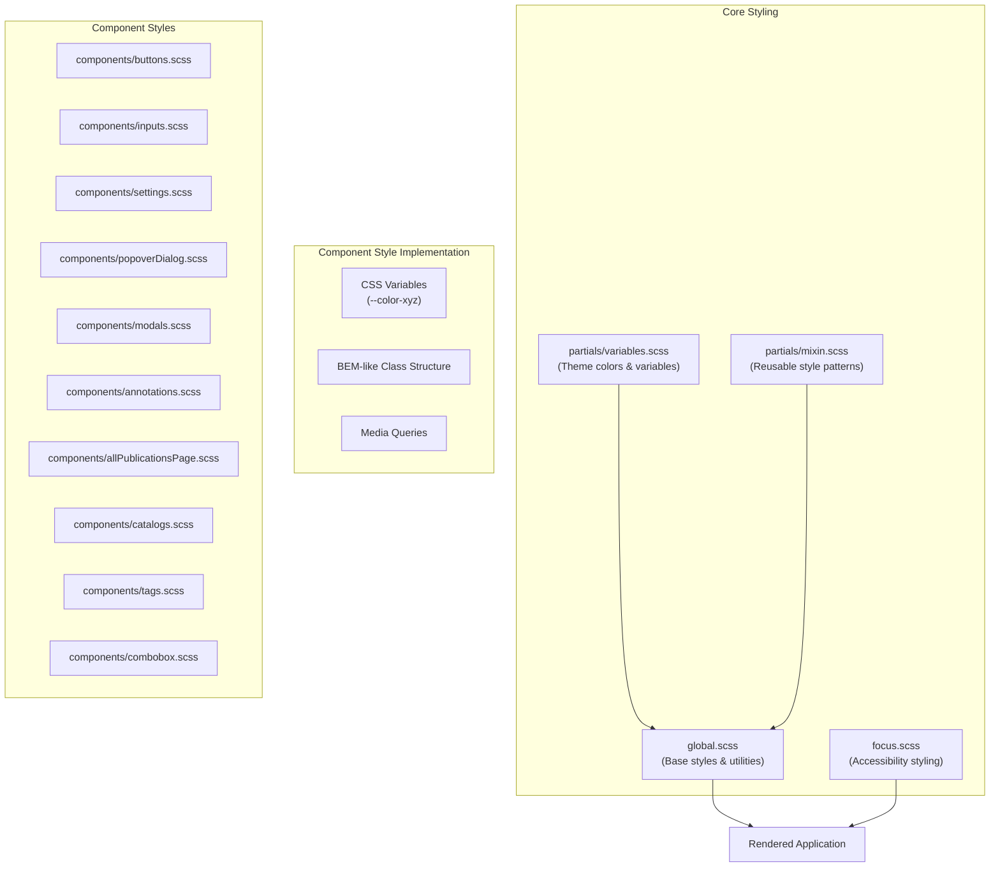
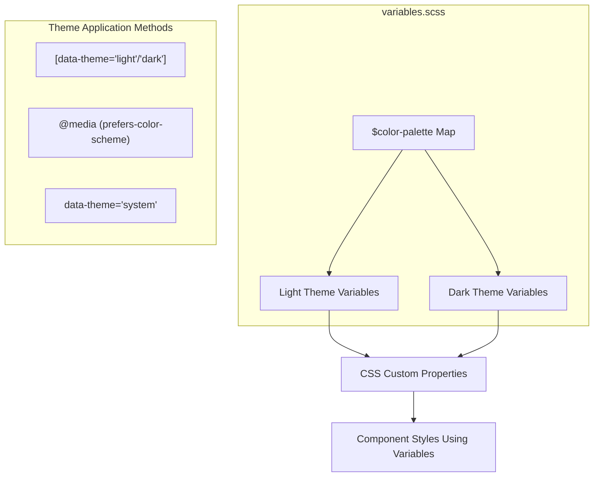
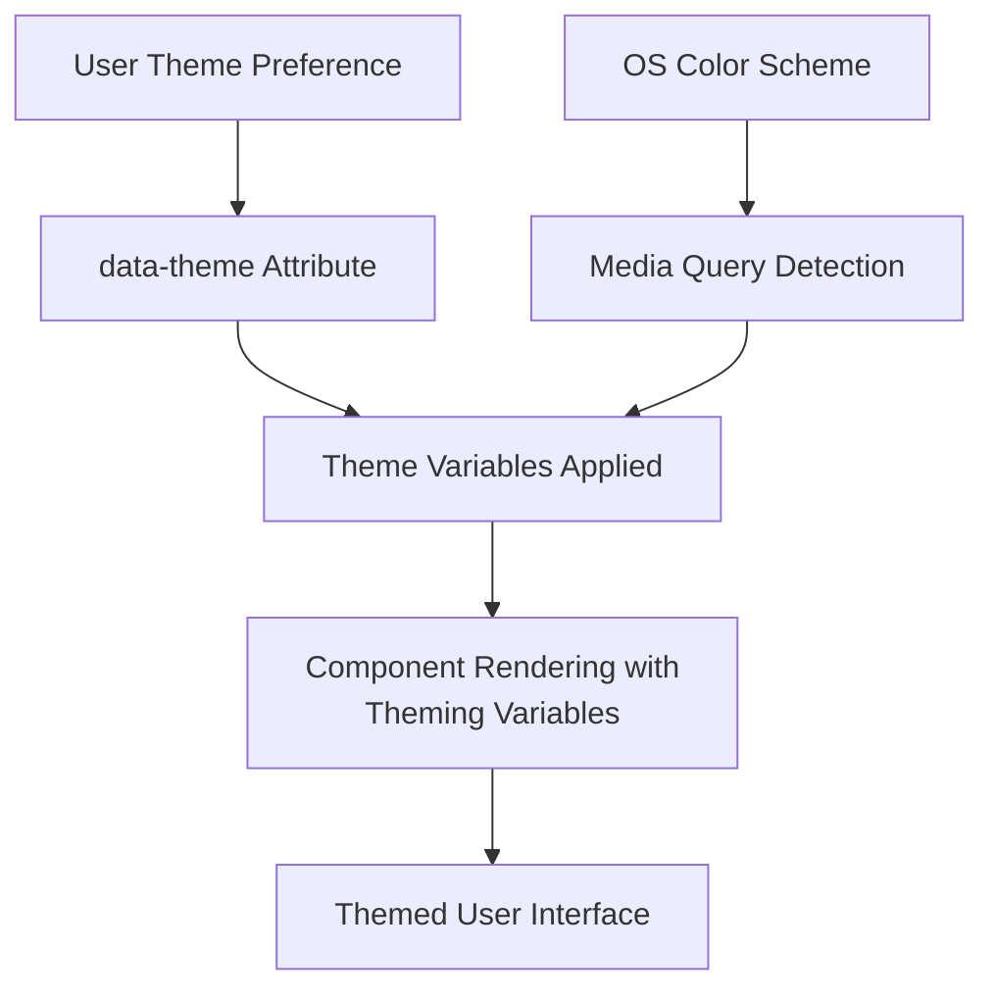

# Styling System

> **Relevant source files**
> * [scripts/translator-key-type.js](https://github.com/edrlab/thorium-reader/blob/02b67755/scripts/translator-key-type.js)
> * [src/renderer/assets/styles/components/allPublicationsPage.scss](https://github.com/edrlab/thorium-reader/blob/02b67755/src/renderer/assets/styles/components/allPublicationsPage.scss)
> * [src/renderer/assets/styles/components/allPublicationsPage.scss.d.ts](https://github.com/edrlab/thorium-reader/blob/02b67755/src/renderer/assets/styles/components/allPublicationsPage.scss.d.ts)
> * [src/renderer/assets/styles/components/breadcrumb.scss.d.ts](https://github.com/edrlab/thorium-reader/blob/02b67755/src/renderer/assets/styles/components/breadcrumb.scss.d.ts)
> * [src/renderer/assets/styles/components/catalogs.scss.d.ts](https://github.com/edrlab/thorium-reader/blob/02b67755/src/renderer/assets/styles/components/catalogs.scss.d.ts)
> * [src/renderer/assets/styles/components/columns.scss](https://github.com/edrlab/thorium-reader/blob/02b67755/src/renderer/assets/styles/components/columns.scss)
> * [src/renderer/assets/styles/components/combobox.scss.d.ts](https://github.com/edrlab/thorium-reader/blob/02b67755/src/renderer/assets/styles/components/combobox.scss.d.ts)
> * [src/renderer/assets/styles/components/modals.scss.d.ts](https://github.com/edrlab/thorium-reader/blob/02b67755/src/renderer/assets/styles/components/modals.scss.d.ts)
> * [src/renderer/assets/styles/components/settings.scss.d.ts](https://github.com/edrlab/thorium-reader/blob/02b67755/src/renderer/assets/styles/components/settings.scss.d.ts)
> * [src/renderer/common/components/dialog/publicationInfos/PublicationInfoDescription.tsx](https://github.com/edrlab/thorium-reader/blob/02b67755/src/renderer/common/components/dialog/publicationInfos/PublicationInfoDescription.tsx)
> * [src/renderer/common/components/dialog/publicationInfos/formatPublisherDate.tsx](https://github.com/edrlab/thorium-reader/blob/02b67755/src/renderer/common/components/dialog/publicationInfos/formatPublisherDate.tsx)
> * [src/renderer/common/components/dialog/publicationInfos/publicationInfoA11y.tsx](https://github.com/edrlab/thorium-reader/blob/02b67755/src/renderer/common/components/dialog/publicationInfos/publicationInfoA11y.tsx)
> * [src/renderer/common/components/dialog/publicationInfos/publicationInfoContent.tsx](https://github.com/edrlab/thorium-reader/blob/02b67755/src/renderer/common/components/dialog/publicationInfos/publicationInfoContent.tsx)
> * [src/renderer/common/components/hoc/translator.tsx](https://github.com/edrlab/thorium-reader/blob/02b67755/src/renderer/common/components/hoc/translator.tsx)
> * [src/renderer/library/components/searchResult/AllPublicationPage.tsx](https://github.com/edrlab/thorium-reader/blob/02b67755/src/renderer/library/components/searchResult/AllPublicationPage.tsx)

## Purpose and Scope

The Thorium Reader styling system provides a cohesive visual framework for the application interface. It implements theming (light/dark), component styling, and responsive design across the various views of the application. This document details the structure of the styling codebase, theming architecture, and the component styling methodology.

For information about specific UI components, see [UI Components](/edrlab/thorium-reader/8.1-ui-components). For information about the Dialog System, see [Dialog System](/edrlab/thorium-reader/8.3-styling-system).

## Architecture Overview

The styling system is organized into a hierarchy of SCSS files that follow a modular structure:



Sources: [src/renderer/assets/styles/global.scss](https://github.com/edrlab/thorium-reader/blob/02b67755/src/renderer/assets/styles/global.scss)

 [src/renderer/assets/styles/partials/variables.scss](https://github.com/edrlab/thorium-reader/blob/02b67755/src/renderer/assets/styles/partials/variables.scss)

 [src/renderer/assets/styles/components/](https://github.com/edrlab/thorium-reader/blob/02b67755/src/renderer/assets/styles/components/)

## Theming System

Thorium Reader implements theming through CSS variables with light and dark color palettes:



The theme system is defined in the `variables.scss` file, which creates a Sass map with color definitions for both light and dark themes. These are then exposed as CSS custom properties:

```
$color-palette: (  light: (    --color-primary: #4d4d4d,    --color-secondary: #fff,    --color-blue: #1053C8,    --color-light-blue: #ECF2FD,    // More color variables...  ),  dark: (    --color-primary: #e7eaf8,    --color-secondary: #1D1D1E,    --color-blue: #99A9E3,    --color-light-blue: #2D2D2D,    // More color variables...  ),);
```

The themes are applied using:

1. `data-theme` attribute on the body (`light`, `dark`, or `system`)
2. Media queries to detect system color scheme preference
3. CSS variable usage in component styles (`var(--color-primary)`)

Sources: [src/renderer/assets/styles/partials/variables.scss L8-L92](https://github.com/edrlab/thorium-reader/blob/02b67755/src/renderer/assets/styles/partials/variables.scss#L8-L92)

## Component Styling Structure

Component styles follow a consistent organizational pattern with nested SCSS structure:

| File | Description | Key Classes | Usage Pattern |
| --- | --- | --- | --- |
| `allPublicationsPage.scss` | Publication table & grid display | `allBooks_header`, `cell_coverImg`, `showColFilters_wrapper`, `allBook_table_body` | `stylesPublication.allBooks_header` |
| `modals.scss` | Modal dialogs | `modal_dialog`, `modal_dialog_body_cover`, `modal_dialog_overlay` | `stylesModals.modal_dialog` |
| `settings.scss` | Settings panels | `settings_container`, `settings_tabslist`, `display_options_item` | `stylesSettings.settings_container` |
| `buttons.scss` | Button variants | `button_primary_blue`, `button_secondary_blue`, `button_transparency` | `stylesButtons.button_primary_blue` |
| `inputs.scss` | Form controls | `form_group`, `form_group_allPubSearch` | `stylesInput.form_group` |
| `publicationInfos.scss` | Publication metadata display | `publicationInfo_container`, `book_title`, `accessibility_infos` | `stylePublication.publicationInfo_container` |
| `combobox.scss` | React Aria ComboBox | `react_aria_ComboBox`, `my_combobox_container`, `my_item` | `stylesComboBox.react_aria_ComboBox` |

### SCSS Nesting Structure

Components use nested SCSS syntax for hierarchical organization:

```css
.allBooks {    &_header {        font-size: 20px;        &_navigation {            background-color: var(--color-extralight-grey);            &_inputs {                display: flex;                gap: 10px;            }            &_pagination {                display: flex;                flex-direction: column;            }        }    }}
```

This generates flattened CSS classes: `allBooks_header`, `allBooks_header_navigation`, `allBooks_header_navigation_inputs`, etc.

Sources: [src/renderer/assets/styles/components/allPublicationsPage.scss L7-L165](https://github.com/edrlab/thorium-reader/blob/02b67755/src/renderer/assets/styles/components/allPublicationsPage.scss#L7-L165)

 [src/renderer/assets/styles/components/modals.scss](https://github.com/edrlab/thorium-reader/blob/02b67755/src/renderer/assets/styles/components/modals.scss)

 [src/renderer/library/components/searchResult/AllPublicationPage.tsx L10-L16](https://github.com/edrlab/thorium-reader/blob/02b67755/src/renderer/library/components/searchResult/AllPublicationPage.tsx#L10-L16)

## Component Style Pattern

Components follow a standardized pattern for SCSS organization:

1. **Style Section Markers**: Each component file uses CSS comments as markers: ``` .CSS_START_components_allPublicationsPage { display: none; }// Actual component styles....CSS_END_components_allPublicationsPage { display: none; } ```
2. **BEM-like Naming Conventions**: Class names follow a Block-Element-Modifier pattern: ``` .showColFilters {    &_wrapper {        display: flex;        align-items: center;        .showColFilters_input {            border: 1px solid var(--color-blue);        }    }} ```
3. **CSS Variable Usage**: Components use theme variables throughout: ```css .allBooks_header_navigation {    background-color: var(--color-extralight-grey);    border-radius: 6px;} .cell_link {    text-decoration: underline;    color: var(--color-primary);} ```
4. **Responsive Design**: Media queries adapt layouts for different screen sizes: ``` @media screen and (width <= 1072px) {    .allBooks_header_navigation {        height: 125px;    }    .allBook_table_wrapper {        inset: 280px 20px 75px 26px;    }} ```
5. **Class Composition in Components**: React components combine multiple CSS classes: ```html <div className={classNames(    stylesInput.form_group,     stylesInput.form_group_allPubSearch)}> <div className={classNames(    stylesPublication.cell_wrapper,     stylesPublication.cell_multi_langs)}> ```

Sources: [src/renderer/assets/styles/components/allPublicationsPage.scss L3-L6](https://github.com/edrlab/thorium-reader/blob/02b67755/src/renderer/assets/styles/components/allPublicationsPage.scss#L3-L6)

 [src/renderer/assets/styles/components/allPublicationsPage.scss L190-L212](https://github.com/edrlab/thorium-reader/blob/02b67755/src/renderer/assets/styles/components/allPublicationsPage.scss#L190-L212)

 [src/renderer/library/components/searchResult/AllPublicationPage.tsx L401](https://github.com/edrlab/thorium-reader/blob/02b67755/src/renderer/library/components/searchResult/AllPublicationPage.tsx#L401-L401)

## Utility System

The styling system includes several utility patterns:

### 1. Global Utility Classes

Defined in `global.scss` for quick styling:

```
.d_flex { display: flex; }.justify_content_between { justify-content: space-between; }.align_items_center { align-items: center; }.flex_wrap { flex-wrap: wrap; }.text_center { text-align: center; }.fw_bold { font-weight: 700; }
```

### 2. Mixins

Reusable style patterns defined in `partials/mixin.scss`:

```css
@mixin scrollbar_styling {  &::-webkit-scrollbar {    width: 8px;  }  &::-webkit-scrollbar-thumb {    background-color: var(--scrollbar-thumb);    border-radius: 4px;  }} @mixin R2_MIXIN_FOCUS_OUTLINE {  outline: var(--color-blue) solid 2px !important;}
```

Used throughout components for consistent styling:

```css
.allBook_table_wrapper {  overflow: auto;  @include mx.scrollbar_styling;    &::-webkit-scrollbar {    width: 10px;    height: 10px;    background-color: var(--color-secondary);  }} .cell_wrapper {  &:hover {    &::-webkit-scrollbar-thumb {      background-color: var(--color-blue);    }  }  @include mx.scrollbar_styling;}
```

Sources: [src/renderer/assets/styles/components/allPublicationsPage.scss L346-L361](https://github.com/edrlab/thorium-reader/blob/02b67755/src/renderer/assets/styles/components/allPublicationsPage.scss#L346-L361)

 [src/renderer/assets/styles/components/allPublicationsPage.scss L275](https://github.com/edrlab/thorium-reader/blob/02b67755/src/renderer/assets/styles/components/allPublicationsPage.scss#L275-L275)

## CSS Module Integration

The styling system uses CSS modules to provide type-safe, scoped styling in React components. Each SCSS file generates a TypeScript declaration file (`.d.ts`) that exports class names as string constants:

```javascript
// allPublicationsPage.scss.d.tsexport declare const allBooks_header: string;export declare const cell_coverImg: string;export declare const showColFilters_wrapper: string;export declare const form_group: string;
```

### Import Pattern

Components import SCSS files as module objects, creating a namespace for CSS classes:

```javascript
// AllPublicationPage.tsximport * as stylesPublication from "readium-desktop/renderer/assets/styles/components/allPublicationsPage.scss";import * as stylesInput from "readium-desktop/renderer/assets/styles/components/inputs.scss";import * as stylesButtons from "readium-desktop/renderer/assets/styles/components/buttons.scss";
```

### Usage Pattern

CSS classes are accessed as properties of the imported style objects:

```python
// Single class usage<div className={stylesPublication.allBooks_header}> // Multiple class composition using classNames utility<div className={classNames(stylesInput.form_group, stylesInput.form_group_allPubSearch)}> // Conditional class application<div className={classNames(    stylesBookDetailsDialog.descriptionWrapper,    this.state.seeMore && stylesBookDetailsDialog.seeMore)}>
```

This pattern provides:

* **Type Safety**: Invalid class names cause TypeScript errors
* **Scoping**: CSS classes are automatically scoped to prevent conflicts
* **Refactoring Safety**: Renaming CSS classes updates references automatically
* **Auto-completion**: IDEs provide intellisense for available class names

Sources: [src/renderer/library/components/searchResult/AllPublicationPage.tsx L10-L16](https://github.com/edrlab/thorium-reader/blob/02b67755/src/renderer/library/components/searchResult/AllPublicationPage.tsx#L10-L16)

 [src/renderer/common/components/dialog/publicationInfos/publicationInfoContent.tsx L8-L11](https://github.com/edrlab/thorium-reader/blob/02b67755/src/renderer/common/components/dialog/publicationInfos/publicationInfoContent.tsx#L8-L11)

 [src/renderer/assets/styles/components/allPublicationsPage.scss.d.ts](https://github.com/edrlab/thorium-reader/blob/02b67755/src/renderer/assets/styles/components/allPublicationsPage.scss.d.ts)

## Specialized Content Styling

Thorium Reader includes specialized styling for specific content types:

### Markdown Content Styling

The `github-markdown.scss` file provides styling for rendering markdown content in the application, based on GitHub's markdown styling:

```sql
.markdown-body {  text-size-adjust: 100%;  margin: 0;  color: var(--fgColor-default);  background-color: var(--color-annotations-bg);  font-family: -apple-system,BlinkMacSystemFont,"Segoe UI",...;  line-height: 1.5;  word-wrap: break-word;  user-select: text;  font-size: unset;  margin-top: 10px;  margin-bottom: 10px;}
```

This styling is used for rendering annotation content, notes, and other markdown text in the application.

Sources: [src/renderer/assets/styles/github-markdown.scss](https://github.com/edrlab/thorium-reader/blob/02b67755/src/renderer/assets/styles/github-markdown.scss)

 [src/common/readium/annotation/htmlTemplate.ts](https://github.com/edrlab/thorium-reader/blob/02b67755/src/common/readium/annotation/htmlTemplate.ts)

## Theme Application Flow

The process of applying themes to the application follows this lifecycle:



1. User can select a theme preference (light/dark/system)
2. The preference is applied as a `data-theme` attribute on the document
3. If using system preference, media queries detect the OS color scheme
4. Theme variables are resolved based on these preferences
5. Components render using the resolved theme variables

Sources: [src/renderer/assets/styles/partials/variables.scss L94-L138](https://github.com/edrlab/thorium-reader/blob/02b67755/src/renderer/assets/styles/partials/variables.scss#L94-L138)

## Theming Implementation Details

The theme implementation uses a combination of CSS selectors to apply theme variables:

```css
/* System preference detection */@media (prefers-color-scheme: light) {  :root {    --color-primary: #4d4d4d;    --color-secondary: #fff;    /* More variables... */  }} /* Explicit theme selection */[data-theme="light"] {  --color-primary: #4d4d4d;  --color-secondary: #fff;  /* More variables... */} [data-theme="dark"] {  --color-primary: #e7eaf8;  --color-secondary: #1D1D1E;  /* More variables... */} /* System theme with OS preference */[data-theme="system"] {  @media (prefers-color-scheme: dark) {    /* Dark theme variables... */  }}
```

This approach allows for both explicit theme selection and system preference detection.

Sources: [src/renderer/assets/styles/partials/variables.scss L98-L138](https://github.com/edrlab/thorium-reader/blob/02b67755/src/renderer/assets/styles/partials/variables.scss#L98-L138)

## Dark Mode Considerations

The dark mode styling has special considerations for certain elements:

```css
[data-theme="dark"] {  .button_transparency_icon:not([data-css-override]) svg {    color: var(--color-primary);    fill: var(--color-primary);  }} [data-theme="system"] {  @media (prefers-color-scheme: dark) {    .button_transparency_icon:not([data-css-override]) svg {      color: var(--color-primary);      fill: var(--color-primary);    }  }}
```

Some components require specific overrides in dark mode to maintain proper contrast and visibility.

Sources: [src/renderer/assets/styles/components/settings.scss L270-L283](https://github.com/edrlab/thorium-reader/blob/02b67755/src/renderer/assets/styles/components/settings.scss#L270-L283)

## Conclusion

The Thorium Reader styling system provides a comprehensive approach to application styling through:

1. **Modular Organization**: Component-specific SCSS files maintain separation of concerns
2. **Theming Support**: CSS variables enable light/dark mode theming
3. **Responsive Design**: Media queries adapt the interface to different screen sizes
4. **TypeScript Integration**: Type definitions enable type-safe styling references
5. **Utility Patterns**: Mixins and utility classes promote consistency and reduce duplication

This architecture allows for maintainable styling that can adapt to different themes, screen sizes, and accessibility requirements.