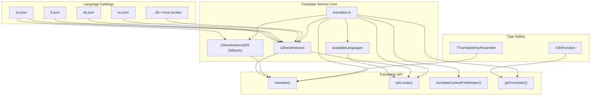
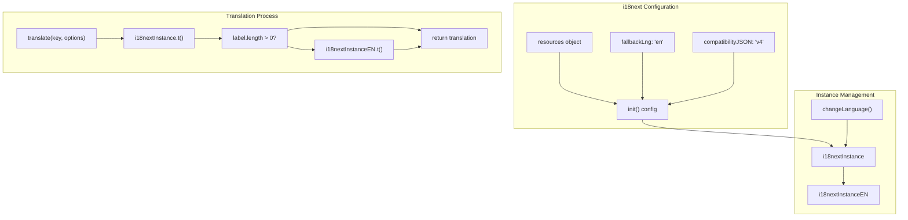
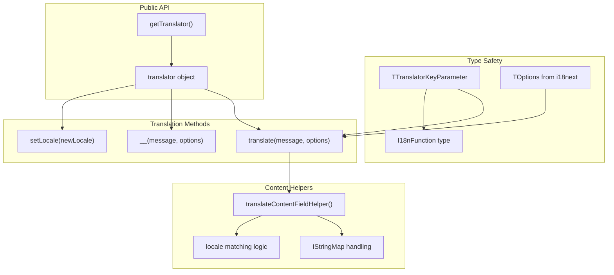
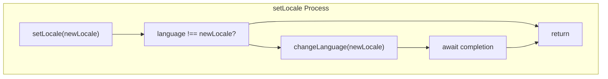
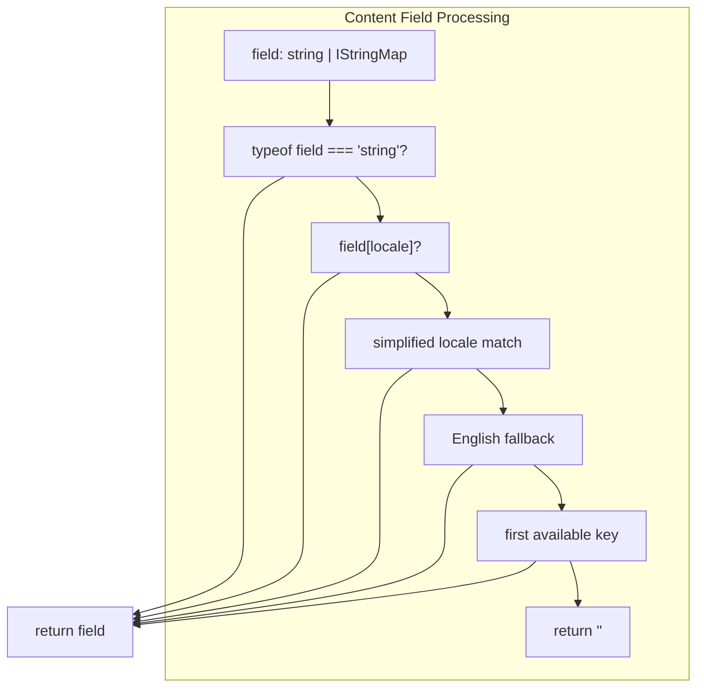
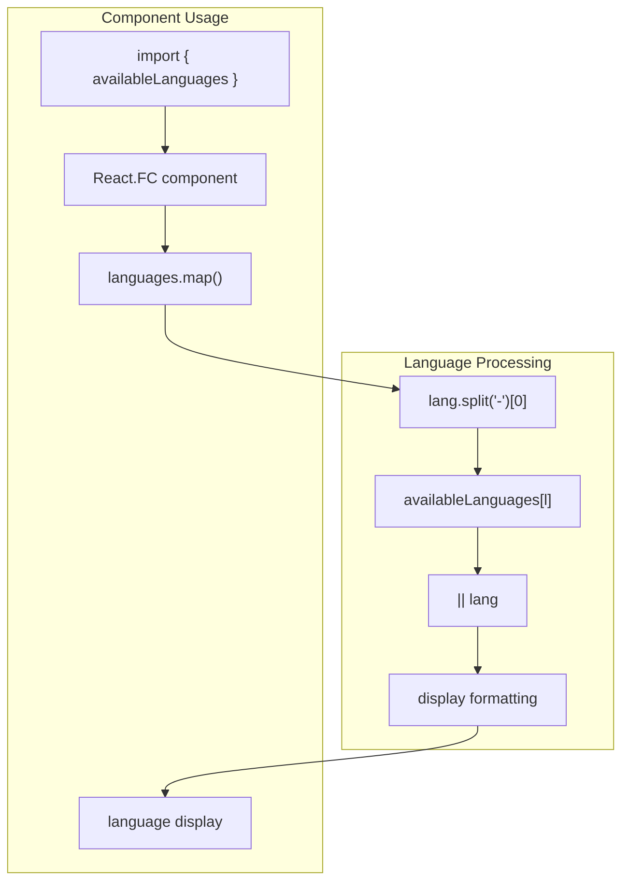

# Translator Service

> **Relevant source files**
> * [scripts/csvToJson.py](https://github.com/edrlab/thorium-reader/blob/02b67755/scripts/csvToJson.py)
> * [scripts/readme.md](https://github.com/edrlab/thorium-reader/blob/02b67755/scripts/readme.md?plain=1)
> * [src/common/services/translator.ts](https://github.com/edrlab/thorium-reader/blob/02b67755/src/common/services/translator.ts)
> * [src/renderer/common/components/dialog/publicationInfos/formatPublicationLanguage.tsx](https://github.com/edrlab/thorium-reader/blob/02b67755/src/renderer/common/components/dialog/publicationInfos/formatPublicationLanguage.tsx)

The Translator Service provides internationalization (i18n) capabilities for Thorium Reader, supporting 39+ languages through type-safe translation functions. It implements a wrapper around i18next with fallback mechanisms, multi-language content handling, and seamless integration across main and renderer processes.

For general internationalization overview including locale files, see [Internationalization](/edrlab/thorium-reader/7-internationalization). For language selection UI, see [Language Selection](/edrlab/thorium-reader/7.3-language-selection).

## Core Architecture

The translator service is built on top of i18next and provides a centralized translation system with English fallback support. It loads all language catalogs at initialization and provides type-safe translation functions throughout the application.



Sources: [src/common/services/translator.ts L1-L285](https://github.com/edrlab/thorium-reader/blob/02b67755/src/common/services/translator.ts#L1-L285)

## i18next Integration

The service creates two i18next instances for robust translation handling with fallback support. The main instance handles the current locale while a dedicated English instance ensures fallback translations are always available.



Sources: [src/common/services/translator.ts L45-L174](https://github.com/edrlab/thorium-reader/blob/02b67755/src/common/services/translator.ts#L45-L174)

 [src/common/services/translator.ts L176-L181](https://github.com/edrlab/thorium-reader/blob/02b67755/src/common/services/translator.ts#L176-L181)

 [src/common/services/translator.ts L231-L237](https://github.com/edrlab/thorium-reader/blob/02b67755/src/common/services/translator.ts#L231-L237)

## Language Support

The service supports 39 languages through imported JSON catalog files. Each language is mapped to a human-readable display name in the `availableLanguages` object.

| Language Code | Display Name | Catalog Import |
| --- | --- | --- |
| en | English | `enCatalog` |
| fr | Français (French) | `frCatalog` |
| de | Deutsch (German) | `deCatalog` |
| es | Español (Spanish) | `esCatalog` |
| zh-CN | 简体中文 - 中国 | `zhCnCatalog` |
| zh-TW | 繁體中文 - 台灣 | `zhTwCatalog` |
| pt-BR | Português Brasileiro | `ptBrCatalog` |
| pt-PT | Português (Portuguese - Portugal) | `ptPtCatalog` |
| ... | ... | ... |

The complete language mapping includes European, Asian, Middle Eastern, and regional variants with proper Unicode display names.

Sources: [src/common/services/translator.ts L9-L37](https://github.com/edrlab/thorium-reader/blob/02b67755/src/common/services/translator.ts#L9-L37)

 [src/common/services/translator.ts L186-L216](https://github.com/edrlab/thorium-reader/blob/02b67755/src/common/services/translator.ts#L186-L216)

## Translation API

The service exposes a clean API through the `translator` object and `getTranslator()` factory function. The main translation functions handle different use cases from simple key lookup to complex multi-language content processing.

### Core Translation Functions



Sources: [src/common/services/translator.ts L218-L237](https://github.com/edrlab/thorium-reader/blob/02b67755/src/common/services/translator.ts#L218-L237)

 [src/common/services/translator.ts L279-L284](https://github.com/edrlab/thorium-reader/blob/02b67755/src/common/services/translator.ts#L279-L284)

 [src/common/services/translator.ts L240-L277](https://github.com/edrlab/thorium-reader/blob/02b67755/src/common/services/translator.ts#L240-L277)

### Locale Management

The `setLocale()` function handles language switching with proper async handling and change detection:



Sources: [src/common/services/translator.ts L220-L229](https://github.com/edrlab/thorium-reader/blob/02b67755/src/common/services/translator.ts#L220-L229)

## Multi-Language Content Handling

The `translateContentFieldHelper()` function processes publication metadata that may contain multiple language variants, implementing a sophisticated fallback strategy for optimal user experience.



The function implements a four-tier fallback strategy:

1. Direct locale match (e.g., `pt-BR`)
2. Simplified locale match (e.g., `pt` for `pt-BR`)
3. English locale variants (`en`, `en-US`, etc.)
4. First available key

Sources: [src/common/services/translator.ts L240-L277](https://github.com/edrlab/thorium-reader/blob/02b67755/src/common/services/translator.ts#L240-L277)

## Type Safety Integration

The service integrates with TypeScript through generated types that provide compile-time safety for translation keys and parameters.

| Type | Purpose | Source |
| --- | --- | --- |
| `TTranslatorKeyParameter` | Valid translation keys | `en.translation-keys` |
| `I18nFunction` | Translation function signature | Local definition |
| `TOptions` | i18next options type | `i18next` package |

The `I18nFunction` type ensures consistent translation function signatures across the application:

```typescript
export type I18nFunction = (_: TTranslatorKeyParameter, __?: {}) => string;
```

Sources: [src/common/services/translator.ts L40](https://github.com/edrlab/thorium-reader/blob/02b67755/src/common/services/translator.ts#L40-L40)

 [src/common/services/translator.ts L218](https://github.com/edrlab/thorium-reader/blob/02b67755/src/common/services/translator.ts#L218-L218)

## Usage in Components

Components access the translator service through the `getTranslator()` function and use the `availableLanguages` object for language display. The service integrates seamlessly with React components for dynamic language switching.



Sources: [src/renderer/common/components/dialog/publicationInfos/formatPublicationLanguage.tsx L11](https://github.com/edrlab/thorium-reader/blob/02b67755/src/renderer/common/components/dialog/publicationInfos/formatPublicationLanguage.tsx#L11-L11)

 [src/renderer/common/components/dialog/publicationInfos/formatPublicationLanguage.tsx L33-L34](https://github.com/edrlab/thorium-reader/blob/02b67755/src/renderer/common/components/dialog/publicationInfos/formatPublicationLanguage.tsx#L33-L34)

## Build-Time Language Processing

The system includes Python scripts for processing language data from CSV sources into JSON format for use in the translator service.

Sources: [scripts/csvToJson.py L1-L25](https://github.com/edrlab/thorium-reader/blob/02b67755/scripts/csvToJson.py#L1-L25)

 [scripts/readme.md L1-L16](https://github.com/edrlab/thorium-reader/blob/02b67755/scripts/readme.md?plain=1#L1-L16)