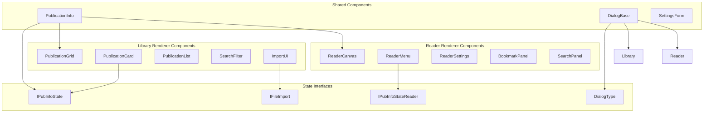
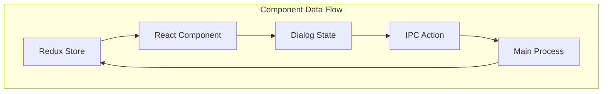

# UI Components

> **Relevant source files**
> * [src/common/models/dialog.ts](https://github.com/edrlab/thorium-reader/blob/02b67755/src/common/models/dialog.ts)

This section documents the user interface component architecture in Thorium Reader, focusing on publication display elements, component state patterns, and common UI structures. The application uses React components across multiple renderer processes to provide library management, reading interfaces, and publication browsing capabilities.

For information about dialog management and modal windows, see [Dialog System](/edrlab/thorium-reader/8.2-dialog-system). For styling and CSS architecture, see [Styling System](/edrlab/thorium-reader/8.3-styling-system).

## Component Architecture Overview

Thorium Reader's UI components are distributed across three main renderer processes, each serving distinct user interface needs. The components follow React patterns with Redux state management and TypeScript interfaces for type safety.



Sources: [src/common/models/dialog.ts L15-L26](https://github.com/edrlab/thorium-reader/blob/02b67755/src/common/models/dialog.ts#L15-L26)

## Publication Component States

The UI components use well-defined TypeScript interfaces to manage publication information and user interactions. These interfaces provide the foundation for consistent data handling across different contexts.

### Publication Information Interface

The `IPubInfoState` interface defines the core structure for publication display components:

| Property | Type | Purpose |
| --- | --- | --- |
| `publication` | `TPublication` | Complete publication metadata |
| `coverZoom` | `boolean` | Cover image zoom state |

### Reader Context Extension

The `IPubInfoStateReader` extends the base interface for reader-specific components:

| Property | Type | Purpose |
| --- | --- | --- |
| `focusWhereAmI` | `boolean` | Accessibility navigation focus |
| `pdfPlayerNumberOfPages` | `number \| undefined` | PDF pagination info |
| `divinaNumberOfPages` | `number \| undefined` | Visual narrative pagination |
| `divinaContinousEqualTrue` | `boolean` | Continuous reading mode |
| `readerReadingLocation` | `MiniLocatorExtended` | Current reading position |
| `handleLinkUrl` | `function \| undefined` | Link navigation handler |

Sources: [src/common/models/dialog.ts L15-L26](https://github.com/edrlab/thorium-reader/blob/02b67755/src/common/models/dialog.ts#L15-L26)

## Component Type System

The application uses a centralized dialog type system that defines UI component patterns and their associated data structures. This provides type safety and consistent interfaces across the application.

```mermaid
flowchart TD

FileImport["DialogTypeName.FileImport"]
PubInfoOpds["DialogTypeName.PublicationInfoOpds"]
PubInfoLib["DialogTypeName.PublicationInfoLib"]
PubInfoReader["DialogTypeName.PublicationInfoReader"]
OpdsFeedAdd["DialogTypeName.OpdsFeedAddForm"]
OpdsFeedUpdate["DialogTypeName.OpdsFeedUpdateForm"]
DeletePub["DialogTypeName.DeletePublicationConfirm"]
LcpAuth["DialogTypeName.LcpAuthentication"]
AboutDialog["DialogTypeName.AboutThorium"]
ReaderMenu["DialogTypeName.ReaderMenu"]
ReaderSettings["DialogTypeName.ReaderSettings"]
IFileImportState["IFileImport[]"]
IPubInfoState["IPubInfoState"]
IPubInfoStateReader["IPubInfoStateReader"]
IOpdsFeedView["IOpdsFeedView"]
IReaderDialog["IReaderDialogOrDockSettingsMenuState"]

FileImport --> IFileImportState
PubInfoOpds --> IPubInfoState
PubInfoLib --> IPubInfoState
PubInfoReader --> IPubInfoStateReader
OpdsFeedUpdate --> IOpdsFeedView
ReaderMenu --> IReaderDialog
ReaderSettings --> IReaderDialog

subgraph subGraph1 ["Interface Mappings"]
    IFileImportState
    IPubInfoState
    IPubInfoStateReader
    IOpdsFeedView
    IReaderDialog
end

subgraph subGraph0 ["Dialog Types"]
    FileImport
    PubInfoOpds
    PubInfoLib
    PubInfoReader
    OpdsFeedAdd
    OpdsFeedUpdate
    DeletePub
    LcpAuth
    AboutDialog
    ReaderMenu
    ReaderSettings
end
```



Sources: [src/common/models/dialog.ts L33-L49](https://github.com/edrlab/thorium-reader/blob/02b67755/src/common/models/dialog.ts#L33-L49)

 [src/common/models/dialog.ts L51-L84](https://github.com/edrlab/thorium-reader/blob/02b67755/src/common/models/dialog.ts#L51-L84)

## File Import Components

The file import system uses structured interfaces to handle publication file management and user upload workflows.

### Import File Structure

The `IFileImport` interface defines the structure for file upload components:

```
interface IFileImport {    name: string;    path: string;}
```

This interface supports batch file operations and provides the foundation for:

* Drag-and-drop publication import
* File browser integration
* Publication validation workflows
* Error handling for unsupported formats

Sources: [src/common/models/dialog.ts L28-L31](https://github.com/edrlab/thorium-reader/blob/02b67755/src/common/models/dialog.ts#L28-L31)

## Component Integration Patterns

The UI components integrate with the broader application architecture through several key patterns:

1. **Redux State Integration**: Components receive state through Redux selectors and dispatch actions for state updates
2. **IPC Communication**: Renderer components communicate with the main process through structured action dispatching
3. **Type Safety**: All component interfaces are strongly typed using TypeScript definitions
4. **Context Awareness**: Components adapt their behavior based on their rendering context (library, reader, PDF)
5. **Internationalization**: Components support multiple languages through the i18n system



Sources: [src/common/models/dialog.ts L1-L85](https://github.com/edrlab/thorium-reader/blob/02b67755/src/common/models/dialog.ts#L1-L85)