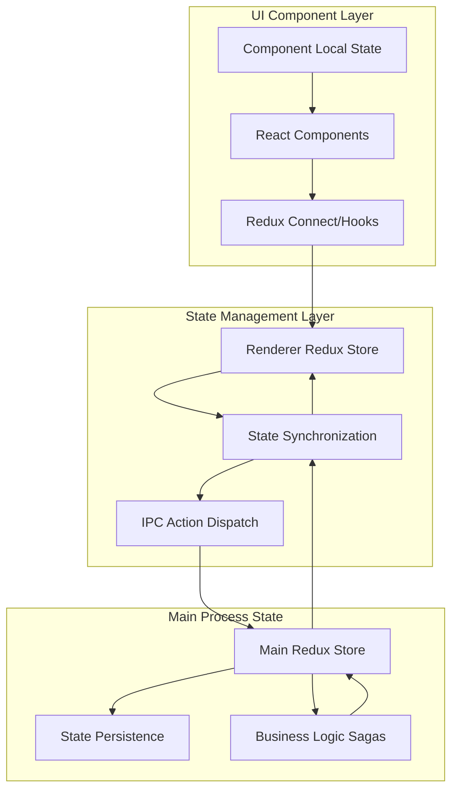
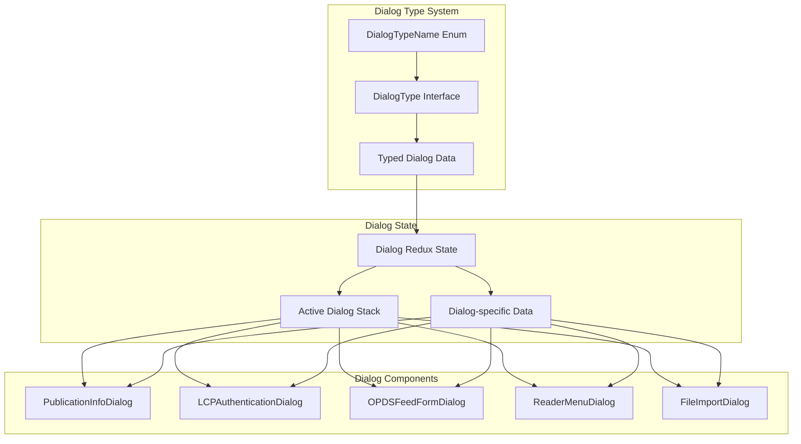
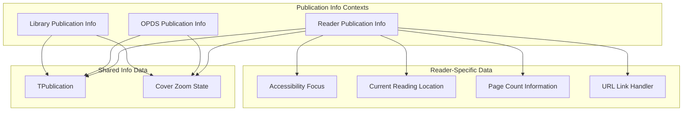

# User Interface

> **Relevant source files**
> * [src/common/models/dialog.ts](https://github.com/edrlab/thorium-reader/blob/02b67755/src/common/models/dialog.ts)

## Purpose and Scope

This document covers the overall user interface architecture of Thorium Reader, including the component organization, dialog system, and UI state management patterns. The UI is built as a multi-process Electron application with separate renderer processes for the library and reader interfaces, each using React components with Redux state management.

For detailed information about specific UI components, see [UI Components](/edrlab/thorium-reader/8.1-ui-components). For dialog implementation details, see [Dialog System](/edrlab/thorium-reader/8.2-dialog-system). For styling architecture, see [Styling System](/edrlab/thorium-reader/8.3-styling-system). For settings interface specifics, see [Settings UI](/edrlab/thorium-reader/8.4-settings-ui).

## UI Architecture Overview

Thorium Reader implements a multi-process UI architecture where different interfaces run in separate Electron renderer processes, each with their own React component trees and Redux stores synchronized with the main process.

### Process-Based UI Organization

```mermaid
flowchart TD

MainStore["Main Redux Store"]
DialogManager["Dialog Manager"]
WindowManager["Window Manager"]
LibraryStore["Library Redux Store"]
LibraryApp["Library App Component"]
PublicationGrid["Publication Grid/List"]
SearchFilters["Search & Filters"]
ImportUI["Import Interface"]
ReaderStore["Reader Redux Store"]
ReaderApp["Reader App Component"]
ReadingArea["Reading Canvas"]
ReaderMenu["Reader Menu"]
ReaderSettings["Reader Settings Panel"]
PDFStore["PDF Redux Store"]
PDFApp["PDF App Component"]
PDFViewer["PDF Viewer"]
PDFControls["PDF Controls"]
PublicationInfo["Publication Info Dialog"]
LCPAuth["LCP Authentication Dialog"]
OPDSForms["OPDS Feed Dialogs"]
ConfirmDialogs["Confirmation Dialogs"]

MainStore --> LibraryStore
MainStore --> ReaderStore
MainStore --> PDFStore
DialogManager --> PublicationInfo
DialogManager --> LCPAuth
DialogManager --> OPDSForms
DialogManager --> ConfirmDialogs

subgraph subGraph4 ["Shared Dialog Components"]
    PublicationInfo
    LCPAuth
    OPDSForms
    ConfirmDialogs
end

subgraph subGraph3 ["PDF Renderer Process"]
    PDFStore
    PDFApp
    PDFViewer
    PDFControls
    PDFApp --> PDFViewer
    PDFApp --> PDFControls
end

subgraph subGraph2 ["Reader Renderer Process"]
    ReaderStore
    ReaderApp
    ReadingArea
    ReaderMenu
    ReaderSettings
    ReaderApp --> ReadingArea
    ReaderApp --> ReaderMenu
    ReaderApp --> ReaderSettings
end

subgraph subGraph1 ["Library Renderer Process"]
    LibraryStore
    LibraryApp
    PublicationGrid
    SearchFilters
    ImportUI
    LibraryApp --> PublicationGrid
    LibraryApp --> SearchFilters
    LibraryApp --> ImportUI
end

subgraph subGraph0 ["Main Process"]
    MainStore
    DialogManager
    WindowManager
end
```

Sources: [src/common/models/dialog.ts L1-L85](https://github.com/edrlab/thorium-reader/blob/02b67755/src/common/models/dialog.ts#L1-L85)

### Component State Integration

The UI components integrate with Redux state management through a synchronized store architecture where actions dispatched in renderer processes are synchronized with the main process store.

Sources: [src/common/models/dialog.ts L1-L85](https://github.com/edrlab/thorium-reader/blob/02b67755/src/common/models/dialog.ts#L1-L85)

## Dialog System Architecture

The application uses a centralized dialog system that manages modal dialogs across all renderer processes. Dialog types are strictly typed using TypeScript interfaces and enums.

### Dialog Type Definitions

The dialog system defines specific dialog types with associated data structures:

| Dialog Type | Purpose | Data Structure |
| --- | --- | --- |
| `FileImport` | File import selection | `{files: IFileImport[]}` |
| `PublicationInfoOpds` | OPDS publication details | `IPubInfoState` |
| `PublicationInfoLib` | Library publication details | `IPubInfoState` |
| `PublicationInfoReader` | Reader publication details | `IPubInfoStateReader` |
| `OpdsFeedAddForm` | Add OPDS feed | `{}` |
| `OpdsFeedUpdateForm` | Update OPDS feed | `{feed: IOpdsFeedView}` |
| `LcpAuthentication` | LCP license authentication | Complex authentication data |
| `ReaderMenu` | Reader navigation menu | `IReaderDialogOrDockSettingsMenuState` |
| `ReaderSettings` | Reader configuration panel | `IReaderDialogOrDockSettingsMenuState` |

### Dialog State Management

Sources: [src/common/models/dialog.ts L33-L84](https://github.com/edrlab/thorium-reader/blob/02b67755/src/common/models/dialog.ts#L33-L84)

## Interface-Specific UI Organization

### Library Interface Components

The library interface manages publication collections and provides import/export functionality:

* **Publication Display**: Grid and list view components for publication browsing
* **Search and Filtering**: Text search, tag filtering, and sorting controls
* **Import Interface**: File selection and OPDS feed management
* **Settings**: Library-specific configuration options

### Reader Interface Components

The reader interface provides the core reading experience:

* **Reading Canvas**: WebView-based publication rendering
* **Navigation Controls**: Table of contents, bookmarks, page navigation
* **Reader Settings**: Font, theme, layout, and accessibility options
* **Annotation System**: Highlighting, notes, and bookmark management
* **Search**: In-publication text search with highlighting

### Publication Information System

Publication info dialogs are context-aware with different data structures:

* **Library Context** (`IPubInfoState`): Basic publication metadata and cover zoom
* **Reader Context** (`IPubInfoStateReader`): Extended with reading location, accessibility focus, and page count information
* **OPDS Context** (`IPubInfoState`): Publication details from catalog feeds

Sources: [src/common/models/dialog.ts L15-L26](https://github.com/edrlab/thorium-reader/blob/02b67755/src/common/models/dialog.ts#L15-L26)

## UI State Patterns

The UI follows consistent patterns for state management and component organization:

1. **Typed Interfaces**: All dialog and component state uses TypeScript interfaces for type safety
2. **Redux Integration**: UI components connect to Redux state through hooks and selectors
3. **Action Dispatching**: UI interactions dispatch typed Redux actions that synchronize across processes
4. **Conditional Rendering**: Components conditionally render based on Redux state flags
5. **Dialog Stacking**: Multiple dialogs can be active simultaneously with proper z-index management

Sources: [src/common/models/dialog.ts L1-L85](https://github.com/edrlab/thorium-reader/blob/02b67755/src/common/models/dialog.ts#L1-L85)