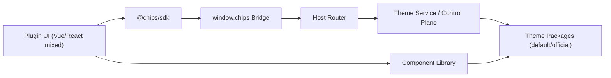

# 01-前端现状全景与背景说明

## 文档定位与边界

- 本文是阶段18的前端全景基线文档，只回答“当前前端事实是什么、边界在哪里、风险在哪里”。
- 本文不做排期、不做人力估算、不替代详细技术方案；后续演进与分阶段落地在文档03。
- 调查范围限定为：架构设计文档、前端接口标准、阶段四计划文档，以及 8 个实现仓库（Chips-ComponentLibrary、Chips-Host、Chips-SDK、chips-theme-default、chips-app-editor、chips-app-settings、chips-app-viewer、chips-template-app）。

## 状态更新（2026-02-26，阶段07任务05）

- `chips-app-settings` 双入口问题已在阶段07任务05闭环：主路径固定为 `index.html -> src/main.tsx -> src/App.tsx`。
- 历史 Vue 实现与历史 bridge-client 已归档到 `chips-app-settings/src/archive/**` 并补齐追溯说明。
- 本文保留 2026-02-24 调查快照语境；涉及 settings 双入口描述均应按“历史现状”理解，不再代表当前主路径状态。

## 生态背景与前端职责边界

- 生态总体是六层架构：插件应用位于最上层，系统能力通过 Bridge API 访问，核心服务与内核在主进程托管。
- 前端职责边界：
  - UI 层负责交互与编排；
  - 主题系统负责视觉表达；
  - SDK/Bridge 负责与内核通信；
  - 不能越过 Bridge 直接触达 Node/Electron 系统能力。
- 主题设计哲学已明确为“无头组件 + 主题包驱动视觉”，目标是让主题不仅换色，还能覆盖形状、阴影、动效、装饰等完整设计语言。

## 现状全景图（关系图）

## 现状事实清单（组件库/主题系统/应用接入/文档一致性）

### 1) 组件库现状

- 组件库实现基线已是 React：`@chips/component-library`，依赖 `@ark-ui/react`。
- 当前对外导出 13 个组件（Button/Input/Select/Dialog/Tabs 等），与阶段四计划中的 24 组件首版目标不一致。
- 组件库已提供 `ThemeProvider`、token 解析和 i18n/config 上下文能力，但生态专用组件覆盖仍不完整（与计划清单存在缺项）。

### 2) 主题系统现状

- default 主题包结构已覆盖 tokens/components/icons/animations，`theme.css` 串联加载链可用。
- 主题契约与实现存在质量分裂：
  - `chips-theme-default/manifest.yaml` 出现重复 `theme` 字段；
  - 三个官方主题仓库的校验脚本严格度不一致；
  - macaron 主题校验仍假设 24 组件，而 default/obsidian 契约是 13。

### 3) 应用接入现状

- `chips-app-viewer` 走 React + `@chips/component-library`。
- `chips-app-editor` 仍是 Vue，并通过 Vite alias 指向 `src/shims/chips-components` 做兼容层（250 行 shim）。
- `chips-app-settings` 同时存在 Vue 与 React 两套入口（`main.ts` 与 `main.tsx`），当前 `index.html` 激活的是 React 入口。
- `chips-template-app` 仍是 Vue 模板，并且包名/描述与 settings 工程一致，模板身份混淆。

### 4) 文档一致性现状

- 架构与阶段四文档仍保留 Vue 3 + `@chips/components` 作为组件库主口径。
- 实际组件库包名与实现口径为 `@chips/component-library` + React。
- 标准文档给出的主题运行时契约与当前控制平面/主题服务动作集合存在偏差（详见文档02）。

## 可用能力与已知缺口

### 已可用能力

- 主题包可完成 Token + 组件 CSS + 动画 + 图标的聚合注入。
- Host 侧已有 `theme.getCSS / theme.getAllCss / theme.getCurrent / theme.resolve` 等基础动作。
- React 应用（viewer/settings）已能直接消费 React 组件库。

### 已知缺口

- 前端技术栈未统一（Vue/React 混跑 + shim 过渡层）。
- 包名与契约命名未收敛（`@chips/components` vs `@chips/component-library`）。
- 组件覆盖广度、测试密度与阶段目标有明显差距。
- 多处硬编码文案仍存在，违反“零硬编码文本”目标。

## 风险分级

- P0（架构一致性风险）
  - 双框架并存 + shim 层长期化，导致组件契约、主题接口和开发体验持续分裂。
- P1（主题系统可持续性风险）
  - 主题契约版本与校验策略不统一，主题包质量门禁不可预测。
- P1（生态接入风险）
  - 模板与实际推荐栈不一致，第三方开发者接入路径不稳定。
- P2（质量风险）
  - 组件测试覆盖不足、文案硬编码残留，会在重构后期放大回归成本。

## 术语表

- 薯片主机（Chips Host）：唯一 Electron 宿主程序。
- Bridge API：插件访问系统能力的唯一通道（`window.chips.*`）。
- 无头组件（Headless Component）：只提供结构与行为，不含视觉样式。
- 主题包（Theme Package）：提供 tokens、组件样式、动效、图标等视觉资产。
- 主题契约（Theme Contract）：主题包与组件库的接口点约束（选择器、变量、文件清单）。
- 控制平面（Control Plane）：面向设置面板/运维操作的系统路由集合。

## 本轮调查时间点与证据索引（独立）

- 调查时间点：2026-02-24 10:34:31 +0800
- 调查说明：本文件写作前已独立重新读取四份基线文档，并重新抽样 8 个实现仓库。

| 证据ID | 证据路径 | 结论映射 |
|---|---|---|
| D01 | `生态架构设计/01-薯片主机架构总览.md:24` | 六层架构与前端职责边界 |
| D02 | `生态架构设计/09-主题与设计系统架构.md:10` | 无头组件 + 主题驱动视觉的核心哲学 |
| D03 | `生态架构设计/生态重构开发计划/04-阶段四-组件库与插件模板开发.md:31` | 阶段计划口径为 Vue + `@chips/components` + 24组件目标 |
| D04 | `生态共用/05-前端接口标准.md:834` | 主题 manifest 与 runtime 契约基线 |
| C01 | `Chips-ComponentLibrary/packages/component-library/src/index.ts:1` | 实际组件库导出为 13 组件（React实现） |
| C02 | `Chips-Host/src/main/services/theme/constants.ts:6` | Host 主题动作集合现状 |
| C03 | `Chips-SDK/src/composables/use-theme.ts:45` | SDK 主题使用路径与事件监听现状 |
| C04 | `chips-theme-default/theme.css:1` | 主题包聚合加载链可用 |
| C05 | `chips-app-editor/vite.config.ts:11` | Vue 编辑器通过 alias 指向 shim |
| C06 | `chips-app-settings/src/main.tsx:1` | settings 当前 React 启动链 |
| C07 | `chips-app-viewer/src/features/viewer/ViewerStateOverlay.tsx:29` | Viewer 存在硬编码文案 |
| C08 | `chips-template-app/src/main.ts:1` | 模板仍为 Vue 入口 |
| C09 | `chips-template-app/package.json:2` | 模板身份与命名仍指向 settings |
