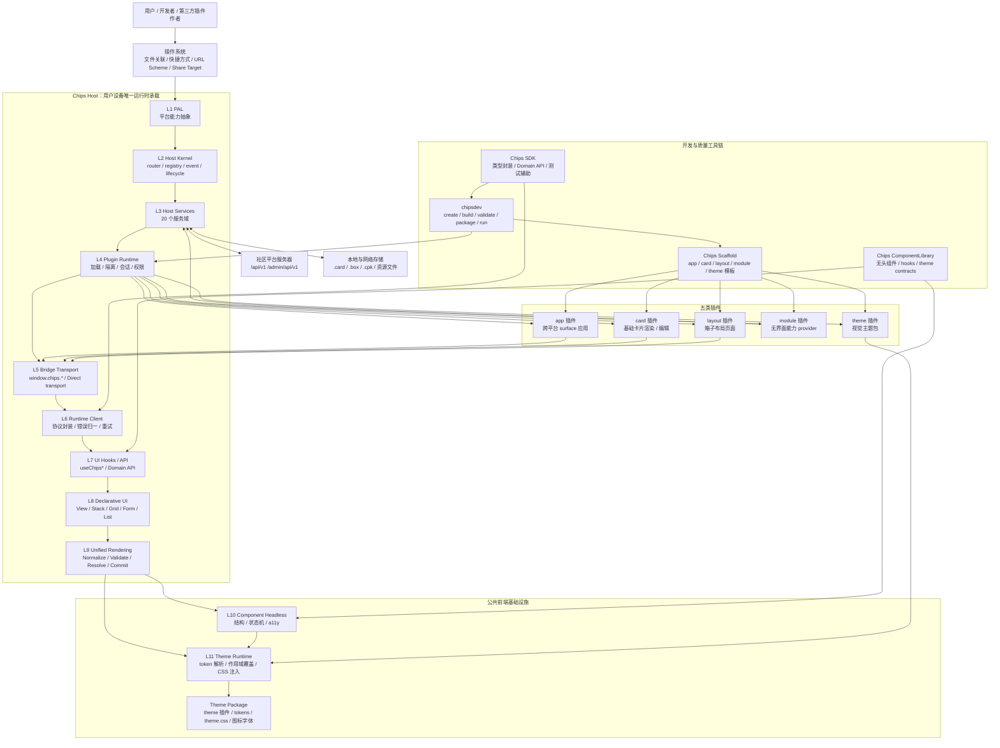
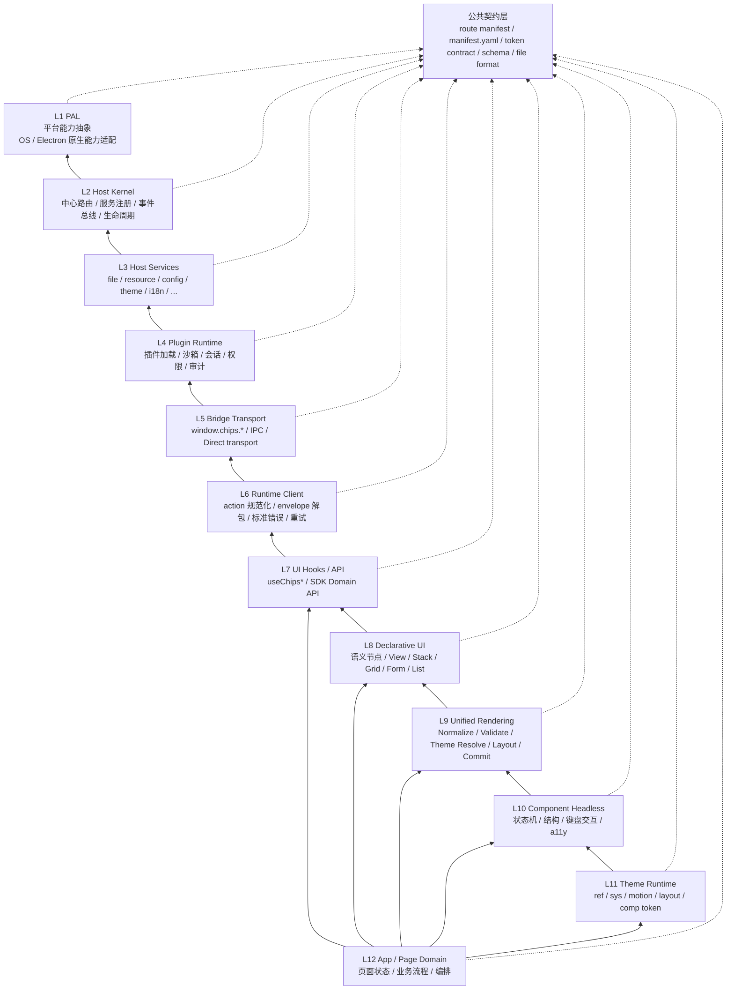
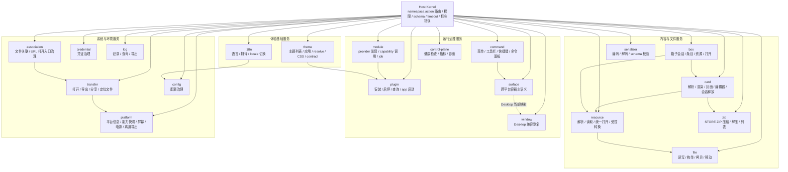
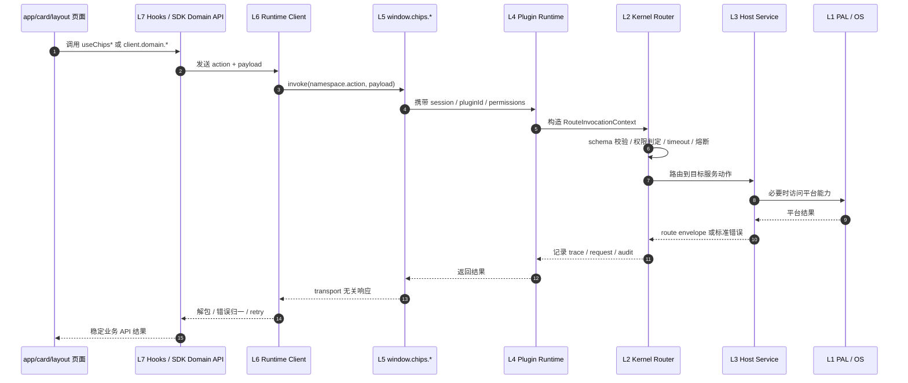
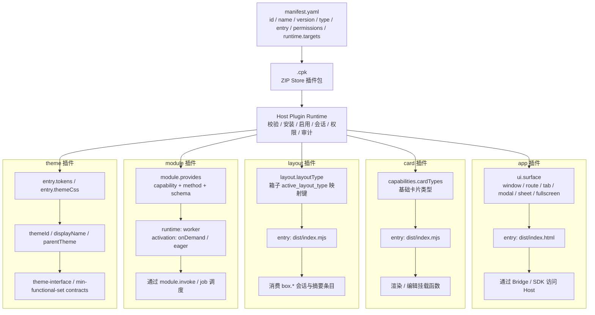
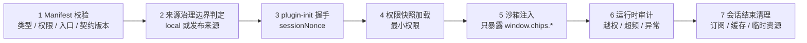
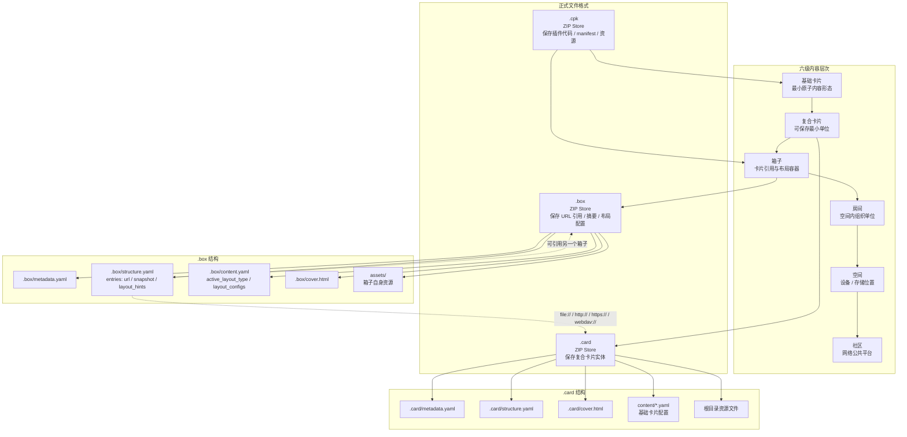
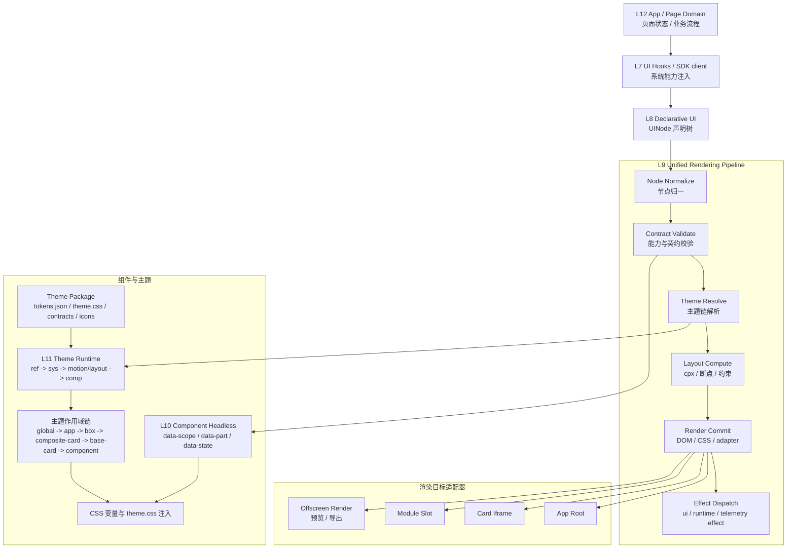
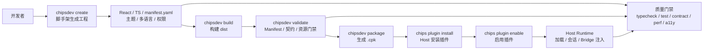
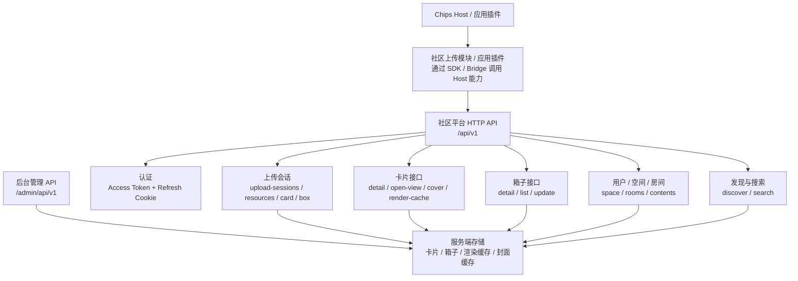

# 薯片生态整体架构图

> 文档状态：生态共用公开架构图  
> 修订日期：2026-06-29  
> 适用范围：Host、SDK、ComponentLibrary、ThemePack、Scaffold、五类插件、社区平台与生态工具链

---

## 1. 文档定位

本文档用 Mermaid 图集中表达薯片生态当前正式架构口径，便于开发、评审、插件接入和公共文档引用。

本文档只沉淀稳定公共架构，不记录任务过程、短期实现策略或单仓内部细节。更细的接口字段、schema、命令和测试门禁仍以各主发布文档为准。

主要依据：

- `生态共用技术文档/架构设计/薯片生态-架构设计手册.md`
- `生态共用技术文档/架构设计/03-插件架构设计.md`
- `生态共用技术文档/架构设计/13-Bridge三层设计.md`
- `生态共用技术文档/架构设计/14-Host服务域设计.md`
- `生态共用技术文档/架构设计/19-前端框架vNext公共契约与术语冻结.md`
- `生态共用技术文档/协议与接口标准/02-Bridge-API规范.md`
- `生态共用技术文档/插件开发/06-Manifest配置规范.md`
- `生态共用技术文档/插件开发/08-SDK使用指南.md`
- `生态共用技术文档/文件格式规范/01-卡片文件格式规范.md`
- `生态共用技术文档/文件格式规范/02-箱子文件格式规范.md`
- `生态共用技术文档/文件格式规范/03-CPK打包格式规范.md`

---

## 2. 总体拓扑

核心边界：

- Host 是唯一运行时承载，生产运行时主链路由 Host 承担。
- SDK 是开发者工具包与类型化封装，不承载 Host runtime 主实现。
- 组件库主责 L10 Component Headless，不写视觉皮肤。
- 主题视觉通过 Theme Runtime 与 theme 插件注入，不在业务组件中硬编码。
- 插件访问系统能力只能通过 `window.chips.*`、Bridge 或 `chips-sdk` 正式入口。

---

## 3. 十二层运行时架构

依赖白名单：

- 常规依赖只允许 `Ln -> Ln-1`。
- 任何层级可以依赖公共契约层。
- 禁止 L12 页面域直连 L1-L5 细节。
- 禁止服务间跨服务源码直连，服务协作必须走 Kernel 路由。

---

## 4. Host 服务域矩阵

服务域规则：

- 每个服务动作必须有输入 schema、输出 schema、权限、超时、错误码和幂等性定义。
- 新的跨平台界面能力优先进入 `surface`。
- 新的打开、导出、分享、定位文件能力优先进入 `transfer`。
- 新的系统入口治理优先进入 `association`。
- `window` 仅保留为 Desktop 兼容别名，不承载未来主语义。
- `platform.getCapabilities()` 返回结构化能力快照，不回退为字符串数组。

---

## 5. Bridge 与插件调用链

调用边界：

- 页面代码优先使用组件库环境 Provider、`useChips*` hooks 或 SDK Domain API。
- 必须直连时才使用 `window.chips.invoke/on/once/emit`。
- `file/resource/card/box/zip/module` 等服务域通过 `invoke("namespace.action", payload)` 或 SDK Domain API 访问，不发布 `window.chips.file.*` 这类子对象。
- `window.chips.*` 的形状独立于 Desktop IPC、Headless Direct transport 和未来 Web/Mobile transport。

---

## 6. 五类插件架构

安装与运行安全流水线：

插件边界：

- `app` 的公共容器语义是 `surface`，Desktop 当前映射为窗口。
- `card` 在 Host 通用渲染链路中 iframe 优先，并可被官方编辑引擎以正式特例在编辑态本地装配。
- `layout` 是箱子页面前端，只消费 Host 箱子会话和摘要数据，不自行扫描磁盘。
- `module` 是 Host 托管无界面能力 provider，通过 capability + method 暴露能力。
- `theme` 负责 token、CSS、组件接口点和视觉资源。

---

## 7. 内容与文件格式架构

文件格式边界：

- `.card` 保存复合卡片实体，基础卡片配置在 `content/` 中，资源位于卡片根目录。
- `.box` 是卡片与箱子的引用容器，只保存 URL、摘要快照、布局配置和箱子自身资源，不保存被引用卡片实体。
- `.cpk` 是五类插件统一包格式，以包根 `manifest.yaml` 为唯一正式清单源。
- 三类格式均采用 ZIP Store 零压缩模型。

---

## 8. 渲染、组件与主题链路

渲染约束：

- L8 只描述语义结构，不承载颜色、阴影、圆角、字体等视觉值。
- L9 对声明树执行归一、契约校验、主题解析、布局计算、提交与副作用分发。
- `runtime-effect` 禁止在渲染阶段直接触发。
- 非兼容能力必须在 Validate 阶段失败，不允许 silent fallback。
- 组件库只输出无头结构和接口点，视觉由主题运行时和主题包注入。

---

## 9. 生态开发到运行链路

开发链路边界：

- 工程根 `manifest.yaml` 是插件工程唯一正式清单源。
- `runtime.targets` 是五类插件的基础要求。
- `app` 插件必须声明 `ui.surface`。
- `card` 插件正式解析依据是 `capabilities.cardTypes`。
- `layout` 插件必须声明 `layout.layoutType`。
- `module` 插件必须声明 `module.provides`。
- `theme` 插件必须使用对象形式 `entry.tokens / entry.themeCss`。

---

## 10. 社区平台与本地 Host 协作

社区边界：

- 社区平台使用 JSON 与 multipart/form-data，统一响应结构为 `data` 或 `error`。
- 卡片打开入口优先使用 `open-view`，不把历史 `htmlUrl` 作为新客户端正式打开入口。
- 房间公开不代表房间内所有卡片或箱子公开，内容仍以各自 `visibility` 为准。
- 本地插件访问社区能力仍应通过 Host、SDK、Bridge 与正式网络模块/应用链路治理。

---

## 11. 图例

| 图形元素 | 含义 |
|---|---|
| 实线箭头 | 正式依赖、调用或数据流 |
| 虚线箭头 | 映射、引用、兼容别名或非直接承载关系 |
| `surface` | 跨平台界面容器公共语义 |
| `window` | Desktop 当前窗口映射或兼容别名 |
| `namespace.action` | Host Kernel 路由动作名格式 |
| ZIP Store | ZIP 零压缩存储模式 |

---

## 12. 已核对实现锚点

| 方向 | 当前核对锚点 |
|---|---|
| Host 运行时与服务域 | `Chips-Host/src/main/services/register-host-services.ts`、`Chips-Host/src/runtime/plugin-runtime.ts` |
| Bridge 与 preload | `Chips-Host/src/preload/create-bridge.ts`、`Chips-Host/packages/bridge-api/src/*` |
| Runtime Client 与 Hooks | `Chips-Host/src/renderer/runtime-client.ts`、`Chips-Host/src/renderer/hooks.ts` |
| L8 / L9 | `Chips-Host/src/renderer/declarative-ui/*`、`Chips-Host/packages/unified-rendering/src/*` |
| 主题运行时 | `Chips-Host/src/main/theme-runtime/*` |
| 插件 manifest 示例 | `Chips-EditingEngine/manifest.yaml`、`Chips-BaseCardPlugin/richtext-BCP/manifest.yaml`、`Chips-BoxLayoutPlugin/grid-BLP/manifest.yaml`、`Chips-ModulePlugin/Chips-ColorPicker/manifest.yaml`、`ThemePack/Chips-default/manifest.yaml` |
| SDK 与工具链 | `Chips-SDK/package.json`、`Chips-SDK/src/*`、`Chips-SDK/tests/*` |
| 组件库 | `Chips-ComponentLibrary/package.json`、`Chips-ComponentLibrary/packages/*` |
| Host 测试入口 | `Chips-Host/tests/contract/route-manifest.contract.test.ts`、`Chips-Host/tests/integration/host-services.test.ts`、`Chips-Host/tests/unit/*` |
