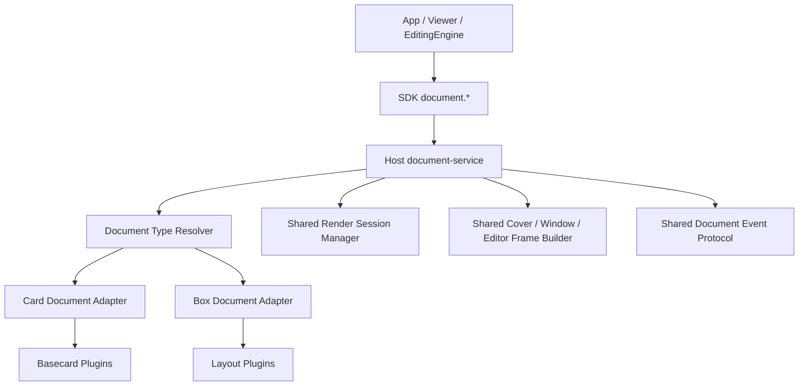

# 箱子链路统一化重构方案

## 方案目标

本方案用于回答新的目标要求：

1. 箱子的所有链路需要完全参考卡片链路；
2. 箱子和卡片采用统一、同构的架构；
3. 仍然区分 `.card` 和 `.box` 两种文件格式；
4. 尽可能扩展现有接口并统一到同一个开发者入口；
5. 只有在确实无法共用的环节，才单开专用模块；
6. 尽量减少开发者在应用侧自己写“如果是 card 就调 A，如果是 box 就调 B”的分支逻辑。

## 一、基于当前审查结果的判断

当前实现已经做到：

1. Host 是统一运行时承载；
2. 查看器已经统一到 `client.document.window.render(...)`；
3. 箱子条目内部已经复用卡片的封面、信息读取和打开能力；
4. 两者都由插件驱动。

当前实现还没有做到：

1. Host 正式主接口没有统一，仍然是 `card.*` / `box.*` 两组服务域；
2. SDK 对外主接口没有完全统一，常用能力仍需要开发者区分 `client.card.*` / `client.box.*`；
3. 编辑引擎链路明显分叉：
   1. 卡片主预览 / 主编辑走本地基础卡片运行时；
   2. 箱子主预览 / 主编辑仍依赖 Host `box-service` + SDK `box.*`；
4. 插件虽然设计模式相似，但宿主上下文和桥接协议不统一；
5. 事件命名、运行时桥、信息结构、会话模型都还没有真正收口成一套“文档主语义”。

因此，本次重构的正确方向不是继续在 `card.*` 和 `box.*` 上各补一层，而是要把“文档”提升为正式一等主语义。

## 二、目标架构总原则

## 1. 正式主语义从 `card/box` 上提到 `document`

重构后，对外公开的第一入口应是：

1. `document`

而不是：

1. `card`
2. `box`

`card` 和 `box` 在目标架构中仍然存在，但它们不再是开发者首先面对的一级主接口，而是：

1. 文档类型适配器
2. 文档类型内部模块
3. 无法抽象掉的专有能力归属地

## 2. 同一条主链路，类型分流放在内部

目标模式：

1. 应用层只拿到 `filePath`
2. SDK `document.*` 负责探测类型
3. Host `document-service` 负责分派到 `card-adapter` / `box-adapter`
4. 适配器只处理：
   1. 文件解析差异
   2. 插件上下文差异
   3. 必要的专有资源桥

也就是说：

1. 上层统一
2. 中层统一
3. 底层按类型适配

而不是：

1. 上层就分叉
2. 开发者自己写一堆 `if (card) ... else if (box) ...`

## 3. 统一的是“主协议”和“主宿主”

本方案不追求把卡片和箱子的内部文件格式做成一样，也不强行让所有专有语义消失。

本方案追求的是：

1. 同一个正式宿主主语义
2. 同一套开发者主接口
3. 同一套窗口 / 封面 / 信息 / 打开 / 编辑主流程
4. 同一套会话治理、渲染会话治理、错误模型和事件模型

## 4. 专有能力允许存在，但必须挂在统一主语义下面

例如：

1. 箱子特有的条目列表、条目打开、条目封面、条目资源
2. 卡片特有的基础卡片节点编辑

这些能力可以继续存在，但目标是：

1. 不再以 `client.box.*` / `client.card.*` 的一级分叉方式暴露为主入口
2. 而是挂到 `client.document.*` 之下的子模块或 target model 中

## 三、目标架构图



这个图表达的目标是：

1. 对外只先看到 `document.*`
2. 内部再按 `card/box` 分流
3. 两种类型共用同一套 Host 文档主架构

## 四、目标接口设计

## 1. SDK 一级主入口

重构后，SDK 面向应用层的主入口应统一为：

1. `client.document.detectType(filePath)`
2. `client.document.inspect({ filePath, fields? })`
3. `client.document.open({ filePath })`
4. `client.document.window.render({ filePath, mode, locale, themeId, interactionPolicy })`
5. `client.document.cover.render({ filePath })`
6. `client.document.editor.render({ filePath, target?, locale, themeId, resources? })`

### 说明

这里的统一不是语法糖，而是正式主接口。

开发者在绝大多数场景下，不应该再需要直接使用：

1. `client.card.compositeWindow.render(...)`
2. `client.box.documentWindow.render(...)`
3. `client.card.coverFrame.render(...)`
4. `client.box.renderCover(...)`
5. `client.card.editorPanel.render(...)`
6. `client.box.editorPanel.render(...)`

这些接口可以保留为：

1. 内部适配层
2. 低层专用接口
3. 调试 / 迁移阶段过渡接口

但不再作为正式主推荐入口。

## 2. 统一的 `document.inspect`

目标返回结构建议统一为：

```ts
interface DocumentInfo {
  documentType: "card" | "box";
  documentId: string;
  name: string;
  createdAt?: string;
  modifiedAt?: string;
  tags?: Array<string | string[]>;
  coverRatio?: string;
  status: {
    state: "ready" | "missing" | "invalid";
    exists: boolean;
    valid: boolean;
    errors?: string[];
  };
  capabilities: {
    hasCover: boolean;
    hasWindow: boolean;
    hasEditor: boolean;
    hasCollection?: boolean;
    hasNodeEditor?: boolean;
  };
  kindSpecific?: Record<string, unknown>;
}
```

### 统一原则

1. 卡片不再单独叫 `cardId`
2. 箱子不再单独叫 `boxId`
3. 上层统一叫 `documentId`
4. 如需保留原始类型字段，可放入 `kindSpecific`

## 3. 统一的 `document.window.render`

这个接口已经存在，目标是把它从“薄壳分发器”提升成真正的正式主窗口接口。

### 目标职责

1. 自动识别文件类型
2. 统一调用 Host `document.renderWindow`
3. 统一返回 `documentType`
4. 统一事件：
   1. ready
   2. error
   3. resize
   4. resource-open

### 目标要求

1. 应用层不再关心内部是 `card.render` 还是 `box.renderLayoutFrame`
2. Host 必须保证两种文档都走相同的“托管文档 -> iframe -> render session”主框架

## 4. 统一的 `document.cover.render`

目标替代：

1. `card.coverFrame.render`
2. `box.renderCover`

### 统一目标

1. 输入统一是 `filePath`
2. 输出统一是 `coverUrl + title + ratio + documentType`
3. SDK 统一创建 iframe

### 专有能力

箱子条目封面不属于文档本体封面，可单开：

1. `client.document.collection.renderItemCover(...)`

## 5. 统一的 `document.open`

目标替代：

1. `card.open`
2. `.box` 文件关联里由调用方自己找 `file-handler:.box`

### 统一目标

1. Host 提供 `document.open`
2. Host 内部先探测类型
3. 再统一走文件关联和 app 拉起逻辑

这样应用层和系统入口治理都只需要认识：

1. `document.open`

## 6. 统一的 `document.editor.render`

这是本轮重构里最关键、也最难的一块。

### 目标形式

建议统一成：

```ts
client.document.editor.render({
  filePath,
  target: {
    scope: "document" | "node" | "collection-item";
    targetId?: string;
    role?: string;
  },
  locale,
  themeId,
  resources,
})
```

### 含义

1. `scope: 'document'`
   1. 编辑文档级内容
   2. 箱子默认走这个
2. `scope: 'node'`
   1. 编辑卡片里的基础卡片节点
   2. 卡片默认走这个
3. `scope: 'collection-item'`
   1. 仅在未来确实需要时开放
   2. 当前可不实现

### 好处

1. 外部主接口统一
2. 内部仍允许卡片和箱子有不同的编辑目标模型
3. 不需要把卡片和箱子硬挤成同一个完全错误的编辑对象

## 7. 无法完全共用的专用模块

以下能力建议挂在 `document` 下面的专用子模块，而不是继续暴露一级 `box.*`：

1. `document.collection.listItems(...)`
2. `document.collection.readItemDetail(...)`
3. `document.collection.renderItemCover(...)`
4. `document.collection.openItem(...)`
5. `document.collection.resolveItemResource(...)`

原因很简单：

1. 这些能力是“集合型文档”特有能力
2. 卡片当前没有 collection 语义
3. 但它们仍然属于“文档主语义”下的扩展模块，不该继续割裂成另一套一级主接口

## 五、Host 重构方案

## 1. 新增 `document-service`

在 Host 服务域中新增：

1. `document`

### 正式动作建议

1. `document.detectType`
2. `document.inspect`
3. `document.open`
4. `document.renderWindow`
5. `document.renderCover`
6. `document.renderEditor`
7. `document.releaseRenderSession`
8. `document.collection.listItems`
9. `document.collection.readItemDetail`
10. `document.collection.renderItemCover`
11. `document.collection.openItem`
12. `document.collection.resolveItemResource`

### 目标定位

1. `document` 是新的正式对外主服务域
2. `card` 和 `box` 退到内部实现层或专用补充域

## 2. 引入 `DocumentTypeAdapter` 内部抽象

Host 内部新增抽象：

```ts
interface DocumentTypeAdapter {
  type: "card" | "box";
  detect(filePath: string): boolean;
  inspect(filePath: string): Promise<DocumentInfo>;
  renderWindow(input: DocumentWindowRenderInput): Promise<DocumentWindowRenderOutput>;
  renderCover(filePath: string): Promise<DocumentCoverRenderOutput>;
  renderEditor(input: DocumentEditorRenderInput): Promise<DocumentEditorRenderOutput>;
}
```

### 两个正式实现

1. `CardDocumentAdapter`
2. `BoxDocumentAdapter`

### 作用

1. 把当前 `card-service` / `box-service` 的分叉收敛到适配器内部
2. 对外统一由 `document-service` 管理

## 3. 抽取共享基础设施

当前 card/box 各自维护了很多相似但没统一的基础设施，建议抽成共享模块：

1. `DocumentRenderSessionManager`
2. `DocumentFrameHtmlBuilder`
3. `DocumentCoverFrameBuilder`
4. `DocumentEditorFrameBuilder`
5. `DocumentManagedUrlFactory`
6. `DocumentOpenDispatcher`
7. `DocumentErrorNormalizer`
8. `DocumentEventProtocol`

### 目标

把以下共性从 `card-service` / `box-service` 中抽出：

1. render session 生命周期
2. 受控 `documentUrl/coverUrl`
3. iframe HTML 壳生成
4. 释放逻辑
5. 通用错误包装

## 4. 统一事件协议

建议把顶层通用事件统一为：

1. `chips.document:ready`
2. `chips.document:error`
3. `chips.document:resize`
4. `chips.document:resource-open`

同时保留类型扩展事件：

1. `chips.document:node-select`
2. `chips.document:collection-item-open`

### 原则

1. 应用层默认只消费 `chips.document:*`
2. 只有深度场景才消费类型专有事件

## 5. 文件关联改造

`file-association.ts` 目标改成：

1. 统一先走 `document.detectType`
2. 再调用 `document.open`

不再由文件关联层直接知道：

1. `.card -> card.open`
2. `.box -> inspect + launch viewer`

## 6. box-service 内部改造方向

### 不要求强行删除 box 专有能力

`box-service` 仍然可以保留内部专有模块：

1. collection session
2. layout descriptor
3. item resource resolve

### 但要改变其在架构中的位置

从：

1. 独立一级对外主链路

改成：

1. `document-service` 的 `box` 类型适配器和 collection 子模块

## 六、SDK 重构方案

## 1. 扩展 `document.ts` 成为真正主入口

现在的 `document.ts` 只是薄分发。目标改为：

1. 它是主要 SDK 文档 API
2. 大部分应用只需要 import / 调用 `client.document.*`

### 需要新增的方法

1. `document.inspect`
2. `document.open`
3. `document.cover.render`
4. `document.editor.render`
5. `document.collection.*`

## 2. 降低 `card.ts` / `box.ts` 的主入口地位

重构后建议：

1. `card.ts` / `box.ts` 仍可存在
2. 但转为：
   1. 类型专有辅助接口
   2. 内部桥接接口
   3. 高级场景接口

而不是应用开发的默认入口。

## 3. 统一返回类型

当前 SDK 存在：

1. `CardReadInfoResult`
2. `BoxInspectionResult`
3. `CardOpenResult`
4. `BoxOpenViewResult`

建议统一主模型：

1. `DocumentInfo`
2. `DocumentOpenResult`
3. `DocumentWindowRenderResult`
4. `DocumentCoverRenderResult`
5. `DocumentEditorRenderResult`

专有字段继续进：

1. `kindSpecific`
2. `collection`
3. `nodeTarget`

## 4. 统一资源桥抽象

当前：

1. 卡片编辑器桥是 `resolve/import/importArchiveBundle/delete`
2. 箱子编辑器桥是 `readBoxAsset/importBoxAsset/deleteBoxAsset`

建议上提一个抽象：

```ts
interface DocumentEditorResourceBridge {
  read?(path: string): Promise<DocumentResource>;
  resolveUrl?(path: string): Promise<string>;
  import?(input: { file: File; preferredPath?: string }): Promise<{ path: string }>;
  importBundle?(input: { file: File; preferredRootDir?: string; entryFile?: string }): Promise<...>;
  delete?(path: string): Promise<void>;
}
```

然后：

1. 卡片编辑器使用其中的 `resolveUrl/import/importBundle/delete`
2. 箱子编辑器使用其中的 `read/import/delete`

这样外部配置结构统一，内部 capability 再做裁剪。

## 七、查看器重构方案

`Chips-CardViewer` 重构目标最简单：

1. 完全只依赖 `client.document.*`
2. 不再感知 `client.card.*` / `client.box.*`
3. 默认主界面、错误、加载、资源打开都用统一文档语义

### 需要做的事情

1. 继续保留 `file-handler:.card/.box`
2. 启动入口保持 `targetPath`
3. 所有窗口、封面、打开、错误处理全面改为 `document.*`
4. UI 文案从“卡片查看器”逐步提升为“文档查看器”内部主语义

## 八、编辑引擎重构方案

这是重构方案里改动最大的部分。

## 1. 编辑引擎目标原则

要让箱子链路完全参考卡片链路，编辑引擎不能再继续保持：

1. 卡片本地运行时
2. 箱子 Host 托管运行时

这会永久造成架构不对称。

### 目标做法

官方编辑引擎应升级为：

1. 本地 `document-runtime`
2. 内部按 `card/box` 分别挂接 `document adapter`

也就是说：

1. 卡片和箱子都走编辑引擎本地运行时框架
2. 两者只在适配器层区分

## 2. 新增 `document-runtime` 层

建议新增模块：

1. `document-runtime/registry`
2. `document-runtime/preview-host`
3. `document-runtime/editor-host`
4. `document-runtime/session-store`
5. `document-runtime/contracts`

### 两个实现

1. `CardDocumentRuntimeAdapter`
2. `BoxDocumentRuntimeAdapter`

### 卡片适配器职责

1. 复用当前 `CompositeCardAssembler`
2. 复用当前 `BasecardFrameHost`
3. 复用当前 `EditorHost`

### 箱子适配器职责

1. 提供本地箱子预览装配器
2. 提供本地布局插件注册与挂载
3. 提供本地布局编辑宿主
4. 通过统一文档 runtime 会话模型管理布局配置和条目数据

## 3. 箱子本地运行时的目标形态

目标不是让箱子“直接变成卡片”，而是让箱子也进入与卡片同构的本地文档运行时框架：

1. `BoxPreviewSurface` 不再直接调用 `client.document.window.render(...box...)`
2. 改为：
   1. 本地箱子文档快照
   2. 本地布局插件 registry
   3. 本地预览宿主

3. `BoxEditorPanel` 不再直接以 `client.box.editorPanel.render(...)` 为主
4. 改为：
   1. 本地布局编辑宿主
   2. 统一 `document.editor.render` 目标模型

### 这一步的意义

这一步完成后，编辑引擎里：

1. 卡片和箱子都成为“官方本地文档运行时”的两个类型适配器
2. 架构真正对称

## 4. 抽象统一的编辑目标模型

建议在编辑引擎中引入：

```ts
type DocumentEditorTarget =
  | { documentType: "card"; scope: "node"; targetId: string }
  | { documentType: "box"; scope: "document"; role: "layout" | "metadata" | "content-list" };
```

然后统一由：

1. `DocumentEditPanelHost`

负责渲染。

### 这样做的好处

1. 外层 UI 不再分叉成 `PluginHost` 和 `BoxEditorPanel` 两套主宿主
2. 统一为一个编辑面板主框架
3. 内部再按 target 适配

## 5. `box-document-service` 的演进方向

建议演进成：

1. `document-workspace-service`

内部再分：

1. `card workspace adapter`
2. `box workspace adapter`

### 统一职责

1. 创建工作目录
2. 打开工作目录
3. 保存文档
4. 自动保存
5. 资源导入
6. 文档级快照广播

### 专有职责

1. 卡片适配器处理基础卡片节点和 `content/*.yaml`
2. 箱子适配器处理 entries/layout/assets

## 九、插件层重构方案

## 1. 不强行把 `basecardDefinition` 和 `layoutDefinition` 合并成同一个对象

这一步不建议硬做。

原因：

1. 基础卡片插件面向单节点内容
2. 布局插件面向集合型文档布局
3. 二者语义粒度不同

## 2. 统一插件宿主协议层

建议统一的是宿主协议，而不是插件对象名本身。

### 统一方向

新增一层共享宿主契约：

1. `DocumentPluginHostContext`
2. `DocumentEditorHostContext`
3. `DocumentResourceAccess`
4. `DocumentRuntimeEvents`

### 目标

让基础卡片插件和布局插件虽然仍是不同类型，但：

1. 宿主注入方式一致
2. 资源桥结构一致
3. 错误回传格式一致
4. 事件语义一致

## 3. 箱子布局插件需要参考基础卡片插件的宿主模式

重点不是让布局插件直接长得像基础卡片插件，而是让它也遵守：

1. 宿主提供受控容器
2. 宿主提供标准资源桥
3. 宿主提供标准事件通道
4. 宿主负责生命周期与清理

这样开发者在写两类插件时，心智模型基本一致。

## 十、需要修改的仓库与主要事项

## 1. `Chips-Host`

### 必做

1. 新增 `document-service` 与 route 注册
2. 新增 `DocumentTypeAdapter` 内部抽象
3. 抽取共享 render session / url / frame builder
4. 实现 `document.open`
5. 实现 `document.inspect`
6. 实现 `document.renderWindow`
7. 实现 `document.renderCover`
8. 实现 `document.renderEditor`
9. 实现 `document.collection.*`
10. 将文件关联改为走 `document.open`

### 推荐同步重构

1. 统一错误码与错误模型
2. 统一 render session 生命周期
3. 统一 document URL 管理

## 2. `Chips-SDK`

### 必做

1. 扩展 `document.ts`
2. 让 `document.*` 成为主 API
3. 新增统一 `DocumentInfo` / `DocumentOpenResult` / `DocumentEditor*` 类型
4. 统一事件桥
5. 统一资源桥抽象
6. 调整测试覆盖 `document.*`

### 可收缩项

1. 将 `card.ts` / `box.ts` 标记为低层类型专有接口
2. 在 SDK 使用指南中把推荐入口改成 `document.*`

## 3. `Chips-CardViewer`

### 必做

1. 全面改为只依赖 `client.document.*`
2. 清理残留的 card/box 分叉心智
3. 验证 `.card` / `.box` 在统一窗口接口下都能正常查看

## 4. `Chips-EditingEngine`

### 必做

1. 新建 `document-runtime`
2. 把卡片和箱子都接入统一本地文档运行时
3. 新建 `DocumentPreviewSurface`
4. 新建 `DocumentEditPanelHost`
5. 为箱子增加本地布局运行时 registry
6. 把 `box-document-service` 演进为统一 workspace service
7. 用统一 target model 替换两套编辑面板主宿主

### 这是整个方案里工作量最大的部分

如果这块不做，最终只能得到：

1. 查看器统一
2. SDK 部分统一
3. 编辑引擎仍然不统一

那就达不到“箱子链路完全参考卡片链路”的目标。

## 5. `Chips-BoxLayoutPlugin`

### 必做

1. 适配新的统一宿主协议层
2. 适配新的本地布局运行时
3. 适配新的文档事件模型

## 6. `Chips-BaseCardPlugin`

### 必做

1. 适配新的统一宿主协议抽象
2. 核对事件、资源桥和错误模型是否对齐

## 7. `生态共用技术文档`

### 必做

1. 更新 Host 服务域设计
2. 更新 SDK 与协议设计
3. 更新 Viewer 显示链路标准
4. 更新 EditingEngine 编辑运行时标准
5. 更新布局插件开发文档
6. 更新卡片插件开发文档
7. 更新系统接口标准 / Host 对外接口基线

## 十一、推荐实施阶段

## 阶段 0：方案冻结

1. 冻结目标主语义：`document`
2. 冻结统一接口范围
3. 冻结编辑引擎是否一并统一到本地 runtime

## 阶段 1：Host / SDK 主接口统一

1. 先做 `document-service`
2. 先做 SDK `document.*` 完整能力
3. Viewer 先切换到纯 `document.*`

### 交付结果

1. 开发者外部主入口统一
2. 查看器主链路统一

## 阶段 2：Host 内部 adapter 化

1. card/box 内部都挂到 `DocumentTypeAdapter`
2. 抽共享 render session / frame builder / error model
3. 文件关联统一走 `document.open`

### 交付结果

1. Host 架构真正统一
2. 不再只是 SDK 壳层统一

## 阶段 3：编辑引擎统一化

1. 新建 `document-runtime`
2. 卡片适配器迁入
3. 箱子适配器迁入
4. 替换 `BoxPreviewSurface` / `BoxEditorPanel` 分叉主链路

### 交付结果

1. 编辑引擎卡片 / 箱子架构对称
2. “箱子完全参考卡片链路”目标真正落地

## 阶段 4：插件协议与文档收口

1. 插件宿主协议统一
2. 共用技术文档更新
3. 清理旧接口文档

## 十二、验证与测试清单

## 1. Host

1. `npm run build`
2. `npm test`
3. `npm run test:contract`

### 需要新增 / 调整的测试

1. `document.detectType`
2. `document.inspect`
3. `document.open`
4. `document.renderWindow`
5. `document.renderCover`
6. `document.renderEditor`
7. `document.collection.*`

## 2. SDK

1. `npm test`

### 需要新增 / 调整的测试

1. `document.*` smoke tests
2. `document.*` host-managed tests
3. 统一事件桥测试
4. 统一资源桥测试

## 3. Viewer

1. `npm run build`
2. `npm run test`
3. `npm run validate`

### 重点验证

1. `.card` / `.box` 都能通过 `client.document.window.render` 正常显示
2. 资源打开、错误、ready 事件统一正常

## 4. EditingEngine

1. `npm run build`
2. `npm run test`
3. `npm run validate`

### 重点验证

1. 卡片预览与编辑不回退
2. 箱子预览改为本地 runtime 后行为正确
3. 箱子布局编辑和内容列表编辑正确
4. 卡片与箱子都能通过统一 `DocumentEditPanelHost` 工作

## 5. 插件联调

1. image 基础卡片
2. richtext 基础卡片
3. webpage 基础卡片
4. grid 布局插件

### 场景矩阵

1. 打开 card
2. 打开 box
3. box 中打开 card 条目
4. box 中打开 box 条目
5. box 封面
6. card 封面
7. 编辑引擎中 card
8. 编辑引擎中 box

## 十三、需要显式处理的风险点

## 1. `card.validate` 当前口径漂移

这个问题已在 `工单081` 登记。

在进入正式重构前，必须先把这类接口口径漂移收口，否则新的 `document.*` 很容易继续复制旧问题。

## 2. 编辑引擎工作量远大于 Viewer

如果只做 Viewer / SDK 统一，不做 EditingEngine 统一，最终架构仍然不对称。

## 3. 不能用“兼容层无限叠加”来完成重构

因为当前还未发布第一版，不需要背兼容包袱，建议：

1. 直接把 `document.*` 提升为正式主接口
2. 文档、测试、实现一起切换

而不是：

1. 再长期背三层别名
2. 让开发者继续猜应该用哪套接口

## 十四、最终建议

如果目标是严格满足你的要求，那么这次重构的正式落点应该是：

1. `document` 成为唯一主文档语义
2. `card` 与 `box` 退为文档类型适配器
3. Viewer 彻底统一到 `document.*`
4. EditingEngine 也统一到本地 `document-runtime`
5. 只有 collection/item 一类箱子专有能力，才放到 `document.collection.*`

### 一句话总结

不要再把“统一”理解成给 `card.*` 和 `box.*` 再套一个薄壳；要把 `document` 真正做成一级主架构，把 `card/box` 下沉成类型适配层，这样箱子和卡片才会是同一套架构，只在文件格式和少量专有语义上不同。
