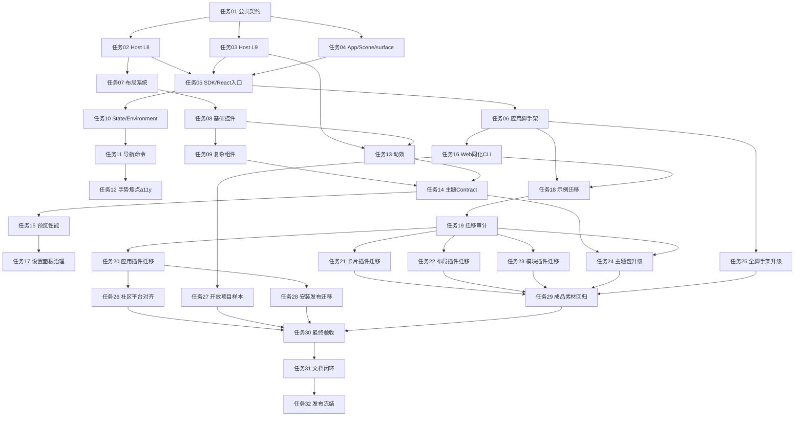

# 薯片前端框架与组件库重构开发任务方案

> 文档性质：开发任务拆解与实施路线，不是生态正式公共契约。  
> 保存位置：`项目日志与笔记/task022-优化薯片组件库和主题系统/05-开发任务方案/`。  
> 编写时间：2026-05-22。  

## 1. 本轮重新核对依据

本任务方案编写前，已重新核对以下内容：

- 生态设计原稿：生态概述、极致模块化架构、公共基础层、前端多样化和主题系统、插件系统、SDK 与协议、生态设置面板设计。
- 生态共用技术文档：插件架构、Bridge 三层、Host 服务域、L8 声明式 UI、主题系统、组件库契约、应用插件开发、Manifest、SDK 使用指南。
- 当前代码结构：`Chips-Host`、`Chips-SDK`、`Chips-ComponentLibrary`、`Chips-Scaffold/*`、`ThemePack/*`、应用插件、基础卡片插件、箱子布局插件、模块插件、社区平台、开放项目处理空间、成品测试空间。
- SwiftUI 官方调研方向：Apple Developer SwiftUI 文档中 App、Scene、View、View modifier、layout、controls、navigation、state、accessibility、gestures、animation、previews、performance 相关能力。

## 2. 总原则

这次重构目标不是新增一堆开发者需要理解的新项目，而是把薯片生态已有的 Host、SDK、组件库、脚手架、主题包、模块插件、应用插件打通成一套统一应用框架。

落点原则：

- Host 承载运行时：surface、plugin runtime、Bridge、L8、L9、theme runtime、服务域。
- SDK 承载开发入口：类型封装、Runtime Client、CLI、测试辅助、同化工具命令。
- 组件库承载 UI 语义：无头组件、布局原语、状态机、a11y、contract、testing。
- 主题包承载外观：token、CSS、组件契约、motion、图标字体。
- 脚手架承载默认路径：新应用默认具备 App/Scene/View/theme/i18n/test/preview 基线。
- 生态设置面板承载治理入口：主题、插件、组件矩阵、预览、诊断。

## 3. 执行顺序

### 阶段 A：契约和运行时地基

1. [任务01-公共契约冻结与任务基线.md](./任务01-公共契约冻结与任务基线.md)
2. [任务02-Host-L8声明式UI产品化.md](./任务02-Host-L8声明式UI产品化.md)
3. [任务03-Host-L9统一渲染产品化与诊断.md](./任务03-Host-L9统一渲染产品化与诊断.md)
4. [任务04-App-Scene-surface-commands应用结构能力.md](./任务04-App-Scene-surface-commands应用结构能力.md)
5. [任务05-SDK-RuntimeClient与React消费入口.md](./任务05-SDK-RuntimeClient与React消费入口.md)

### 阶段 B：开发默认路径和 UI 能力补齐

6. [任务06-应用脚手架vNext默认模板.md](./任务06-应用脚手架vNext默认模板.md)
7. [任务07-统一布局系统与页面结构原语.md](./任务07-统一布局系统与页面结构原语.md)
8. [任务08-SwiftUI对标控件清单与基础控件补齐.md](./任务08-SwiftUI对标控件清单与基础控件补齐.md)
9. [任务09-复杂组件Compound-API与样式契约.md](./任务09-复杂组件Compound-API与样式契约.md)
10. [任务10-State-Environment-Binding模型.md](./任务10-State-Environment-Binding模型.md)

### 阶段 C：应用级交互体系

11. [任务11-导航菜单工具栏与命令系统.md](./任务11-导航菜单工具栏与命令系统.md)
12. [任务12-手势焦点可访问性与键盘交互.md](./任务12-手势焦点可访问性与键盘交互.md)
13. [任务13-动画动效与Motion-Token.md](./任务13-动画动效与Motion-Token.md)
14. [任务14-主题系统与组件Contract治理.md](./任务14-主题系统与组件Contract治理.md)
15. [任务15-预览组件矩阵主题矩阵与性能工具.md](./任务15-预览组件矩阵主题矩阵与性能工具.md)

### 阶段 D：框架规模化工具与样板验证

16. [任务16-Web项目同化CLI与迁移报告.md](./任务16-Web项目同化CLI与迁移报告.md)
17. [任务17-生态设置面板治理入口扩展.md](./任务17-生态设置面板治理入口扩展.md)
18. [任务18-示例应用与真实迁移验证.md](./任务18-示例应用与真实迁移验证.md)

### 阶段 E：现有生态全量重构

19. [任务19-全生态迁移审计与分批计划.md](./任务19-全生态迁移审计与分批计划.md)
20. [任务20-现有应用插件全量迁移.md](./任务20-现有应用插件全量迁移.md)
21. [任务21-基础卡片插件全量迁移.md](./任务21-基础卡片插件全量迁移.md)
22. [任务22-箱子布局插件全量迁移.md](./任务22-箱子布局插件全量迁移.md)
23. [任务23-模块插件能力契约与运行时迁移.md](./任务23-模块插件能力契约与运行时迁移.md)
24. [任务24-主题包全量升级与视觉一致性.md](./任务24-主题包全量升级与视觉一致性.md)
25. [任务25-全类型脚手架升级.md](./任务25-全类型脚手架升级.md)
26. [任务26-社区平台与应用市场前端对齐.md（已取消）](./任务26-社区平台与应用市场前端对齐.md)
27. [任务27-开放项目同化样本工程.md](./任务27-开放项目同化样本工程.md)
28. [任务28-安装打包发布与工作区迁移链路.md](./任务28-安装打包发布与工作区迁移链路.md)
29. [任务29-成品测试空间与真实素材回归.md](./任务29-成品测试空间与真实素材回归.md)

### 阶段 F：最终验收与文档闭环

30. [任务30-最终全生态质量门禁与发布验收.md](./任务30-最终全生态质量门禁与发布验收.md)
31. [任务31-正式文档全量沉淀与工单闭环.md](./任务31-正式文档全量沉淀与工单闭环.md)
32. [任务32-第一版发布前冻结与后续路线.md](./任务32-第一版发布前冻结与后续路线.md)

## 4. 依赖关系

## 5. 全局不能做的事

- 不默认创建独立应用框架、前端框架、同化工具、预览工作台、设计系统工作台等新项目。
- 不新增独立页面应用分类。
- 不让应用插件直接调用 Electron、Node、Host 内部模块或跨服务直连。
- 不在组件库写死视觉皮肤。
- 不把未冻结接口写入脚手架模板。
- 不留下 TODO、占位实现或临时简化链路。
- 不引入未在技术选型中确认的新第三方库；确需新增时先登记并等待决策。

## 6. 总体验收目标

完成后，一个新应用插件应该能通过脚手架得到：

- 标准 `manifest.yaml`、`runtime.targets`、`ui.surface`。
- App/Scene/surface/commands 结构。
- `View/Stack/Grid/Form/List` 统一声明式布局。
- 主题、i18n、权限、焦点、导航、动效、a11y 默认接线。
- 组件库和主题包一致的 contract。
- 预览、组件矩阵、主题矩阵、性能检查和质量门禁。
- 可通过 SDK/Scaffold CLI 快速吸收外部 Web 项目并生成同化报告。
- 现有应用插件、基础卡片插件、箱子布局插件、模块插件、主题包、脚手架、社区平台和成品测试材料完成全量迁移或有明确阻断工单。
