# 端到端上传与文件信息流向总览

```mermaid
flowchart LR
  localCard["本地用户文件: .card\n正式格式: ZIP Store\n.card/metadata.yaml\n.card/structure.yaml\n.card/cover.html\ncontent/*.yaml\n根目录资源文件"]
  localBox["本地用户文件: .box\n正式格式: ZIP Store\n.box/metadata.yaml\n.box/structure.yaml\n.box/content.yaml\n.box/cover.html\nassets/ 自有资源"]

  subgraph web["社区平台网站: Chips-CommunityPlatformServer/packages/web"]
    workspace["工作区上传页 /workspace\n拖拽 .card / .box\n并发队列 WORKSPACE_UPLOAD_CONCURRENCY=3"]
    cardUploadClient["cardsApi.uploadCard\n1. POST /upload-sessions\n2. multipart POST /upload-sessions/:uploadId/card\n3. 轮询 /cards/:cardId/render-status"]
    boxUploadClient["boxesApi.uploadBox\nmultipart POST /upload/box\n上传成功后直接 success"]
    profileAndDetail["用户主页与详情页\nGET /users/:username/cards\nGET /users/:username/boxes\n/cards/:cardId\n/boxes/:boxId"]
  end

  subgraph api["社区 API 服务: Fastify /api/v1"]
    auth["认证层\nBearer access token\n可选登录态控制公开/私有访问"]
    uploadRoutes["upload.ts\n/upload-sessions\n/upload-sessions/:id/resources/presign\n/upload-sessions/:id/card\n/upload/card\n/upload/box"]
    uploadSessionSvc["UploadSessionService\n创建上传会话\n生成 resourcePrefix\n预签名 CARD_RESOURCES\n校验 headObject\nmarkSourceReady"]
    cardPersist["persistProcessedCard\ninspectCardSourceFile\nCardService.create\n上传 source.card\n入队 view + cover 渲染任务"]
    boxCreate["BoxService.create\n解包 .box\n当前只写 metadata / structure 摘要到数据库\n上传临时 .box 随后删除"]
    cardRoutes["cards.ts\n/card detail\n/open-view\n/view\n/cover\n/render-status\n私有缓存受控代理"]
    boxRoutes["boxes.ts\n/boxes/:boxId\n/users/:username/boxes\n当前依赖 boxes.documentUrl\n并 enrich 旧式 structure.cards"]
    hostRuntimeRoutes["host-runtime.ts\nWeb 插件宿主\nplugin-sessions\nresource-open-plan\nassets/bootstrap/theme"]
  end

  subgraph db["PostgreSQL: Drizzle schema"]
    uploadSessionTables["upload_sessions\ncontent_type: card | box\nstatus: created -> source_ready\nresource_prefix\nsource_card_bucket/key/sha256"]
    uploadResourceTable["upload_session_resources\nrelative_path\nbucket/key/public_url\nsha256/size/mime\nstatus: presigned -> verified"]
    cardsTable["cards\nid/card_file_id/title\nsource_card_bucket/key/sha256\nresource_manifest\nhtml_url/cover_url\nstatus ready/error\nvisibility"]
    renderTables["card_render_jobs\ncard_render_caches\nrender_profile: community-web/community-cover\ncache_bucket/key/url\nexpires_at 30天续期"]
    boxesTable["boxes\nid/box_file_id/title\nmetadata/structure\ncover_url/document_url/layout_plugin\nvisibility\n当前无 source_box_bucket/key"]
  end

  subgraph storage["对象存储 / CDN: S3 兼容, MinIO 或七牛云"]
    cardFiles["私有 bucket: chips-card-files\n{userId}/{cardId}/source.card\n永久 .card 源文件\nWorker 读取, 不公开"]
    cardResources["公开 bucket: chips-card-resources\nusers/{userId}/uploads/{uploadId}/resources/{relativePath}\n预签名外置资源链路\n当前 Web 上传卡片未实际使用"]
    renderCache["公开或私有 bucket: chips-card-render-cache*\n{cardId}/{cacheVersion}/index.html + assets\ncommunity-web 查看缓存"]
    coverCache["公开或私有 bucket: chips-card-cover-cache*\n{cardId}/{cacheVersion}/index.html + cardcover\ncommunity-cover 封面缓存"]
    miscPublic["公开 bucket: chips-avatars / chips-covers\n头像、房间封面、历史非卡片封面资源"]
    publicUrl["公开访问域名\n优先 S3_PUBLIC_URL\n生产: https://file.chipscard.space/{logical-bucket}/...\n未配置时回退 BASE_URL/cdn/..."]
  end

  subgraph worker["后台 Worker: packages/server/src/worker.ts"]
    redisQueue["Redis 队列\nccps:card-render:queue"]
    renderWorker["CardRenderCacheService.processJob\n锁定 card_render_jobs\n下载 source.card\n调用 Host 集成层"]
    hostIntegration["Host 集成层\n安装 CardViewer / 基础卡片插件 / 模块插件 / 主题\ncommunity-web: convertCardToHtml\ncommunity-cover: 提取 cover.html"]
    cacheCleanup["过期缓存清理\n最后访问后 CARD_RENDER_CACHE_TTL_DAYS\n默认 30 天\n只删缓存, 不删 source.card"]
  end

  localCard --> workspace
  localBox --> workspace
  workspace --> cardUploadClient
  workspace --> boxUploadClient
  cardUploadClient --> auth
  boxUploadClient --> auth
  auth --> uploadRoutes

  uploadRoutes -->|"card 当前前端主链路: 创建 session"| uploadSessionSvc
  uploadSessionSvc --> uploadSessionTables
  uploadRoutes -->|"可选资源直传链路: 当前前端未走"| uploadSessionSvc
  uploadSessionSvc -->|"presigned PUT"| cardResources
  uploadSessionSvc --> uploadResourceTable
  cardUploadClient -.->|"当前 manifest.resources = []"| uploadSessionSvc
  uploadRoutes -->|"POST /upload-sessions/:id/card"| cardPersist
  uploadSessionSvc -->|"verifyResources: headObject"| cardResources
  cardPersist -->|"写入卡片基本信息"| cardsTable
  cardPersist -->|"上传永久源文件"| cardFiles
  cardPersist -->|"记录 source ready"| uploadSessionTables
  cardPersist -->|"创建 community-web + community-cover job"| renderTables
  renderTables --> redisQueue

  redisQueue --> renderWorker
  renderWorker -->|"下载"| cardFiles
  renderWorker --> hostIntegration
  hostIntegration -->|"完整查看缓存"| renderCache
  hostIntegration -->|"封面缓存"| coverCache
  renderWorker -->|"ready/error + entryUrl/coverUrl"| renderTables
  renderWorker -->|"更新 htmlUrl / coverUrl"| cardsTable
  cacheCleanup --> renderCache
  cacheCleanup --> coverCache

  uploadRoutes -->|"box 当前链路: POST /upload/box"| boxCreate
  boxCreate -->|"写入 metadata / structure 摘要"| boxesTable
  boxCreate -.->|"当前未上传 .box 源文件"| storageGap["当前缺口\n无 chips-box-files bucket\n无 source_box_bucket/key\n无箱子 CDN 文档缓存"]
  boxCreate -.->|"当前未读取/发布 .box/content.yaml、cover.html、assets/"| boxSpecGap["与正式箱子规范未完全收口\n已有工单097覆盖社区箱子发布链路缺口"]

  profileAndDetail --> cardRoutes
  profileAndDetail --> boxRoutes
  cardRoutes --> cardsTable
  cardRoutes --> renderTables
  cardRoutes -->|"public cache 直达 CDN\nprivate cache API 受控代理"| renderCache
  cardRoutes --> coverCache
  cardRoutes -->|"卡片内资源点击 resource.open"| hostRuntimeRoutes
  hostRuntimeRoutes -->|"插件会话 /host/plugins/:sessionId"| profileAndDetail
  hostRuntimeRoutes -->|"读取公开资源或受控资源"| publicUrl

  boxRoutes --> boxesTable
  boxRoutes -.->|"当前 documentUrl 多数为空或依赖过渡链路"| boxPageGap["/boxes/:boxId\n前端需要 documentUrl 才能进入 DocumentPluginRoutePage\n否则显示 notReady"]

  cardResources --> publicUrl
  renderCache --> publicUrl
  coverCache --> publicUrl
  miscPublic --> publicUrl

  classDef current fill:#eef7ff,stroke:#3973b7,color:#0b2948;
  classDef storage fill:#f6f0ff,stroke:#7d4cc2,color:#25103d;
  classDef db fill:#eefaf0,stroke:#3f8f55,color:#0f2a16;
  classDef risk fill:#fff4e5,stroke:#c97914,color:#3a2100;
  classDef private fill:#f4f4f4,stroke:#777,color:#1f1f1f;

  class workspace,cardUploadClient,boxUploadClient,profileAndDetail,auth,uploadRoutes,uploadSessionSvc,cardPersist,boxCreate,cardRoutes,boxRoutes,hostRuntimeRoutes,redisQueue,renderWorker,hostIntegration,cacheCleanup current;
  class cardFiles,cardResources,renderCache,coverCache,miscPublic,publicUrl storage;
  class uploadSessionTables,uploadResourceTable,cardsTable,renderTables,boxesTable db;
  class storageGap,boxSpecGap,boxPageGap risk;
  class localCard,localBox private;
```

## 调查笔记（2026-08-03）

这份笔记先按“用户看到什么”来想，再反推技术链路。目标不是把用户教育成理解对象存储、CDN、预签名 URL 的人，而是让用户感觉自己只是在发布一个普通文件：本地做好 `.card`，拖到社区网页或从发布工具点上传，网页能直接打开看，别人也能按权限下载完整文件。

### 1. 目标体验应该长什么样

理想用户流程可以压缩成这几步：

1. 用户在电脑或手机上的正式软件里制作卡片。
2. 软件保存出一个完整 `.card` 文件，这个文件本身可以离线备份、拷贝、发送，也可以被 Host/SDK 正式打开。
3. 用户把 `.card` 上传到社区。
4. 社区网页详情页显示封面、标题、作者、权限、查看按钮、下载按钮。
5. 点击查看时，浏览器直接进入 Web 查看器，体验尽量接近本地查看态；不要求网页编辑。
6. 点击下载时，拿到的应该是完整 `.card`，不是半成品、不是只适合网页缓存的导出物、也不是缺资源的壳。

这里最重要的语义是：**网页查看态**和**完整文件回下载态**不能混成一个东西。网页查看态可以为了性能、安全和 CDN 做资源外置、HTML 缓存、静态资源展开；但下载态必须尊重用户对“文件”的直觉：下载回来仍然是完整卡片文件。

### 2. 现在真实链路是什么

按当前代码和契约看，`.card` 主链路已经不是空白，基础能力其实比较接近目标了：

- `.card` 是 ZIP Store 风格的正式包，核心结构是 `.card/metadata.yaml`、`.card/structure.yaml`、`.card/cover.html`、`content/*.yaml` 和卡片根目录资源。
- CommunityUploader 插件的正式发布链路是在用户设备上先解包 `.card`，扫描内部资源，为资源申请预签名 URL，把资源 PUT 到 `chips-card-resources`，再把卡片 YAML 和 cover HTML 里的内部资源引用改成公开 URL，删除已外置资源，重新打包一个发布处理后的 `.card`，最后提交给社区服务器。
- 社区服务器收到处理后的 `.card` 后，会解析基本信息，创建 `cards` 记录，把 `source.card` 上传到私有 `chips-card-files`，然后排队生成 `community-web` 查看缓存和 `community-cover` 封面缓存。
- Worker 后台下载私有 `source.card`，调用 Host 集成层把卡片转换为网页查看用的静态文档，再上传到 `chips-card-render-cache` 或私有缓存 bucket。
- 网页详情页只在 `viewState === cache_ready` 时拿 `viewUrl`，再启动 `com.chips.card-viewer` Web 插件会话，把 `documentUrl` 交给查看器。

所以当前推荐理解是：**网页查看不是浏览器直接解析用户上传的原始 `.card`，而是服务器后台用 Host/插件能力生成一个可被浏览器加载的查看缓存，浏览器再用 Web 插件宿主承载这个文档。**

这个方向是对的，尤其适合弱服务器：渲染可以异步，缓存可以长期复用，浏览器访问时主要走 CDN 或对象存储，不需要每次动态生成页面。

### 3. 用户设备解析，还是服务器解析

这里不能简单二选一，最好拆成三类处理：

- **用户设备负责发布前处理**：本地 Host/CommunityUploader 最懂 `.card` 正式结构、基础卡片插件、资源路径和包格式，适合做资源扫描、资源外置、引用改写、校验提示、重新打包。这一步在用户机器上做，可以把大资源上传的数据面绕开弱 API 服务器。
- **服务器负责可信校验和入库**：服务器不能完全相信客户端说“我已经处理好了”。它至少要做包结构检查、大小/数量限制、sha256 校验、资源引用一致性检查、权限记录、数据库状态流转和渲染任务入队。
- **Worker 负责网页发布态渲染**：网页查看缓存应该由服务端控制的 Host 集成层生成，原因是可复现、可审计、可隔离权限，也能保证详情页给浏览器的是稳定 `documentUrl`。

换句话说，客户端可以承担重活，服务器承担验收和调度，Worker 做异步转换。这样用户零感知，服务器也不会被大文件和大资源压垮。

### 4. 资源文件怎么保存比较合理

为了同时满足“网页能快看”和“下载仍完整”，建议把对象存储里的东西分成四类，不要混用语义：

1. **原始完整包**：用户上传或软件保存的完整 `.card`，放私有 bucket，例如未来 `chips-card-originals` 或扩展当前 `chips-card-files` 字段语义。用途是回下载、备份、迁移、作者取回、未来重新发布。
2. **发布处理包**：资源已外置、URL 已改写、面向社区网页渲染的 `.card`，放私有 bucket。用途是 Worker 渲染网页缓存，不一定适合当作“完整离线卡片”给用户下载。
3. **外置资源**：图片、音频、视频、字体或其他卡片资源，放公开或受控资源 bucket，例如 `chips-card-resources`。公开卡片可以走 CDN；私有卡片未来需要考虑私有资源代理或短签名 URL。
4. **渲染缓存**：`index.html`、查看态 assets、封面 HTML 和封面资源，放 render/cover cache bucket。缓存可以过期重建，不是权威源文件。

现在最大的语义漏洞就是：已有 `source.card` 字段，但它更像“服务器保存的渲染源”，不一定是用户原始完整包。只要 CommunityUploader 已经外置资源并删除包内资源，这个 `source.card` 就不能直接宣传成“完整卡片回下载”。这就是新登记的工单 121。

### 5. 下载时怎么重新整合

有两个方向：

- **优先方案：直接保存原始完整包，下载时原样返回。** 这是最符合用户直觉、服务器成本最低、风险最小的方式。上传时多保存一份原始 `.card` 到私有 bucket，下载时鉴权后返回 `Content-Disposition: attachment`，文件名用卡片标题加 `.card`。这样不需要临时解包、不需要重新抓 CDN 资源、不需要在弱服务器上重组大文件。
- **备选方案：按发布处理包 + 资源清单重组完整包。** 这会复杂很多：服务器要下载处理包，反向把公开 URL 映射回内部路径，拉取外置资源，写回包内，再重新打 ZIP Store。它会消耗服务器 CPU、内存、临时磁盘和带宽，还容易遇到资源丢失、URL 过期、第三方资源不可访问、版本不一致等问题。

所以如果目标是“像 Word 文档一样简单”，技术上反而应该避免下载时动态整合。**上传时就保存权威原始包**，后面所有下载都从这份权威包走。

### 6. 网页端应该直接加载 `.card` 吗

短期不建议让普通网页端直接解析并渲染原始 `.card`，原因有几个：

- `.card` 查看依赖 Host/SDK、基础卡片插件、主题、多语言、资源打开等正式运行时能力；浏览器裸解析会绕开这些边界。
- 用户上传内容里可能有 HTML、资源路径、外链、很大的媒体文件，直接在浏览器里解包并渲染会带来安全和兼容风险。
- 如果每个访问者都在浏览器端解包和解析，大卡片会让低端手机很痛苦，也不利于 CDN 缓存。
- 社区需要稳定的分享 URL、封面和 SEO/预览信息，这些更适合服务端异步生成静态缓存。

当前“Worker 生成查看缓存，浏览器加载查看缓存，CardViewer Web 插件承载”的方向比较合理。服务器也不应该每次请求都动态渲染完整页面；动态渲染只用于后台异步任务，访问时优先命中静态缓存。

### 7. 用户上传资源：先传社区服务器，还是直传 CDN/图床

弱服务器场景下，数据面最好不要走 API 服务器。

推荐链路是：

1. 客户端请求社区 API 创建上传会话。
2. 社区 API 返回 uploadId、资源前缀、限制规则和资源预签名 URL。
3. 客户端把大资源直接 PUT 到对象存储。
4. 客户端提交 manifest：每个资源的相对路径、sha256、size、mime、对象 key。
5. 服务器用 HeadObject 或对象存储 metadata 校验资源确实存在。
6. 客户端把原始完整 `.card` 也通过私有 bucket 预签名 URL 直传。
7. 客户端提交完成请求，服务器只记录元数据并排队后台校验和渲染。

如果对象存储本身挂了 CDN 域名，就不需要再“服务器上传到 CDN 图床”。更准确地说：对象存储是源站，CDN 是它的公开访问层。服务器只签名和记录，不中转文件。

当前正式 CommunityUploader 已经对资源走了预签名直传，这是很好的方向。但 Web 工作区上传页现在只是把整个 `.card` multipart 发给 API，`resources: []`，没有资源外置。处理后的 `.card` 也还是通过 API multipart 上传。这对“弱服务器 + 大文件”还不够理想。

### 8. 低性能服务器的关键策略

如果服务器性能很弱，设计上要尽量让它做控制面，不做数据面：

- 大文件、大图片、大音视频全部直传对象存储。
- API 服务器只签发上传会话、校验对象 metadata、写数据库、投递队列。
- Worker 并发默认很低，比如 1 或 2，渲染慢一点可以接受，但不要拖垮 API。
- 查看页面优先走 CDN 静态缓存，缓存未就绪时显示“正在生成预览”，不要同步阻塞用户请求。
- 封面缓存和查看缓存分开，列表页只需要封面，不应该触发完整查看缓存下载。
- 对每张卡限制：总包大小、单资源大小、资源数量、解包后总大小、文件名长度、路径深度、YAML 大小、HTML 大小。
- 对每个用户限制：每日上传次数、存储总量、并发上传数、渲染队列数。
- 私有卡片不要把所有资源都公开 CDN，需要私有缓存代理、短签名 URL 或受控资源访问策略，否则“私有卡片资源被公开链接访问”会成为权限漏洞。

这个架构的核心是：慢任务进入队列，热访问走缓存，重流量走对象存储/CDN。

### 9. 当前已经看到的漏洞和缺口

#### 9.1 完整 `.card` 回下载缺口

公共 API 契约现在明确把“社区内 `.card` 回下载”列在当前不支持范围内，服务端路由里也没有源文件 download/attachment 接口。用户想要“像 Word 一样下载完整文件”，这里必须补契约、路由、权限和前端入口。

这已经登记为工单 121。

#### 9.2 原始完整包和发布处理包语义混在一起

CommunityUploader 的发布态 `.card` 会外置资源并改写 URL。如果服务器只保存这个包，再开放下载，用户会以为拿到的是完整离线包，但实际可能依赖社区 CDN。这个语义必须拆开。

推荐字段上显式区分：

- `original_card_bucket/key/sha256/size`：完整回下载源。
- `publish_card_bucket/key/sha256/size`：网页渲染源。
- `resource_manifest`：外置资源清单。
- `render_cache_*`：网页缓存状态。

不一定非要用这些字段名，但语义必须存在。

#### 9.3 处理后的 `.card` 仍走 API multipart

当前上传会话只对资源预签名，`.card` 本体仍进 API，再由 API 上传私有 bucket。大卡片会占用 API 带宽、临时磁盘和反向代理超时。要实现低性能服务器友好，源 `.card` 和发布处理 `.card` 都应该支持私有 bucket 预签名直传，API 只做提交确认。

#### 9.4 网页工作区上传页没有做资源外置

Web 上传页当前是“创建 session + 直接传 whole `.card` + `resources: []`”。这能跑通普通上传，但和正式 CommunityUploader 的资源外置链路不一致。后续如果允许网页上传大卡片，要么网页端也复用正式 SDK/打包能力做外置处理，要么明确网页上传只是轻量入口并由 Worker 后台处理资源外置，但后者会把压力放回服务器。

#### 9.5 手机端制作和上传能力还没有打通

CommunityUploader manifest 当前支持 desktop/headless，不支持 web/mobile。用户说“电脑手机上编写制作卡片文件”，这意味着手机端 Host 或移动端发布能力也要有正式链路。否则手机用户可能只能从网页上传现成 `.card`，不能完整走本地制作-发布体验。

#### 9.6 `.box` 链路还不完整

`.box` 当前上传后主要保存 metadata/structure 摘要，源 `.box` 没有长期保存字段，详情页又需要 `documentUrl` 才能进入统一查看器。这已经由工单 097 覆盖。虽然用户这次重点说卡片，但如果社区体验要像“文档文件”一样统一，`.box` 迟早也要补同样的原始包保存、查看缓存、回下载链路。

#### 9.7 安全边界要冻结

卡片里有 `cover.html`，渲染缓存里也会有 HTML 和 assets。当前服务端关闭了 Fastify Helmet CSP，并备注 CSP 由 Nginx 处理；但已查看的 Nginx 片段主要是 X-Frame-Options、nosniff、XSS、Referrer-Policy，没有看到完整 CSP 细则。社区承载用户生成内容时，需要正式冻结 CSP、iframe sandbox、资源域名白名单、脚本策略和插件宿主隔离规则。

这里不是说当前一定存在可利用漏洞，而是“用户上传内容网页可查看”这个产品形态必须把安全策略写成契约和部署检查项。

#### 9.8 解包限制和资源校验需要更硬

上传 `.card` / `.box` 时要防 zip bomb、超大 YAML、路径穿越、极深目录、超多小文件、重复路径、奇怪编码文件名、压缩包伪装等问题。当前已有资源 HeadObject 校验和处理包引用检查，但还需要确认所有入口都有统一限制。

另一个细节是资源 sha256 metadata：如果对象存储没有 `chips-sha256` metadata，当前校验逻辑可能不会硬失败，只在存在且不匹配时失败。为了可信上传，最好要求 metadata 必须存在，或者服务器自己抽样/全量计算。

#### 9.9 权限语义不能只靠 visibility

“能查看”和“能下载完整源文件”不一定是同一个权限。建议未来至少区分：

- 公开可查看、公开可下载。
- 公开可查看、禁止下载。
- 私有仅作者可查看和下载。
- 登录用户可查看但不可下载。
- 未来可能有授权、转载、二创、付费下载等策略。

即使第一版不做复杂商业授权，也应该先把字段或契约预留成干净语义，不要把下载按钮简单绑定到 `visibility = public`。

### 10. 推荐的最终技术链路

我建议最终收口成这条链路：

1. 本地 Host / 移动 Host / CommunityUploader 保存完整 `.card`。
2. 发布时创建上传会话，服务器返回限制和预签名 URL。
3. 客户端直传原始完整 `.card` 到私有对象存储。
4. 客户端在本地生成发布处理包：外置资源、改写 URL、删除包内已外置资源、重新 pack。
5. 客户端把外置资源直传公开或受控对象存储。
6. 客户端把发布处理包也直传私有对象存储。
7. 客户端提交 manifest，服务器做 HeadObject、sha256、大小、路径和引用一致性校验。
8. 服务器写入 cards 记录，入队 view/cover 渲染。
9. Worker 用发布处理包生成网页查看缓存和封面缓存。
10. 浏览器详情页加载缓存 `documentUrl`，CardViewer Web 插件负责查看体验。
11. 用户点击下载时，服务器鉴权后返回原始完整 `.card` 的短签名 URL，或 API 受控转发 attachment。

这个链路里，服务器最重的部分只剩后台 Worker 渲染，而且可以限并发。用户感觉上仍然只是“上传一个文件，网页稍等生成预览，之后可以打开和下载”。

### 11. 从产品交互上要隐藏掉的复杂度

用户不应该看到“资源外置”“发布处理包”“CDN”“预签名 URL”这些概念。界面上建议只保留：

- 上传中：显示总进度和当前阶段，比如“上传文件”“生成网页预览”。
- 预览生成中：详情页可先展示标题、作者、封面占位和状态。
- 查看：缓存 ready 后直接打开 Web 查看器。
- 下载：只显示“下载卡片文件”，不要让用户选择原始包/处理包。
- 错误：用人能理解的话说明，比如“卡片中有 2 个资源没有上传成功，请重新上传”，不要暴露对象存储错误码。

内部复杂度应该留给日志和调试页，普通用户只需要知道这个文件发出去了、能看、能下载。

### 12. 现在可以下的结论

当前链路已经接近“网页可查看”：服务端有上传会话、私有源文件保存、渲染缓存、封面缓存和 Web 插件宿主。真正还没闭环的是“完整文件回下载”和“弱服务器下的大文件全直传”。

如果只做查看，当前方向是：服务器后台生成网页缓存，浏览器加载缓存，不要浏览器直接解析原始 `.card`。如果要做到用户感知像 Word/图片一样完整，必须补上原始完整包长期保存和下载契约，同时把源 `.card` 上传也改成对象存储直传。

优先级建议：

1. 先冻结 `.card` 原始包 / 发布处理包 / 渲染缓存三者的正式语义。
2. 补公共 API 契约和数据库字段，保存原始完整 `.card`。
3. 补下载接口、权限和前端下载按钮。
4. 把 `.card` 本体上传改为私有 bucket 预签名直传。
5. 补 zip bomb、文件数量、sha metadata、CSP/sandbox 等安全验收。
6. 再统一 Web 上传页、桌面发布插件和未来移动端发布链路。

这样做完以后，用户看到的是一个极简单的文件发布体验；系统内部则仍然保持资源、缓存、权限和运行时边界清楚。
